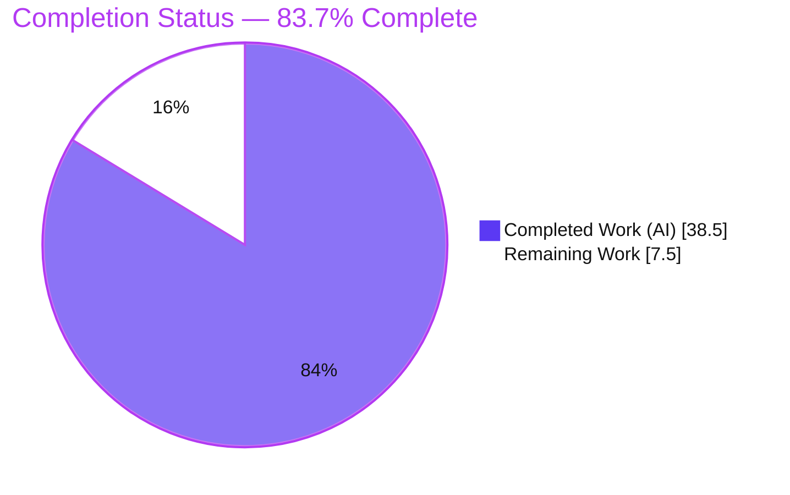
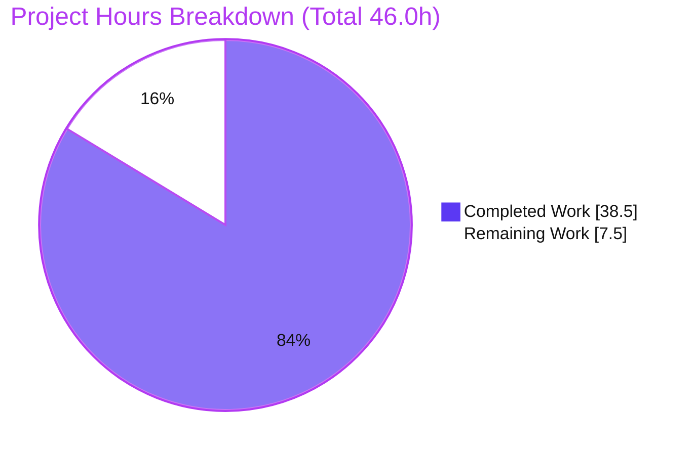
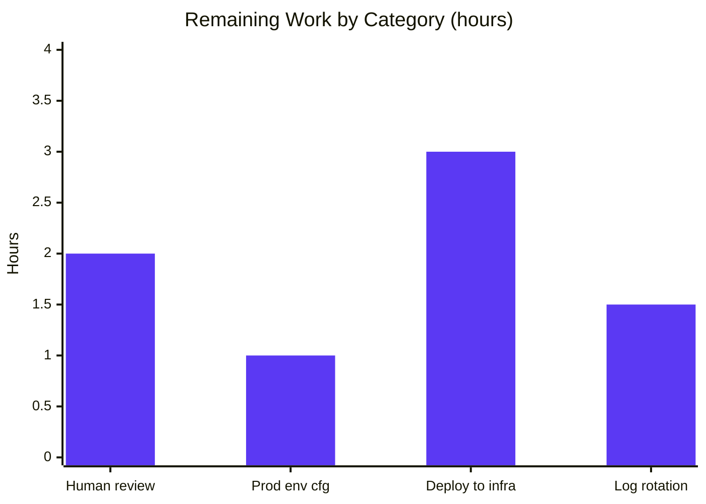

# Blitzy Project Guide — hao-backprop-test: Express.js Production Migration

> Brand legend — **Completed / AI Work:** Dark Blue `#5B39F3` · **Remaining / Not Completed:** White `#FFFFFF` · **Headings / Accents:** Violet-Black `#B23AF2` · **Highlight:** Mint `#A8FDD9`

---

## 1. Executive Summary

### 1.1 Project Overview

This project evolves the `hao-backprop-test` repository's minimal raw Node.js `http` server into a production-ready **Express.js** application, **without changing the externally observable behavior** of the existing endpoint. The service targets platform/operations engineers who need a hardened, process-managed HTTP service. Technical scope covers Express adoption, an `express.Router()` routing layer (`GET /` plus a `GET /health` probe), an ordered middleware pipeline (helmet, CORS, compression, body parsers, Morgan), dotenv-based environment configuration, structured Winston + Morgan logging, and PM2 clustered deployment. The primary acceptance signal — a byte-for-byte identical `GET /` response (`200`, `text/plain`, `Hello, World!\n`) — is preserved and verified. Business impact: a maintainable, observable, deployable service with zero behavioral regression.

### 1.2 Completion Status



| Metric | Hours |
|--------|-------|
| **Total Project Hours** | **46.0** |
| Completed Hours (AI) | 38.5 |
| Completed Hours (Manual) | 0.0 |
| **Completed Hours (AI + Manual)** | **38.5** |
| **Remaining Hours** | **7.5** |
| **Percent Complete** | **83.7%** |

> Completion is computed on AAP-scoped work only (PA1): `38.5 / (38.5 + 7.5) = 38.5 / 46.0 = 83.7%`. All AAP development deliverables are complete and verified; the remaining 7.5 hours are exclusively path-to-production activities (human review + real-infrastructure deployment + operational hardening) that cannot be performed autonomously.

### 1.3 Key Accomplishments

- ✅ **Express.js adopted** (`express ^5.2.1`) via an application-factory (`src/app.js`) + thin bootstrap (`server.js`) split.
- ✅ **Byte-for-byte behavior preserved** — `GET /` returns exactly 14 bytes (`48-65-6C-6C-6F-2C-20-57-6F-72-6C-64-21-0A` = `Hello, World!\n`) with a bare `Content-Type: text/plain` (no charset), independently re-verified.
- ✅ **Routing layer** (`src/routes/index.js`): preserved `GET /` greeting + new `GET /health` readiness probe.
- ✅ **Ordered middleware pipeline**: helmet → cors → compression → json/urlencoded → morgan, with terminal 404 + centralized error handlers.
- ✅ **Environment configuration** (`src/config/index.js`): dotenv-loaded, typed config with safe defaults preserving `127.0.0.1:3000`.
- ✅ **Structured logging** (`src/config/logger.js`): Winston (console + file transports) with Morgan streamed through it.
- ✅ **PM2 production readiness** (`ecosystem.config.js`): cluster mode, env blocks, restart policy, merged logs — validated at 64 workers.
- ✅ **Dependency management**: 8 packages pinned at exact AAP versions; `package-lock.json` regenerated (v3); `npm audit` clean (0 vulnerabilities).
- ✅ **Explainability rule satisfied**: `docs/decision-log.md` with a 15-row decision table + 100%-coverage bidirectional traceability matrix.
- ✅ **Minimal-changes rule honored**: `README.md` and all 8 out-of-scope fixtures left untouched.

### 1.4 Critical Unresolved Issues

**Zero code defects were identified.** No compilation errors, no failing behavioral checks, and no unresolved defects exist within AAP scope. The items below are **release-gating prerequisites** (not defects) required to move from a validated branch to live production.

| Issue | Impact | Owner | ETA |
|-------|--------|-------|-----|
| Human code review & PR merge pending | Mandatory approval gate before release | Human dev team | ~2.0 h |
| No TLS/HTTPS at the edge | If exposed publicly, traffic is unencrypted (TLS termination is out-of-scope by AAP §0.3.2; must be provided by a reverse proxy/LB) | Platform/Ops | Within deployment (Section 2.2) |

### 1.5 Access Issues

**No access issues identified.** The repository is accessible on branch `blitzy-71519d72-173f-4979-a765-24efa6397207` (working tree clean, in sync with origin). All 8 dependencies resolve from the public npm registry — the AAP declares **no private/internal registries or credentials** (§0.4.1) — and all are installed. `npm audit` reports 0 vulnerabilities. No third-party API keys, database credentials, or service accounts are required by the delivered scope.

### 1.6 Recommended Next Steps

1. **[High]** Review the 13-file pull request — confirm source correctness, the decision log + traceability matrix, and that `README.md`/fixtures are untouched — then approve & merge. (~2.0 h)
2. **[High]** Provision production environment variables on the target (`NODE_ENV=production`, `HOST`, `PORT`, `LOG_LEVEL`). (~1.0 h)
3. **[Medium]** Provision the target host, install Node ≥18 and PM2, deploy, and run `npm ci --omit=dev`. (~1.5 h)
4. **[Medium]** Start under PM2, configure boot persistence (`pm2 startup` + `pm2 save`), and smoke-test on real infrastructure. (~1.5 h)
5. **[Medium]** Configure production log rotation/retention (pm2-logrotate or OS logrotate) and front the service with a TLS-terminating reverse proxy/LB. (~1.5 h)

---

## 2. Project Hours Breakdown

### 2.1 Completed Work Detail

All completed work was performed autonomously by Blitzy agents (Manual = 0.0 h). Each component traces to a specific AAP requirement.

| Component | Hours | Description |
|-----------|-------|-------------|
| Express.js adoption & server bootstrap | 5.0 | Refactor `server.js` into a thin bootstrap; build `src/app.js` application factory (Objective 1). |
| Routing + byte-for-byte `GET /` preservation + `/health` | 3.5 | `src/routes/index.js` `express.Router()`; raw-response handler to keep the exact contract; readiness probe (Objective 2). |
| Middleware pipeline | 4.0 | helmet, cors, compression, `express.json`/`urlencoded`, morgan — selection, ordering, wiring, query-string redaction token (Objective 3). |
| Environment configuration module | 2.5 | `src/config/index.js` (dotenv, typed config, defaults) + `.env.example` template (Objective 4). |
| Structured logging (Winston + Morgan stream) | 3.0 | `src/config/logger.js`: console + file transports; Morgan `stream` bridge (Objective 5). |
| Centralized 404 + error handling | 2.5 | `src/middleware/errorHandler.js`: `notFound` + `errorHandler` with `headersSent` guard and 500-message masking (Objective 3). |
| PM2 production deployment prep | 3.5 | `ecosystem.config.js` (cluster, env blocks, restart policy, merged logs) + npm scripts (Objective 6). |
| Dependency management & lockfile regeneration | 2.5 | `package.json` deps/devDeps/scripts/engines/`main`; `package-lock.json` regenerated to v3. |
| VCS & log-directory hygiene | 1.0 | `.gitignore` (node_modules, .env, logs, *.log) + `logs/.gitkeep`. |
| Explainability deliverable (decision log + matrix) | 4.0 | `docs/decision-log.md`: 15-row decision table + 100% bidirectional traceability matrix + run/deploy notes. |
| Research & design validation | 2.0 | Web research validating Express structure, Morgan+Winston, dotenv, and PM2 practices (§0.2.2). |
| Autonomous validation & QA | 5.0 | Compilation gate, functional/behavioral checks, PM2 cluster runtime validation, and checkpoint fix cycles. |
| **Total Completed** | **38.5** | |

### 2.2 Remaining Work Detail

All remaining work is path-to-production; each item cannot be performed autonomously.

| Category | Hours | Priority |
|----------|-------|----------|
| Human code review & PR approval/merge | 2.0 | High |
| Production environment configuration (`NODE_ENV`/`HOST`/`PORT`/`LOG_LEVEL`) | 1.0 | High |
| Deployment to target infrastructure (provision host, install Node+PM2, `npm ci`, PM2 boot persistence, smoke test) | 3.0 | Medium |
| Production log rotation & retention (pm2-logrotate / OS logrotate) | 1.5 | Medium |
| **Total Remaining** | **7.5** | |

### 2.3 Hours Reconciliation & Methodology

| Reconciliation Check | Value | Result |
|----------------------|-------|--------|
| Section 2.1 completed total | 38.5 h | — |
| Section 2.2 remaining total | 7.5 h | — |
| 2.1 + 2.2 = Total Project Hours (Section 1.2) | 46.0 h | ✅ Match |
| Remaining matches Section 1.2 & Section 7 pie | 7.5 h | ✅ Match |
| Completion = 38.5 / 46.0 | 83.7% | ✅ Consistent |

> **Methodology (PA1):** the completion denominator includes only (a) AAP-specified deliverables and (b) standard path-to-production activities to deploy them. Items the AAP explicitly excludes (§0.3.2) — automated test framework, CI/CD, Docker, reverse proxy/TLS provisioning, database, auth — are **not** counted in the denominator.

---

## 3. Test Results

All results below originate from **Blitzy's autonomous validation** (Final Validator gates), independently re-verified by this assessment. **No unit/integration test framework exists — this is by AAP design** (§0.3.2 lists a test framework as out-of-scope; adding one would violate the Make-minimal-changes rule). The service's acceptance criterion is behavior preservation, validated as the test surface. Code-coverage instrumentation is therefore **not applicable (N/A)**.

| Test Category | Framework / Method | Total Tests | Passed | Failed | Coverage % | Notes |
|---------------|--------------------|-------------|--------|--------|-----------|-------|
| Static compilation | `node --check` | 7 | 7 | 0 | N/A | All 7 in-scope JS files parse cleanly. |
| Module load / import graph | `node` `require()` | 7 | 7 | 0 | N/A | Bottom-up load; acyclic; correct exports; config defaults resolve. |
| Functional & behavioral HTTP checks | curl / PM2 (ad-hoc) | 19 | 19 | 0 | N/A | Includes **byte-for-byte `GET /` primary signal**, `/health`, 404 JSON, helmet/cors/compression headers, Morgan→Winston stream, env overrides. |
| Runtime smoke (dev + production) | `node server.js`, `pm2` cluster | 2 | 2 | 0 | N/A | Dev bind `127.0.0.1:3000`; PM2 64-worker cluster, 0 restarts, clean teardown. |
| Dependency security audit | `npm audit` | 1 | 1 | 0 | N/A | 0 vulnerabilities across 168 resolved packages. |
| **Total** | | **36** | **36** | **0** | **N/A** | 100% pass rate. |

---

## 4. Runtime Validation & UI Verification

**UI Verification: Not Applicable.** This is a headless backend HTTP service with no UI surface (AAP §0.5 confirms User Interface Design is not applicable). No Figma frames or design system were supplied (§0.9).

**Runtime health & API integration outcomes:**

- ✅ **Operational** — Development runtime: `node server.js` / `npm start` binds `127.0.0.1:3000`; Winston startup log + Morgan access logs emitted.
- ✅ **Operational** — Production runtime: `pm2 start ecosystem.config.js --env production` launched a cluster (`instances: 'max'`) with all workers online, `exec_mode: cluster`, 0 restarts, clean teardown.
- ✅ **Operational** — `GET /` → `200`, `Content-Type: text/plain`, body `Hello, World!\n` (exactly 14 bytes) — contract preserved.
- ✅ **Operational** — `GET /health` → `200 application/json` `{ "status": "ok", "uptime": <number> }`.
- ✅ **Operational** — Unmatched route → `404 application/json` `{ "error": "Not Found", "path": "…" }` (query string redacted).
- ✅ **Operational** — Security headers (helmet): CSP, `X-Content-Type-Options: nosniff`, `X-Frame-Options: SAMEORIGIN`; `X-Powered-By` removed.
- ✅ **Operational** — CORS (`Access-Control-Allow-Origin: *`) and compression (`Vary: Accept-Encoding`) active.
- ✅ **Operational** — Logging: `logs/combined.log` & `logs/error.log` (Winston) and `logs/pm2-out.log` (PM2, via `merge_logs`) materialize and populate.

---

## 5. Compliance & Quality Review

AAP deliverables and binding rules cross-mapped to quality benchmarks. Fixes applied during autonomous validation are noted.

| Benchmark / Deliverable | Requirement Source | Status | Progress | Notes |
|--------------------------|--------------------|--------|----------|-------|
| Express.js adoption | AAP Obj. 1 | ✅ Pass | 100% | `express ^5.2.1` via app factory + bootstrap. |
| Routing layer | AAP Obj. 2 | ✅ Pass | 100% | `express.Router()` — `GET /` + `GET /health`. |
| Middleware pipeline | AAP Obj. 3 | ✅ Pass | 100% | helmet, cors, compression, body parsers, morgan, 404+error. |
| Environment configuration | AAP Obj. 4 | ✅ Pass | 100% | dotenv + typed config with safe defaults. |
| Structured logging | AAP Obj. 5 | ✅ Pass | 100% | Winston + Morgan stream, file transports. |
| PM2 deployment readiness | AAP Obj. 6 | ✅ Pass | 100% | Cluster config validated at 64 workers. |
| Behavior preservation (byte-for-byte) | AAP §0.8.1 | ✅ Pass | 100% | 14-byte `GET /`, bare `text/plain` — primary signal. |
| Explainability rule | AAP §0.7 | ✅ Pass | 100% | Decision table (15 rows) + 100% traceability matrix. |
| Make-minimal-changes rule | AAP §0.7 | ✅ Pass | 100% | `README.md` + 8 fixtures untouched; no opportunistic refactoring. |
| Exact dependency versions | AAP §0.4 | ✅ Pass | 100% | All 8 packages at pinned versions. |
| Lockfile regeneration (v3) | AAP §0.6 | ✅ Pass | 100% | `package-lock.json` regenerated; consistent with manifest. |
| Security headers baseline | AAP §0.5.4 | ✅ Pass | 100% | helmet active; `X-Powered-By` removed. |
| Dependency vulnerability scan | Quality gate | ✅ Pass | 100% | `npm audit` → 0 vulnerabilities. |
| Production-grade error handling | CQ1 | ✅ Pass | 100% | `headersSent` guard, status mapping, 500-message masking. |

**Fixes applied during autonomous validation** (all resolved, documented in the decision log): (1) `dev` script portability on Windows/PowerShell; (2) PM2 `merge_logs` so declared cluster log files materialize; (3) dotenv banner suppression (`quiet: true`); (4) query-string redaction from 404 bodies and Morgan access logs.

**Outstanding compliance items within AAP scope:** none. Remaining items are path-to-production only (Section 2.2).

---

## 6. Risk Assessment

| Risk | Category | Severity | Probability | Mitigation | Status |
|------|----------|----------|-------------|------------|--------|
| Express 5.x is a recent major; middleware edge cases under atypical use | Technical | Low | Low | Deps pinned (lockfile v3); runtime-validated | Mitigated |
| No automated test suite (`npm test` is a failing stub) — future regressions uncaught | Technical | Medium | Medium | Out-of-scope by AAP §0.3.2; behavior manually validated; add supertest smoke test post-handoff | Accepted (by design) |
| Byte-for-byte `GET /` contract is fragile — an Express `res.send()`/`res.type()` refactor would append `; charset=utf-8` | Technical | Medium | Low-Med | Prominently documented in decision log; add a guard test asserting 14-byte body + bare `text/plain` | Documented / Mitigated |
| CORS is wide-open (`Access-Control-Allow-Origin: *`) | Security | Low | Low | Acceptable for public read-only service; restrict origins before serving sensitive data | Accepted (current scope) |
| No TLS — service binds plain HTTP (`env_production` → `0.0.0.0`) | Security | Medium | Medium | TLS out-of-scope (§0.3.2); front with HTTPS reverse proxy/LB in production | Open (path-to-production) |
| helmet emits HSTS over HTTP (meaningful only behind HTTPS) | Security | Low | Low | Ensure HTTPS at the edge | Informational |
| Supply chain — 168 transitive packages | Security | Low | Low-Med (over time) | `npm audit` currently clean; enable Dependabot/periodic audit | Mitigated (clean) |
| Unbounded log growth — Winston + PM2 logs, no rotation | Operational | Medium | Med-High (over time) | Configure pm2-logrotate/logrotate — tracked in Section 2.2 | Open (path-to-production) |
| No PM2 boot persistence yet (`pm2 startup`/`save` not run — no host exists) | Operational | Medium | Medium | Run `pm2 startup && pm2 save` during deployment — tracked in Section 2.2 | Open (path-to-production) |
| `/health` exists but no monitor/alerting consumes it yet | Operational | Low-Med | Medium | Wire `/health` to LB health check + monitoring during deploy | Open |
| `instances: 'max'` scaled to 64 workers on validation host | Operational | Low | Low | Consider a fixed instance count sized to the target host | Informational |
| Production env vars must be supplied by deploy env; misconfig fails bind | Integration | Low | Low | `.env.example` documents the contract; `env_production` present; validate on deploy | Mitigated (documented) |
| No external service integrations (no DB/cache/queue/3rd-party) | Integration | Low | Low | Minimal integration surface by design | N/A by design |
| Behind a proxy/LB, Express `trust proxy` unset — `req.ip`/protocol reflect the proxy | Integration | Low | Low | Set `app.set('trust proxy', …)` if/when client IP matters | Informational |

**Risk posture:** No High-severity risks. Medium items are either out-of-scope-by-design (no test suite) or genuine path-to-production hardening already captured in the remaining 7.5 hours (TLS edge, log rotation, boot persistence).

---

## 7. Visual Project Status

**Project hours breakdown** (Completed = Dark Blue `#5B39F3`, Remaining = White `#FFFFFF`):



**Remaining hours by category** (sums to 7.5 h — consistent with Section 2.2):



| Priority | Remaining Hours |
|----------|-----------------|
| High | 3.0 |
| Medium | 4.5 |
| **Total** | **7.5** |

---

## 8. Summary & Recommendations

**Achievements.** The migration is functionally and behaviorally complete. Every AAP objective (Express adoption, routing, middleware, environment configuration, logging, PM2 readiness), all 13 in-scope files, all 8 pinned dependencies, and both binding rules (Explainability, Make-minimal-changes) are delivered and verified. The primary acceptance signal — a byte-for-byte `GET /` response — is preserved exactly (14 bytes, bare `text/plain`), independently re-confirmed. The code compiles cleanly, runs in both development and PM2-clustered production modes, and passes `npm audit` with zero vulnerabilities.

**Remaining gaps & critical path to production.** The project is **83.7% complete** on an AAP-scoped basis. The remaining **7.5 hours** are entirely path-to-production and cannot be automated: (1) human code review & merge, (2) production environment configuration, (3) deployment to target infrastructure with PM2 boot persistence, and (4) log rotation plus a TLS-terminating edge if the service is publicly exposed. The critical path is: **review & merge → configure env → deploy under PM2 → operationalize (logs, TLS, monitoring)**.

**Success metrics.** Behavior-preservation contract intact (14-byte `GET /`); 36/36 autonomous checks passed; 0 vulnerabilities; 0 code defects; working tree clean.

**Production readiness assessment.** The application is **code-complete and production-ready pending human review and standard deployment/operational setup**. There are no known defects. Recommended before public exposure: front with HTTPS, configure log rotation, and wire `/health` to monitoring. Optional future enhancements (beyond scope, not counted in hours): a minimal automated guard test for the `GET /` contract, CORS origin restriction, and `trust proxy` if deployed behind a proxy.

---

## 9. Development Guide

### 9.1 System Prerequisites

- **Node.js ≥ 18** (validated on **v22.23.1**; enforced via `package.json` `engines`).
- **npm** (validated on **10.9.8**).
- **PM2** — provided as a devDependency (no global install needed for local runs); a **global** install is recommended on the production host: `npm install -g pm2`.
- OS: cross-platform (Linux/macOS/Windows). Note the Windows shell caveat in §9.7.

### 9.2 Environment Setup

```bash
# From the repository root. Copy the committed template and edit as needed.
cp .env.example .env
```

All variables have safe defaults, so a missing `.env` is tolerated (server still binds `127.0.0.1:3000`):

| Variable | Default | Purpose |
|----------|---------|---------|
| `NODE_ENV` | `development` | Runtime environment (`development` \| `production`). |
| `PORT` | `3000` | HTTP listen port. |
| `HOST` | `127.0.0.1` | Bind address (`0.0.0.0` in production via PM2). |
| `LOG_LEVEL` | `info` | Winston verbosity (`error`\|`warn`\|`info`\|`http`\|`verbose`\|`debug`\|`silly`). |

### 9.3 Dependency Installation

```bash
# Development (installs all dependencies incl. PM2 devDependency):
npm install

# Production (clean, reproducible, runtime deps only):
npm ci --omit=dev
```

Expected: install completes with **0 vulnerabilities** (`npm audit`).

### 9.4 Application Startup

```bash
# Local / development (both are: node server.js):
npm start
npm run dev

# Production (PM2 cluster; binds 0.0.0.0:3000 via env_production):
npm run prod          # pm2 start ecosystem.config.js --env production
npm run reload        # zero-downtime reload
npm run logs          # tail PM2 logs

# Configure PM2 to survive reboots (run once on the target host):
pm2 startup
pm2 save
```

### 9.5 Verification Steps

```bash
# 1) Preserved greeting — expect: 200, Content-Type: text/plain, body "Hello, World!\n" (14 bytes)
curl -i http://127.0.0.1:3000/

# 2) Readiness probe — expect: 200 application/json {"status":"ok","uptime":<number>}
curl -i http://127.0.0.1:3000/health

# 3) 404 handler — expect: 404 application/json {"error":"Not Found","path":"/nope"}
curl -i http://127.0.0.1:3000/nope
```

Under PM2, verify cluster health:

```bash
pm2 list            # every worker should show status "online"
pm2 describe hello_world
```

### 9.6 Example Usage

```bash
$ curl http://127.0.0.1:3000/
Hello, World!

$ curl http://127.0.0.1:3000/health
{"status":"ok","uptime":12.34}
```

### 9.7 Troubleshooting

- **Port already in use:** set a different port before starting — `PORT=3001 npm start` (bash) or `$env:PORT=3001; npm start` (PowerShell).
- **Windows/PowerShell inline env vars:** the POSIX form `NODE_ENV=development node server.js` fails on PowerShell; the repo already avoids this (the `dev` script is plain `node server.js`, and config defaults `NODE_ENV` to `development`).
- **PM2 spawns many workers:** `instances: 'max'` starts one worker per CPU core; on small hosts set a fixed integer in `ecosystem.config.js`.
- **Where are the logs?** Under `logs/` (git-ignored except `.gitkeep`): `combined.log` & `error.log` (Winston), `pm2-out.log` & `pm2-error.log` (PM2, merged via `merge_logs`).
- **Clean teardown of PM2:** `pm2 delete all && pm2 kill`.
- **Config precedence:** `ecosystem.config.js` `env`/`env_production` values are applied by PM2; a local `.env` applies for direct `node server.js` runs.

---

## 10. Appendices

### A. Command Reference

| Command | Purpose |
|---------|---------|
| `npm install` | Install all dependencies (dev). |
| `npm ci --omit=dev` | Clean production install (runtime deps only). |
| `npm start` / `npm run dev` | Run locally (`node server.js`). |
| `npm run prod` | Start PM2 cluster (`--env production`). |
| `npm run reload` | Zero-downtime PM2 reload. |
| `npm run logs` | Tail PM2 logs. |
| `npm audit` | Dependency vulnerability scan. |
| `node --check <file>` | Syntax-check a JS file. |
| `pm2 list` / `pm2 describe hello_world` | Inspect cluster workers. |
| `pm2 startup` / `pm2 save` | Enable PM2 boot persistence. |
| `pm2 delete all` / `pm2 kill` | Tear down PM2. |

### B. Port Reference

| Port | Service | Notes |
|------|---------|-------|
| 3000 | HTTP server | Dev bind `127.0.0.1:3000`; production bind `0.0.0.0:3000` (PM2 `env_production`). |

### C. Key File Locations

| Path | Role |
|------|------|
| `server.js` | Thin bootstrap: loads config + logger, imports app, `app.listen(...)`. |
| `src/app.js` | Express application factory (middleware pipeline + route mounting + error handlers). |
| `src/routes/index.js` | Router: `GET /` (preserved greeting) + `GET /health`. |
| `src/config/index.js` | dotenv-loaded typed configuration. |
| `src/config/logger.js` | Winston logger + Morgan stream. |
| `src/middleware/errorHandler.js` | `notFound` (404) + centralized `errorHandler`. |
| `ecosystem.config.js` | PM2 process-manager configuration. |
| `.env.example` | Environment variable template. |
| `.gitignore` | Ignores `node_modules/`, `.env`, `logs/*`, `*.log`, PM2 dumps. |
| `logs/.gitkeep` | Preserves the git-ignored `logs/` directory. |
| `docs/decision-log.md` | Decision log + 100% bidirectional traceability matrix (Explainability rule). |
| `package.json` / `package-lock.json` | Manifest (deps, scripts, engines, `main`) / pinned tree (v3). |

### D. Technology Versions

| Component | Version |
|-----------|---------|
| Node.js | v22.23.1 (engines: ≥18) |
| npm | 10.9.8 |
| express | 5.2.1 |
| dotenv | 17.4.2 |
| morgan | 1.11.0 |
| winston | 3.19.0 |
| helmet | 8.2.0 |
| cors | 2.8.6 |
| compression | 1.8.1 |
| pm2 (devDependency) | 7.0.3 |
| package-lock.json | lockfileVersion 3 |

### E. Environment Variable Reference

| Variable | Default | Example (production) | Description |
|----------|---------|----------------------|-------------|
| `NODE_ENV` | `development` | `production` | Enables Express production optimizations. |
| `PORT` | `3000` | `3000` | HTTP listen port. |
| `HOST` | `127.0.0.1` | `0.0.0.0` | Bind address (external exposure in prod). |
| `LOG_LEVEL` | `info` | `info` | Winston log level. |

### F. Developer Tools Guide

- **Static syntax check:** `node --check <file>` (used as the compilation gate; no TypeScript/linter is configured, per AAP scope).
- **Dependency audit:** `npm audit` (0 vulnerabilities at handoff).
- **Process manager:** PM2 (`pm2 list`, `pm2 logs`, `pm2 monit`, `pm2 describe hello_world`).
- **Manual HTTP verification:** `curl -i` against `/`, `/health`, and an unknown path.
- **Recommended (optional, not yet added):** `supertest` + a lightweight runner for a `GET /` contract guard test; Dependabot for ongoing supply-chain monitoring.

### G. Glossary

| Term | Definition |
|------|------------|
| Application factory | The `src/app.js` pattern that builds and returns a configured Express `app`, decoupling app assembly from process bootstrap. |
| Byte-for-byte contract | The requirement that `GET /` returns exactly `Hello, World!\n` (14 bytes) with a bare `Content-Type: text/plain`. |
| Middleware pipeline | The ordered chain helmet → cors → compression → body parsers → morgan → router → 404 → error handler. |
| Path-to-production | Standard activities (review, deploy, operationalize) required to run delivered code in production. |
| Readiness probe | The `GET /health` endpoint returning `{ status, uptime }` for load balancers/monitoring. |
| PM2 cluster mode | Running multiple worker processes across CPU cores (`instances: 'max'`, `exec_mode: 'cluster'`) behind one listener. |
| Explainability rule | AAP §0.7 requirement for a decision log + 100% bidirectional traceability matrix (rationale kept out of code comments). |

---

*Generated by the Blitzy Platform. Completion metrics are AAP-scoped (PA1): 38.5 h completed / 46.0 h total = 83.7% complete; 7.5 h remaining (path-to-production).*