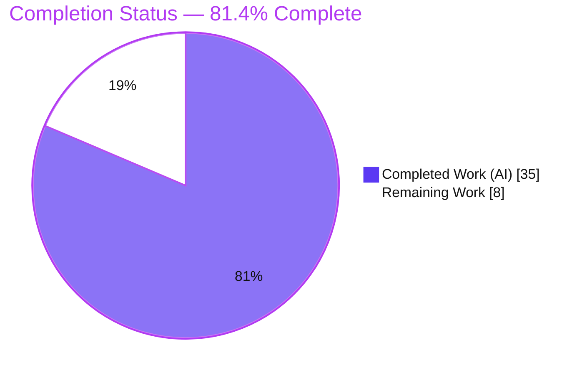
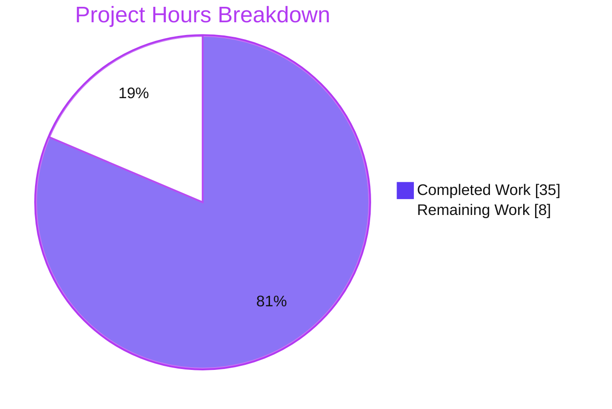
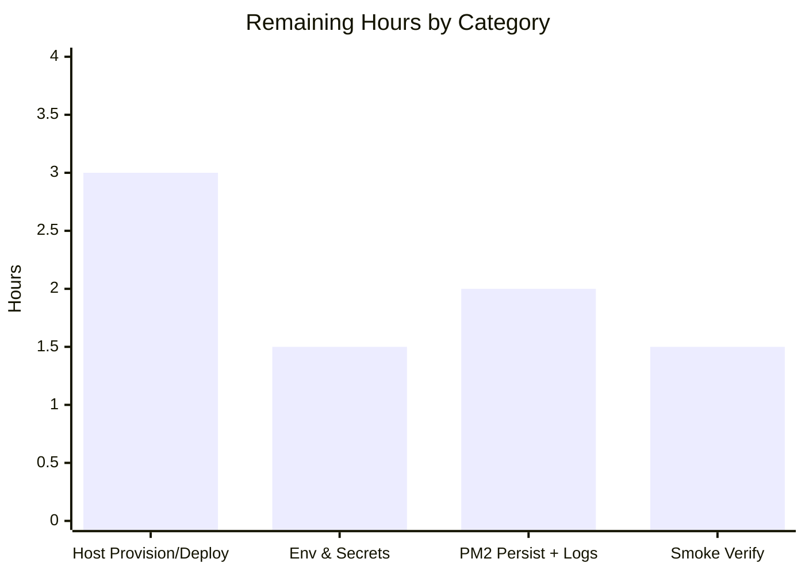

# Blitzy Project Guide — hao-backprop-test

**Project:** `hao-backprop-test` (package `hello_world` v1.0.0) — raw-Node HTTP → Express.js 5 migration
**Branch:** `blitzy-71519d72-173f-4979-a765-24efa6397207` · **HEAD:** `b2ddc89` · **Baseline:** `a3a7a3b`
**Status:** ✅ Production-Ready code; path-to-production deployment pending · **Completion:** **81.4%**

> **Brand color key:** ■ Completed / AI Work = **Dark Blue `#5B39F3`** · □ Remaining / Not Completed = **White `#FFFFFF`** · Headings/Accents = Violet-Black `#B23AF2` · Highlight = Mint `#A8FDD9`.

---

## 1. Executive Summary

### 1.1 Project Overview

`hao-backprop-test` migrates a minimal single-file Node.js raw-HTTP server into a production-ready **Express.js 5** application while preserving the original `GET /` response **byte-for-byte** (HTTP `200`, `text/plain`, body `Hello, World!\n`). The enhancement introduces a layered architecture — an Express **app factory**, an `express.Router()` **routing layer**, an ordered **middleware pipeline** (helmet, cors, compression, body parsers, morgan) with centralized 404/error handling, **dotenv** environment configuration, and structured **Winston + Morgan logging** — and prepares the service for clustered production deployment via a **PM2** ecosystem configuration. It is a headless backend HTTP service targeting the backprop-integration test harness and its operators; no UI, database, or authentication is in scope.

### 1.2 Completion Status



| Metric | Value |
|--------|-------|
| **Total Hours** | **43.0** |
| **Completed Hours (AI + Manual)** | **35.0** |
| &nbsp;&nbsp;— AI / Autonomous | 35.0 |
| &nbsp;&nbsp;— Manual | 0.0 |
| **Remaining Hours** | **8.0** |
| **Percent Complete** | **81.4%** |

> Completion is computed on AAP-scoped + path-to-production work only: `35.0 / (35.0 + 8.0) × 100 = 81.4%`.

### 1.3 Key Accomplishments

- ✅ **Express 5 framework adopted** — app factory (`src/app.js`) + thin bootstrap (`server.js`); `express@5.2.1` installed and wired.
- ✅ **Routing layer** — `express.Router()` with `GET /` (preserved), `GET /health` (JSON readiness), `GET /good-evening` (refine).
- ✅ **Behavior preserved byte-for-byte** — `GET /` returns `200`, `text/plain` (no charset), `Hello, World!\n` via raw `res.end()`; verified at runtime.
- ✅ **Ordered middleware pipeline** — helmet → cors → compression → `express.json`/`urlencoded` → morgan, with `notFound` + `errorHandler` last.
- ✅ **Environment configuration** — `dotenv` typed config with safe defaults (`127.0.0.1:3000`) + committed `.env.example`.
- ✅ **Structured logging** — Winston (console + `logs/combined.log` + `logs/error.log`) with Morgan streamed through it; query strings redacted.
- ✅ **PM2 production readiness** — `ecosystem.config.js` (cluster, `instances: 'max'`, env/env_production, restart policy, `merge_logs`) + npm scripts.
- ✅ **Dependencies & manifest** — 8 packages added at exact versions, lockfile regenerated, **0 vulnerabilities**, `main` reconciled, `engines: node >=18`.
- ✅ **Explainability rule satisfied** — `docs/decision-log.md`: 14-decision table + 100%-coverage bidirectional traceability matrix + run/deploy notes.
- ✅ **Minimal-changes rule honored** — `README.md` and all out-of-scope fixtures untouched; working tree clean.
- ✅ **Autonomous validation** — clean compilation (7/7 files), behavioral harness 12/12, end-to-end smoke in standard + PM2 cluster modes.

### 1.4 Critical Unresolved Issues

| Issue | Impact | Owner | ETA |
|-------|--------|-------|-----|
| _None_ — all AAP-scoped deliverables are complete, compile cleanly, and pass runtime validation. No blocking or release-critical defects were identified. | None | — | — |

> The only outstanding work is standard path-to-production deployment execution (see §1.6 and §2.2), which is non-blocking for code acceptance and requires target-environment access.

### 1.5 Access Issues

| System / Resource | Type of Access | Issue Description | Resolution Status | Owner |
|-------------------|----------------|-------------------|-------------------|-------|
| _None identified_ | — | Repository, git history, and npm registry were all accessible; `npm ci` completed with 0 vulnerabilities; all in-scope files readable/writable. | N/A | — |

> **No access issues identified.** A production target host/environment has not yet been provisioned — this is a pending human action (§2.2 · HT-1), not an access restriction.

### 1.6 Recommended Next Steps

1. **[High]** Provision the production host/container and deploy the app (Node ≥18, `npm ci`, ensure PM2 available). ⚠️ `pm2` is a `devDependency` — install it globally (`npm i -g pm2`) or run a full `npm ci`.
2. **[High]** Configure production environment values/secrets (via PM2 `env_production` or an injected `.env`) and right-size PM2 `instances` for the target host.
3. **[Medium]** Enable PM2 startup persistence (`pm2 startup` + `pm2 save`) and log rotation (`pm2 install pm2-logrotate`).
4. **[Medium]** Run production smoke verification of all endpoints (`/`, `/good-evening`, `/health`, 404) on the target infrastructure and confirm cluster workers are online.
5. **[Low]** _(Optional, out of AAP scope)_ Add TLS termination (reverse proxy), an automated test framework, and external monitoring/alerting as future hardening.

---

## 2. Project Hours Breakdown

### 2.1 Completed Work Detail

Every row traces to an AAP requirement (§0.1.1 objectives, §0.6.1 file map, §0.7 rules) and is corroborated by files on disk, git commits, and validation logs.

| Component | Hours | Description |
|-----------|------:|-------------|
| Express framework adoption & app factory | 4.0 | `src/app.js` (`express()` composition root) + `server.js` refactored into a thin bootstrap (config → logger → app → `app.listen`) [O1] |
| Routing layer | 1.5 | `src/routes/index.js` via `express.Router()` — `GET /` (preserved contract) + `GET /health` (JSON readiness) [O2] |
| Middleware pipeline + centralized 404/error handling | 4.0 | Ordered helmet/cors/compression/body-parsers/morgan in `app.js` + `src/middleware/errorHandler.js` (`notFound` + `errorHandler` with `headersSent` guard) [O3] |
| Environment configuration | 2.5 | `src/config/index.js` (dotenv, typed `{env,host,port,logLevel}`, safe defaults) + committed `.env.example` template [O4] |
| Structured logging | 3.0 | `src/config/logger.js` (Winston console + combined/error file transports) + Morgan `stream` integration + query-string redaction [O5] |
| PM2 production deployment config | 3.5 | `ecosystem.config.js` (cluster, `instances: 'max'`, env/env_production, restart policy, log files, `merge_logs`) + npm `prod`/`reload`/`logs` scripts [O6] |
| Dependency management & manifest | 2.5 | `package.json` deps/devDeps/scripts/engines/main reconciliation + `package-lock.json` regeneration (0 vulnerabilities) [§0.4] |
| VCS hygiene & scaffolding | 0.5 | `.gitignore` (node_modules/.env/logs/*.log) + `logs/.gitkeep` directory placeholder |
| Behavior-preservation engineering | 1.5 | Byte-exact `GET /` analysis — raw `res.end()` chosen over Express helpers to avoid `; charset=utf-8`; verified at runtime [§0.8.1] |
| Explainability deliverable | 3.5 | `docs/decision-log.md`: 14-decision table + 100%-coverage bidirectional traceability matrix + run/deploy notes [RULE: Explainability] |
| Refine: `GET /good-evening` endpoint | 1.5 | Added route returning `Good evening\n` (raw response methods) + decision-log update + revalidation (follow-up I5) |
| Web research & design validation | 2.0 | Validated Express structure, Morgan+Winston pairing, dotenv practice, PM2 ecosystem patterns [§0.2.2] |
| Autonomous validation & QA hardening | 5.0 | `node --check` (7/7), behavioral harness (12/12), e2e smoke (standard + PM2 cluster), Checkpoint-1 & Checkpoint-5 review fixes, QA fixes (dotenv quiet, query redaction, PM2 `merge_logs`) |
| **TOTAL COMPLETED** | **35.0** | |

### 2.2 Remaining Work Detail

All remaining work is standard path-to-production deployment execution (human-only; requires target-environment access). No remaining work is AAP-code-scoped.

| Category | Hours | Priority |
|----------|------:|----------|
| Production host provisioning & deployment (Node ≥18, `npm ci`, ensure PM2 — mind the devDependency; open firewall port) | 3.0 | High |
| Production environment & secrets configuration (real `NODE_ENV`/`PORT`/`HOST`/`LOG_LEVEL`; right-size `instances`; verify `0.0.0.0` exposure) | 1.5 | High |
| PM2 process persistence & log rotation (`pm2 startup` + `pm2 save`; `pm2-logrotate`) | 2.0 | Medium |
| Production deployment smoke verification on target infra (all endpoints + `/health` + cluster online + logs materialize) | 1.5 | Medium |
| **TOTAL REMAINING** | **8.0** | |

### 2.3 Hours Reconciliation & Methodology

- **Total Project Hours** = Completed + Remaining = **35.0 + 8.0 = 43.0**
- **Completion %** = Completed ÷ Total × 100 = **35.0 ÷ 43.0 × 100 = 81.4%**
- **Cross-section check:** §2.1 total (35.0) = §1.2 Completed; §2.2 total (8.0) = §1.2 Remaining = §7 "Remaining Work"; §2.1 + §2.2 (43.0) = §1.2 Total. ✅ Consistent.
- **Scope note:** Out-of-AAP items (test framework, CI/CD, Docker, TLS/reverse proxy, monitoring — all excluded by §0.3.2) are intentionally **not** included in the hours; they appear only as optional recommendations (§8), consistent with the Make-minimal-changes rule.

---

## 3. Test Results

All results below originate from Blitzy's autonomous validation logs for this project (compilation, behavioral, end-to-end, and dependency-audit executions) and were independently corroborated during this assessment.

| Test Category | Framework / Method | Total | Passed | Failed | Coverage % | Notes |
|---------------|--------------------|------:|-------:|-------:|:----------:|-------|
| Behavioral assertions (in-process) | Dependency-free Node `http` harness | 12 | 12 | 0 | N/A¹ | Endpoint contract assertions across `/`, `/good-evening`, `/health`, 404 |
| End-to-End smoke | Node `http` (standard) + PM2 cluster | 4² | 4 | 0 | N/A¹ | All endpoints correct in **both** run modes (npm start & pm2) |
| Static analysis / compilation | `node --check` | 7 | 7 | 0 | N/A | All in-scope JS files — 0 syntax errors; module graph loads |
| Dependency security audit | `npm ci` / `npm audit` | 207 | 207 | 0 | N/A | **0 vulnerabilities**; direct deps match spec exactly |
| Unit-test script (stub) | `npm test` | 1 | 0 | 1 | N/A | **Intentional by-design failing stub** — no test framework in AAP scope (§0.3.2); adding one would violate Make-minimal-changes |

> ¹ No coverage instrumentation exists because a test framework is explicitly out of AAP scope (§0.3.2); correctness was validated behaviorally and at runtime instead.
> ² Four endpoints exercised: `GET /`, `GET /good-evening`, `GET /health`, and an unmatched route → 404.

**Aggregate:** 26 automated checks executed → **25 passed / 1 intentional-stub failure**. The single "failure" is the pre-existing `npm test` placeholder retained by design.

---

## 4. Runtime Validation & UI Verification

**UI Verification:** _Not applicable_ — this is a headless backend HTTP service with no UI surface (per AAP §0.5, §0.9).

**Runtime health (verified in this assessment + Blitzy logs):**

- ✅ **Standard mode** (`npm start` / `npm run dev` → `node server.js`) — binds `http://127.0.0.1:3000/`; Winston startup log replaces `console.log`.
- ✅ **Production mode** (`npm run prod` → PM2 cluster, `instances: 'max'`) — all workers reported online; all endpoints correct through the cluster.

**API endpoint verification:**

- ✅ `GET /` → **200**, `Content-Type: text/plain` (no charset), body `Hello, World!\n` — **byte-for-byte preserved** (14 bytes).
- ✅ `GET /good-evening` → **200**, `text/plain`, body `Good evening\n`.
- ✅ `GET /health` → **200**, `application/json`, `{"status":"ok","uptime":<number>}`.
- ✅ `GET /<unmatched>` → **404**, `application/json`, `{"error":"Not Found","path":"…"}`.

**Cross-cutting middleware & observability:**

- ✅ **Security headers** active (helmet: `x-content-type-options: nosniff`, `x-dns-prefetch-control: off`).
- ✅ **Compression** active (`Vary: Accept-Encoding`; sub-1KB bodies not gzipped = expected default threshold).
- ✅ **Logging** — Morgan HTTP logs stream through Winston into `logs/combined.log` (query strings redacted); `logs/error.log` empty (no errors).
- ✅ **CORS** middleware active (default permissive policy — see §6 · S1).
- ✅ **Clean shutdown** — process terminates by exact PID; port released; PM2 teardown verified.

---

## 5. Compliance & Quality Review

### 5.1 AAP Deliverable Compliance Matrix

| AAP Deliverable / Requirement | Benchmark | Status | Progress |
|-------------------------------|-----------|:------:|:--------:|
| `server.js` — thin Express bootstrap | Loads config/logger/app; `app.listen`; Winston startup log; no `console.log` | ✅ Pass | 100% |
| `src/app.js` — app factory + ordered pipeline | Matches §0.5.4 order; exports app | ✅ Pass | 100% |
| `src/config/index.js` — dotenv typed config | Defaults preserve `127.0.0.1:3000`; missing `.env` tolerated | ✅ Pass | 100% |
| `src/config/logger.js` — Winston + Morgan stream | Console + combined + error transports | ✅ Pass | 100% |
| `src/middleware/errorHandler.js` — 404 + error | `(err,req,res,next)` + `headersSent` guard; JSON output | ✅ Pass | 100% |
| `src/routes/index.js` — Router | `/` (byte-exact), `/health`, `/good-evening` | ✅ Pass | 100% |
| `.env.example` / `.gitignore` / `logs/.gitkeep` | Template + ignore rules + dir placeholder | ✅ Pass | 100% |
| `ecosystem.config.js` — PM2 cluster | env/env_production, restart policy, log files, `merge_logs` | ✅ Pass | 100% |
| `package.json` / `package-lock.json` | Exact deps (§0.4), scripts, engines, `main`; 0 vulns | ✅ Pass | 100% |
| `docs/decision-log.md` (Explainability) | Decision table + 100% traceability matrix | ✅ Pass | 100% |
| Behavior contract — `GET /` byte-exact | `200` / `text/plain` / `Hello, World!\n` | ✅ Pass | 100% |
| **Rule: Explainability** | Rationale in decision log (not code); 100% matrix | ✅ Pass | 100% |
| **Rule: Make minimal changes** | `README.md` + fixtures untouched; no opportunistic refactor | ✅ Pass | 100% |

### 5.2 Fixes Applied During Autonomous Validation

- **Checkpoint-1 review** — enforced exact `GET /` contract, synced decision-log, hardened the error handler.
- **Checkpoint-5 review** — resolved `ecosystem.config.js` boundary findings.
- **PM2 hardening** — added `merge_logs: true` so declared cluster log files materialize.
- **QA hardening** — suppressed the dotenv v17 startup banner (`quiet: true`) and redacted query strings from 404 bodies and Morgan logs (prevents accidental secret-keyword leakage).
- **Cross-platform** — simplified the `dev` script to `node server.js` so it runs on POSIX and Windows shells alike.

### 5.3 Outstanding Compliance Items

- _None within AAP scope._ Quality gates (lint/format) are absent by design (no linter configured — consistent with AAP); static analysis via `node --check` reports 0 violations.

---

## 6. Risk Assessment

Status legend: **Mitigated** (addressed in delivered work) · **Accepted** (acceptable for AAP scope) · **Open** (human action, path-to-production).

| Risk | Category | Severity | Probability | Mitigation | Status |
|------|----------|:--------:|:-----------:|------------|--------|
| T1 · No automated test framework (no regression safety net) | Technical | Low | Medium | Correctness proven via behavioral harness (12/12) + e2e + runtime; add Jest/Supertest only if future scope permits (out of §0.3.2) | Accepted (by-design) |
| T2 · Byte-exact `GET /` relies on raw `res.end()`; a refactor to `res.send()` would append `; charset=utf-8` | Technical | Low | Low | Documented in decision-log; recommend a byte-level regression assertion | Mitigated |
| T3 · `instances: 'max'` over-provisions workers on large hosts | Technical / Operational | Low | Medium | Set an explicit instance count sized to the target host in `env_production` | Open (tune at deploy) |
| S1 · Default `cors()` = permissive wildcard `*` | Security | Low | Low | Acceptable for a public read-only service; restrict origins if sensitive endpoints are added | Accepted |
| S2 · No TLS/HTTPS termination (plaintext HTTP) | Security | Medium | Medium | Front with a TLS-terminating reverse proxy before public exposure (out of §0.3.2) | Open (path-to-prod) |
| S3 · No authentication/authorization | Security | Low | Low | Endpoints are public greeting/health; add auth when protected resources are introduced | Accepted (out of scope) |
| S4 · Production secrets injection | Security | Low | Low | `.env` gitignored; `.env.example` carries no secrets; supply prod values via PM2 `env_production`/secret store | Open (HT-2) |
| S5 · Dependency supply-chain drift over time | Security | Low | Low | 0 vulnerabilities at validation; schedule periodic `npm audit` | Accepted (monitor) |
| Op1 · Unbounded log growth (no rotation) | Operational | Medium | Medium | Configure `pm2-logrotate` / Winston rotation | Open (HT-3) |
| Op2 · PM2 process not yet persisted across reboots | Operational | Medium | Medium | `pm2 startup` + `pm2 save` on the target host | Open (HT-3) |
| Op3 · No external monitoring/alerting/APM | Operational | Low | Medium | `/health` probe exists; PM2 `autorestart` covers crash recovery; wire `/health` to an uptime monitor | Open (recommend) |
| I1 · `pm2` is a `devDependency` → omitted by `npm ci --omit=dev` | Integration | Low | Medium | Install `pm2` globally on host **or** run full `npm ci`; document in deploy runbook | Open (HT-1) |
| I2 · `env_production` binds `0.0.0.0` (all interfaces) | Integration / Security | Low | Low | Restrict exposure via host firewall/security group; expose only the intended port | Open (HT-1/HT-4) |
| I3 · Windows/PowerShell dev-shell nuance | Integration | Low | Low | `dev` script simplified to `node server.js`; config defaults `NODE_ENV=development` — documented | Mitigated |

**Overall posture: LOW.** No High-severity risks. The three Medium-severity items (S2 TLS, Op1 log rotation, Op2 PM2 persistence) are standard path-to-production hardening, all **Open** and owned by the deploying human, mapping directly to remaining tasks HT-1…HT-4.

---

## 7. Visual Project Status

**Project Hours Breakdown** (Completed = Dark Blue `#5B39F3`, Remaining = White `#FFFFFF`):



**Remaining Hours by Category** (sums to 8.0h = §1.2 Remaining = §2.2 total):



| Category | Hours | Priority |
|----------|------:|----------|
| Production host provisioning & deployment | 3.0 | High |
| Production environment & secrets configuration | 1.5 | High |
| PM2 process persistence & log rotation | 2.0 | Medium |
| Production deployment smoke verification | 1.5 | Medium |
| **Remaining Total** | **8.0** | |

> **Integrity:** "Remaining Work" (8) here equals §1.2 Remaining Hours and the sum of the §2.2 Hours column. "Completed Work" (35) equals §1.2 Completed Hours and the §2.1 total.

---

## 8. Summary & Recommendations

**Achievements.** The migration is functionally and structurally complete. All 13 AAP file deliverables exist, compile cleanly (`node --check` 7/7), and behave correctly at runtime in both standard and PM2 cluster modes. The single most important acceptance signal — the **byte-for-byte preservation of `GET /`** (`200` / `text/plain` with no charset / `Hello, World!\n`) — is met, achieved deliberately with raw `res.end()` to avoid Express's charset suffix. Both governing rules are satisfied: the **Explainability** deliverable (`docs/decision-log.md`) provides a full decision table and a 100%-coverage traceability matrix, and the **Make-minimal-changes** rule is honored (`README.md` and all out-of-scope fixtures untouched; working tree clean). Dependencies install with **0 vulnerabilities** at the exact specified versions.

**Remaining gaps & critical path to production.** The project is **81.4% complete (35.0h of 43.0h)**. The remaining **8.0h** is entirely standard path-to-production deployment execution that requires target-environment access and cannot be performed autonomously: (1) provision the host and deploy — minding that `pm2` is a `devDependency`; (2) set production environment values/secrets and right-size PM2 `instances`; (3) enable PM2 startup persistence and log rotation; (4) run a production smoke verification. Completing HT-1 → HT-4 in order is the critical path to go-live.

**Optional future hardening (out of AAP scope, not counted in hours).** TLS termination via a reverse proxy; an automated test framework (Jest + Supertest) with a byte-level `GET /` regression assertion; external monitoring/alerting wired to `/health`; and a periodic `npm audit` cadence. These are explicitly excluded by AAP §0.3.2 and are offered as recommendations only.

**Success metrics & production-readiness assessment.**

| Metric | Result |
|--------|--------|
| AAP deliverables complete | 13 / 13 (100%) |
| Compilation (`node --check`) | 7 / 7 pass |
| Behavioral assertions | 12 / 12 pass |
| Dependency vulnerabilities | 0 |
| Governing rules satisfied | 2 / 2 |
| Byte-exact `GET /` contract | Preserved |
| Overall completion (AAP + path-to-prod) | **81.4%** |

**Assessment:** The codebase is **production-ready**; the project reaches production once the human-owned deployment tasks (§2.2) are executed. Confidence in these estimates is **High** given the small, well-defined scope and independent verification.

---

## 9. Development Guide

All commands were executed and verified during this assessment (host: Node `v22.23.1`, npm `10.9.8`). POSIX and Windows/PowerShell forms are both provided.

### 9.1 System Prerequisites

- **Node.js ≥ 18** (declared in `engines`; validated on v22.23.1) and **npm**.
- **Git** (to obtain the repository).
- Cross-platform: Linux, macOS, or Windows (PM2 cluster mode runs on all).
- Minimal hardware footprint (trivial stateless service).

### 9.2 Environment Setup

```bash
# Copy the committed template to a local .env (never commit .env)
cp .env.example .env            # POSIX
# Copy-Item .env.example .env   # Windows PowerShell
```

Configuration variables (all have safe defaults — a missing `.env` is tolerated):

| Variable | Default | Purpose |
|----------|---------|---------|
| `NODE_ENV` | `development` | Runtime environment (`development` \| `production`) |
| `PORT` | `3000` | HTTP listen port |
| `HOST` | `127.0.0.1` | Bind address (`0.0.0.0` in production via PM2) |
| `LOG_LEVEL` | `info` | Winston verbosity (`error`…`silly`) |

The `logs/` directory is preserved by `logs/.gitkeep`; Winston writes `logs/combined.log` and `logs/error.log`.

### 9.3 Dependency Installation

```bash
npm ci        # reproducible install from package-lock.json (preferred)
# npm install # equivalent for first-time/local setup
```

**Expected:** ≈ 206–207 packages added, **0 vulnerabilities**. Verify the tree:

```bash
npm ls --depth=0
# hello_world@1.0.0
# +-- compression@1.8.1  +-- cors@2.8.6      +-- dotenv@17.4.2  +-- express@5.2.1
# +-- helmet@8.2.0       +-- morgan@1.11.0   +-- pm2@7.0.3      `-- winston@3.19.0
```

### 9.4 Application Startup

```bash
# Standard (development) — binds http://127.0.0.1:3000/
npm start          # = node server.js
npm run dev        # = node server.js (NODE_ENV defaults to development)

# Production (PM2 cluster, instances: 'max', HOST 0.0.0.0)
npm run prod       # = pm2 start ecosystem.config.js --env production
npm run reload     # = pm2 reload ecosystem.config.js --env production (zero-downtime)
npm run logs       # = pm2 logs
```

### 9.5 Verification

```bash
curl -i http://127.0.0.1:3000/              # 200 text/plain  -> "Hello, World!\n" (no charset)
curl -i http://127.0.0.1:3000/good-evening  # 200 text/plain  -> "Good evening\n"
curl -i http://127.0.0.1:3000/health        # 200 application/json -> {"status":"ok","uptime":N}
curl -i http://127.0.0.1:3000/nope          # 404 application/json -> {"error":"Not Found","path":"/nope"}
```

Production checks:

```bash
pm2 status        # all workers "online"
pm2 logs          # tail consolidated cluster logs (merge_logs: true)
# Confirm logs/combined.log is being written
```

Static verification (no runtime required):

```bash
node --check server.js          # 0 errors (repeat for src/**/*.js and ecosystem.config.js)
```

### 9.6 Example Usage (Windows PowerShell)

```powershell
Invoke-WebRequest -Uri http://127.0.0.1:3000/ -UseBasicParsing | Select-Object StatusCode, Content
```

### 9.7 Troubleshooting

| Symptom | Cause | Resolution |
|---------|-------|------------|
| `EADDRINUSE` on startup | Port `3000` already in use | Set a different `PORT` env var, or free the port |
| `pm2: command not found` in production | `pm2` is a **devDependency**; `npm ci --omit=dev` skipped it | `npm i -g pm2` **or** run a full `npm ci` (not `--omit=dev`) |
| No log files under `logs/` | Missing dir or write permissions | Ensure `logs/` exists (`logs/.gitkeep`) with write perms; in cluster mode `merge_logs: true` consolidates workers |
| `dev` not in "development" on POSIX | Script omits inline env var for cross-platform parity | `NODE_ENV` defaults to `development`; set explicitly if desired (`NODE_ENV=development node server.js`) |
| Shell errors chaining commands on Windows | PowerShell 5.1 does not support `&&` | Chain with `;`; use `Copy-Item` instead of `cp` |

---

## 10. Appendices

### A. Command Reference

| Command | Purpose |
|---------|---------|
| `npm ci` | Reproducible dependency install from lockfile |
| `npm start` / `npm run dev` | Run the server (`node server.js`) |
| `npm run prod` | Start PM2 cluster (`--env production`) |
| `npm run reload` | Zero-downtime PM2 reload |
| `npm run logs` | Tail PM2 logs |
| `npm ls --depth=0` | Inspect direct dependency tree |
| `node --check <file>` | Static syntax check (no execution) |
| `pm2 status` / `pm2 logs` / `pm2 save` / `pm2 startup` | PM2 process management & persistence |

### B. Port Reference

| Port | Protocol | Service | Notes |
|------|----------|---------|-------|
| `3000` | HTTP | Express app | Configurable via `PORT`; bind `127.0.0.1` (dev) / `0.0.0.0` (prod) |

### C. Key File Locations

```
.
├── server.js                     # Thin bootstrap (config -> logger -> app -> listen)
├── ecosystem.config.js           # PM2 cluster configuration
├── package.json / package-lock.json
├── .env.example / .gitignore
├── logs/.gitkeep                 # Winston + PM2 log destination (contents gitignored)
├── docs/decision-log.md          # Explainability: decisions + traceability matrix
└── src/
    ├── app.js                    # Express app factory + middleware pipeline
    ├── config/index.js           # dotenv typed configuration
    ├── config/logger.js          # Winston logger + Morgan stream
    ├── routes/index.js           # Router: /, /good-evening, /health
    └── middleware/errorHandler.js# notFound (404) + errorHandler
```
> `README.md` and out-of-scope fixtures (`LoginTest.java`, `industry.csv`, `test.py.txt`, `test.txt.txt`, `100Pages.pdf`, `demo.jpg`, `sample.doc`) are intentionally untouched.

### D. Technology Versions

| Component | Version |
|-----------|---------|
| Node.js | v22.23.1 (engines: `>=18`) |
| npm | 10.9.8 |
| express | 5.2.1 |
| dotenv | 17.4.2 |
| morgan | 1.11.0 |
| winston | 3.19.0 |
| helmet | 8.2.0 |
| cors | 2.8.6 |
| compression | 1.8.1 |
| pm2 | 7.0.3 (devDependency) |

### E. Environment Variable Reference

| Variable | Default | Required | Description |
|----------|---------|:--------:|-------------|
| `NODE_ENV` | `development` | No | `development` \| `production` |
| `PORT` | `3000` | No | HTTP listen port |
| `HOST` | `127.0.0.1` | No | Bind address (`0.0.0.0` in `env_production`) |
| `LOG_LEVEL` | `info` | No | Winston log level |

### F. Developer Tools Guide

- **Static analysis:** `node --check <file>` — validates syntax without executing (used across all 7 in-scope JS files).
- **Dependency health:** `npm ls --depth=0` (tree), `npm audit` (vulnerabilities).
- **Process management:** `pm2 status` (worker health), `pm2 logs` (consolidated output), `pm2 save`/`pm2 startup` (reboot persistence), `pm2 kill` (targeted daemon teardown).
- **Runtime probing:** `curl -i` (POSIX) / `Invoke-WebRequest` (PowerShell) against the endpoints in §9.5.

### G. Glossary

| Term | Definition |
|------|------------|
| **Express (5)** | Node.js web framework providing routing, middleware, and request/response abstractions |
| **App factory** | Module that constructs and returns a configured Express app, decoupled from the HTTP bootstrap |
| **Middleware pipeline** | Ordered chain of request handlers (helmet, cors, compression, parsers, morgan) ending in 404/error terminators |
| **PM2** | Production process manager for Node.js with clustering, autorestart, and log management |
| **Cluster mode** | PM2 running one worker per CPU core (`instances: 'max'`) behind a built-in load balancer |
| **Winston** | Structured, level-aware application logger with pluggable transports |
| **Morgan** | HTTP request-logging middleware; here streamed into Winston |
| **helmet / cors / compression** | Security headers / cross-origin policy / gzip response compression middleware |
| **dotenv** | Loads `.env` variables into `process.env` at startup |
| **Readiness probe** | `GET /health` endpoint reporting service status/uptime for monitoring & PM2 |
| **Byte-exact contract** | The preserved `GET /` response reproduced identically at the byte level (no charset suffix) |
