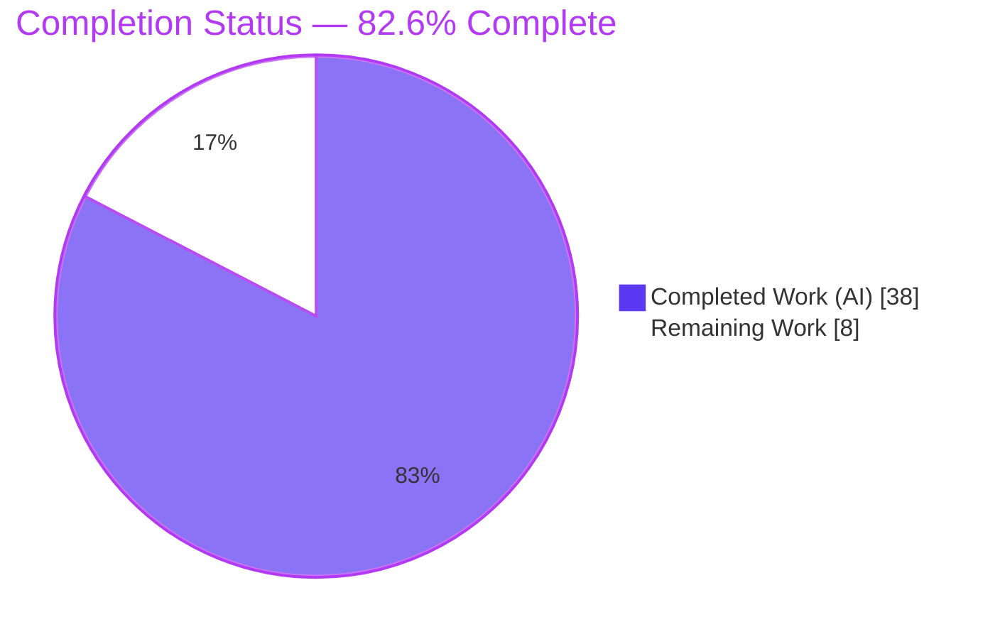
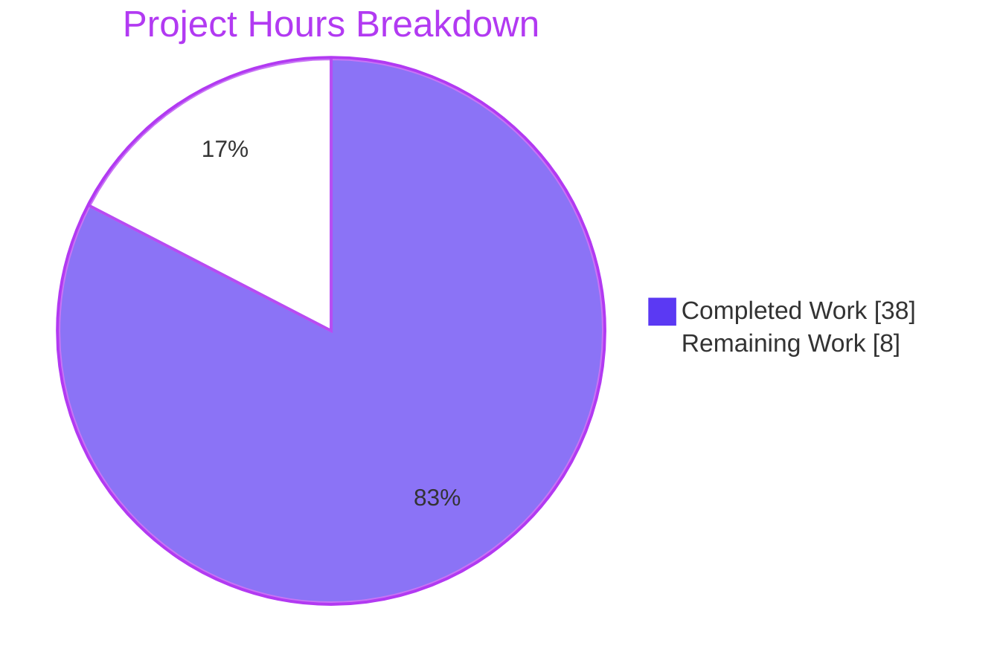
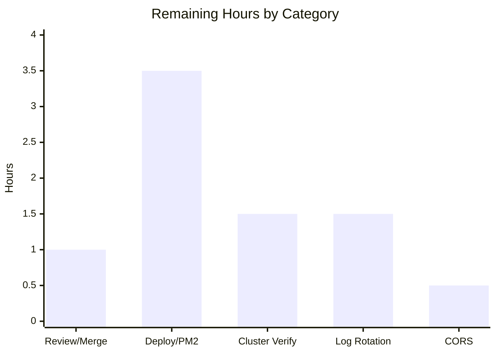

# Blitzy Project Guide — `hao-backprop-test` (Express.js Migration)

> **Project:** `hao-backprop-test` · npm package `hello_world` v1.0.0
> **Branch:** `blitzy-71519d72-173f-4979-a765-24efa6397207` · **HEAD:** `2654d99` · Working tree clean
> **Assessment basis:** Agent Action Plan (AAP) scope + path-to-production only (PA1 methodology)

---

## 1. Executive Summary

### 1.1 Project Overview

The **hao-backprop-test** repository (npm package `hello_world` v1.0.0) has been migrated from a minimal raw-Node `http` server into a production-ready **Express.js 5** application, while preserving the original `GET /` response contract **byte-for-byte** (HTTP `200`, `Content-Type: text/plain`, body `Hello, World!\n`). The enhancement adds an `express.Router()` routing layer, an ordered middleware pipeline (helmet, CORS, compression, body parsers, Morgan), dotenv-based environment configuration, structured Winston + Morgan logging, and a PM2 clustered deployment configuration. A user-requested `GET /good-evening` endpoint was also delivered. The service is headless (no UI). Target users are backend/platform engineers integrating with or operating the HTTP service.

### 1.2 Completion Status

The project is **82.6% complete** on an AAP-scoped, hours-based basis. All AAP deliverables are implemented and validated; the remaining hours are path-to-production last-mile activities (human review, deployment, operational hardening).



| Metric | Hours |
|---|---|
| **Total Hours** | **46** |
| Completed Hours (AI + Manual) | 38 |
| Remaining Hours | 8 |
| **Percent Complete** | **82.6%** |

> Formula: `38 ÷ 46 × 100 = 82.6%`. Completed hours are entirely AI-delivered (Blitzy agents); no manual hours were required to reach this state.

### 1.3 Key Accomplishments

- [x] **Express.js 5 adopted** via an application-factory pattern (`src/app.js`) with a thin bootstrap (`server.js`).
- [x] **Routing layer** (`express.Router()`) exposing preserved `GET /`, `GET /health` readiness probe, and user-requested `GET /good-evening`.
- [x] **Ordered middleware pipeline**: helmet → CORS → compression → body parsers → Morgan, terminated by centralized 404 + error handlers.
- [x] **Environment configuration** via dotenv with a typed config object and defaults preserving `127.0.0.1:3000`.
- [x] **Structured logging**: Winston (console + file transports) with Morgan streamed through it; query strings redacted for privacy.
- [x] **PM2 production deployment** configuration (cluster mode, env/env_production blocks, merge_logs, restart policy) + npm scripts.
- [x] **`GET /` contract preserved byte-for-byte** — the primary AAP acceptance signal — re-verified this session.
- [x] **Explainability rule satisfied**: `docs/decision-log.md` with 15 decision rows + a 100%-coverage bidirectional http→Express traceability matrix.
- [x] **Minimal-changes rule satisfied**: `README.md` and all unrelated fixtures left untouched; only in-scope files changed.
- [x] **Clean validation**: dependencies, compilation (7/7 `node --check`), functional smoke (12/12), and dev + PM2 cluster runtime all green.

### 1.4 Critical Unresolved Issues

| Issue | Impact | Owner | ETA |
|---|---|---|---|
| _None_ — no blocking defects identified | All AAP deliverables implemented, compile, and run; `GET /` contract preserved | — | — |

> There are **no critical unresolved issues**. All remaining items are non-blocking path-to-production activities enumerated in §1.6, §2.2, and §8.

### 1.5 Access Issues

| System/Resource | Type of Access | Issue Description | Resolution Status | Owner |
|---|---|---|---|---|
| _None_ | — | No access issues identified | N/A | — |

> **No access issues identified.** The repository, toolchain (Node v22.23.1, npm 10.9.8, git 2.55.0), and npm registry packages were all reachable; dependencies install deterministically from the committed lockfile. Production deployment will require the operator to provision a target host and set production environment variables (see §2.2 / §9), but no access blockers exist today.

### 1.6 Recommended Next Steps

1. **[High]** Review and merge the branch — confirm the byte-for-byte `GET /` contract and decision-log completeness, then approve the PR. _(≈1h)_
2. **[High]** Deploy to a production host and configure PM2 boot persistence (`pm2 startup` + `pm2 save`), binding `0.0.0.0:3000` via `--env production`. _(≈3.5h)_
3. **[Medium]** Verify the PM2 cluster on target infrastructure and cap `instances: 'max'` to a workload-appropriate count for this trivial service. _(≈1.5h)_
4. **[Medium]** Configure log rotation/retention (pm2-logrotate or winston-daily-rotate-file) to prevent unbounded disk growth. _(≈1.5h)_
5. **[Low]** Restrict the wildcard CORS policy to a production origin allowlist. _(≈0.5h)_

---

## 2. Project Hours Breakdown

### 2.1 Completed Work Detail

| Component | Hours | Description |
|---|---:|---|
| Dependency & manifest setup | 3.0 | 8 net-new packages added; `package-lock.json` regenerated (v3); `engines` node ≥18; `main` reconciled to `server.js`; 5 npm scripts (`start`/`dev`/`prod`/`reload`/`logs`) |
| Environment configuration module | 3.0 | `src/config/index.js` (dotenv load, typed `{env,host,port,logLevel}`, defaults preserving `127.0.0.1:3000`) + committed `.env.example` template |
| Structured logging (Winston + Morgan) | 4.0 | `src/config/logger.js`: Winston console + file transports (`combined.log`, `error.log`), timestamp+JSON, Morgan write-stream, query-string redaction token |
| Express app factory + middleware pipeline | 6.0 | `src/app.js`: `express()` composition root; ordered helmet → cors → compression → `express.json`/`urlencoded` → morgan; route mounting; terminal 404/error handlers |
| Routing layer | 3.0 | `src/routes/index.js`: `express.Router()`; byte-for-byte `GET /`; `GET /health` readiness probe |
| Centralized error/404 middleware | 2.5 | `src/middleware/errorHandler.js`: `notFound` (404 JSON) + hardened `errorHandler` (headersSent guard, 5xx message sanitization, server-side stack logging) |
| Entry-point refactor (`server.js`) | 1.5 | Thin bootstrap: load config, import app, `app.listen(port, host, cb)`, Winston startup log; listen semantics preserved |
| PM2 production deployment config | 4.0 | `ecosystem.config.js`: cluster mode, `instances:'max'`, env/env_production, log files, `merge_logs`, `max_memory_restart`, restart policy |
| VCS hygiene & log scaffolding | 1.0 | `.gitignore` (node_modules, .env, logs, *.log, pm2 dumps) + `logs/.gitkeep` |
| Decision log + 100% traceability matrix | 4.0 | `docs/decision-log.md`: 15 decision rows (decision/alternatives/rationale/risks) + bidirectional http→Express matrix at 100% coverage + run/deploy notes (Explainability rule) |
| `GET /good-evening` refine endpoint | 1.0 | User follow-up: behavior-consistent raw-methods handler (200 / `text/plain` / `Good evening\n`) + decision-log row |
| Autonomous validation, checkpoint fixes & debugging | 5.0 | Multi-checkpoint review cycles; dev + PM2 cluster runtime validation; 12/12 functional smoke; cross-platform dev-script fix; dotenv-banner + leaked-env-var diagnosis |
| **Total Completed** | **38.0** | |

> **Validation:** the Hours column sums to **38.0**, matching Completed Hours in §1.2.

### 2.2 Remaining Work Detail

| Category | Hours | Priority |
|---|---:|---|
| Code Review & PR Merge | 1.0 | High |
| Production Host Deploy & PM2 Boot Persistence | 3.5 | High |
| PM2 Cluster Verification & Instance Sizing | 1.5 | Medium |
| Log Rotation & Retention Configuration | 1.5 | Medium |
| Production CORS Origin Restriction | 0.5 | Low |
| **Total Remaining** | **8.0** | |

> **Validation:** the Hours column sums to **8.0**, matching Remaining Hours in §1.2 and the "Remaining Work" value in the §7 pie chart.

### 2.3 Total Project Hours & Completion Methodology

Completion is measured strictly against AAP-scoped work plus standard path-to-production activities (PA1 methodology). No out-of-scope items are counted in either bucket.

| Bucket | Hours |
|---|---:|
| Completed (§2.1) | 38.0 |
| Remaining (§2.2) | 8.0 |
| **Total Project Hours** | **46.0** |
| **Completion %** | **82.6%** (`38 ÷ 46 × 100`) |

**Out-of-scope (excluded from all totals per AAP §0.3.2):** CI/CD pipeline, Docker/containerization, automated unit/integration test framework, TLS/reverse-proxy termination, authentication/authorization, database/persistence, MVC controllers/services/models layering, TypeScript migration. These are AAP-declared non-goals, not remaining work, and are therefore not part of the 46-hour total.

---

## 3. Test Results

All results below originate from Blitzy's autonomous validation logs for this project and were re-confirmed during this assessment session. There is **no unit/integration test framework in scope**: per AAP §0.3.2 the `npm test` stub is an intentional failing placeholder that the plan mandates be retained, so functional correctness was validated through compilation checks, an assertion-based smoke harness, and live runtime checks.

| Test Category | Framework | Total Tests | Passed | Failed | Coverage % | Notes |
|---|---|---:|---:|---:|---:|---|
| Syntax / Compilation | `node --check` | 7 | 7 | 0 | N/A | All 7 in-scope JS files; re-confirmed this session |
| Functional Smoke (assertions) | Ad-hoc Node/HTTP harness | 12 | 12 | 0 | N/A | Exact status codes, exact `Content-Type` (no charset for `/` and `/good-evening`), exact bodies, `/health` JSON, 404 JSON |
| Runtime Endpoint — Dev | `curl` | 4 | 4 | 0 | N/A | `GET /`, `/good-evening`, `/health`, 404; re-confirmed this session |
| Runtime Endpoint — PM2 Prod Cluster | `curl` + PM2 | 4 | 4 | 0 | N/A | Same 4 endpoints against a 64-worker cluster (0 restarts) |
| Unit / Integration | _none in scope_ | 0 | 0 | 0 | N/A | `npm test` is an intentional failing stub retained per AAP §0.3.2 (out of scope) |
| **Total** | | **27** | **27** | **0** | **N/A** | 100% pass across all executed checks |

> **Coverage note:** no coverage instrumentation is configured (no test framework in scope), so line/branch coverage is Not Applicable. Correctness confidence derives from the byte-for-byte contract assertions and full-pipeline runtime validation.

---

## 4. Runtime Validation & UI Verification

**Runtime health (dev — `node server.js`, `127.0.0.1:3000`):**
- ✅ **GET /** → `200`, `Content-Type: text/plain` (no charset), body `Hello, World!\n` — byte-for-byte contract preserved
- ✅ **GET /good-evening** → `200`, `text/plain` (no charset), body `Good evening\n`
- ✅ **GET /health** → `200`, `application/json`, `{"status":"ok","uptime":<seconds>}`
- ✅ **GET /<unknown>** → `404`, `application/json`, `{"error":"Not Found","path":"/<unknown>"}`

**Middleware & observability:**
- ✅ **helmet** security headers present (CSP, HSTS, `X-Frame-Options: SAMEORIGIN`, `X-Content-Type-Options: nosniff`, Referrer-Policy, etc.)
- ✅ **CORS** active (`Access-Control-Allow-Origin: *`)
- ✅ **compression** negotiated (`Vary: Accept-Encoding`)
- ✅ **Winston** startup log + **Morgan** HTTP logs written to console **and** `logs/combined.log`; query strings redacted; `logs/error.log` empty

**Production (PM2 — `npm run prod`, `0.0.0.0:3000`):**
- ✅ Cluster started (64 workers online, 0 restarts); `env_production` applied (`NODE_ENV=production`, `HOST=0.0.0.0`)
- ✅ All 4 endpoints correct against the cluster; `merge_logs` consolidated worker output to `logs/pm2-out.log`; `pm2-error.log` empty
- ✅ Clean teardown (`pm2 delete all` + `pm2 kill`), port 3000 freed

**UI Verification:**
- ➖ **Not applicable** — this is a headless backend HTTP service with no UI surface (AAP §0.5). No Figma frames or design system were supplied (AAP §0.9).

---

## 5. Compliance & Quality Review

AAP deliverables and binding rules cross-mapped to quality/compliance benchmarks. All items pass; fixes applied during autonomous validation are noted.

| Benchmark / AAP Deliverable | Requirement | Status | Notes |
|---|---|:--:|---|
| Express.js adoption | Framework migration from raw `http` | ✅ Pass | `src/app.js` factory; express@5.2.1 |
| Routing | `express.Router()` + `GET /` + `GET /health` | ✅ Pass | `src/routes/index.js`; plus `GET /good-evening` |
| Middleware pipeline | helmet, cors, compression, body parsers, morgan, 404+error | ✅ Pass | Correct ordering; terminal error handler |
| Environment configuration | dotenv, externalized host/port | ✅ Pass | `src/config/index.js`; defaults preserve `127.0.0.1:3000` |
| Logging | Winston + Morgan, console + file transports | ✅ Pass | `src/config/logger.js`; query-string redaction |
| PM2 deployment | `ecosystem.config.js` + scripts | ✅ Pass | Cluster mode; env_production; merge_logs |
| Behavior preservation | Byte-for-byte `GET /` | ✅ Pass | Primary acceptance signal met (runtime-verified) |
| Explainability rule | Decision log + 100% traceability matrix, no rationale in code | ✅ Pass | `docs/decision-log.md`: 15 decisions + full matrix |
| Minimal-changes rule | Confine to HTTP-server surface | ✅ Pass | `README.md` + fixtures untouched; git diff confirms in-scope only |
| Zero-placeholder policy | No stubs/TODOs/dummy returns | ✅ Pass | Every in-scope file fully implemented |
| Dependency integrity | Manifests in sync; exact versions | ✅ Pass | `npm ls` clean; 8 exact AAP versions; lockfile v3 |
| Secret hygiene | `.env` not committed | ✅ Pass | Only `.env.example` committed; `.gitignore` in place |

**Fixes applied during autonomous validation (from commit history):** Checkpoint-1 fixes; Checkpoint-5 fixes; PM2 `merge_logs` consolidation; dotenv startup-banner suppression (`quiet:true`); Morgan query-string redaction; cross-platform dev-script correction. **Outstanding compliance items:** none within AAP scope.

---

## 6. Risk Assessment

| Risk | Category | Severity | Probability | Mitigation | Status |
|---|---|:--:|:--:|---|---|
| Unbounded log growth (Winston file + PM2 logs have no rotation) | Technical | Medium | Medium | Add pm2-logrotate or winston-daily-rotate-file; cap size/retention | Open (→ §2.2) |
| `instances:'max'` over-spawns workers on large hosts for a trivial service | Technical | Low–Med | Medium | Pin instances to a workload-appropriate count on target infra | Open (→ §2.2) |
| Express 5.x relative maturity vs long-stable v4 | Technical | Low | Low | Pinned versions + lockfile; all middleware verified working; watch advisories | Mitigated |
| No automated regression suite (contract guard for future edits) | Technical | Medium | Medium | Add supertest suite when the AAP out-of-scope constraint is lifted | Accepted (AAP decision) |
| Wildcard CORS in production (`ACAO: *`) | Security | Low | Low | Restrict to an origin allowlist for production | Open (→ §2.2) |
| Dependency CVE surface (transitive vulns over time) | Security | Medium | Medium | `npm audit` in CI + Dependabot/Renovate | Open (recommend) |
| `.env` secret handling | Security | Low | Low | Gitignored; only `.env.example` committed; no real secrets today | Mitigated |
| Error info exposure | Security | Low | Low | 5xx sanitized to "Internal Server Error"; stack logged server-side only | Mitigated |
| helmet baseline headers | Security | Low | Low | Applied with defaults (runtime-confirmed); tune CSP if a UI is added | Mitigated |
| PM2 boot persistence not configured | Operational | Medium | Medium | Run `pm2 startup` + `pm2 save` on the target host | Open (→ §2.2) |
| No external monitoring/alerting | Operational | Medium | Medium | Wire `/health` to an uptime monitor / PM2 Plus | Open (recommend) |
| Single-host deployment (no cross-host HA) | Operational | Low–Med | Low | Multi-host + load balancer if the SLA requires HA | Accepted (scope) |
| No TLS / reverse proxy (serves plain HTTP) | Integration | Medium | Medium | Front with a reverse proxy / LB terminating TLS | Open (out-of-AAP-scope) |
| Port 3000 conflicts on shared hosts | Integration | Low | Low | `PORT` externalized — set per environment | Mitigated |
| Env var provisioning on target | Integration | Low | Low | Use `--env production` (sets `HOST=0.0.0.0`); documented in §9 | Mitigated |

**Overall risk posture: LOW-to-MEDIUM. No High-severity risks.** Most open risks are standard path-to-production operational items already captured in the 8h remaining or flagged as post-scope recommendations.

---

## 7. Visual Project Status

**Project hours breakdown** (Completed = Dark Blue `#5B39F3`, Remaining = White `#FFFFFF`):



**Remaining hours by category** (from §2.2, totaling 8h):



**Priority distribution of remaining work:** High = 4.5h (Review/Merge + Deploy/PM2) · Medium = 3.0h (Cluster Verify + Log Rotation) · Low = 0.5h (CORS). Sum = 8.0h, consistent with §1.2, §2.2, and the pie chart above.

---

## 8. Summary & Recommendations

**Achievements.** The migration from a raw-Node `http` server to a production-ready **Express.js 5** application is complete and validated. Every AAP deliverable — Express adoption, `express.Router()` routing, an ordered middleware pipeline, dotenv environment configuration, Winston + Morgan logging, and a PM2 clustered deployment configuration — is implemented, compiles cleanly, and runs correctly. The primary acceptance signal (byte-for-byte preservation of the `GET /` response) is met and was independently re-verified this session, along with the user-requested `GET /good-evening` endpoint. Both binding rules are satisfied: the Explainability rule via a decision log with a 100%-coverage traceability matrix, and the Make-minimal-changes rule (README and unrelated fixtures untouched; only in-scope files changed).

**Remaining gaps & critical path to production.** The project is **82.6% complete** (38 of 46 AAP-scoped hours). The remaining **8 hours** are entirely path-to-production last-mile: human review/merge (1h) → production host deployment with PM2 boot persistence (3.5h) → cluster verification/instance sizing (1.5h) → log rotation/retention (1.5h) → optional CORS origin restriction (0.5h). No code defects or feature gaps remain; the critical path is operational, not developmental.

**Success metrics.** Compilation 7/7; functional smoke 12/12; runtime 4/4 endpoints correct in both dev and a 64-worker PM2 cluster; dependency tree clean with 8 exact pinned versions; zero placeholders; zero committed secrets.

**Production readiness assessment.** The codebase is **production-ready pending human review and deployment**. Before public exposure, address the operational recommendations (log rotation, monitoring/alerting to `/health`, TLS termination via a reverse proxy, dependency scanning in CI) — these are out-of-AAP-scope enhancements (≈12h, not counted in project totals) but are prudent for a hardened production posture. Recommended immediate action: execute steps 1–2 in §1.6 to review, merge, and deploy.

| Metric | Value |
|---|---|
| Completion | 82.6% |
| Completed / Total Hours | 38 / 46 |
| Remaining Hours | 8 |
| Critical unresolved issues | 0 |
| High-severity risks | 0 |
| Test pass rate (executed checks) | 27/27 (100%) |

---

## 9. Development Guide

All commands below were tested on the host this session (Windows/PowerShell shell; Node v22.23.1, npm 10.9.8, git 2.55.0). Run them from the repository root.

### 9.1 System Prerequisites
- **Node.js ≥ 18** (per `package.json` `engines`; verified on v22.23.1)
- **npm** (verified on 10.9.8)
- **git** (verified on 2.55.0)
- **PM2** — not required globally; it is a devDependency and `npm run prod` resolves the local binary. Global install (`npm i -g pm2`) is optional for `pm2` CLI convenience.

### 9.2 Environment Setup
Environment variables are optional locally — all have safe defaults in `src/config/index.js`. To override, copy the template:

```bash
cp .env.example .env
# .env keys: NODE_ENV, PORT (default 3000), HOST (default 127.0.0.1), LOG_LEVEL (default info)
```

> **Tip:** if a shell has a leaked `LOG_LEVEL=error` exported, `info` logs are suppressed. Clear it before running (`unset LOG_LEVEL` on bash, or `$env:LOG_LEVEL=$null` on PowerShell).

### 9.3 Dependency Installation

```bash
npm ci        # deterministic install from package-lock.json (recommended)
# or
npm install   # regenerates/updates the lockfile if needed
```

Verify the dependency tree (expect 8 packages, no unmet/peer errors):

```bash
npm ls --depth=0
# hello_world@1.0.0
# +-- compression@1.8.1
# +-- cors@2.8.6
# +-- dotenv@17.4.2
# +-- express@5.2.1
# +-- helmet@8.2.0
# +-- morgan@1.11.0
# +-- pm2@7.0.3
# `-- winston@3.19.0
```

Optional compile check (expect all OK):

```bash
node --check server.js
node --check src/app.js
node --check src/config/index.js
node --check src/config/logger.js
node --check src/middleware/errorHandler.js
node --check src/routes/index.js
node --check ecosystem.config.js
```

### 9.4 Application Startup

**Development** (binds `127.0.0.1:3000`):

```bash
npm start        # === node server.js
# or
npm run dev
```

Expected Winston startup log:

```json
{"level":"info","message":"Server running at http://127.0.0.1:3000/","timestamp":"<ISO-8601>"}
```

**Production** (PM2 cluster, binds `0.0.0.0:3000`):

```bash
npm run prod      # pm2 start ecosystem.config.js --env production
npm run reload    # zero-downtime reload
npm run logs      # tail consolidated logs

# Cleanup / teardown
npx --no-install pm2 delete all
npx --no-install pm2 kill

# Reboot persistence (run once on the target host)
pm2 startup       # follow the printed instruction
pm2 save
```

### 9.5 Verification Steps

```bash
curl -i http://127.0.0.1:3000/              # 200 text/plain  -> Hello, World!
curl -i http://127.0.0.1:3000/good-evening  # 200 text/plain  -> Good evening
curl -i http://127.0.0.1:3000/health        # 200 application/json -> {"status":"ok","uptime":...}
curl -i http://127.0.0.1:3000/nope          # 404 application/json -> {"error":"Not Found","path":"/nope"}
```

Confirm logging (Winston + Morgan → console and file):

```bash
# logs/combined.log receives startup + HTTP request lines (query strings redacted)
# logs/error.log stays empty unless an error is logged
```

### 9.6 Example Usage

```bash
$ curl -s http://127.0.0.1:3000/
Hello, World!

$ curl -s http://127.0.0.1:3000/good-evening
Good evening

$ curl -s http://127.0.0.1:3000/health
{"status":"ok","uptime":2.05}
```

### 9.7 Troubleshooting

| Symptom | Cause | Resolution |
|---|---|---|
| No `info` logs appear | Leaked `LOG_LEVEL=error` in the shell | Clear it: `unset LOG_LEVEL` (bash) / `$env:LOG_LEVEL=$null` (PowerShell) |
| `EADDRINUSE :3000` | Port already in use | Set `PORT` env var, or free the port |
| Not reachable from another host in prod | Bound to `127.0.0.1` | Start with `--env production` (sets `HOST=0.0.0.0`) |
| App does not restart after host reboot | PM2 boot persistence not configured | Run `pm2 startup` then `pm2 save` |
| `npm test` "fails" | Intentional failing stub retained per AAP §0.3.2 | Expected — no test framework is in scope |

---

## 10. Appendices

### A. Command Reference

| Command | Purpose |
|---|---|
| `npm ci` | Deterministic dependency install from lockfile |
| `npm start` / `npm run dev` | Start dev server (`node server.js`, `127.0.0.1:3000`) |
| `npm run prod` | Start PM2 cluster (`--env production`, `0.0.0.0:3000`) |
| `npm run reload` | Zero-downtime PM2 reload |
| `npm run logs` | Tail consolidated PM2 logs |
| `npm ls --depth=0` | Verify dependency tree |
| `node --check <file>` | Syntax/compile check |
| `npx --no-install pm2 delete all` / `pm2 kill` | PM2 teardown |
| `pm2 startup` + `pm2 save` | Configure PM2 boot persistence |

### B. Port Reference

| Port | Service | Binding |
|---|---|---|
| 3000 | HTTP server | `127.0.0.1` (dev) / `0.0.0.0` (production via `env_production`) |

### C. Key File Locations

| Path | Role |
|---|---|
| `server.js` | Thin bootstrap (config → logger → app → listen) |
| `src/app.js` | Express application factory (middleware + routes + error handlers) |
| `src/routes/index.js` | Router: `GET /`, `GET /good-evening`, `GET /health` |
| `src/config/index.js` | dotenv-backed typed configuration |
| `src/config/logger.js` | Winston logger + Morgan write-stream |
| `src/middleware/errorHandler.js` | `notFound` + `errorHandler` |
| `ecosystem.config.js` | PM2 cluster/deployment configuration |
| `.env.example` | Environment-variable template |
| `.gitignore` | Ignores node_modules, .env, logs, *.log, PM2 dumps |
| `logs/.gitkeep` | Preserves the git-ignored `logs/` directory |
| `docs/decision-log.md` | Decision log + 100% traceability matrix (Explainability rule) |
| `README.md` | Left untouched ("Do not touch!" guardrail) |

### D. Technology Versions

| Tool / Package | Version |
|---|---|
| Node.js | v22.23.1 (engines: ≥18) |
| npm | 10.9.8 |
| git | 2.55.0 |
| express | 5.2.1 |
| dotenv | 17.4.2 |
| morgan | 1.11.0 |
| winston | 3.19.0 |
| helmet | 8.2.0 |
| cors | 2.8.6 |
| compression | 1.8.1 |
| pm2 | 7.0.3 (devDependency) |

> **Note:** AAP §0.2.3 referenced npm 11.1.0; the host reports npm 10.9.8. This is a minor environment discrepancy only — installs are deterministic from `package-lock.json` (lockfileVersion 3) and unaffected.

### E. Environment Variable Reference

| Variable | Default | Purpose |
|---|---|---|
| `NODE_ENV` | `development` | Runtime mode; `production` enables Express optimizations |
| `PORT` | `3000` | HTTP listen port |
| `HOST` | `127.0.0.1` | Bind address (`0.0.0.0` in `env_production`) |
| `LOG_LEVEL` | `info` | Winston verbosity |

### F. Developer Tools Guide

- **PM2** — clustered process manager driven by `ecosystem.config.js` (`instances:'max'`, `exec_mode:'cluster'`, `max_memory_restart:'300M'`, `autorestart`, `merge_logs`). Use `npm run prod`/`reload`/`logs`; teardown with `pm2 delete all` + `pm2 kill`.
- **Winston** — application logger; console + file transports (`logs/combined.log`, `logs/error.log`); timestamped JSON.
- **Morgan** — HTTP request logger streamed through Winston; a custom `url` token strips query strings for privacy.
- **dotenv** — loads `.env` into `process.env` at startup with `quiet:true` (no banner); all variables have safe defaults.

### G. Glossary

| Term | Definition |
|---|---|
| **AAP** | Agent Action Plan — the authoritative specification of project scope |
| **Application factory** | Pattern where `src/app.js` builds and returns a configured Express app, decoupled from process bootstrap |
| **Byte-for-byte contract** | The exact preserved `GET /` response: `200` / `text/plain` (no charset) / `Hello, World!\n` |
| **Middleware pipeline** | Ordered chain: helmet → CORS → compression → body parsers → Morgan → router → 404 → error handler |
| **PA1 methodology** | AAP-scoped, hours-based completion measurement (Completed ÷ Total) |
| **Path-to-production** | Standard deployment/operational activities required to run AAP deliverables in production |
| **Readiness probe** | `GET /health` returning `{status, uptime}` for monitoring/orchestration |
