# Technical Specification

# 1. Introduction

## 1.1 Executive Summary

`hao-backprop-test` is a deliberately minimal, mixed-language **test-fixture repository** rather than a conventional business application. Its identity and intent are declared directly in `README.md`, which titles the project *hao-backprop-test* and describes it as a "test project for backprop integration," accompanied by an explicit "Do not touch!" guardrail instructing that the fixture remain unmodified. The repository's only functional runtime artifact is `server.js`, a self-contained Node.js HTTP server that binds to the loopback interface `127.0.0.1:3000` and returns a fixed `Hello, World!` plain-text response to every request.

The project is intentionally small and flat: it contains eleven files at a single directory level with no subfolders, mixing Node.js runtime code, an incomplete Java stub, CSV reference data, binary document artifacts, and empty placeholder files. Notably, the human-facing repository name (*hao-backprop-test*) differs from the Node package identity declared in `package.json` (`hello_world`, version `1.0.0`), indicating that the Node component is a canonical "Hello world" example embedded within a broader integration-test fixture.

**Project at a glance**

| Attribute | Value as declared in the repository |
| --- | --- |
| Repository name | `hao-backprop-test` (`README.md`) |
| Node package identity | `hello_world`, version `1.0.0` (`package.json`) |
| Stated purpose | "test project for backprop integration" (`README.md`) |
| Primary runtime artifact | `server.js` — Node.js HTTP server on `127.0.0.1:3000` |
| Author / License | `hxu` / MIT (`package.json`) |

**Core business problem.** As a fixture, the repository does not address an end-user or commercial problem; it satisfies a tooling and quality-assurance need. It provides a stable, low-complexity, and intentionally heterogeneous target that an external process — referred to in `README.md` only as "backprop integration" — can consume and exercise in a predictable way. The repository does not itself define the internal mechanics of that integration beyond the README phrase, so this specification treats "backprop integration" strictly as the external consumer of the fixture and makes no further assumptions about its nature.

**Key stakeholders and users.**

| Stakeholder / User group | Interest in the repository | Supporting evidence |
| --- | --- | --- |
| Backprop integration / tooling operators | Primary consumers that exercise the fixture | `README.md` — "test project for backprop integration" |
| Repository author and owner | Authorship, custody, and change control | `package.json` author `hxu`; Git remote owner `Sandeep02Kumar02` |
| QA / integration engineers | Validating deterministic, repeatable behavior | Test-oriented artifacts: `LoginTest.java`, `test.py.txt`, `test.txt.txt`, Java package `com.blitzyTest` |

**Expected business impact and value proposition.** The repository's value derives largely from what it deliberately does *not* do. Its determinism (a single static HTTP response with no branching or shared state), minimalism (zero third-party dependencies; a standard-library-only server), heterogeneity (JavaScript, Java, CSV, and binary PDF/JPEG/DOC artifacts co-located in one place), and stability (an explicit "Do not touch!" directive) make it a dependable, repeatable reference against which integration and analysis tooling can be validated without the noise and variability of a complex production application.

## 1.2 System Overview

This section situates the repository within its operating context, describes its capabilities and components at a high level, and identifies the criteria by which its success as a test fixture can be judged. All statements are grounded in the repository's actual contents; where the source does not define a concept (for example, formal market positioning or KPIs), that absence is stated explicitly rather than inferred.

### 1.2.1 Project Context

**Business and operational context.** The repository operates as a supporting asset within an integration and quality-assurance workflow rather than as a product positioned in a market. `README.md` frames it solely as a "test project for backprop integration," and the Git remote name — `12-dec-existing-projects-qa-test-5` — together with the Java package `com.blitzyTest` reinforce a test/QA orientation. The repository defines no commercial product, customers, pricing, or market positioning, and this specification does not infer any.

**Relationship to existing systems (not a replacement or upgrade).** The repository is a greenfield fixture rather than a migration or replacement of a prior system, and it contains no evidence of versioned predecessors beyond a single initial commit ("Add files via upload"). Several characteristics that would be considered defects in a production application are, in this fixture, either deliberate or inert:

| Characteristic | Observed state | Evidence |
| --- | --- | --- |
| Declared package entry point | `main` points to `index.js`, which is absent from the repository | `package.json` |
| Test script | Intentionally fails — prints an error and exits with status `1` | `package.json` (`scripts.test`) |
| Java stub | `main` method body is the bare token `Web`; the file will not compile | `LoginTest.java` |
| Placeholder files | `test.py.txt` and `test.txt.txt` are empty (0 bytes) | repository contents |

**Integration with the enterprise landscape.** Runtime coupling is intentionally minimal. `server.js` binds only to the loopback interface `127.0.0.1`, so the service is not reachable from external networks. `package-lock.json` records no dependency tree and `package.json` declares no `dependencies` or `devDependencies`, so the Node server relies solely on the built-in `http` module. The repository's only external touchpoints are its Git/GitHub hosting and the unspecified "backprop integration" tooling that consumes it.

### 1.2.2 High-Level Description

**Primary system capabilities.**

- **Serve a deterministic local HTTP response** — `server.js` returns HTTP `200`, `Content-Type: text/plain`, and body `Hello, World!\n` for every request, irrespective of method or path.
- **Present multiple source languages** — Node.js (`server.js`) and Java (`LoginTest.java`) co-exist within a single fixture.
- **Supply structured reference data** — `industry.csv` provides a controlled vocabulary of 43 industry labels under a single `Industry` column.
- **Supply binary document artifacts** — a PDF, a JPEG, and a legacy Word document serve as file-handling inputs.
- **Provide empty placeholders** — `test.py.txt` and `test.txt.txt` act as content-free marker files.

**Major system components.**

| Component | File(s) | Role in the fixture |
| --- | --- | --- |
| HTTP server | `server.js` | Standalone Node.js loopback server; the only executable behavior |
| Package manifest & lockfile | `package.json`, `package-lock.json` | Declare `hello_world` identity, MIT license, dependency-free lock |
| Project documentation | `README.md` | Establishes identity and the "Do not touch!" guardrail |
| Java stub | `LoginTest.java` | Incomplete `com.blitzyTest.LoginTest` entry-point placeholder |
| Reference dataset | `industry.csv` | 43-value industry controlled vocabulary |
| Binary artifacts | `100Pages.pdf`, `demo.jpg`, `sample.doc` | PDF / JPEG / legacy-Word file-handling inputs |
| Empty placeholders | `test.py.txt`, `test.txt.txt` | Zero-byte marker files |

The runtime behavior of the sole executable component is summarized below:

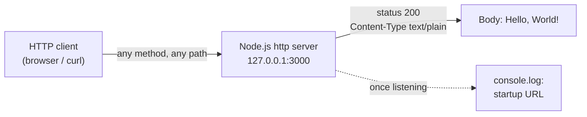

**Core technical approach.** The design is defined by minimalism and self-containment. The server uses only Node's standard-library `http` module, requires no build step or installation of third-party packages, and holds no state between requests. The repository is flat (no subdirectories), heterogeneous by design, and intended for local execution, verification, or demonstration rather than production deployment.

### 1.2.3 Success Criteria

The repository does not define formal business KPIs, service-level agreements, or performance targets; none are present in any file. The following criteria are therefore expressed as functional, observable indicators derived directly from the source, consistent with the repository's role as a test fixture.

**Measurable objectives (observable indicators).**

| Indicator | Expected observable outcome | Source |
| --- | --- | --- |
| Server startup | Logs `Server running at http://127.0.0.1:3000/` once listening | `server.js` |
| Request handling | Every request returns HTTP `200` + `Hello, World!\n` (text/plain) | `server.js` |
| Dependency footprint | Resolves with no third-party packages (empty lock tree) | `package-lock.json` |
| Test command | `npm test` exits non-zero, by design | `package.json` |

**Critical success factors.** Preservation of the fixture's defining qualities — determinism, simplicity, heterogeneity, and immutability (the "Do not touch!" directive in `README.md`) — is the central success factor; drift in any of these would undermine the fixture's usefulness as a stable, repeatable reference.

**Key performance indicators (KPIs).** No quantitative KPIs (throughput, latency, availability, adoption, or similar) are defined anywhere in the repository. In keeping with the evidence-based scope of this specification, no KPIs are introduced that the source does not itself establish.

## 1.3 Scope

This section delineates what the repository — as it actually exists — includes and what it deliberately excludes or does not support. Because the subject is a test fixture rather than an evolving product, "scope" is framed in terms of the artifacts and behaviors present in the source versus those that are absent, inert, or explicitly unsupported.

### 1.3.1 In-Scope

**Core features and functionalities (must-have capabilities).**

| Capability | Description | Evidence |
| --- | --- | --- |
| Static HTTP endpoint | Serves HTTP `200` + `Hello, World!\n` on `127.0.0.1:3000` for all requests | `server.js` |
| Package definition | Declares `hello_world` v1.0.0, MIT license, and a `test` script hook | `package.json`, `package-lock.json` |
| Multi-language artifacts | Node.js and Java source co-located within one fixture | `server.js`, `LoginTest.java` |
| Reference vocabulary | 43 industry labels under a single `Industry` column | `industry.csv` |
| Binary sample documents | PDF, JPEG, and legacy Word files as file-handling inputs | `100Pages.pdf`, `demo.jpg`, `sample.doc` |
| Documentation & guardrail | Project identity and the "Do not touch!" directive | `README.md` |

**Primary user workflows.**

- **Run the server locally** — execute `server.js` with Node.js, observe the `Server running at http://127.0.0.1:3000/` log, issue an HTTP request, and receive the fixed `Hello, World!` response.
- **Consume the fixture with external tooling** — the "backprop integration" process reads and exercises the repository's heterogeneous files.
- **Invoke the test hook** — running `npm test` executes the placeholder script, which exits non-zero by design.

**Essential integrations.**

- The **Node.js runtime** and its built-in `http` module — the only runtime dependency of `server.js`.
- **Git / GitHub** hosting of the repository.
- The external **backprop integration** tooling that acts as the fixture's consumer.

No third-party package integrations exist; `package-lock.json` records an empty dependency tree.

**Key technical requirements (as evidenced).**

- A Node.js runtime capable of executing a CommonJS script that calls `require('http')`.
- Availability of TCP port `3000` on the loopback interface `127.0.0.1`.
- No build, compile, or dependency-install step for the Node component (zero declared dependencies).
- MIT licensing terms (`package.json`, `package-lock.json`).

**Implementation boundaries.**

| Boundary dimension | In-scope definition | Evidence |
| --- | --- | --- |
| System boundary | A single Node.js process bound to loopback, plus the repository's static files | `server.js` |
| User groups covered | Technical operators — tooling/QA engineers and the author — not end customers | `README.md`, `package.json` |
| Geographic / market coverage | None defined; loopback-only binding implies single-host local use | `server.js` |
| Data domains included | Industry controlled vocabulary, a static greeting string, and sample binary documents | `industry.csv`, `server.js` |

### 1.3.2 Out-of-Scope

**Explicitly excluded or absent capabilities.**

| Excluded capability | Basis for exclusion | Evidence |
| --- | --- | --- |
| Request routing / dynamic responses | Handler ignores request method, URL, headers, and body | `server.js` |
| Authentication / authorization | No auth logic; the Java "login" file is a non-compiling stub | `LoginTest.java` |
| Persistence / database / session state | No storage code or stateful logic present | repository contents |
| Third-party frameworks & dependencies | No `dependencies`/`devDependencies`; empty lock tree | `package.json`, `package-lock.json` |
| Automated testing | `test` script intentionally fails; no test runner configured | `package.json` |
| Build, CI/CD, containerization | No build config, pipeline, Dockerfile, or environment files present | repository contents |

**Future phase considerations.** The repository documents no roadmap, versioning strategy, or planned enhancements. The "Do not touch!" directive in `README.md`, together with the single "Add files via upload" commit, indicates the fixture is intended to remain static; consequently, no future phases are defined within the repository, and none are inferred here.

**Integration points not covered.** The repository exposes no external APIs, message queues, cloud services, or third-party service integrations. The internal mechanics of the "backprop integration" that consumes this fixture are external to the repository and therefore lie outside the scope of this specification.

**Unsupported use cases.**

- Public or production hosting and internet-facing traffic — the server binds only to `127.0.0.1`.
- Concurrent, multi-user, or stateful sessions — no state is retained between requests.
- Using `LoginTest.java` as a functional login or test routine — it does not compile.
- Relying on `npm test` for validation — it fails intentionally.
- Resolving the package's declared `index.js` entry point — the file is absent from the repository.
- Attributing functional behavior to the empty placeholder files `test.py.txt` and `test.txt.txt`.

## 1.4 References

The following repository artifacts were examined directly as the evidentiary basis for this Introduction. No external web sources were required, as the system relies only on the Node.js standard library and declares no third-party dependencies.

**Files**

- `README.md` — Established the project identity (`hao-backprop-test`), the stated purpose ("test project for backprop integration"), and the "Do not touch!" guardrail.
- `server.js` — Established the sole runtime behavior: a Node.js `http` server bound to `127.0.0.1:3000` returning a static `Hello, World!\n` response with HTTP `200` and `Content-Type: text/plain`.
- `package.json` — Established the Node package identity (`hello_world` v1.0.0), MIT license, author `hxu`, the missing `index.js` main entry point, and the intentionally failing `test` script.
- `package-lock.json` — Confirmed lockfile v3 with an empty dependency tree (no third-party packages).
- `LoginTest.java` — Established the incomplete Java stub in package `com.blitzyTest` whose `main` body is the bare token `Web` (non-compiling placeholder).
- `industry.csv` — Established the controlled-vocabulary reference dataset: one `Industry` header column plus 43 industry labels.
- `test.py.txt` — Confirmed a 0-byte empty placeholder file.
- `test.txt.txt` — Confirmed a 0-byte empty placeholder file.
- `100Pages.pdf` — Confirmed a binary PDF (1.7) sample document artifact (~9.4 MB).
- `demo.jpg` — Confirmed a binary JPEG/EXIF image artifact (~2.1 MB).
- `sample.doc` — Confirmed a binary legacy (OLE2) Microsoft Word document artifact (~98 KB).

**Folders**

- Repository root (`/`) — The single, flat directory level of the repository; contains all eleven files above and no subfolders.

**Repository metadata**

- Git remote and history — Established the remote owner (`Sandeep02Kumar02`), the repository name (`12-dec-existing-projects-qa-test-5`), and the single initial commit "Add files via upload".

# 2. Product Requirements

## 2.1 Feature Catalog

This catalog decomposes the `hao-backprop-test` repository into discrete, individually testable features. Because the repository is a deliberately minimal, mixed-language **test fixture** rather than a business application (as established in *1.1 Executive Summary*, *1.2 System Overview*, and *1.3 Scope*), the features below are derived **strictly from artifacts that actually exist** in the repository. No speculative, roadmap, or "typical" features are introduced. The six features together account for all eleven files present at the single directory level of the repository.

**Feature derivation and evidence base.** Every feature maps directly to one or more source artifacts. The primary — and only — executable behavior is the HTTP server in `server.js`; the remaining features describe the package/configuration, reference data, and heterogeneous static artifacts that constitute the fixture's consumable surface.

**Feature index.**

| Feature ID | Feature Name | Category | Priority |
| --- | --- | --- | --- |
| F-001 | Static HTTP Response Server | Runtime Service / HTTP Interface | Critical |
| F-002 | Node.js Package Definition & Dependency-Free Manifest | Build & Package Configuration | High |
| F-003 | Industry Reference Vocabulary Dataset | Reference Data | Medium |
| F-004 | Binary Document Sample Artifacts | Test Fixture Content (Binary) | Low |
| F-005 | Multi-Language Source & Empty Placeholder Artifacts | Test Fixture Content (Source / Placeholder) | Low |
| F-006 | Project Documentation & Immutability Guardrail | Documentation & Governance | Medium |

**Feature status and source artifacts.**

| Feature ID | Status | Primary Source Artifact(s) |
| --- | --- | --- |
| F-001 | Completed | `server.js` |
| F-002 | Completed | `package.json`, `package-lock.json` |
| F-003 | Completed | `industry.csv` |
| F-004 | Completed | `100Pages.pdf`, `demo.jpg`, `sample.doc` |
| F-005 | Completed | `LoginTest.java`, `test.py.txt`, `test.txt.txt` |
| F-006 | Completed | `README.md` |

All features are recorded as **Completed** because the repository exists as a single committed snapshot (one Git commit, `Add files via upload`) that `README.md` explicitly declares immutable ("Do not touch!"). "Completed" therefore denotes *delivered fixture state*, not functional maturity — F-005 in particular contains a Java stub that does not compile and two empty placeholder files, all of which are intentional fixture characteristics rather than defects to be resolved.

**Assumptions and constraints governing this catalog.**

- No key performance indicators, service-level agreements, or quantitative performance targets are defined anywhere in the repository; none are invented here (consistent with *1.2.3 Success Criteria*).
- Priorities reflect each feature's centrality to the fixture's stated purpose: the sole runtime behavior (F-001) is Critical; package identity (F-002) is High; the remaining static artifacts are Medium/Low.
- Complexity is uniformly **Low** across all features because no branching, algorithmic, or stateful logic exists in any artifact.
- The `main` field of `package.json` references `index.js`, which is **absent** from the repository; this is treated as a documented characteristic, not a feature.

### 2.1.1 F-001 — Static HTTP Response Server

**Feature metadata.**

| Attribute | Value |
| --- | --- |
| Unique ID | F-001 |
| Feature Name | Static HTTP Response Server |
| Feature Category | Runtime Service / HTTP Interface |
| Priority Level | Critical |
| Status | Completed |

**Description.**

- **Overview:** `server.js` creates an HTTP server using Node's built-in `http` module, binds it to the loopback host `127.0.0.1` on port `3000`, and responds to every incoming request with HTTP status `200`, header `Content-Type: text/plain`, and the response body `Hello, World!\n`. Upon successful binding it logs `Server running at http://127.0.0.1:3000/`.
- **Business Value:** This is the single point of observable runtime behavior in the fixture and the deterministic target that the external "backprop integration" tooling exercises. Its predictability is the feature's primary value.
- **User Benefits:** Tooling and QA operators obtain a repeatable HTTP endpoint that requires no configuration, build step, or dependency installation beyond a Node.js runtime.
- **Technical Context:** The implementation is a fourteen-line CommonJS script with no request routing, no branching, no shared state, and no exported API. It relies solely on the Node standard library.

**Dependencies.**

| Dependency Category | Detail |
| --- | --- |
| Prerequisite Features | None |
| System Dependencies | A Node.js runtime capable of executing a CommonJS script that calls `require('http')` |
| External Dependencies | None — no third-party npm packages are declared or installed |
| Integration Requirements | Availability of TCP port `3000` on the loopback interface `127.0.0.1`; consumed by HTTP clients and the external backprop integration tooling |

### 2.1.2 F-002 — Node.js Package Definition & Dependency-Free Manifest

**Feature metadata.**

| Attribute | Value |
| --- | --- |
| Unique ID | F-002 |
| Feature Name | Node.js Package Definition & Dependency-Free Manifest |
| Feature Category | Build & Package Configuration |
| Priority Level | High |
| Status | Completed |

**Description.**

- **Overview:** `package.json` declares the Node package identity `hello_world` version `1.0.0`, description `Hello world in Node.js`, author `hxu`, MIT license, `main` entry `index.js`, and a single `test` script that prints `Error: no test specified` and exits with status `1`. `package-lock.json` (lockfile version `3`) records the same identity and license with an empty dependency tree.
- **Business Value:** Establishes a reproducible, dependency-free package identity that npm tooling can resolve without any network installation, reinforcing the fixture's determinism and minimalism.
- **User Benefits:** Operators can inspect the package identity and license and can invoke npm scripts with zero install step.
- **Technical Context:** No `dependencies` or `devDependencies` are declared. The declared `main` entry `index.js` is absent from the repository, and the `test` script fails by design; both are intentional fixture characteristics rather than functional package behavior.

**Dependencies.**

| Dependency Category | Detail |
| --- | --- |
| Prerequisite Features | None |
| System Dependencies | An npm / Node.js toolchain to read the manifest and execute the `test` script |
| External Dependencies | None — the lockfile records no packages |
| Integration Requirements | Provides the dependency-free Node runtime context in which F-001 executes; consumed by npm |

### 2.1.3 F-003 — Industry Reference Vocabulary Dataset

**Feature metadata.**

| Attribute | Value |
| --- | --- |
| Unique ID | F-003 |
| Feature Name | Industry Reference Vocabulary Dataset |
| Feature Category | Reference Data |
| Priority Level | Medium |
| Status | Completed |

**Description.**

- **Overview:** `industry.csv` is a single-column CSV containing the header `Industry` followed by 43 unique industry labels (for example, `Accounting/Finance`, `Healthcare`, `Technology`, `Telecommunications`), terminating in the catch-all value `Other`.
- **Business Value:** Supplies structured tabular reference data as one of the heterogeneous inputs the consuming tooling can read and exercise.
- **User Benefits:** Provides a ready-made controlled vocabulary suitable for validation, dropdown, import, or lookup scenarios driven by external tooling.
- **Technical Context:** A flat, 44-line CSV using LF line endings, with no quoting or escaping required and no runtime coupling to any code in the repository.

**Dependencies.**

| Dependency Category | Detail |
| --- | --- |
| Prerequisite Features | None |
| System Dependencies | None — it is a static data file requiring only a CSV reader |
| External Dependencies | None |
| Integration Requirements | Read by external backprop integration tooling; not referenced by `server.js` or any other artifact |

### 2.1.4 F-004 — Binary Document Sample Artifacts

**Feature metadata.**

| Attribute | Value |
| --- | --- |
| Unique ID | F-004 |
| Feature Name | Binary Document Sample Artifacts |
| Feature Category | Test Fixture Content (Binary) |
| Priority Level | Low |
| Status | Completed |

**Description.**

- **Overview:** Three binary document artifacts are present: `100Pages.pdf` (a valid PDF 1.7 document of 1,080 pages, ~9.0 MB), `demo.jpg` (a valid JPEG image with an EXIF/APP1 header, ~2.0 MB), and `sample.doc` (a legacy Microsoft Word OLE2 compound document, ~96 KB).
- **Business Value:** Provides representative binary file formats as heterogeneous inputs for any file-handling exercises performed by the consuming tooling.
- **User Benefits:** Ready-made, valid binary samples spanning three common document/image formats, available without any preparation.
- **Technical Context:** These files are inert static assets. No code in the repository references, opens, or processes them; their significance derives entirely from external tooling that consumes the fixture.

**Dependencies.**

| Dependency Category | Detail |
| --- | --- |
| Prerequisite Features | None |
| System Dependencies | None — no code reads these files |
| External Dependencies | None |
| Integration Requirements | Consumed only by external tooling capable of reading PDF, JPEG, and legacy Word formats |

### 2.1.5 F-005 — Multi-Language Source & Empty Placeholder Artifacts

**Feature metadata.**

| Attribute | Value |
| --- | --- |
| Unique ID | F-005 |
| Feature Name | Multi-Language Source & Empty Placeholder Artifacts |
| Feature Category | Test Fixture Content (Source / Placeholder) |
| Priority Level | Low |
| Status | Completed |

**Description.**

- **Overview:** `LoginTest.java` declares package `com.blitzyTest` and a public class `LoginTest` with a `public static void main(String[] args)` method whose body is only the bare token `Web`; the file therefore does **not** compile. `test.py.txt` and `test.txt.txt` are both zero-byte placeholder files.
- **Business Value:** Contributes language heterogeneity (a Java artifact alongside the JavaScript runtime) and placeholder file paths, both of which broaden the variety of inputs the consuming tooling can encounter.
- **User Benefits:** Presence of a second source language and named placeholder paths for tooling that keys off file types, extensions, or paths.
- **Technical Context:** The Java stub is intentionally incomplete and non-compiling; the two placeholders contain no content. None of these files are executed or referenced by the Node.js runtime, and no Java build is configured.

**Dependencies.**

| Dependency Category | Detail |
| --- | --- |
| Prerequisite Features | None |
| System Dependencies | None — no Java toolchain or build is wired in the repository |
| External Dependencies | None |
| Integration Requirements | Consumed only by external tooling; the artifacts have no internal integration points |

### 2.1.6 F-006 — Project Documentation & Immutability Guardrail

**Feature metadata.**

| Attribute | Value |
| --- | --- |
| Unique ID | F-006 |
| Feature Name | Project Documentation & Immutability Guardrail |
| Feature Category | Documentation & Governance |
| Priority Level | Medium |
| Status | Completed |

**Description.**

- **Overview:** `README.md` is a two-line document that declares the repository identity `hao-backprop-test` and states its purpose — `test project for backprop integration` — followed by the directive `Do not touch!`.
- **Business Value:** Establishes the fixture's identity and the governance constraint that it remain unmodified, which is what preserves the determinism and repeatability the fixture depends on.
- **User Benefits:** Operators immediately understand the fixture's purpose and the immutability rule that governs it.
- **Technical Context:** The document has no runtime effect. It also surfaces a naming distinction: the human-facing repository name (`hao-backprop-test`) differs from the Node package identity (`hello_world`) declared in `package.json`.

**Dependencies.**

| Dependency Category | Detail |
| --- | --- |
| Prerequisite Features | None |
| System Dependencies | None |
| External Dependencies | None |
| Integration Requirements | Informational; the "Do not touch!" guardrail governs change control across all other features (F-001–F-005) |


## 2.2 Functional Requirements Tables

Each feature from *2.1 Feature Catalog* is expanded below into testable functional requirements using consistent identifiers of the form `F-XXX-RQ-YYY`. Every requirement is grounded in an observed artifact and is stated so that it can be verified by inspection or execution. Priorities use the MoSCoW scale (Must-Have / Should-Have / Could-Have) and complexity is uniformly **Low** because no artifact contains branching, algorithmic, or stateful logic.

To respect the four-column limit, the four prompt fields of *Technical Specifications* are presented as **Input Parameters**, **Output / Response**, and a combined **Performance & Data Requirements** column; the four fields of *Validation Rules* are presented as **Business Rules**, **Data Validation**, and a combined **Security & Compliance** column. No quantitative performance targets or compliance regimes are defined anywhere in the repository, so those cells report the observed reality (typically constant-time behavior and non-applicability).

### 2.2.1 F-001 — Static HTTP Response Server

**Requirement details.**

| Requirement ID | Description | Priority | Complexity |
| --- | --- | --- | --- |
| F-001-RQ-001 | Bind an HTTP listener to `127.0.0.1:3000` and log the startup URL | Must-Have | Low |
| F-001-RQ-002 | Respond with HTTP `200`, `Content-Type: text/plain`, body `Hello, World!\n` | Must-Have | Low |
| F-001-RQ-003 | Return an identical response regardless of request method, path, headers, or body | Must-Have | Low |
| F-001-RQ-004 | Depend only on Node's built-in `http` module (no third-party packages) | Must-Have | Low |

**Acceptance criteria.**

| Requirement ID | Acceptance Criteria |
| --- | --- |
| F-001-RQ-001 | Running `node server.js` emits exactly `Server running at http://127.0.0.1:3000/` and a TCP listener is bound to `127.0.0.1:3000` |
| F-001-RQ-002 | `curl -i http://127.0.0.1:3000/` returns status `200`, header `Content-Type: text/plain`, and body `Hello, World!` followed by a newline |
| F-001-RQ-003 | Requests using different methods (GET/POST/PUT/DELETE), URL paths, and bodies all yield the identical `200` / `Hello, World!\n` response |
| F-001-RQ-004 | Static inspection confirms `require('http')` is the only module import and the server runs with no prior `npm install` |

**Technical specifications.**

| Requirement ID | Input Parameters | Output / Response | Performance & Data Requirements |
| --- | --- | --- | --- |
| F-001-RQ-001 | None (host `127.0.0.1` and port `3000` are hardcoded constants) | Console log line; a bound TCP listener | Constant-time startup; no persisted or configurable data |
| F-001-RQ-002 | HTTP request (contents ignored) | Status `200`, `text/plain`, `Hello, World!\n` | Stateless, constant response payload; no data store |
| F-001-RQ-003 | Any HTTP method, path, query, header, or body | Identical `200` / `Hello, World!\n` | No routing table; O(1) handling |
| F-001-RQ-004 | Not applicable | Not applicable | Zero install footprint; standard library only |

**Validation rules.**

| Requirement ID | Business Rules | Data Validation | Security & Compliance |
| --- | --- | --- | --- |
| F-001-RQ-001 | Host and port are fixed constants | None | Loopback-only binding prevents external network exposure; no compliance regime defined |
| F-001-RQ-002 | Response is fixed irrespective of input | None (request is not parsed) | No authentication; response contains no sensitive data |
| F-001-RQ-003 | No routing or conditional branching | None | All HTTP methods accepted; no method restriction enforced |
| F-001-RQ-004 | Standard-library-only implementation | Not applicable | Minimal supply-chain surface (no third-party code) |

### 2.2.2 F-002 — Node.js Package Definition & Dependency-Free Manifest

**Requirement details.**

| Requirement ID | Description | Priority | Complexity |
| --- | --- | --- | --- |
| F-002-RQ-001 | Declare package identity `hello_world` v`1.0.0`, MIT license, author `hxu` | Must-Have | Low |
| F-002-RQ-002 | Record an empty dependency tree in a version-3 lockfile | Must-Have | Low |
| F-002-RQ-003 | Provide a `test` script that reports "no test specified" and exits non-zero | Should-Have | Low |

**Acceptance criteria.**

| Requirement ID | Acceptance Criteria |
| --- | --- |
| F-002-RQ-001 | `package.json` contains `name=hello_world`, `version=1.0.0`, `license=MIT`, `author=hxu`; `package-lock.json` root mirrors the same name/version/license |
| F-002-RQ-002 | `package-lock.json` has `lockfileVersion: 3` and a `packages` object whose only entry is the root (`""`), with no dependency entries |
| F-002-RQ-003 | Running `npm test` prints `Error: no test specified` and terminates with exit code `1` |

**Technical specifications.**

| Requirement ID | Input Parameters | Output / Response | Performance & Data Requirements |
| --- | --- | --- | --- |
| F-002-RQ-001 | Not applicable | Manifest metadata fields | Static JSON manifest |
| F-002-RQ-002 | Not applicable | Lockfile contents | Zero packages resolved |
| F-002-RQ-003 | `npm test` invocation | `Error: no test specified` + exit code `1` | Constant-time script execution |

**Validation rules.**

| Requirement ID | Business Rules | Data Validation | Security & Compliance |
| --- | --- | --- | --- |
| F-002-RQ-001 | Required identity fields must be present | Well-formed JSON | MIT license explicitly declared |
| F-002-RQ-002 | No third-party dependencies permitted | Well-formed lockfile v3 | No external dependency supply chain |
| F-002-RQ-003 | `test` hook is an intentional placeholder | Not applicable | Not applicable |

### 2.2.3 F-003 — Industry Reference Vocabulary Dataset

**Requirement details.**

| Requirement ID | Description | Priority | Complexity |
| --- | --- | --- | --- |
| F-003-RQ-001 | Provide a single `Industry` column header followed by 43 unique labels | Should-Have | Low |
| F-003-RQ-002 | Terminate the vocabulary with the catch-all value `Other` using LF line endings | Could-Have | Low |

**Acceptance criteria.**

| Requirement ID | Acceptance Criteria |
| --- | --- |
| F-003-RQ-001 | Line 1 equals `Industry`; the file contains 43 subsequent non-empty rows, all distinct |
| F-003-RQ-002 | The final data value is `Other`; the file contains no carriage-return characters (LF-only endings) |

**Technical specifications.**

| Requirement ID | Input Parameters | Output / Response | Performance & Data Requirements |
| --- | --- | --- | --- |
| F-003-RQ-001 | Not applicable (static data file) | 44-line, single-column CSV | 43 distinct string values |
| F-003-RQ-002 | Not applicable | Not applicable | Catch-all category present; LF encoding |

**Validation rules.**

| Requirement ID | Business Rules | Data Validation | Security & Compliance |
| --- | --- | --- | --- |
| F-003-RQ-001 | One industry label per line | No duplicate or empty rows | Non-sensitive reference data; no controls required |
| F-003-RQ-002 | `Other` closes the controlled set | Consistent LF line endings | Not applicable |

### 2.2.4 F-004 — Binary Document Sample Artifacts

**Requirement details.**

| Requirement ID | Description | Priority | Complexity |
| --- | --- | --- | --- |
| F-004-RQ-001 | Provide a valid PDF 1.7 document artifact | Could-Have | Low |
| F-004-RQ-002 | Provide a valid JPEG image artifact | Could-Have | Low |
| F-004-RQ-003 | Provide a valid legacy Microsoft Word (OLE2) document artifact | Could-Have | Low |

**Acceptance criteria.**

| Requirement ID | Acceptance Criteria |
| --- | --- |
| F-004-RQ-001 | `100Pages.pdf` begins with the bytes `%PDF-1.7` and a PDF reader opens it, reporting 1,080 pages |
| F-004-RQ-002 | `demo.jpg` begins with the JPEG start-of-image marker (`FF D8 FF`) with an EXIF/APP1 segment and opens as a valid image |
| F-004-RQ-003 | `sample.doc` begins with the OLE2 signature `D0 CF 11 E0 A1 B1 1A E1` and opens as a legacy `.doc` |

**Technical specifications.**

| Requirement ID | Input Parameters | Output / Response | Performance & Data Requirements |
| --- | --- | --- | --- |
| F-004-RQ-001 | Not applicable | Not applicable | ~9.0 MB binary; PDF version 1.7 |
| F-004-RQ-002 | Not applicable | Not applicable | ~2.0 MB binary; JPEG/EXIF |
| F-004-RQ-003 | Not applicable | Not applicable | ~96 KB binary; OLE2 compound document |

**Validation rules.**

| Requirement ID | Business Rules | Data Validation | Security & Compliance |
| --- | --- | --- | --- |
| F-004-RQ-001 | File must be a valid, openable PDF | PDF magic header present | Non-executable static asset; no controls defined |
| F-004-RQ-002 | File must be a valid, openable JPEG | JPEG SOI marker present | Non-executable static asset |
| F-004-RQ-003 | File must be a valid legacy Word document | OLE2 signature present | Non-executable static asset |

### 2.2.5 F-005 — Multi-Language Source & Empty Placeholder Artifacts

**Requirement details.**

| Requirement ID | Description | Priority | Complexity |
| --- | --- | --- | --- |
| F-005-RQ-001 | Present a Java source artifact declaring `com.blitzyTest.LoginTest` with a `main` method | Could-Have | Low |
| F-005-RQ-002 | Keep the Java stub intentionally incomplete and non-compiling | Could-Have | Low |
| F-005-RQ-003 | Present two zero-byte placeholder files | Could-Have | Low |

**Acceptance criteria.**

| Requirement ID | Acceptance Criteria |
| --- | --- |
| F-005-RQ-001 | `LoginTest.java` declares `package com.blitzyTest;` and `public class LoginTest` containing `public static void main(String[] args)` |
| F-005-RQ-002 | The method body consists only of the bare token `Web`; compilation with `javac` fails |
| F-005-RQ-003 | `test.py.txt` and `test.txt.txt` both exist with a size of exactly 0 bytes |

**Technical specifications.**

| Requirement ID | Input Parameters | Output / Response | Performance & Data Requirements |
| --- | --- | --- | --- |
| F-005-RQ-001 | Not applicable | Not applicable | 128-byte Java source file |
| F-005-RQ-002 | Not applicable | Compiler error if built | No bytecode is produced |
| F-005-RQ-003 | Not applicable | Not applicable | Two 0-byte files |

**Validation rules.**

| Requirement ID | Business Rules | Data Validation | Security & Compliance |
| --- | --- | --- | --- |
| F-005-RQ-001 | Contributes a second source language to the fixture | Recognizable Java package/class declaration | Not applicable |
| F-005-RQ-002 | Incompleteness is intentional fixture state | Recognized as intentionally invalid Java | Not applicable |
| F-005-RQ-003 | Placeholders carry no content | Files are empty | Not applicable |

### 2.2.6 F-006 — Project Documentation & Immutability Guardrail

**Requirement details.**

| Requirement ID | Description | Priority | Complexity |
| --- | --- | --- | --- |
| F-006-RQ-001 | Declare the repository identity and its stated purpose | Should-Have | Low |
| F-006-RQ-002 | State the "Do not touch!" immutability guardrail | Should-Have | Low |

**Acceptance criteria.**

| Requirement ID | Acceptance Criteria |
| --- | --- |
| F-006-RQ-001 | `README.md` line 1 is `# hao-backprop-test`; line 2 states `test project for backprop integration` |
| F-006-RQ-002 | `README.md` contains the directive `Do not touch!` |

**Technical specifications.**

| Requirement ID | Input Parameters | Output / Response | Performance & Data Requirements |
| --- | --- | --- | --- |
| F-006-RQ-001 | Not applicable | Human-readable identity and purpose | 73-byte, two-line Markdown file |
| F-006-RQ-002 | Not applicable | Human-readable governance directive | Not applicable |

**Validation rules.**

| Requirement ID | Business Rules | Data Validation | Security & Compliance |
| --- | --- | --- | --- |
| F-006-RQ-001 | Identity and purpose must be documented | Non-empty Markdown content | Not applicable |
| F-006-RQ-002 | Fixture must remain unmodified | Directive text present | Governance control: change is prohibited by directive |


## 2.3 Feature Relationships

The defining relationship characteristic of this repository is the **near-total absence of inter-feature coupling**. No source file imports, reads, or references another file in the repository: `server.js` requires only the built-in `http` module, `industry.csv` and the binary artifacts are not referenced by any code, and the Java and placeholder files are not part of any build. Consequently, only two genuine relationships exist among the features, and the remaining relationships connect features to **external actors** rather than to each other. Only relationships evidenced in the source are documented below; none are inferred.

### 2.3.1 Feature Dependency Map

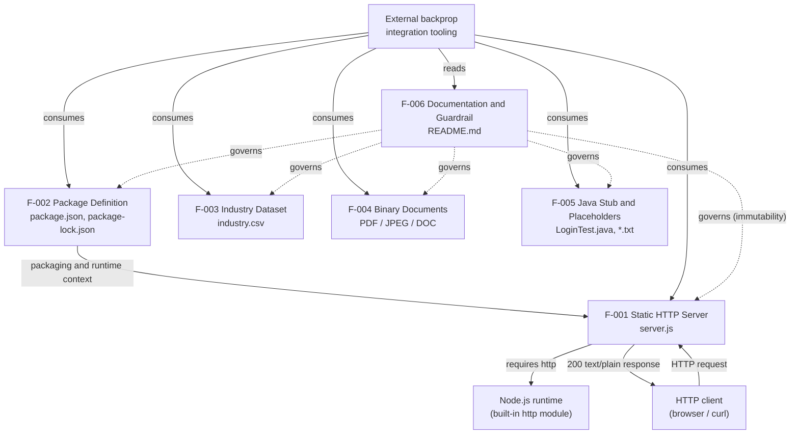

**Reading the map.** Solid edges denote observed runtime/packaging relationships; dotted edges denote governance. Two relationships are internal to the repository: (1) **F-002 provides the Node package and runtime context for F-001** — although note that `server.js` is executed directly and does not rely on the `main` entry point declared by `package.json`; and (2) **F-006 governs every other feature** through the "Do not touch!" immutability directive. Every other relationship is a connection to an external actor: the HTTP client that F-001 serves, the Node.js runtime F-001 requires, and the external backprop integration tooling that consumes all artifacts. Features F-003, F-004, and F-005 have **no relationship to any other feature** and connect only to the external consumer. The runtime request/response flow for F-001 is depicted in the process flowchart in *1.2.2 High-Level Description*.

### 2.3.2 Integration Points

| Integration Point | Type | Related Feature(s) |
| --- | --- | --- |
| HTTP endpoint `127.0.0.1:3000` | Runtime interface (loopback only) | F-001 |
| Node.js built-in `http` module | Runtime library dependency | F-001 |
| `npm test` script hook | Build/tooling hook (fails by design) | F-002 |
| External backprop integration tooling | External consumer of all artifacts | F-001 – F-006 |
| Git / GitHub hosting | External source hosting | F-001 – F-006 |

No inter-feature APIs, message queues, shared databases, or data hand-offs exist between features. The only network-exposed integration point is the loopback HTTP endpoint of F-001, which is unreachable from external networks by design.

### 2.3.3 Shared Components

The repository contains **no shared internal source components** — there are no common modules, libraries, utilities, or configuration files imported across features, and the repository has no subdirectories. The only shared *runtime* component is the **Node.js standard-library `http` module**, which is used exclusively by F-001; no other feature depends on it. F-002 supplies package metadata that frames the runtime context for F-001 but exposes no code that other features consume. Each remaining artifact (F-003, F-004, F-005, F-006) is fully self-contained.

### 2.3.4 Common Services

No common internal services exist. The repository defines no database, cache, authentication service, configuration service, or centralized logging service; the only logging is a single `console.log` startup line emitted by F-001. The elements that are genuinely *common across multiple features* are external or governance-oriented rather than services in a software sense:

- **The external backprop integration tooling** is the common consumer that exercises every feature (F-001 – F-006).
- **The `README.md` immutability directive** (F-006) is the common governance constraint applied to all other features.

These two elements are the only cross-cutting concerns evidenced in the repository.


## 2.4 Implementation Considerations

Implementation considerations are recorded strictly from what the repository exhibits. Because the repository is a static, single-commit test fixture with no build system, no automated tests, and no quantified performance or scalability targets (see *1.2.3 Success Criteria* and *1.3.2 Out-of-Scope*), several dimensions are legitimately "not applicable" for the passive artifacts; those are stated rather than invented.

### 2.4.1 Cross-Cutting Implementation Constraints

The following constraints apply repository-wide and therefore condition every feature (F-001 – F-006):

- **Immutability directive.** `README.md` states "Do not touch!"; the fixture is intended to remain unmodified, so any change to a feature alters the fixture's semantics.
- **Single committed snapshot.** The repository has one Git commit (`Add files via upload`); there is no in-repository versioning, changelog, or release history.
- **Flat, build-free structure.** There are no subdirectories, no build tooling, no CI/CD pipeline, no containerization, and no environment configuration files.
- **No automated testing.** The only `test` hook exits non-zero by design; validation is manual or performed by the external consuming tooling.
- **Zero third-party dependencies.** `package-lock.json` records no packages, so there is no dependency supply chain to secure or maintain.
- **Loopback-only runtime posture.** The sole runtime service (F-001) binds to `127.0.0.1`, so no feature is reachable from external networks.

### 2.4.2 Per-Feature Technical Constraints, Performance, and Scalability

| Feature | Technical Constraints | Performance Requirements | Scalability Considerations |
| --- | --- | --- | --- |
| F-001 | Hardcoded host/port (`127.0.0.1:3000`, not configurable); CommonJS; requires a Node.js runtime; no routing/parsing | None quantified; response is constant-time and stateless | Single process; no clustering/load balancing; port `3000` must be free |
| F-002 | `main` references absent `index.js`; lockfile v3 assumes modern npm; `test` script is non-functional | Not applicable (static metadata) | Not applicable |
| F-003 | Single-column schema, 43 fixed values, LF endings; schema not enforced by any code | Not applicable (small static file) | Fixed vocabulary; changes are manual edits |
| F-004 | Large binaries committed directly (no Git LFS); fixed formats (PDF 1.7, JPEG/EXIF, OLE2) | Not applicable (not processed by code) | Repository size grows with binary content; no LFS strategy |
| F-005 | Java stub does not compile; no JDK/build wired; placeholders empty; nothing executed by Node | Not applicable | Not applicable |
| F-006 | Two-line Markdown; repo name differs from package name; no runtime effect | Not applicable | Not applicable |

### 2.4.3 Per-Feature Security Implications and Maintenance Requirements

| Feature | Security Implications | Maintenance Requirements |
| --- | --- | --- |
| F-001 | Loopback binding limits exposure to the local host; no auth, TLS, input validation, or rate limiting; accepts all methods but returns only a static string | Minimal — 14 lines, no dependencies to patch; primary concern is compatibility with future Node.js versions |
| F-002 | MIT-licensed; zero dependencies eliminate third-party vulnerability surface; no secrets in the manifest | Keep the dependency tree empty; reconcile the `main`/`index.js` mismatch only if package-entry execution is ever required |
| F-003 | Non-sensitive public reference data; no PII | Vocabulary edits are manual; the `Other` catch-all reduces churn |
| F-004 | Inert, non-executable assets not opened by any code; parsing risk would lie with external tooling, not this repository | Preserve as-is per the immutability directive; large files complicate history if modified |
| F-005 | No executable risk (Java is never compiled or run; placeholders are empty) | Intentionally incomplete; the stub must not be "fixed," as that would change fixture semantics |
| F-006 | Contains no sensitive information; serves as a governance directive | Preserve the identity and "Do not touch!" directive intact |


## 2.5 Requirements Traceability Matrix

This matrix provides bidirectional traceability: every functional requirement is traced to the artifact that evidences it and to a verification method, and every feature is traced to the related sections of this specification. Because the repository is a single committed snapshot (commit `a3a7a3b`, `Add files via upload`) with no in-repository version history, all requirements are at **baseline version 1.0** corresponding to that commit; there is no separate requirement-version log to track.

### 2.5.1 Requirement-to-Source Traceability

| Requirement ID | Feature | Source Evidence | Verification Method |
| --- | --- | --- | --- |
| F-001-RQ-001 | F-001 | `server.js` (`server.listen`, `console.log`) | Execution |
| F-001-RQ-002 | F-001 | `server.js` (handler: `statusCode`, header, `res.end`) | Execution |
| F-001-RQ-003 | F-001 | `server.js` (no routing/branching in handler) | Execution |
| F-001-RQ-004 | F-001 | `server.js` (`require('http')` only) | Inspection |
| F-002-RQ-001 | F-002 | `package.json`, `package-lock.json` | Inspection |
| F-002-RQ-002 | F-002 | `package-lock.json` (`lockfileVersion: 3`, root-only) | Inspection |
| F-002-RQ-003 | F-002 | `package.json` (`scripts.test`) | Execution |
| F-003-RQ-001 | F-003 | `industry.csv` (header + 43 rows) | Inspection |
| F-003-RQ-002 | F-003 | `industry.csv` (final value `Other`, LF endings) | Inspection |
| F-004-RQ-001 | F-004 | `100Pages.pdf` (magic `%PDF-1.7`) | Inspection |
| F-004-RQ-002 | F-004 | `demo.jpg` (magic `FF D8 FF`, EXIF) | Inspection |
| F-004-RQ-003 | F-004 | `sample.doc` (magic `D0 CF 11 E0`) | Inspection |
| F-005-RQ-001 | F-005 | `LoginTest.java` (package/class/`main`) | Inspection |
| F-005-RQ-002 | F-005 | `LoginTest.java` (body = bare token `Web`) | Inspection / attempted compile |
| F-005-RQ-003 | F-005 | `test.py.txt`, `test.txt.txt` (0 bytes) | Inspection |
| F-006-RQ-001 | F-006 | `README.md` (title + purpose line) | Inspection |
| F-006-RQ-002 | F-006 | `README.md` ("Do not touch!") | Inspection |

### 2.5.2 Feature-to-Specification Traceability

| Feature ID | Related Specification Sections | Source Artifact(s) |
| --- | --- | --- |
| F-001 | 1.2.2, 1.2.3, 1.3.1 | `server.js` |
| F-002 | 1.1, 1.2.1, 1.2.3, 1.3.1 | `package.json`, `package-lock.json` |
| F-003 | 1.2.2, 1.3.1 | `industry.csv` |
| F-004 | 1.2.2, 1.3.1 | `100Pages.pdf`, `demo.jpg`, `sample.doc` |
| F-005 | 1.2.1, 1.2.2 | `LoginTest.java`, `test.py.txt`, `test.txt.txt` |
| F-006 | 1.1, 1.2.1, 1.3.1 | `README.md` |

**Coverage summary.** All six features and all seventeen requirements trace to at least one concrete source artifact, and all eleven repository files are accounted for by exactly one feature (F-001 → 1 file, F-002 → 2, F-003 → 1, F-004 → 3, F-005 → 3, F-006 → 1). No requirement lacks evidence, and no repository file is left unmapped.


## 2.6 References

The following repository artifacts, structures, and specification sections were examined as evidence for this section. No external web sources were used.

**Repository files:**

- `server.js` — Established F-001: the Node.js HTTP server bound to `127.0.0.1:3000` returning `200` / `text/plain` / `Hello, World!\n`, its startup log, and its sole `require('http')` import.
- `package.json` — Established F-002 identity (`hello_world` v1.0.0, MIT, author `hxu`), the `main` = `index.js` reference, and the intentionally failing `test` script.
- `package-lock.json` — Established F-002's version-3 lockfile with an empty dependency tree.
- `industry.csv` — Established F-003: the single `Industry` column, 43 unique labels, and the `Other` catch-all with LF line endings.
- `100Pages.pdf` — Established F-004: a valid PDF 1.7 artifact (magic `%PDF-1.7`, 1,080 pages, ~9.0 MB).
- `demo.jpg` — Established F-004: a valid JPEG artifact (magic `FF D8 FF E1`, EXIF, ~2.0 MB).
- `sample.doc` — Established F-004: a legacy Microsoft Word OLE2 compound document (magic `D0 CF 11 E0`, ~96 KB).
- `LoginTest.java` — Established F-005: the `com.blitzyTest.LoginTest` class with a `main` method whose body is the bare, non-compiling token `Web`.
- `test.py.txt` — Established F-005: a zero-byte placeholder file.
- `test.txt.txt` — Established F-005: a zero-byte placeholder file.
- `README.md` — Established F-006: the `hao-backprop-test` identity, the "test project for backprop integration" purpose, and the "Do not touch!" immutability guardrail.

**Repository structure and metadata:**

- Repository root (`/`) — Confirmed the flat, single-level layout of exactly eleven files with no subdirectories, and the reconciliation that three binary artifacts (`100Pages.pdf`, `demo.jpg`, `sample.doc`) are present on disk though not surfaced by the folder inspection tool.
- Git metadata — Confirmed the single commit (`a3a7a3b`, `Add files via upload`) establishing the baseline snapshot referenced by the traceability matrix.

**Cross-referenced technical specification sections:**

- *1.1 Executive Summary* — Terminology, stakeholder/user groups, and the package-vs-repository naming distinction.
- *1.2 System Overview* — Primary capabilities, major components, the runtime process flowchart (*1.2.2*), and the explicit absence of KPIs/SLAs (*1.2.3*), which shaped feature priorities and implementation considerations.
- *1.3 Scope* — In-scope capabilities and out-of-scope exclusions that framed the feature catalog boundaries.


# 3. Technology Stack

## 3.1 Programming Languages

The `hao-backprop-test` repository is a deliberately minimal, single-commit test fixture rather than a multi-tier application (as established in *1.2 System Overview* and *2.1 Feature Catalog*). Its technology stack is correspondingly sparse: a dependency-free Node.js HTTP server is the only executable component, accompanied by a non-compiling Java stub and a set of static data and document artifacts. This section documents **only** the technologies that are actually present in the repository's canonical state — the single `Add files via upload` commit that `README.md` declares immutable ("Do not touch!"). Default or "typical" stack components that were evaluated but are absent are reconciled explicitly below rather than presented as if implemented.

**Technology stack at a glance.**

| Layer / Concern | Technology | Version (as declared) | Evidence |
| --- | --- | --- | --- |
| Server runtime language | JavaScript on Node.js (CommonJS modules) | Runtime unpinned — no `engines` field | `server.js`, `package.json` |
| Secondary source language | Java (non-compiling stub, never built) | Unspecified — no JDK/build configured | `LoginTest.java` |
| Package manifest & lockfile | npm (Node package manager) | Package `1.0.0`; `lockfileVersion` `3` | `package.json`, `package-lock.json` |
| Web / application framework | None — Node.js standard library only | Not applicable | `package.json` (no dependencies) |
| Third-party runtime libraries | None | Not applicable | `package-lock.json` (empty tree) |
| Database / caching layer | None | Not applicable | repository contents |
| External / cloud services | None — loopback-only binding | Not applicable | `server.js` |
| Containerization / CI-CD / IaC | None | Not applicable | repository contents |
| Version control | Git (GitHub-hosted) | — | `.git` metadata |

**Default technology stack reconciliation.** The proposed default stack is mapped to the repository's actual contents so the evidence-based scope is unambiguous. No default component below is documented elsewhere in this section as "in use," because none is present.

| Default-stack category | Proposed default | Actual state in repository |
| --- | --- | --- |
| Cloud / IaC / CI-CD | AWS, Terraform, GitHub Actions | Absent — no cloud SDKs, `.tf`, or workflow files |
| Containerization | Docker | Absent — no Dockerfile or compose file |
| Backend language & framework | Python + Flask | Absent — backend is JavaScript on Node.js with no framework |
| AI framework | LangChain | Absent — no AI/ML code or dependency |
| Authentication | Auth0 | Absent — no auth logic (`LoginTest.java` is an inert stub) |
| Database | MongoDB | Absent — no database, driver, or ORM |
| Web / mobile frontend | React, TypeScript, TailwindCSS, React Native | Absent — no frontend, build tooling, or TypeScript |
| Native apps | Swift, Kotlin, Objective-C, Electron | Absent — only a non-compiling Java stub is present |

**Programming languages by component.**

- **JavaScript (Node.js, CommonJS) — primary and only executable language.** `server.js` is authored in JavaScript targeting the Node.js runtime and uses the CommonJS module system (`const http = require('http');`). It is the sole source of runtime behavior in the fixture (feature F-001), implementing an HTTP server bound to the loopback interface `127.0.0.1:3000`. It employs no language features beyond the Node standard library and holds no state between requests.
- **Java — secondary, non-executable source language.** `LoginTest.java` declares package `com.blitzyTest` and a `public class LoginTest` with a `public static void main(String[] args)` method whose body is only the bare token `Web`; the file therefore does not compile. No JDK, build file, or classpath is configured anywhere in the repository. Java is present strictly for source-language heterogeneity (feature F-005) and contributes no runtime capability.
- **Ancillary data and markup formats (not runtime languages).** Three declarative formats support the fixture but execute nothing: JSON (`package.json`, `package-lock.json`) for package metadata, Markdown (`README.md`) for documentation, and CSV (`industry.csv`) for reference data. They are catalogued here only to distinguish them from the executable languages above.

**Selection criteria and justification.** The language choices follow directly from the fixture's stated purpose — a deterministic, zero-configuration target for external "backprop integration" tooling (*1.2 System Overview*, *1.3 Scope*):

- **JavaScript on Node.js** suits a minimal HTTP endpoint because Node's built-in `http` module provides a complete server implementation with no installation step, allowing the fixture to run via a single `node server.js` invocation with zero dependencies.
- **Java** appears solely to provide a second, contrasting source language within one repository; because it is an intentional, non-compiling stub, no language-version or toolchain decision was made or is required.

**Constraints and dependencies.**

- **No pinned language/runtime versions.** `package.json` declares no `engines` constraint, so no minimum Node.js version is enforced; the server relies only on the long-stable `http` core API, which is compatible across current Node.js LTS lines. No Java language level is specified because no Java build exists.
- **CommonJS, not ECMAScript modules.** The absence of `"type": "module"` in `package.json`, together with the use of `require()`, fixes the server as CommonJS.
- **Security consideration.** Restricting the executable surface to a single standard-library JavaScript file — and never compiling or running the Java stub — minimizes the language-level attack surface: there is no framework code, transpiler, or third-party parser anywhere in the execution path.

## 3.2 Frameworks & Libraries

No application framework or third-party library is used anywhere in the repository. The sole runtime component, `server.js`, is built exclusively on the **Node.js standard library**, and `package.json` declares neither `dependencies` nor `devDependencies`. Consequently there are no framework versions to pin, upgrade, or secure. The paragraphs below record the one standard-library module that is actually exercised and explicitly confirm the absence of the frameworks a typical web or AI application would otherwise carry.

**Core "framework": the Node.js runtime and its standard library.** In the absence of any web framework (such as Express, Fastify, or Koa), the Node.js runtime itself — together with its bundled core modules — is the only framework-level technology present. The single module used is:

| Module | Type | Purpose in the repository | Version |
| --- | --- | --- | --- |
| `http` | Node.js core module (standard library) | Creates the HTTP server, receives every request, and writes the fixed `200` / `text/plain` / `Hello, World!\n` response in `server.js` | Bundled with the Node.js runtime; not independently versioned or pinned |

**Supporting libraries.** None. No utility, logging, routing, validation, templating, ORM, testing, or build library is declared or imported. The `package-lock.json` dependency tree is empty (only the root package entry is present), confirming that no supporting library is installed at any depth.

**Compatibility requirements.**

- The server depends only on the stable `http` core API, which has been part of Node.js since its earliest releases; it therefore runs unmodified on any current Node.js LTS runtime. No `engines` range narrows this.
- Because no third-party packages exist, there are **no** inter-library version-compatibility constraints, peer-dependency ranges, or transitive-dependency conflicts to manage.
- `package-lock.json` uses `lockfileVersion` `3`, the format emitted by modern npm (npm v9, backward compatible to npm v7); reproducing the (empty) install therefore assumes a reasonably current npm client.

**Justification for the framework choice — namely, the choice of *no* framework.** For a fixture whose only job is to return a constant response deterministically (*1.2.3 Success Criteria*), a framework would add dependency-install steps, version drift, and attack surface without providing any needed capability. Relying solely on the built-in `http` module keeps the fixture runnable with `node server.js` and no `npm install`, preserving the determinism and minimalism that are its defining success factors.

**Frameworks evaluated and confirmed absent.** Consistent with *1.3.2 Out-of-Scope*, none of the frameworks or libraries implied by a typical full-stack or AI application are present: no backend web framework (for example Flask or Express), no frontend framework or CSS toolkit (React, TypeScript, TailwindCSS), no cross-platform or native framework (React Native, Electron), and no AI/ML framework (LangChain). No corresponding source files, imports, or manifest entries exist for any of them.

**Security consideration.** A zero-framework, zero-library posture eliminates the third-party framework vulnerability surface entirely — there are no framework CVEs to track and no dependency updates to apply (reinforced in *2.4.3*). The trade-off is that the cross-cutting protections a framework might supply (input validation, routing guards, security headers) are simply not present; this is acceptable only because the server binds to the loopback interface and returns a static string.

## 3.3 Open Source Dependencies

The repository declares and installs **no** third-party open-source packages. `package.json` contains no `dependencies` or `devDependencies` fields, and `package-lock.json` (`lockfileVersion` `3`) records an empty dependency tree — only the root package entry keyed by the empty string `""` is present. There is no `node_modules` directory. The single open-source foundation the fixture relies on is the Node.js runtime itself, which is a platform prerequisite rather than a declared package.

**Declared dependency inventory.**

| Dependency class | Declared entries | Evidence |
| --- | --- | --- |
| Runtime (`dependencies`) | None — field is absent | `package.json` |
| Development (`devDependencies`) | None — field is absent | `package.json` |
| Locked / installed packages | None — empty tree (only the root `""` entry) | `package-lock.json` |

**Package identity and licensing.** The manifest and lockfile agree on a single, self-describing package identity:

| Attribute | Value | Source |
| --- | --- | --- |
| Package name | `hello_world` | `package.json`, `package-lock.json` |
| Package version | `1.0.0` | `package.json`, `package-lock.json` |
| License | `MIT` | `package.json`, `package-lock.json` |
| Lockfile format | `lockfileVersion` `3` | `package-lock.json` |

**Registries.** The public npm registry (`registry.npmjs.org`) is the implicit resolution source for any Node package, but because no dependencies are declared, no registry is actually contacted during install and no artifacts are downloaded. No private registry, package scope, or `.npmrc` configuration exists in the repository.

**Runtime as the only open-source foundation.** The one open-source technology the fixture depends on at execution time is the Node.js runtime and its bundled `http` module. This dependency is satisfied by the execution environment rather than by any manifest entry, so it does not appear in the lockfile and is not version-pinned.

**Package version reproducibility.** Because `lockfileVersion` `3` is the format used by npm v9 (and is backward compatible to npm v7), the lockfile is intended to be consumed by a modern npm client. With an empty dependency set, however, `npm install` resolves deterministically to "nothing to install," so reproducibility is trivially guaranteed regardless of network state.

**Security and supply-chain implications.** An empty dependency graph removes the third-party supply-chain entirely: there are no transitive dependencies, no package-introduced vulnerability surface, and nothing for `npm audit` to flag or remediate (reinforced in *2.4.3 Per-Feature Security Implications*). The corresponding maintenance obligation is narrow — keep the dependency tree empty and monitor only Node.js runtime security advisories rather than a package graph.

## 3.4 Third-Party Services

The fixture integrates with **no** external services. Its only runtime component makes no outbound network calls, imports no service SDKs, and stores no credentials; it binds to the loopback interface and returns a static response. The only external touchpoints are the Git/GitHub hosting of the source and the external "backprop integration" tooling that consumes the fixture — both of which lie outside the repository's own code (*1.3 Scope*).

**External service inventory.**

| Service category | Status in repository | Evidence |
| --- | --- | --- |
| External APIs / integrations | None — no outbound calls, no client SDKs | `server.js`, `package.json` |
| Authentication / identity provider | None — no auth code; `LoginTest.java` is an inert, non-compiling stub | `LoginTest.java` |
| Monitoring / observability / telemetry | None — startup message written to stdout via `console.log` only | `server.js` |
| Cloud services (compute, storage, managed) | None — no cloud SDKs, credentials, or configuration | repository contents |
| Messaging / queues / event streams | None | repository contents |

**External touchpoints that do exist (outside the repository code).**

- **Git / GitHub hosting.** The repository is version-controlled with Git and hosted on GitHub; this is a source-management touchpoint, not a runtime integration.
- **Backprop integration tooling.** The external process named in `README.md` consumes the fixture's files. Its internals are outside this repository and therefore out of scope (*1.3.2 Out-of-Scope*).

**External-interface and trust boundary.** The diagram below shows the complete set of external interactions; the running server makes no outbound calls of any kind.

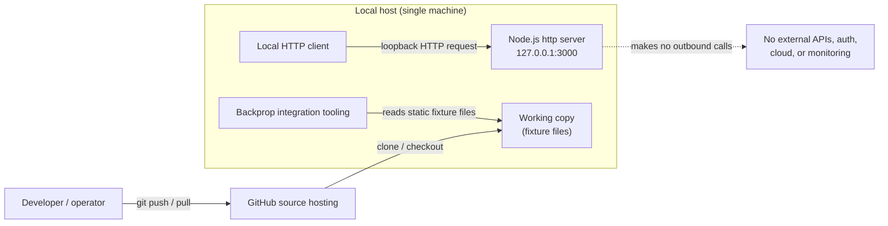

**Services evaluated and confirmed absent.** No authentication service (for example Auth0), no cloud platform (for example AWS), and no monitoring/APM service is integrated; none of the default-stack third-party services are present in any file.

**Security consideration.** Because there are no external integrations, the repository holds **no** API keys, tokens, connection strings, or service credentials, and performs no data egress. The loopback-only binding (`127.0.0.1`) means the sole runtime service is unreachable from external networks (*2.4.3 Per-Feature Security Implications*), so there is no inbound third-party exposure either.

## 3.5 Databases & Storage

The fixture uses **no** database, no caching layer, and no storage service. The runtime is entirely stateless — `server.js` returns a hardcoded string literal and neither reads nor writes any persistent store. What the repository does contain is a set of **static, read-only files committed directly to Git**; these are inert fixture data rather than a managed data store, and none of them are opened by the server at runtime (*1.3.2 Out-of-Scope*, *2.4.1 Cross-Cutting Constraints*).

**Data store and persistence inventory.**

| Capability | Status in repository | Evidence |
| --- | --- | --- |
| Primary database | None — no driver, no connection, no schema | `package.json`, `server.js` |
| Secondary database | None | repository contents |
| ORM / query / migration layer | None | repository contents |
| Caching solution | None — response is a static literal | `server.js` |
| Cloud / object storage service | None — no SDKs or credentials | repository contents |
| Local file storage | Static read-only files committed to Git | `industry.csv`, `100Pages.pdf`, `demo.jpg`, `sample.doc` |

**Persistence strategy.** The service is stateless and holds no data between requests. `server.js` responds to every request with the same in-memory string (`'Hello, World!\n'`); there is no session store, no in-process cache, and no read or write of any file or external store at runtime. Consequently there are no connection strings, no pooling configuration, and no migration tooling anywhere in the repository.

**Static file storage.** The only "storage" is version-controlled fixture data. These files are described in the feature catalog as reference and sample artifacts (*2.1 Feature Catalog*, features F-003 and F-004) and are not consumed by any executable code in the fixture:

| File | Format | Size (bytes) | Role |
| --- | --- | --- | --- |
| `industry.csv` | CSV text — header `Industry` plus 43 labels | 749 | Reference vocabulary dataset (F-003) |
| `100Pages.pdf` | PDF 1.7 (~1,080 pages) | 9,456,545 | Binary sample artifact (F-004) |
| `demo.jpg` | JPEG with EXIF metadata | 2,123,398 | Binary sample artifact (F-004) |
| `sample.doc` | OLE2 Compound File (legacy Word) | 98,304 | Binary sample artifact (F-004) |

**Version-control / storage note.** The three binary artifacts (roughly 11.6 MB combined) are committed **directly to Git with no Git LFS** pointer indirection, so every clone of the repository transfers the full binary payload (*2.4.2*). This is the dominant contributor to repository size, since the executable and text sources together total well under 2 KB.

**Stores evaluated and confirmed absent.** No document database (for example MongoDB), no relational database, no key-value cache (for example Redis), and no object-storage service (for example Amazon S3) is present; none of the default-stack persistence components exist in this repository.

**Security consideration.** With no database, cache, or connection strings, there is no data-at-rest credential, no injection surface, and no data-access control to configure. The committed static files are read-only fixtures; `industry.csv` contains only generic industry-category labels and no personal or sensitive data, and the binary samples are inert (never parsed or executed by the fixture).

## 3.6 Development & Deployment

The fixture has a deliberately minimal toolchain: **Git** for version control and **npm** for package definition. There is **no build step, no containerization, no CI/CD pipeline, and no infrastructure-as-code** — the flat, build-free structure is an explicit constraint of the project (*2.4.1 Cross-Cutting Constraints*). The application runs directly with `node server.js`; nothing is compiled, bundled, or transpiled first.

**Development and deployment tooling.**

| Concern | Tooling | Status / evidence |
| --- | --- | --- |
| Version control | Git | Single commit `a3a7a3b`; 11 tracked files, flat layout |
| Package manager | npm | `package.json` + `package-lock.json` (`lockfileVersion 3`) |
| Build / transpile / bundle | None | No compiler or bundler config; CommonJS runs as-is |
| Test framework | None | `package.json` `test` script echoes an error and exits 1 |
| Lint / format | None | No linter or formatter configuration present |
| Containerization | None | No `Dockerfile`, compose file, or `.dockerignore` |
| CI/CD | None | No pipeline configuration (e.g., no `.github/workflows/`) |
| Infrastructure as Code | None | No Terraform, CloudFormation, or equivalent |
| Process manager / orchestration | None | Manual foreground `node server.js` |

**Execution and deployment model.** Deployment is manual and single-process. An operator runs `node server.js`, which starts the HTTP listener and logs `Server running at http://127.0.0.1:3000/`. The process runs in the foreground, binds only the loopback interface, and is stopped with an interrupt; there is no process manager, reverse proxy, service definition, or orchestration layer. The `main` field in `package.json` points to `index.js`, but that file does not exist, so `npm start`/`node .` would fail — the server must be launched by its actual filename (*1.2 System Overview*, *2.1 Feature Catalog* F-001/F-002).

**Runtime and toolchain versions.** The repository does **not** pin any runtime (there is no `engines` field in `package.json`), so the versions below are those observed in the execution container rather than declared requirements of the fixture. The presence of `lockfileVersion 3` implies the lockfile was generated by a modern npm (npm v9-class, backward compatible to npm v7).

| Tool | Observed version (container) | Pinned in repository? |
| --- | --- | --- |
| Node.js | v22.23.1 | No — no `engines` constraint |
| npm | 11.1.0 | No — `lockfileVersion 3` implies npm v9+ |
| Git | 2.43.0 | Not applicable |
| Python | 3.12.3 | No — present in container but unused by the fixture (`test.py.txt` is empty) |
| Java (JDK) | Not installed | Not applicable — `LoginTest.java` cannot be compiled here and does not compile regardless (*2.1* F-005) |

**Capabilities evaluated and confirmed absent.** No Docker containerization, no GitHub Actions (or any other) CI/CD, no Terraform infrastructure-as-code, and no cloud deployment target is present; none of the default-stack development-and-deployment components exist in this repository.

**Security consideration.** With no build pipeline, container image, or IaC, there are no CI/CD secrets, registry credentials, or provisioning state to protect, and there is likewise no automated dependency or vulnerability scanning configured (an `npm audit` would find nothing to evaluate given the empty dependency graph — *3.3 Open Source Dependencies*). Because deployment is a manual, loopback-only process, the running service is not exposed to external networks (*2.4.3 Per-Feature Security Implications*).

## 3.7 References

The following repository artifacts, specification sections, and external sources were examined as direct evidence for this Technology Stack section.

**Repository files.**

- `server.js` - The sole executable; established the JavaScript/Node.js CommonJS runtime, the `require('http')` standard-library-only surface, the loopback `127.0.0.1:3000` bind, the static `Hello, World!\n` response, and the absence of any framework, outbound call, state, or storage access.
- `package.json` - Established npm package identity (`hello_world` 1.0.0, `MIT`, author `hxu`), the `main: index.js` reference to an absent file, the failing `test` script, and the absence of `dependencies`, `devDependencies`, and `engines` fields.
- `package-lock.json` - Established `lockfileVersion 3` with an empty dependency tree (root package only), confirming zero third-party packages.
- `README.md` - Established the project name/purpose, the "Do not touch!" immutability guardrail, and the external backprop-integration consumer.
- `LoginTest.java` - Established the secondary Java language presence and its inert, non-compiling, non-authentication nature (package `com.blitzyTest`, body reduced to the token `Web`).
- `industry.csv` - Established the file-based static reference vocabulary (header `Industry` plus 43 labels, 749 bytes) used to document static storage rather than a database.
- `100Pages.pdf` - Binary sample artifact (PDF 1.7, ~1,080 pages, 9,456,545 bytes) committed directly to Git without Git LFS.
- `demo.jpg` - Binary sample artifact (JPEG with EXIF metadata, 2,123,398 bytes).
- `sample.doc` - Binary sample artifact (OLE2 Compound File / legacy Word, 98,304 bytes).
- `test.py.txt` - Empty placeholder; established that Python is not used by the fixture.
- `test.txt.txt` - Empty placeholder text artifact.

**Repository folder.**

- `/` (repository root) - Established the flat, single-level layout of 11 Git-tracked files with no subdirectories, and confirmed the absence of any `Dockerfile`, CI/CD configuration, infrastructure-as-code, build/bundler configuration, or `node_modules/` directory.

**Cross-referenced specification sections.**

- *1.2 System Overview* - Confirmed the bare single-commit fixture state, the direct `node server.js` execution model, and the missing `index.js` entry point.
- *1.3 Scope* - Confirmed in-scope artifacts and the out-of-scope exclusion of databases, authentication, third-party frameworks, build/CI/CD, and containerization, with Node.js `http` as the only runtime dependency.
- *2.1 Feature Catalog* - Confirmed features F-001 through F-006 and the format/size details of the binary sample artifacts.
- *2.4 Implementation Considerations* - Confirmed the cross-cutting constraints: immutability directive, flat build-free structure, zero third-party dependencies, loopback-only binding, and direct binary commits without Git LFS.

**External sources.**

- [web] npm CLI documentation — `package-lock.json` / `lockfileVersion` - Confirmed that `lockfileVersion 3` is produced by npm v9-class tooling and is backward compatible to npm v7.

# 4. Process Flowchart

## 4.1 System Workflows

The repository `hao-backprop-test` is a deliberately minimal test fixture whose only executable runtime behavior is the HTTP server defined in `server.js` (feature **F-001, Static HTTP Response Server**). Accordingly, this section documents that request/response workflow and its surrounding process lifecycle in depth, and then explicitly identifies the workflow categories requested by this template that are **not implemented** in the codebase — rather than inventing them. This scoping is consistent with the system characterization in sections 1.2 System Overview and 2.4 Implementation Considerations, both of which describe a single-process, dependency-free, loopback-only server holding no state between requests.

All flowcharts in this section are grounded in the 14-line implementation of `server.js`. Where the source does not implement a concept (for example, message queues, batch jobs, or authorization), the absence is stated explicitly.

### 4.1.1 Core Business Processes

The system implements a single end-to-end process: an operator starts the Node.js process, the process registers a request handler and binds a TCP listener on the loopback interface, and thereafter every inbound HTTP request is answered with one fixed response. The handler defined at `server.js` lines 6–10 never inspects the request object (`req` is unused), so the runtime path is strictly linear with exactly one genuine decision point — whether the listener successfully binds `127.0.0.1:3000` (`server.js` lines 12–14).

**System interactions and user touchpoints.** There are two human/tooling touchpoints: (1) an **operator** who launches the process from the command line (`node server.js`, taking no arguments), and (2) an **HTTP client** (a browser, `curl`, or the external "backprop integration" tooling referenced in `README.md`) that issues requests to the endpoint. There are no other actors — no administrative UI, no authenticated user roles, and no downstream services.

**End-to-end workflow (swim lanes).** The high-level workflow is organized into three swim lanes — the operator/consuming tooling, the Node.js runtime process, and the loopback network boundary. The only branch is the bind-success decision; the request-serving loop is otherwise unconditional.

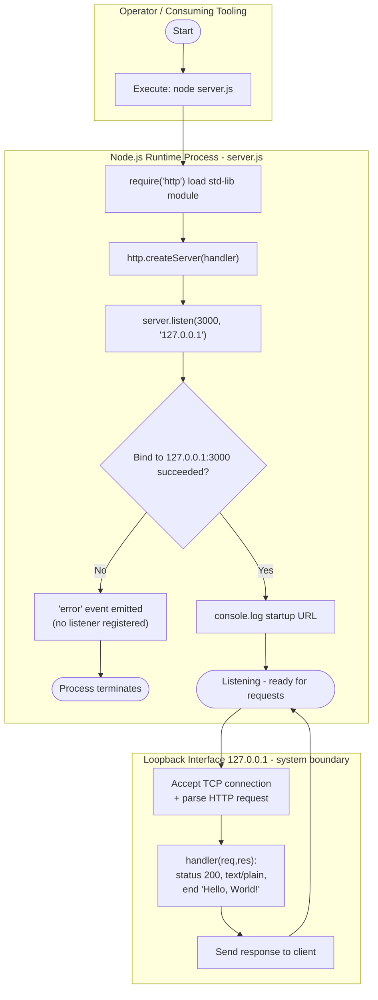

**Process steps mapped to evidence.** Each step of the core process corresponds to a specific statement in `server.js` and, where applicable, a functional requirement documented in section 2.2.

| # | Process step | `server.js` evidence | Requirement |
| --- | --- | --- | --- |
| 1 | Load the built-in `http` module | Line 1 (`require('http')`) | F-001-RQ-004 |
| 2 | Register the request handler | Lines 6–10 (`http.createServer`) | F-001-RQ-002 |
| 3 | Bind the listener and log the startup URL | Lines 12–14 (`server.listen`) | F-001-RQ-001 |
| 4 | Serve each request with the fixed response | Lines 7–9 (status/header/body) | F-001-RQ-002, F-001-RQ-003 |

**Decision points.** The workflow contains a single genuine decision: whether `server.listen` succeeds in binding the loopback port. Because the handler performs no routing, method inspection, or content negotiation, there are **no per-request decision branches** — every method, path, header set, and body yields the identical `200 text/plain "Hello, World!\n"` response (F-001-RQ-003).

**Error-handling paths.** No error-handling code exists in `server.js` (no `try/catch`, no `server.on('error', …)` listener). A bind failure therefore follows Node.js default behavior — the unhandled `'error'` event terminates the process. This path is detailed in section 4.4 Error Handling.

**Timing and SLA considerations.** The repository defines **no quantified latency, throughput, or availability targets, and no SLA** (confirmed in section 1.2.3 Success Criteria and section 2.4). The observable timing characteristics that can be stated from the code are qualitative: startup is a single asynchronous `listen` followed by one `console.log`, and each response is produced by three constant-time statements with no I/O beyond the socket write, so response construction is effectively constant-time and independent of request content.

### 4.1.2 Integration Workflows

**Data flow between systems.** The only runtime data flow is a single synchronous HTTP request/response exchange over the loopback interface between a client and the Node.js process. The static assets in the repository — `industry.csv` (F-003) and the binary artifacts `100Pages.pdf`, `demo.jpg`, and `sample.doc` (F-004) — are **not read, opened, or referenced by `server.js`**; any consumption of those files is performed by external tooling, not by the running service. The context diagram below distinguishes the executable HTTP path (solid edges) from the purely external, non-code-coupled reads of static files (dashed edges).

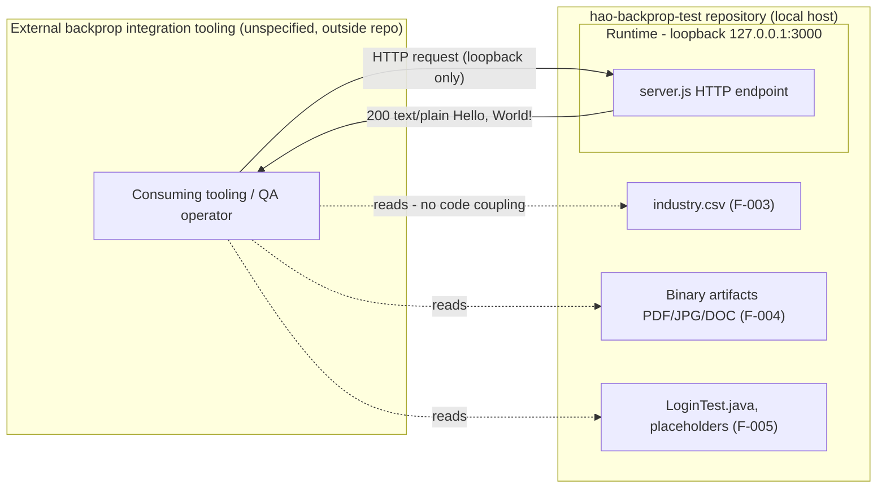

**API interactions.** The service exposes no formal API contract — no routes, no versioned endpoints, and no content negotiation. From an integration standpoint the interaction is a single implicit endpoint that accepts any HTTP request on `127.0.0.1:3000` and returns the fixed payload. The sequence below shows the request/response interaction across the client, Node's `http` module, and the request handler; note that the handler never reads `req`.

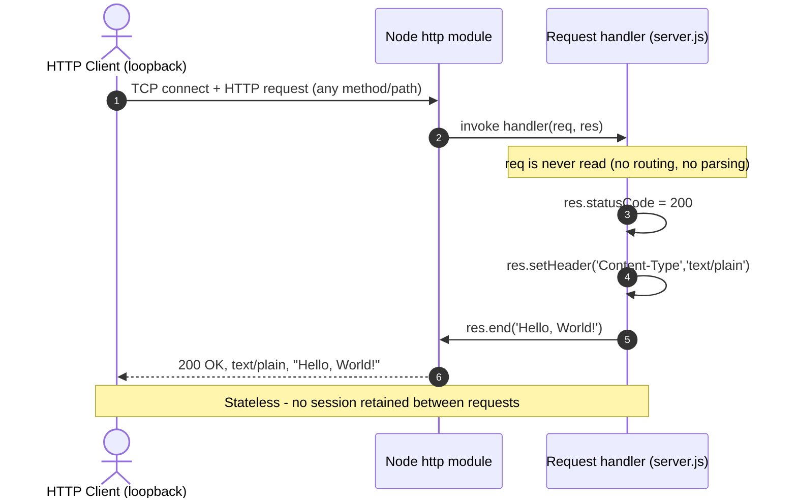

**Event processing flows.** The server participates only in Node's implicit `'request'` event dispatch that `http.createServer` wires internally; the application code registers **no additional event emitters, listeners, or subscriptions** and integrates **no message broker or queue** (there are no `dependencies` in `package.json`/`package-lock.json`). Notably, no `'error'` event listener is registered on the server object.

**Batch processing sequences.** There are **no batch or scheduled workflows** in the repository — no cron definitions, no schedulers, no job runners, and no data-processing scripts. The `npm test` script is not a batch job; per F-002-RQ-003 it deterministically prints `Error: no test specified` and exits with status `1` (`package.json`). The industry vocabulary and binary artifacts are inert inputs with no processing pipeline defined in code.

## 4.2 Flowchart Requirements and Validation Rules

This section presents the detailed process flow for the single core feature (F-001) with the required flowchart elements — start/end points, process steps, decision diamonds, system boundaries, user touchpoints, error states/recovery, and timing considerations — and then documents the validation rules that apply (and, more often, do not apply) at each step.

### 4.2.1 Workflow Element Coverage

The diagram below is the detailed process flow for the HTTP server feature. It combines the startup sequence and the request-serving loop, delineates the loopback system boundary as a subgraph, marks decision diamonds, and shows the terminal error state. Requirement identifiers from section 2.2 are annotated on the relevant steps.

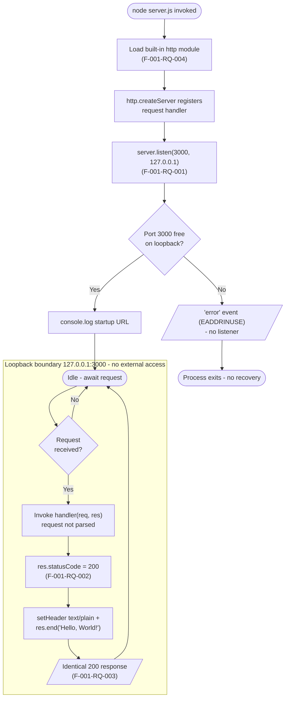

The table below confirms how each required flowchart element is represented in the workflow, citing the concrete evidence from `server.js`.

| Required element | Representation in this system | Evidence |
| --- | --- | --- |
| Start point | Operator runs `node server.js` | `server.js` (entry) |
| End point | Process exit on bind failure, or on operator termination (SIGINT/SIGTERM) | `server.js` lines 12–14; no shutdown handler |
| Process steps | Load `http`, create server, bind/log, set status/header, end response | `server.js` lines 1, 6–10, 12–14 |
| Decision diamonds | Bind success (`Port 3000 free?`) and the listener idle/`Request received?` gate | `server.js` line 12; implicit `request` dispatch |
| System boundaries | Loopback interface `127.0.0.1:3000`; not reachable off-host | `server.js` lines 3–4, 12 |
| User touchpoints | Operator CLI launch; HTTP client request | `server.js`; `README.md` (consuming tooling) |
| Error states & recovery | Unhandled `'error'` → process termination; no in-process recovery | `server.js` (no `on('error')`, no `try/catch`) |
| Timing / SLA | No quantified target defined; response is constant-time, content-independent | Section 1.2.3; Section 2.4 |

**Note on decision diamonds.** The `Request received?` gate models the listener's idle wait for the next connection; it is not a conditional in application code. Once a request arrives, the handler executes an unconditional, fixed sequence — there is no per-request branching, routing, or content negotiation (F-001-RQ-003).

### 4.2.2 Validation Rules

The prompt for this section calls for business rules, data validation, authorization checkpoints, and regulatory-compliance checks at each step. The authoritative finding — consistent with section 2.4 Implementation Considerations — is that **the runtime performs none of these checks**. This is documented explicitly below rather than omitted, because the absence is itself a defining characteristic of the fixture.

| Validation category | Status in `server.js` | Evidence / consequence |
| --- | --- | --- |
| Business rules at each step | None enforced | Handler ignores `req`; every request produces the same output (F-001-RQ-003) |
| Data / input validation | None | No parsing of method, path, query, headers, or body (`server.js` lines 6–10) |
| Authorization checkpoints | None | No authentication, session, token, or access-control logic anywhere in the repo |
| Regulatory compliance checks | None | No compliance regime, PII handling, logging of subjects, or audit trail defined |

**Controlled-vocabulary reference data (not a runtime validator).** `industry.csv` (F-003) supplies a controlled vocabulary of 43 industry labels under a single `Industry` header, terminating in an `Other` catch-all value. Such a controlled list is the kind of asset that could underpin a data-validation rule; however, in this repository it has **no runtime coupling** — `server.js` never loads or references it, so it does not participate in any validation workflow. It is documented here only to record that the sole validation-adjacent artifact present is inert.

**Authorization and network posture.** The only enforced constraint is a network-level boundary rather than an application check: `server.js` binds exclusively to `127.0.0.1` (lines 3, 12), which limits reachability to the local host. There is no TLS, no rate limiting, and no request filtering (section 2.4).

**Placeholder source is not an auth flow.** `LoginTest.java` (F-005) declares a `com.blitzyTest.LoginTest` class whose `main` body is the bare token `Web`; it does not compile and implements no login, credential, or authorization logic. It therefore contributes no validation or authorization workflow to the system.

## 4.3 State Management

The only stateful entity in the system is the operating-system process that runs `server.js`. At the application level the service is **stateless**: the handler (`server.js` lines 6–10) declares no variables that persist across requests, mutates no shared data, and returns a constant payload, so no two requests can influence one another. This subsection documents the process lifecycle as a state machine and records the persistence, caching, and transaction concerns that are absent.

**State transitions.** The server process moves through four lifecycle states — Initializing, Listening, Handling, and Terminated. The `Handling` state is transient and carries no data forward; after `res.end` (line 9) the process returns to `Listening`. A bind failure transitions directly from Initializing to Terminated (see section 4.4).

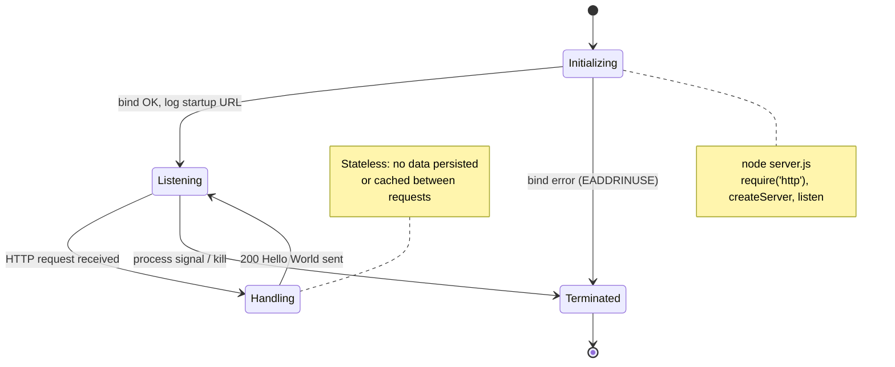

**Data persistence points.** There are **none**. The repository contains no database driver, ORM, connection string, migration folder, or file-write operation in the runtime path; `package-lock.json` records an empty dependency tree, confirming that no persistence library is installed. No request data is stored, logged to disk, or retained in memory beyond the lifetime of a single response.

**Caching requirements.** There is **no caching layer** — no in-memory cache, no cache headers set on responses (the handler sets only `Content-Type: text/plain`), and no external cache such as Redis. Because the response is a fixed literal, caching would be immaterial to behavior.

**Transaction boundaries.** There are **no transactions**. With no data store and no multi-step mutation, the concept does not arise. Each request is handled independently and atomically at the level of a single synchronous `res.end` call; there is no commit/rollback semantics and no cross-request consistency requirement.

The table summarizes the state-management posture against the categories requested by this template.

| Concern | Status | Evidence |
| --- | --- | --- |
| Process/lifecycle state | Initializing → Listening ↔ Handling → Terminated | `server.js` lines 6–14 |
| Application/session state | Stateless; no cross-request data | `server.js` lines 6–10 (no shared/mutable state) |
| Data persistence | None (no DB, no file writes) | Empty dependency tree (`package-lock.json`) |
| Caching | None | No cache library or cache headers in `server.js` |
| Transaction boundaries | Not applicable | No data store; single-statement response |

## 4.4 Error Handling

Error handling in this repository is governed entirely by Node.js defaults, because `server.js` contains **no application-level error handling**: there is no `try/catch` block, no `server.on('error', …)` listener, no `process.on('uncaughtException', …)` hook, and no error middleware (the server uses only the built-in `http` module). This subsection documents the actual failure behavior and records the resilience mechanisms requested by this template that are not present.

**Failure behavior.** Two distinct locations can produce a failure:

- **Startup / bind failure.** If `127.0.0.1:3000` cannot be bound (for example, the port is already in use, yielding `EADDRINUSE`), the `http.Server` emits an `'error'` event. Because no listener is registered for that event, Node's default behavior applies and the unhandled event is thrown, terminating the process with a non-zero exit code. There is no in-process retry or recovery.
- **Request handling.** The handler (`server.js` lines 6–10) executes only three fixed statements — set status, set one header, end with a literal body — none of which perform I/O, parsing, or allocation that depends on request content. There is no conditional or `try/catch` in this path, so under normal operation the request path does not raise application errors and always yields the identical `200` response (F-001-RQ-003).

The flowchart classifies a runtime condition by where it arises and traces it to its terminal outcome. The `Not implemented in repository` subgraph enumerates the resilience mechanisms this template asks about that are absent from the code; the dashed edge indicates that recovery from a crash can only come from an **external** process supervisor, not from the application itself.

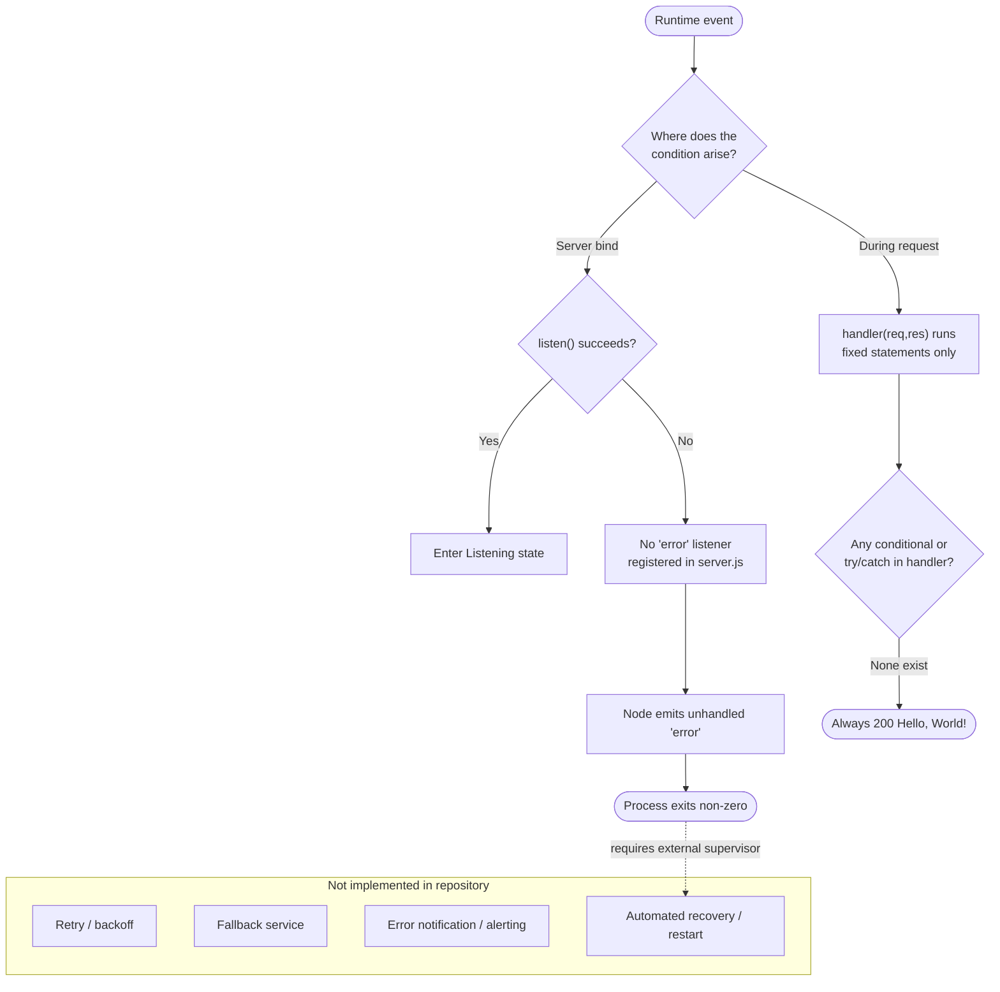

The table maps each error-handling capability requested by this template to its status in the repository.

| Capability | Status | Evidence / consequence |
| --- | --- | --- |
| Retry mechanisms | None | No retry/backoff on bind failure; single `listen` attempt (`server.js` line 12) |
| Fallback processes | None | No alternate handler, port, or degraded mode |
| Error notification flows | None | Only `console.log` of the startup URL (line 13); no error logging or alerting |
| Recovery procedures | None (external only) | No `on('error')`/`uncaughtException`; crash recovery requires an external supervisor |

**Notification flow.** The single observable signal the process emits is the successful-startup log line `Server running at http://127.0.0.1:3000/` (`server.js` line 13). There is no corresponding error-notification path — failures surface only as the default Node.js stack trace on the process's standard error stream and a non-zero exit code.

**Recovery procedures.** Because nothing in the repository restarts the process, monitors its health, or defines a container/orchestration restart policy (there is no Dockerfile, systemd unit, or CI/orchestration configuration, per section 2.4), recovery after a crash is entirely a manual or external-supervisor concern outside the scope of the code.

## 4.5 References

The following repository artifacts and previously authored specification sections were examined as evidence for the workflows, diagrams, and absences documented in this section.

**Repository files**

- `server.js` — Sole executable workflow; established the startup/bind sequence (lines 12–14), the request handler and fixed response (lines 6–10), the loopback host/port constants (lines 3–4), the single `http` import (line 1), and the absence of any error listener, routing, or state.
- `package.json` — Established the `hello_world` identity, the missing `index.js` entry point, and the intentionally failing `npm test` script (F-002-RQ-003); confirmed no `dependencies`/`devDependencies`.
- `package-lock.json` — Confirmed an empty dependency tree, evidencing the absence of any persistence, caching, queue, or framework library.
- `README.md` — Established the fixture identity ("test project for backprop integration"), the "Do not touch!" immutability guardrail, and the existence of external consuming tooling depicted in the integration diagram.
- `industry.csv` — Established the controlled-vocabulary reference dataset (43 labels plus an `Other` catch-all) and its lack of any runtime coupling to `server.js`.
- `LoginTest.java` — Confirmed the non-compiling `com.blitzyTest.LoginTest` stub and that it implements no authentication/authorization workflow.
- `100Pages.pdf`, `demo.jpg`, `sample.doc` — Confirmed inert binary artifacts that are not read or referenced by any runtime code.
- `test.py.txt`, `test.txt.txt` — Confirmed zero-byte placeholder files with no workflow behavior.

**Repository structure**

- `/` (repository root) — Confirmed a flat layout with no subdirectories, no Dockerfile, no CI/orchestration configuration, and no scheduler/batch definitions, supporting the documented absence of integration, batch, and recovery workflows.

**Cross-referenced specification sections**

- `1.2 System Overview` — Corroborated the single-process, stateless, loopback-only characterization and the explicit absence of KPIs/SLAs (§1.2.3).
- `2.1 Feature Catalog` — Source of feature identifiers F-001 through F-006 used to label the workflows.
- `2.2 Functional Requirements Tables` — Source of requirement identifiers (F-001-RQ-001 through F-001-RQ-004, F-002-RQ-003) annotated on the flowcharts.
- `2.4 Implementation Considerations` — Corroborated the absence of authentication, TLS, input validation, rate limiting, data storage, build/CI/containerization, and any performance/SLA targets.

# 5. System Architecture

## 5.1 High-Level Architecture

The `hao-backprop-test` repository implements a single, self-contained runtime component: the Node.js HTTP server defined in `server.js` (feature **F-001, Static HTTP Response Server**). Everything documented in this section is grounded in that 14-line source file and its dependency-free manifest (`package.json`, `package-lock.json`). Consistent with sections *1.2 System Overview*, *2.4 Implementation Considerations*, and *4.1 System Workflows*, this is a deliberately minimal test fixture — not a multi-tier application — so the architecture is described exactly as it exists, and requested architectural concerns that the code does not implement (external integrations, datastores, caches, message brokers, authentication) are recorded as explicitly absent rather than inferred.

### 5.1.1 System Overview

**Architecture style and rationale.** The system is a **single-process, single-module, monolithic script** architecture. One source file (`server.js`) is loaded directly by the Node.js runtime; it uses only the Node.js standard-library `http` module and declares zero third-party dependencies (the `packages` tree in `package-lock.json` contains only the root entry). There is no framework, no middleware pipeline, no layering (controller/service/repository), and no build step. The rationale is documented, not inferred: `README.md` designates the repository as a "test project for backprop integration" with a "Do not touch!" directive, so the governing design goals are **minimalism, determinism, and immutability** (see *2.4.1 Cross-Cutting Implementation Constraints*) rather than extensibility, throughput, or horizontal scale.

**Key architectural principles and patterns (as observed in code).**

- **Zero-dependency minimalism** — the only import is the built-in `http` module (`server.js` line 1); no packages are installed (`package-lock.json`).
- **Statelessness** — the request handler (`server.js` lines 6–10) declares no variables that persist across requests and mutates no shared data, so requests cannot influence one another (see *4.3 State Management*).
- **Determinism / constant response** — every request yields an identical `200` `text/plain` `Hello, World!\n` response regardless of method, path, headers, or body (F-001-RQ-003).
- **Self-containment** — no configuration files, environment variables, CLI arguments, or external services are consulted at runtime; host and port are hard-coded constants (`server.js` lines 3–4).
- **Loopback isolation** — the listener binds `127.0.0.1` (not `0.0.0.0`), so the service is unreachable from external networks (*2.4.3 Per-Feature Security Implications*).

Patterns commonly expected in server architectures — MVC/layered separation, dependency injection, middleware chains, service discovery — are **not present** and are noted here so their absence is unambiguous.

**System boundaries and major interfaces.** The architecture has three boundaries and one primary interface:

- **Process boundary** — a single operating-system process launched via `node server.js`, running one Node.js event loop.
- **Inbound network interface** — one HTTP listener on the loopback socket `127.0.0.1:3000` (the sole externally invokable interface; F-001-RQ-001).
- **stdout boundary** — a single startup log line written to standard output when the listener is ready (`server.js` line 13).
- **No outbound interfaces** — the process opens no database connections, calls no APIs, and imports no SDKs (see *3.4 Third-Party Services*, *3.5 Databases & Storage*).

The other tracked files (`industry.csv`, `100Pages.pdf`, `demo.jpg`, `sample.doc`, `LoginTest.java`, `test.py.txt`, `test.txt.txt`) are **inert, non-runtime artifacts** — static reference data, binary samples, a non-compiling Java stub, and empty placeholders. They are never opened by `server.js` and are therefore outside the runtime architecture; any consumption occurs in the external "backprop integration" tooling, not in this codebase.

The high-level runtime topology is shown below.

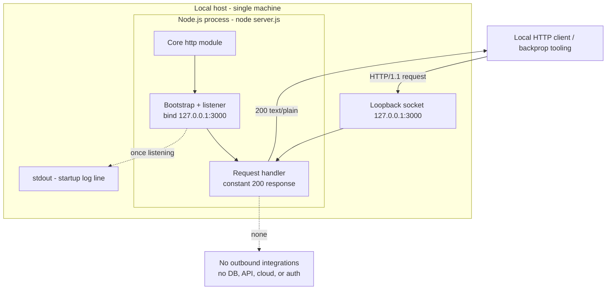

### 5.1.2 Core Components

Because the runtime is a single 14-line module, the "components" below are the cohesive responsibilities within `server.js` plus its runtime dependency. To respect the four-column limit, the component inventory is presented as two complementary tables keyed on the same component names.

**Responsibilities and dependencies.**

| Component | Primary Responsibility | Key Dependencies |
| --- | --- | --- |
| Server Bootstrap (`server.js` L1, L12–14) | Load `http`, create the server, bind the loopback listener on `127.0.0.1:3000`, and emit the startup log | Node.js runtime; built-in `http` module |
| Request Handler (`server.js` L6–10) | Produce the constant `200` `text/plain` `Hello, World!\n` response for every request | Node `http` `req`/`res` objects passed by the runtime |
| Startup Logger (`server.js` L13) | Write a single readiness line to standard output | Node.js `console` / process stdout |

**Integration points and critical considerations.**

| Component | Integration Points | Critical Considerations |
| --- | --- | --- |
| Server Bootstrap | Inbound loopback TCP on port 3000; OS process lifecycle | Host/port are hard-coded (not configurable); no `'error'` listener, so a bind failure (`EADDRINUSE`) crashes the process (see *4.4*) |
| Request Handler | Node's internal `'request'` event dispatch | `req` is never inspected — no routing, parsing, or validation; fully stateless |
| Startup Logger | Standard output stream | The only observability signal emitted; there is no error/request logging |

The following repository artifacts are **not runtime components** and appear here only for completeness: `industry.csv` (reference vocabulary, F-003), `100Pages.pdf` / `demo.jpg` / `sample.doc` (binary samples, F-004), `LoginTest.java` (non-compiling stub, F-005), and `test.py.txt` / `test.txt.txt` (empty placeholders, F-005). None participate in the executable data path.

### 5.1.3 Data Flow Description

**Primary data flows.** The architecture exhibits two flows, both internal to a single host:

- **Startup flow.** On `node server.js`, the runtime loads the `http` module (line 1), `http.createServer` registers the handler closure (lines 6–10), and `server.listen(3000, '127.0.0.1', …)` requests the loopback binding (line 12). When the socket is bound, the callback writes the startup line to stdout (line 13).
- **Request/response flow.** A local client opens a TCP connection to `127.0.0.1:3000`; Node's `http` module parses the inbound HTTP message and invokes the handler; the handler sets `statusCode = 200`, sets the single `Content-Type: text/plain` header, and calls `res.end('Hello, World!\n')`; Node serializes the response and returns it. The `req` object is discarded unread.

**Integration patterns and protocols.** The single interaction pattern is **synchronous HTTP/1.1 request/response over a loopback TCP socket**. There is no asynchronous messaging, no publish/subscribe, no queue or event bus, and no batch pipeline (*4.1.2 Integration Workflows*). The only event in play is Node's implicit internal `'request'` dispatch wired by `http.createServer`; the application registers no additional emitters or listeners.

**Data transformation points.** There are **none of substance**. The response body is a hard-coded string literal, so no input is deserialized, no template is rendered, and no content negotiation is performed. The only transformation is Node's built-in HTTP framing of the fixed status line, header, and body — an infrastructure concern handled entirely by the `http` module.

**Key data stores and caches.** There are **none**. The service reads and writes no persistent store, maintains no in-memory cache or session store, and sets no cache headers (*3.5 Databases & Storage*, *4.3 State Management*). Notably, `industry.csv` — the only structured dataset in the repository — is **never opened by the runtime**; it is inert fixture data consumed, if at all, by external tooling.

### 5.1.4 External Integration Points

The running service performs **no third-party or external-system integration**: it makes no outbound network calls, imports no client SDKs, and stores no API keys, tokens, or connection strings (*3.4 Third-Party Services*). The only touchpoints that exist outside the repository's own code are **Git/GitHub source hosting** and the unspecified **"backprop integration" tooling** referenced in `README.md`; both are source-management/consumer concerns rather than runtime integrations, and the tooling's internals are out of scope.

The process-level interfaces that the architecture actually exposes are summarized below (the "Integration Type & Pattern" column merges the requested integration-type and data-exchange-pattern attributes to keep the table within four columns). No service-level agreements are defined anywhere in the repository, so the SLA column records that fact.

| System / Counterparty | Integration Type & Pattern | Protocol / Format | SLA Requirements |
| --- | --- | --- | --- |
| Local HTTP client / backprop tooling | Inbound; synchronous request/response | HTTP/1.1 over loopback TCP; `text/plain` body | None defined; loopback-only (`127.0.0.1`) |
| Standard output (stdout) | Outbound; one-way readiness log | Plain-text line | None defined |
| Node.js runtime + core `http` module | In-process platform dependency | CommonJS / JavaScript API | Requires a Node.js runtime supporting `require('http')`; no version pinned |
| External APIs / databases / cloud / auth / messaging | None (confirmed absent) | N/A | N/A (see *3.4*, *3.5*) |


## 5.2 Component Details

The repository contains exactly one runtime component — the **Static HTTP Response Server** (`server.js`, F-001). It is documented in full below across the five requested attributes (purpose, technologies, interfaces, persistence, scaling), followed by the required component-interaction, state-transition, and sequence diagrams. The Node package manifest (`package.json` / `package-lock.json`, F-002) is a build/packaging artifact rather than a runtime component and is referenced only where it constrains the runtime (e.g., the empty dependency tree).

### 5.2.1 Static HTTP Response Server (server.js)

**Purpose and responsibilities.** This component is the sole executable behavior in the repository. Its responsibilities are: (1) create an HTTP server from the built-in `http` module; (2) bind a listener to the loopback address `127.0.0.1:3000` and log a readiness message; and (3) answer every inbound request with a fixed `200` `text/plain` `Hello, World!\n` payload. The request handler (lines 6–10) never inspects the `req` object, so it performs no routing, method dispatch, content negotiation, or input validation.

**Technologies and frameworks used.**

- **Language:** JavaScript (CommonJS module format; `require`-based import).
- **Runtime:** Node.js (any version providing the standard-library `http` API; no engine version is pinned in `package.json`).
- **Framework:** none — the component uses only the Node.js core `http` module. No web framework (Express, Koa, Fastify, etc.), middleware library, or router is present (`package-lock.json` records zero dependencies). See *3.1 Programming Languages* and *3.2 Frameworks & Libraries*.

**Key interfaces and APIs.**

- **Externally invokable interface:** a single implicit HTTP endpoint at `http://127.0.0.1:3000/` that accepts any method and any path and returns the identical response (F-001-RQ-003). There is no formal API contract, no versioned routes, and no OpenAPI/schema definition.
- **Runtime (Node) APIs consumed:** `http.createServer(handler)`, `server.listen(port, hostname, callback)`, `res.statusCode`, `res.setHeader(...)`, `res.end(...)`, and `console.log(...)`.
- **Exported module API:** none — `server.js` exports nothing (`module.exports` is untouched); it is an entry-point script, not an importable library.

**Data persistence requirements.** None. The component is stateless (see *4.3 State Management*): it opens no database connection, uses no ORM or cache, performs no file reads or writes in the request path, and retains no data between requests. The response body is an in-process string literal (*3.5 Databases & Storage*).

**Scaling considerations.** The component runs as a **single process on a single-threaded event loop** with no clustering, worker threads, or load balancing (*2.4.2*). Response construction is effectively constant-time and independent of request content, but the design imposes hard scaling boundaries: the host/port are hard-coded and not configurable, port `3000` must be free for startup to succeed, and the loopback binding confines reachability to the local host. Any horizontal scaling (multiple instances behind a reverse proxy, a process manager, or Node's `cluster` module) would require code or infrastructure that is **not present** in the repository.

### 5.2.2 Component Interaction Diagram

The diagram traces how the application code in `server.js` interacts with the Node.js core `http` module and a loopback client across both the startup path and the request path.

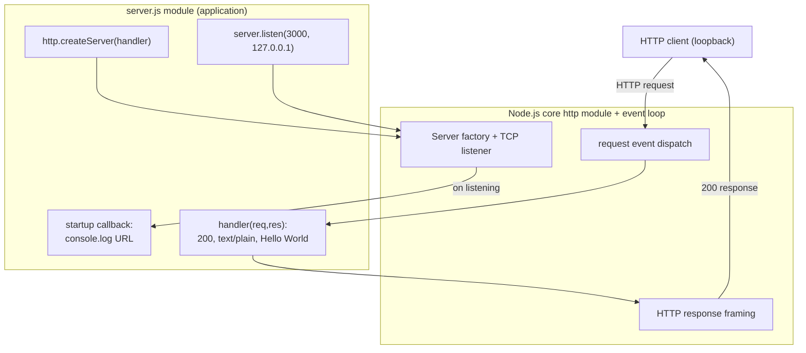

### 5.2.3 State Transition Diagram

The only stateful entity is the OS process running `server.js`. It moves through four lifecycle states; `Handling` is transient and carries no data forward, and a bind failure transitions directly to `Terminated` (consistent with *4.3 State Management* and *4.4 Error Handling*).

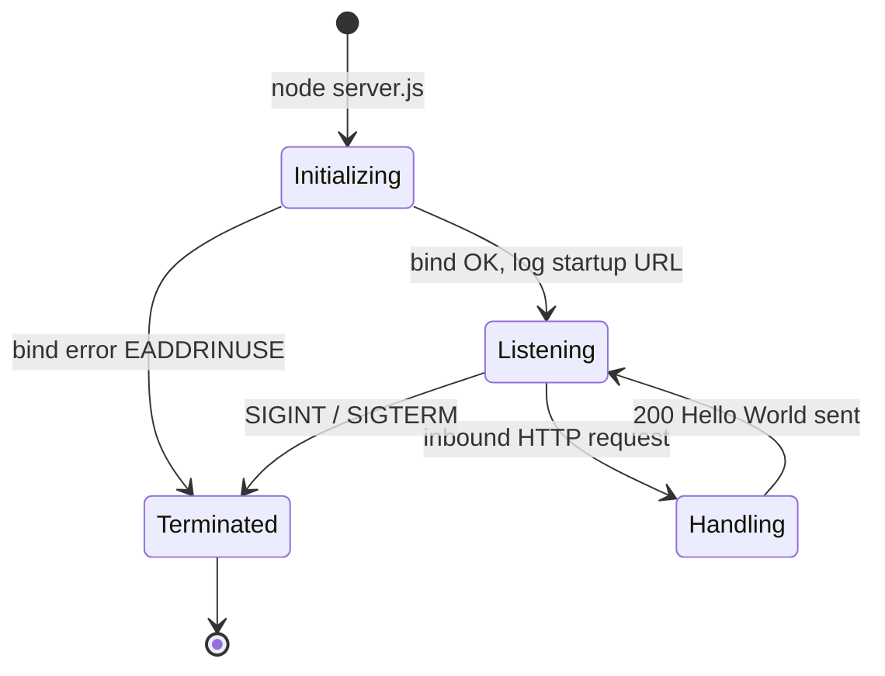

### 5.2.4 Sequence Diagrams for Key Flows

**Startup flow.** The operator launches the process; the module loads `http`, creates the server, and requests the loopback binding; on the `listening` event the callback writes the readiness line to stdout.

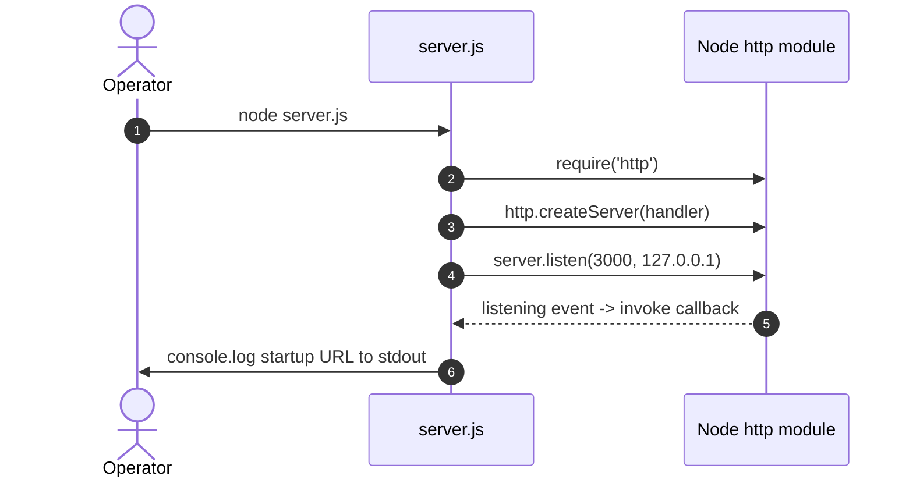

**Request-handling flow.** A loopback client issues any request; Node dispatches the handler, which sets status and header and ends the response with the fixed body. The handler never reads `req`, and no session is retained.

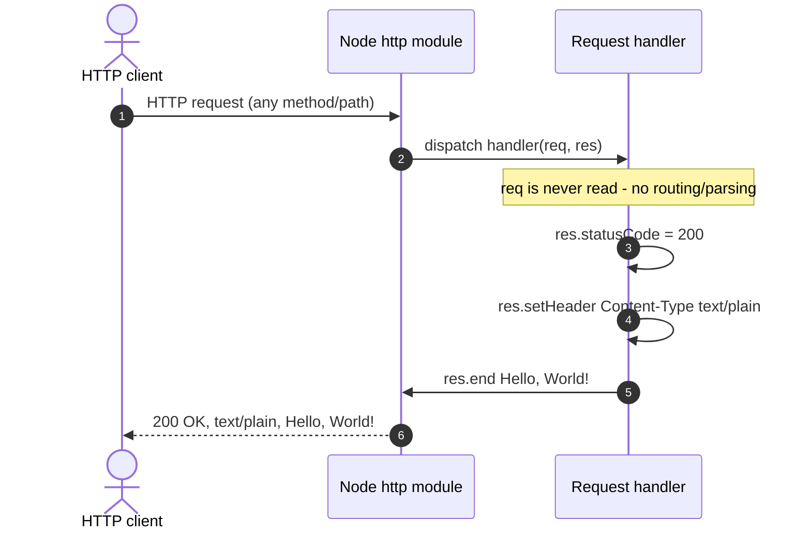


## 5.3 Technical Decisions

This section records the architectural decisions **as they are evidenced in the code**. Because the repository is an existing test fixture rather than a design proposal, each decision is inferred from observed artifacts and anchored to the only documented driver — `README.md`'s framing of the project as a "test project for backprop integration" that should not be modified. Where a motivation is not explicitly documented, it is presented as a reasonable reading of the as-built code, not as an invented requirement. All decisions below are effectively **Accepted (as-built)**.

### 5.3.1 Architecture Style Decision and Tradeoffs

The system adopts a **single-file, framework-free, single-process** style: one CommonJS module (`server.js`) built on the Node.js core `http` module with zero third-party dependencies (`package-lock.json`). The governing rationale is fixture minimalism and determinism (*2.4.1*): a smaller surface is easier to run, reason about, and keep immutable. The principal tradeoffs accepted are summarized below.

| Dimension | As-built choice | Tradeoff accepted |
| --- | --- | --- |
| Modularity | Single 14-line file; no layering | Maximal simplicity vs. no separation of concerns and limited growth path |
| Dependencies | Zero third-party (core `http` only) | No supply-chain/patch burden vs. no framework conveniences (routing, middleware) |
| Configurability | Hard-coded host and port | Deterministic startup vs. cannot change host/port without editing code |
| Concurrency / scale | Single process on the event loop | Minimal footprint vs. no clustering, failover, or high availability |

### 5.3.2 Communication Pattern Decision

The chosen communication pattern is **synchronous HTTP/1.1 request/response over a loopback TCP socket**, served by Node's internal `'request'` event dispatch. No asynchronous or decoupled patterns are used: there is no message queue, event bus, publish/subscribe, streaming, or webhook mechanism (*4.1.2*). This choice matches the fixture's purpose — provide one trivially predictable endpoint — and its tradeoff is that the service can only be exercised through direct, on-host HTTP calls; it cannot participate in event-driven or distributed workflows without additional code.

### 5.3.3 Data Storage and Caching Decisions

The decision is to use **no persistence and no caching**. The response is an in-memory string literal, and the process holds no state between requests, so there is no database, ORM, connection pool, session store, or cache layer anywhere in the repository (*3.5 Databases & Storage*, *4.3 State Management*). The rationale is that the fixture has nothing to persist or cache; the response is constant regardless of input, which makes caching immaterial. The consequence is that there is no data infrastructure to configure, secure, or operate — and equally, no capability to retain or serve dynamic data. `industry.csv` is committed as static reference data but is deliberately **not wired into the runtime**.

### 5.3.4 Security Mechanism Decision

The selected security posture is **network isolation via loopback binding, with no application-level security controls**. This is the only security-relevant mechanism present in the code, and it is documented rather than inferred at *2.4.3*.

| Control | Status in code | Rationale / compensating factor |
| --- | --- | --- |
| Network exposure | Loopback `127.0.0.1` only | Isolation is the entire security posture; the service is unreachable off-host |
| Transport encryption (TLS) | None (plain HTTP) | No sensitive data is exchanged; loopback traffic never leaves the host |
| Authentication / authorization | None | No protected resources; the response is public and static |
| Input validation / rate limiting | None | `req` is never read, so there is no input-processing attack surface |

Note that `LoginTest.java` — despite its name — is a **non-compiling stub** (its `main` body is the bare token `Web`) and implements no authentication; it is inert fixture content (F-005), not part of any security mechanism.

### 5.3.5 Decision Tree Diagram

The decision tree reconstructs the reasoning path evidenced by the code, beginning from the documented fixture purpose. Branches marked "not chosen" show the alternatives the as-built code declined.

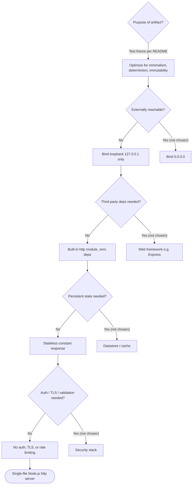

### 5.3.6 Architecture Decision Records (ADRs)

The following ADRs capture the as-built decisions, each tied to repository evidence and its consequences.

| ADR | Decision | Rationale (evidence) | Consequences |
| --- | --- | --- | --- |
| ADR-01 | Single-file, framework-free server on core `http` | Fixture minimalism; zero deps in `package-lock.json` | Trivial to run; no routing/middleware/extensibility |
| ADR-02 | Bind loopback `127.0.0.1:3000` only | Fixture not intended for external exposure (`server.js` L3–4) | Safe by isolation; unusable as a network service without change |
| ADR-03 | Stateless, constant literal response | Deterministic test target (F-001-RQ-003) | O(1) responses; no real business functionality |
| ADR-04 | No persistence or caching | Nothing to store; response is fixed (*3.5*, *4.3*) | No data infrastructure to operate or secure |
| ADR-05 | No auth, TLS, validation, or rate limiting | No sensitive data; no input read (*2.4.3*) | Security relies solely on host isolation |
| ADR-06 | Hard-coded host/port (not configurable) | Simplicity and deterministic startup (`server.js` L3–4) | Port 3000 must be free; changing config requires editing code |
| ADR-07 | Immutability ("Do not touch!") | Preserve fixture stability (`README.md`) | Any change alters fixture semantics; refactoring discouraged |


## 5.4 Cross-Cutting Concerns

Cross-cutting concerns are documented exactly as the repository implements them. For this fixture, most of these concerns are **deliberately absent**, and that absence is recorded here rather than glossed over or invented. The posture across all concerns is summarized below and then detailed per concern.

| Concern | Status | Mechanism / Evidence |
| --- | --- | --- |
| Monitoring & observability | Minimal | One stdout startup line; no metrics/health endpoint (`server.js` L13) |
| Logging & tracing | Minimal | Single `console.log`; no structured logs, no tracing |
| Error handling | Node defaults only | No `try/catch` or `'error'` listener (*4.4*) |
| Authentication / authorization | None | No auth code; loopback isolation only (*3.4*, *2.4.3*) |
| Performance / SLAs | None defined | No quantified targets anywhere (*1.2.3*, *4.1*) |
| Disaster recovery | None (external only) | No persistence, restart policy, or orchestration |

### 5.4.1 Monitoring and Observability

The only observability signal the process emits is a **single readiness line to standard output** — `Server running at http://127.0.0.1:3000/` — written once when the listener binds (`server.js` line 13). There is no health or readiness endpoint, no metrics exposition (e.g., Prometheus), no application performance monitoring, and no telemetry export; *3.4 Third-Party Services* confirms no monitoring/observability service is integrated. In practice, liveness can only be determined by observing that the process is running or by issuing a manual HTTP request and confirming the `200` response.

### 5.4.2 Logging and Tracing

Logging consists of the single startup `console.log` statement noted above. There are **no per-request access logs, no log levels, no structured (JSON) logging, no correlation/request IDs, and no distributed tracing** (no OpenTelemetry or equivalent). The handler (`server.js` lines 6–10) writes nothing to the log. On failure, the only additional output is the default Node.js stack trace emitted to standard error (see *4.4 Error Handling*).

### 5.4.3 Error Handling Patterns

Error handling is governed **entirely by Node.js defaults** because `server.js` contains no application-level error handling: there is no `try/catch`, no `server.on('error', …)` listener, and no `process.on('uncaughtException', …)` hook (*4.4 Error Handling*). Two failure loci exist:

- **Startup / bind failure.** If `127.0.0.1:3000` cannot be bound (e.g., `EADDRINUSE`), the server emits an `'error'` event; with no listener registered, Node throws the unhandled event, prints a stack trace to stderr, and the process exits non-zero. There is no in-process retry or recovery.
- **Request path.** The handler executes only three fixed statements (set status, set one header, end with a literal), performing no I/O or parsing that depends on request content, so under normal operation it raises no application errors and always returns the identical `200` response.

Resilience patterns commonly expected here — **retry/backoff, fallback services, circuit breakers, error notification/alerting, and automated recovery** — are all **absent**; the flow below classifies a failure by locus and traces it to its terminal outcome.

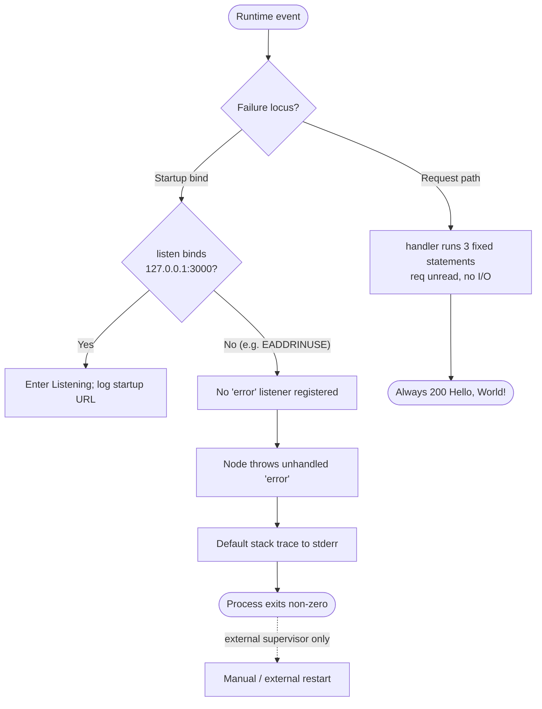

### 5.4.4 Authentication and Authorization

There is **no authentication or authorization framework**. The service defines no identity provider, no sessions, tokens, API keys, or role-based access control, and no auth middleware (*3.4 Third-Party Services*). Every request is served identically with no credential check. The only access control is the **loopback binding**, which limits reachability to the local host (*2.4.3*). As noted in *5.3.4*, `LoginTest.java` is a non-compiling stub and provides no authentication.

### 5.4.5 Performance Requirements and SLAs

The repository defines **no quantified performance requirements, throughput or latency targets, availability objectives, or service-level agreements** anywhere (confirmed in *1.2.3 Success Criteria* and *4.1 System Workflows*); no benchmarks or load tests exist. The observable characteristics that can be stated from the code are qualitative only: startup is a single asynchronous `listen` followed by one log write, and each response is produced by three constant-time statements with no I/O beyond the socket write, so response construction is effectively constant-time and independent of request content. Because the service runs as a single process on one event loop, concurrency is bounded by that single instance (*2.4.2*).

### 5.4.6 Disaster Recovery

There are **no disaster-recovery procedures**, and none are required by the design. The service is stateless and persists no data, so there is nothing to back up or restore and no recovery-point objective to define (*3.5 Databases & Storage*, *4.3 State Management*). Nothing in the repository restarts the process, monitors its health, or defines a container/orchestration restart policy — there is no Dockerfile, systemd unit, or CI/orchestration configuration (*2.4.1*, *4.4*). Consequently, recovery after a crash is entirely a **manual or external-supervisor concern outside the scope of the code**, and no recovery-time objective is specified.


## 5.5 References

The following repository artifacts and previously authored specification sections were examined as evidence for Section 5. No web sources were used; every architectural claim is grounded in the repository's own contents.

**Repository files and folders examined**

- `server.js` — Established the sole runtime component: the Node.js core-`http` server, its constant `200` `text/plain` request handler, loopback `127.0.0.1:3000` binding, single startup log, and the absence of routing, state, error handling, and configuration.
- `package.json` — Established package identity (`hello_world` 1.0.0, MIT), the intentionally failing `test` script, the absent `main` (`index.js`), and the absence of declared dependencies.
- `package-lock.json` — Confirmed the zero-dependency posture (lockfile v3 with only the root package entry).
- `README.md` — Established the documented fixture purpose ("test project for backprop integration") and the "Do not touch!" immutability directive that anchors the technical-decision rationale.
- `LoginTest.java` — Confirmed the non-compiling Java stub (bare token `Web`) is inert fixture content and not an authentication mechanism.
- `industry.csv` — Confirmed a static reference vocabulary (header `Industry` + 43 labels) that is not read by the runtime.
- `100Pages.pdf`, `demo.jpg`, `sample.doc` — Confirmed inert binary sample artifacts committed to Git; not referenced by any code.
- `test.py.txt`, `test.txt.txt` — Confirmed zero-byte placeholder files.
- Repository root (flat, no subdirectories) — Established the single-level project structure and the absence of configuration, CI/CD, container, and infrastructure files.

**Cross-referenced Technical Specification sections**

- `1.2 System Overview` — Aligned system framing, capabilities, and the documented absence of KPIs/SLAs.
- `1.3 Scope` — Confirmed in-scope/out-of-scope boundaries and external-tooling context.
- `2.4 Implementation Considerations` — Sourced cross-cutting constraints, per-feature technical/scalability constraints, and security implications.
- `3.1 Programming Languages`, `3.2 Frameworks & Libraries` — Confirmed the JavaScript/Node.js stack and the absence of any web framework.
- `3.4 Third-Party Services` — Confirmed no external integrations, auth providers, monitoring, cloud, or messaging.
- `3.5 Databases & Storage` — Confirmed no databases, caches, or object storage; static files are inert.
- `4.1 System Workflows` — Aligned the startup and request/response workflows and the absence of integration/batch flows.
- `4.3 State Management` — Sourced the process lifecycle state machine and the stateless posture.
- `4.4 Error Handling` — Sourced the Node-default failure behavior and the enumerated absent resilience mechanisms.


# 6. SYSTEM COMPONENTS DESIGN

## 6.1 Core Services Architecture

### 6.1.1 Architecture Applicability Assessment

**Core Services Architecture is not applicable for this system.**

The `hao-backprop-test` repository does not implement microservices, a distributed architecture, or distinct service components. Its entire runtime is a single 14-line Node.js script (`server.js`, feature **F-001 — Static HTTP Response Server**) executed directly as `node server.js` in one operating-system process on a single event loop, using only the Node.js standard-library `http` module with zero third-party dependencies. There is no second service, no inter-process boundary, and no orchestration layer, so the service-oriented concerns this section is meant to document — service discovery, load balancing, circuit breakers, inter-service communication, auto-scaling, and failover — have no substrate on which to exist.

This determination is consistent with the architecture already recorded in *5.1 High-Level Architecture* (a "single-process, single-module, monolithic script"), the toolchain in *3.6 Development & Deployment* (no containerization, CI/CD, infrastructure-as-code, process manager, or orchestration), and the cross-cutting posture in *5.4 Cross-Cutting Concerns*.

#### Why the service-oriented model does not apply

Each of the following observations, taken directly from the codebase, independently rules out a core-services architecture:

- **One deployable unit.** The complete application is `server.js`; `package.json` declares no additional runtime entry points (its `main` field names `index.js`, which does not exist in the tree). There are no service directories — the repository has no subfolders at all.
- **Zero dependencies / no service libraries.** `package-lock.json` records an empty dependency tree — there is no web framework, RPC/gRPC stack, message-broker client, service-mesh sidecar, or service-registry client installed.
- **No inter-service communication.** `server.js` opens no outbound connections and imports no client SDKs; the sole interface is one inbound HTTP listener (*5.1.4 External Integration Points*).
- **No infrastructure for distribution.** A repository-wide scan found no `Dockerfile`, compose file, Kubernetes/Helm manifest, CI/CD pipeline, or infrastructure-as-code definition — deployment is a manual, single-process foreground launch (*3.6*).
- **Loopback isolation.** The listener binds the hardcoded loopback address `127.0.0.1:3000` (not `0.0.0.0`), so even network-level fan-out to peers is impossible without code changes (`server.js` lines 3–4).

The table below records the determination against the qualifying criteria for a core-services architecture.

| Qualifying Criterion | Present? | Evidence |
| --- | --- | --- |
| Multiple independently deployable services | No | Entire runtime is one file (`server.js`) run as one process (*5.1.1*) |
| Distributed / multi-node or multi-tier topology | No | Single foreground process; no orchestration or IaC (*3.6*) |
| Distinct service components with separate lifecycles | No | One inline handler inside one module (`server.js` lines 6–10) |
| Inter-service communication (synchronous or asynchronous) | No | No outbound calls, SDKs, brokers, or queues (*5.1.4*) |

#### Scope of the remaining subsections

Because the section prompt enumerates specific service-architecture concerns, subsections *6.1.2*–*6.1.4* address each requested area — service components, scalability design, and resilience patterns — explicitly, confirming non-applicability against direct code evidence and describing the minimal single-process reality that stands in place of each pattern. The required diagrams are provided to visualize that reality, not to imply capabilities the code does not contain.

#### Actual runtime topology (service interaction)

The diagram below is the system's complete "service interaction" picture: a single local client interacts with one process, and there are no peer services with which to interact.

**Diagram 6.1.1 — Actual Service Interaction / Runtime Topology**

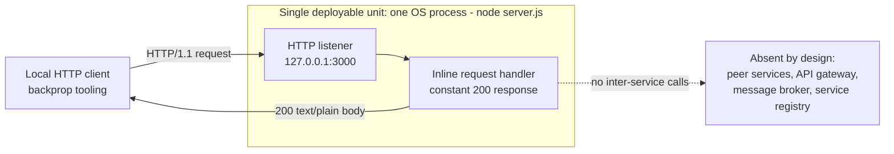

### 6.1.2 Service Components Analysis

Although a core-services architecture is not applicable overall (*6.1.1*), this subsection walks each requested service-component concern to confirm — with code evidence — that it is absent, and to describe the single-process behavior that stands in its place.

| Service Component Concern | Status | Evidence / Rationale |
| --- | --- | --- |
| Service boundaries & responsibilities | Process boundary only | One module `server.js`; cohesive functions, not separate services (*5.1.2*) |
| Inter-service communication patterns | None | Only inbound HTTP/1.1 over loopback; no outbound calls (*5.1.3*) |
| Service discovery mechanisms | None | Hardcoded `127.0.0.1:3000`; no registry/DNS/config (`server.js` lines 3–4) |
| Load balancing strategy | None | Single process/event loop; no `cluster`, proxy, or balancer (*3.6*, *5.4.5*) |
| Circuit breaker patterns | Not applicable | No downstream dependencies; no breaker library (`package-lock.json`) |
| Retry & fallback mechanisms | None | No outbound calls; no retry library; single deterministic path (*4.4*) |

**Service boundaries and responsibilities.** The only boundary is the operating-system process boundary. Within `server.js` three cohesive responsibilities exist — Server Bootstrap, Request Handler, and Startup Logger, as catalogued in *5.1.2 Core Components* — but these are functions and closures inside one module sharing a single lifecycle, not separately deployable services. The "service boundary" is therefore identical to the process boundary described in *5.1.1*: one inbound loopback socket and one stdout stream.

**Inter-service communication patterns.** There are none, because there is no second service to communicate with. The single communication pattern is synchronous inbound HTTP/1.1 request/response over a loopback TCP socket (*5.1.3 Data Flow Description*); the process initiates no outbound calls and uses no asynchronous messaging, publish/subscribe, queue, event bus, or RPC/gRPC. The `req` object is never inspected, and no correlation or context-propagation identifiers are created.

**Service discovery mechanisms.** None exist. The listening endpoint is the hardcoded constant pair `hostname = '127.0.0.1'` and `port = 3000` (`server.js` lines 3–4); there is no service registry (Consul, etcd, Eureka, ZooKeeper), no DNS-based discovery, no environment-variable or configuration-file lookup, and no client that would need to resolve a peer. Any caller must already know the fixed address.

**Load balancing strategy.** None exists. The application runs as a single Node.js process on one event loop, so there is nothing to balance load across; the Node `cluster` module and `worker_threads` are not used (confirmed by a keyword scan of the source), and there is no reverse proxy, external load balancer, or process manager (*3.6*). Concurrency is bounded by that single instance (*5.4.5*).

**Circuit breaker patterns.** Not applicable. Circuit breakers exist to protect calls to downstream dependencies, and this service has no downstream dependencies to protect. No breaker library (for example, Opossum) — indeed, no library of any kind — is installed (`package-lock.json` empty dependency tree), and the handler performs no I/O that could fail or trip a breaker.

**Retry and fallback mechanisms.** None exist. With no outbound calls, there is nothing to retry; there is no retry/backoff library, no fallback path, and no alternate response. The request handler is a single deterministic path that always produces the same `200` `text/plain` response and contains no `try/catch` (*4.4 Error Handling*).

### 6.1.3 Scalability Design Analysis

Scalability design is likewise not applicable: the system defines no scaling mechanism, no auto-scaling rules, no resource-allocation configuration, and no capacity targets. This subsection records each requested concern against code evidence and notes the structural constraints that would have to be removed before the fixture could scale at all.

| Scalability Concern | Status | Evidence / Rationale |
| --- | --- | --- |
| Horizontal / vertical scaling approach | Neither implemented | Single foreground process; no `cluster`/replicas; no resource tuning (*3.6*) |
| Auto-scaling triggers & rules | None | No orchestration, metrics, or autoscaler; nothing to trigger on (*3.6*) |
| Resource allocation strategy | None | No container limits/requests or cgroup config; OS defaults apply |
| Performance optimization techniques | Inherent minimalism only | Constant-time, no-I/O, stateless handler; no cache/pooling (*5.4.5*) |
| Capacity planning guidelines | None | No SLAs/KPIs/throughput targets; no benchmarks (*1.2.3*, *5.4.5*) |

**Horizontal and vertical scaling approach.** Neither is implemented. Horizontal scaling would require multiple instances behind a balancer, but the process uses no clustering (`cluster` / `worker_threads`), declares no replicas, and has no orchestrator (*3.6*); moreover, the hardcoded loopback bind `127.0.0.1:3000` would cause a second instance on the same host to fail with `EADDRINUSE` and would prevent off-host distribution. Vertical scaling — allocating more CPU or memory to the process — is possible only at the operating-system level and is neither expressed nor constrained anywhere in the repository.

**Auto-scaling triggers and rules.** None exist. There is no orchestration platform, no metrics pipeline, and no Horizontal Pod Autoscaler or equivalent, and therefore no signal (CPU, memory, request rate, or queue depth) on which a scaling rule could act (*3.6*).

**Resource allocation strategy.** None is defined. There are no container resource requests/limits, no cgroup or ulimit configuration, and no memory/CPU tuning flags; the process consumes whatever the host operating system grants it. `package.json` sets no runtime flags and pins no engine (*3.6*).

**Performance optimization techniques.** The only "optimization" is inherent minimalism. Each response is produced by three constant-time statements with no request parsing and no I/O beyond the socket write, and the service is stateless (*5.4.5*, *4.3 State Management*). There is no caching layer, no connection pooling, no response compression, and no CDN — none are needed for a fixed-string response, and none are present.

**Capacity planning guidelines.** None are defined. The repository specifies no service-level agreements, throughput or latency targets, or availability objectives, and contains no benchmarks or load tests (*1.2.3 Success Criteria*, *5.4.5 Performance Requirements and SLAs*). The only qualitative statement that can be made is that maximum concurrency is bounded by a single event loop in a single process.

**Diagram 6.1.3 — Scalability Architecture: Current State vs. Structurally-Blocked Scale-Out**

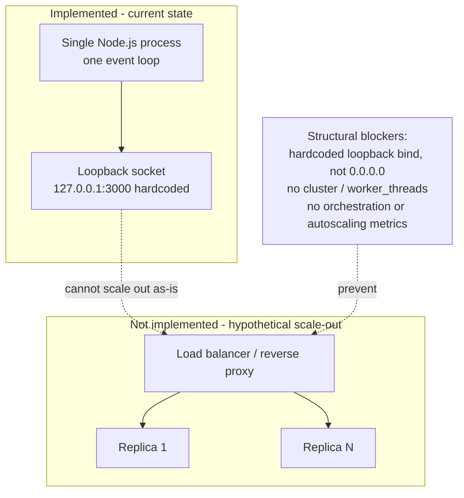

### 6.1.4 Resilience Patterns Analysis

Resilience patterns are not applicable and, apart from the operating system's own process handling, are entirely absent. Because the service is stateless and has no dependencies, it also has nothing to make resilient beyond the availability of the single process itself — which is an unmitigated single point of failure. This subsection records each requested concern and traces the actual failure behavior.

| Resilience Concern | Status | Evidence / Rationale |
| --- | --- | --- |
| Fault tolerance mechanisms | None | No `try/catch`, no `'error'` listener, no supervisor (*5.4.3*, *4.4*) |
| Disaster recovery procedures | None (external only) | Stateless; nothing to back up/restore; no RPO/RTO (*5.4.6*) |
| Data redundancy approach | Not applicable | No runtime data persisted or replicated (*4.3*, *3.5*) |
| Failover configurations | None | Single instance; no standby, health check, or balancer |
| Service degradation policies | None | Binary availability; no tiers, flags, or backpressure |

**Fault tolerance mechanisms.** None exist in code. `server.js` contains no `try/catch`, registers no `server.on('error', …)` listener, and installs no `process.on('uncaughtException', …)` handler, so error behavior is governed entirely by Node.js defaults (*5.4.3 Error Handling Patterns*, *4.4 Error Handling*). A bind failure at startup (for example, `EADDRINUSE`) emits an unhandled `'error'` event that Node throws, printing a stack trace to stderr and exiting the process with a non-zero code; a single fault therefore takes the entire service down. There is no external process supervisor, systemd unit, or container restart policy to compensate (*3.6*).

**Disaster recovery procedures.** None are defined, and none are required by the design. The service is stateless and persists no data, so there is nothing to back up or restore, no recovery-point objective, and no recovery-time objective (*5.4.6 Disaster Recovery*, *4.3*). Recovery after a crash is entirely a manual or external-supervisor concern outside the scope of the code.

**Data redundancy approach.** Not applicable. The runtime reads and writes no persistent data — there is no database, file write, or cache (*4.3*, *3.5 Databases & Storage*) — so there is nothing to replicate or mirror. The static files committed to Git (for example, `industry.csv` and the binary samples) are version-controlled source artifacts, not a runtime data-redundancy mechanism, and are never opened by `server.js`.

**Failover configurations.** None exist. There is a single instance with no standby or hot spare, no health/readiness/liveness probes, and no load balancer or DNS layer that could redirect traffic on failure. The single process is a single point of failure; when it exits, the service is fully unavailable until an external actor restarts it.

**Service degradation policies.** None exist. The service exposes exactly one behavior — the constant `200` `text/plain` response — so there is no tiered or optional functionality to shed under load, no feature flags, no graceful-degradation path, and no rate limiting or backpressure. Availability is therefore binary: the process is either serving the fixed response or it is down.

**Diagram 6.1.4 — Resilience Pattern Implementation: Actual Failure Behavior and Single Point of Failure**

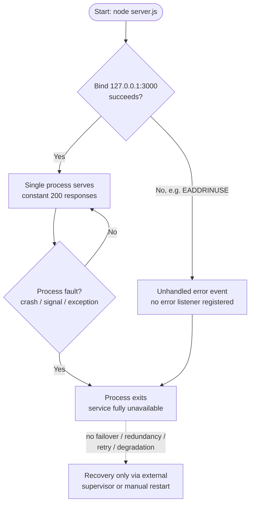

### 6.1.5 References

**Repository files and folders examined for this section**

- `server.js` — The sole runtime artifact; established the single-process model, the hardcoded loopback bind (`127.0.0.1:3000`, lines 3–4), the inline constant-response handler (lines 6–10), and the absence of any `'error'` listener, clustering, or outbound calls.
- `package.json` — Established zero declared dependencies, no `engines` pin, a missing `index.js` main entry, and the intentionally failing `test` script.
- `package-lock.json` — Established the empty dependency tree (no web framework, message-broker client, service-registry client, load-balancing, or resilience library installed).
- `README.md` — Established the repository's identity and purpose as a protected "test project for backprop integration" test fixture.
- `industry.csv` — Cited as static, version-controlled reference data that is never opened at runtime (it is not a data-redundancy mechanism).
- Repository root (flat, no subfolders) — Established via directory and keyword scans that no `Dockerfile`, compose file, Kubernetes/Helm manifest, CI/CD pipeline (`.github/workflows/`), or infrastructure-as-code definition exists anywhere.

**Cross-referenced Technical Specification sections**

- *1.2.3 Success Criteria* — Confirmed no KPIs, SLAs, or measurable performance objectives are defined.
- *3.5 Databases & Storage* — Confirmed no database, cache, or persistent store.
- *3.6 Development & Deployment* — Confirmed no containerization, CI/CD, IaC, process manager, or orchestration; manual single-process launch; Node.js v22.23.1 observed in the container but not pinned.
- *4.3 State Management* — Confirmed application-level statelessness, the process lifecycle state machine, and the absence of persistence, caching, and transactions.
- *4.4 Error Handling* — Confirmed error behavior is governed by Node.js defaults with no in-code handling.
- *5.1 High-Level Architecture* — Confirmed the single-process, single-module, monolithic architecture, the component inventory, and the absence of outbound integrations.
- *5.4 Cross-Cutting Concerns* — Confirmed the monitoring, logging, error-handling, performance, and disaster-recovery posture, including that no SLAs and no disaster-recovery procedures exist.

## 6.2 Database Design

### 6.2.1 Database Applicability Assessment

**Database Design is not applicable to this system.**

The `hao-backprop-test` repository contains no database, no persistent data store, and no persistence layer of any kind. Its entire runtime is a single Node.js script (`server.js`, feature **F-001 — Static HTTP Response Server**) that responds to every request with the same in-memory string literal `'Hello, World!\n'`; it never reads from or writes to a database, cache, or file at runtime. There is therefore no schema to design, no data model to normalize, no index or constraint to define, and no replication, partitioning, or backup topology to configure. This determination is consistent with *3.5 Databases & Storage* (which records that the fixture uses "no database, no caching layer, and no storage service") and *4.3 State Management* (which records that data persistence points "are none").

#### Why a database design does not apply

Each of the following observations, taken directly from the codebase, independently confirms the absence of any managed data store:

- **No database driver or client is installed.** `package.json` declares no `dependencies` or `devDependencies` fields at all, and `package-lock.json` (lockfile version 3) records an empty packages tree — there is no relational driver (`pg`, `mysql`, `sqlite`), no document-store client (`mongodb`, `mongoose`), no cache client (`redis`, `ioredis`, `memcached`), and no ORM or query builder (`sequelize`, `typeorm`, `prisma`, `knex`).
- **No persistence code exists.** A keyword scan across every text source (`.js`, `.json`, `.java`, `.csv`, `.md`, `.txt`) for database, ORM, SQL, migration, schema, connection-pool, and file-I/O constructs returned a single match — `server.js` line 1, `const http = require('http')` — which is the Node.js built-in HTTP module, not a data-access API. The runtime performs no `fs` read or write.
- **No schema, migration, or seed artifacts.** The repository is flat (no subfolders) and its eleven tracked files include no `.sql` file, no `schema`/`models`/`entities` directory, and no `migrations/` folder.
- **The runtime is stateless.** The request handler (`server.js` lines 6–10) declares no variables that persist across requests and mutates no shared state, so there is no in-memory store, session store, or transaction to manage (*4.3 State Management*).
- **The only "data" is static, version-controlled files.** `industry.csv` and the binary sample artifacts are inert files committed directly to Git; none of them are opened by `server.js`, and they constitute reference/fixture content rather than a managed database (*2.1 Feature Catalog*, features F-003 and F-004).

The table below records the persistence inventory that was evaluated.

| Persistence Concern | Status in Repository | Evidence |
| --- | --- | --- |
| Relational database (RDBMS) | None — no engine, driver, or connection | `package.json`, `package-lock.json` |
| NoSQL / document / key-value store | None | Empty dependency tree (`package-lock.json`) |
| ORM / query builder / migration layer | None | Keyword scan (no match) |
| Caching / session store | None — response is a static literal | `server.js`, *4.3* |
| Object / cloud storage service | None — no SDKs or credentials | Repository contents |
| Runtime file I/O (`fs`) | None — no read/write in the request path | `server.js` (only imports `http`) |
| Static committed files | Present, but not a managed data store | `industry.csv` and binary samples |

The next table records the determination against the criteria that would qualify a system for a database design.

| Qualifying Criterion | Present? | Evidence |
| --- | --- | --- |
| Any database engine, driver, or connection | No | Empty dependency tree; no connection string |
| Persistent data read or written at runtime | No | `server.js` performs no I/O beyond the socket write |
| Data model, schema, or migration definitions | No | No schema/model files; no `migrations/` folder |
| Caching, session, or in-memory store | No | Stateless handler; no cache library (*4.3*) |

#### Scope of the remaining subsections

Because the section prompt enumerates specific database-design concerns, subsections *6.2.2*–*6.2.5* address each requested area — schema design, data management, compliance considerations, and performance optimization — explicitly, confirming non-applicability against direct code evidence and describing the minimal, stateless reality that stands in place of each concern. The required diagrams (a data-flow diagram, an entity-relationship diagram, and a replication-architecture diagram) are provided to visualize that reality — an absence of persistence — not to imply capabilities the code does not contain.

#### Actual data flow (no persistence)

The diagram below is the system's complete data-flow picture: a request enters the single process, the handler emits a constant in-memory string, and no data crosses a persistence boundary in either direction.

**Diagram 6.2.1 — Data Flow: Stateless Request Handling with No Persistence**

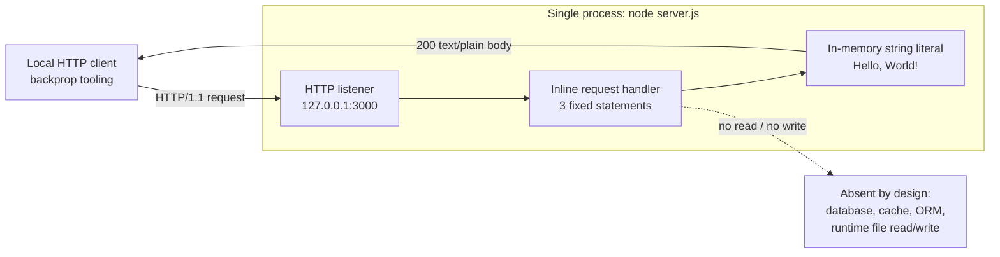


### 6.2.2 Schema Design Assessment

Schema design is not applicable: there is no database, so there are no entities, tables, collections, keys, indexes, constraints, partitions, or replicas to design. This subsection walks each requested schema-design concern, confirms its absence against code evidence, and documents the single structured artifact that exists — the static `industry.csv` reference file — for completeness.

| Schema Design Concern | Status | Evidence / Rationale |
| --- | --- | --- |
| Entity relationships | None — no persisted entities | No data store; no models/entities (*6.2.1*) |
| Data models & structures | Static CSV only, not a DB model | `industry.csv` (flat, single column) |
| Indexing strategy | None — nothing to index | No database engine (`package-lock.json`) |
| Partitioning approach | Not applicable | No tables/collections to partition |
| Replication configuration | None | Single process; no DB nodes (*6.1.4*) |
| Backup architecture | None (Git history only) | No data store to back up (*5.4.6*) |

#### Entity relationships and data models

There are **no persisted entities and therefore no relationships** (one-to-one, one-to-many, or many-to-many) to model. The runtime holds only a single transient string literal per response and no domain objects (*4.3 State Management*). The one structured data artifact in the repository is `industry.csv`, a flat, single-column controlled vocabulary — a header row `Industry` followed by 43 unique labels (`Accounting/Finance` … `Other`). It is a standalone file with no relational counterpart, no join key, and no code that loads it, so even conceptually it participates in no entity relationship (*2.1 Feature Catalog*, F-003). The binary sample artifacts (`100Pages.pdf`, `demo.jpg`, `sample.doc`) are opaque blobs with no structured data model (F-004).

#### Indexing strategy, partitioning, and constraints

No indexing strategy exists because there is no database, query planner, or query workload to optimize. Likewise, there is **no partitioning or sharding** — there are no tables or collections whose rows could be range-, hash-, or list-partitioned. Because the prompt requires that all indexes and constraints be documented, the following table records them exhaustively for the only structured data object; every category is empty by construction.

| Data Object | Primary / Foreign Keys | Indexes | Constraints |
| --- | --- | --- | --- |
| `industry.csv` (static file) | None | None | None (no type/uniqueness enforcement) |

`industry.csv` is a 44-line, LF-terminated text file with one column and no header typing, no declared primary key, no uniqueness or foreign-key constraint, and no not-null or check constraint — nothing enforces its shape at rest or at read time. Its values happen to be distinct, but this is a property of the committed data, not an enforced constraint.

#### Replication configuration and backup architecture

There is **no replication topology** — no primary/replica pair, no read replicas, no write-ahead-log shipping, no streaming replication, and no document-store oplog — because there is no database node to replicate (*6.1.4 Resilience Patterns*). Similarly, there is **no backup architecture**: no snapshot schedule, no point-in-time recovery, no dump/export job, and no recovery-point objective, because there is no data store whose state would need to be captured (*5.4.6 Disaster Recovery*). The only redundancy present is incidental version control: the static files — including the roughly 11.6 MB of binary samples committed directly to Git with no Git LFS indirection (*3.5 Databases & Storage*) — are duplicated across every full clone of the repository. That is a source-artifact distribution mechanism, not a runtime data-replication or backup strategy.

#### Entity-relationship diagram

Because no database entities exist, the entity-relationship diagram depicts the single static reference structure as a lone, relationship-free artifact. It is shown to make the absence explicit, not to imply a managed table.

**Diagram 6.2.2-A — Entity-Relationship View: Sole Static Data Structure (Not a Database Table)**

```mermaid
erDiagram
    INDUSTRY_CSV {
        string Industry "Static file; header + 43 labels; no PK, no index, no constraint"
    }
```

#### Replication architecture diagram

The diagram contrasts the database replication topology that a stateful service would define (absent here) with the only redundancy the fixture actually exhibits — full Git clones of the committed static files.

**Diagram 6.2.2-B — Replication Architecture: Absent Database Replication vs. Git-Clone Redundancy**

```mermaid
flowchart TB
    NOTE["No database exists:<br/>no primary, no replica set,<br/>no WAL / oplog / streaming"]
    subgraph ABSENT["Not implemented - database replication topology"]
        PRIMARY["Primary DB node"]
        REPLICA1["Read replica 1"]
        REPLICA2["Read replica N"]
        PRIMARY -->|"absent sync"| REPLICA1
        PRIMARY -->|"absent sync"| REPLICA2
    end
    subgraph ACTUAL["Implemented - Git distribution of static files"]
        GITREMOTE["Git remote<br/>static files, no Git LFS"]
        CLONE1["Full working copy A"]
        CLONE2["Full working copy B"]
        GITREMOTE -->|"git clone"| CLONE1
        GITREMOTE -->|"git clone"| CLONE2
    end
    NOTE -.->|"rules out"| PRIMARY
```


### 6.2.3 Data Management Assessment

Data management is not applicable in the database sense: with no data store, there is no data to migrate, version at the schema level, archive, retrieve at runtime, or cache. The only data-management activity present is ordinary source control of static files via Git. This subsection records each requested concern against code evidence.

| Data Management Concern | Status | Evidence / Rationale |
| --- | --- | --- |
| Migration procedures | None | No schema, ORM, or `migrations/` folder (*6.2.2*) |
| Versioning strategy | Git source control only | Single commit `a3a7a3b`; no data/schema versioning |
| Archival policies | None | No data lifecycle, TTL, or tiering |
| Storage & retrieval mechanisms | None at runtime | `server.js` returns a constant literal (*4.3*) |
| Caching policies | None | No cache layer or cache headers (*4.3*) |

#### Migration and versioning

There are **no migration procedures**. Schema migrations presuppose a schema and a migration engine; neither exists — the repository contains no ORM, no migration framework (for example Knex, Sequelize, Prisma, Flyway, or Liquibase), and no `migrations/` directory (*6.2.2 Schema Design Assessment*). There is likewise **no data or schema versioning strategy**. The only versioning in effect is Git source control: the repository is a single committed snapshot (commit `a3a7a3b`, "Add files via upload"), and the `1.0.0` value in `package.json` and `package-lock.json` is the Node *package* identity, not a data-model version. `README.md` marks the fixture immutable ("Do not touch!"), so the committed data is expected to remain fixed rather than evolve through versioned migrations (*2.1 Feature Catalog*, F-006).

#### Archival, storage, and retrieval

There are **no archival policies** — no time-to-live, no retention tiers, no cold-storage or export-to-archive job, and no purge routine — because no records accumulate anywhere. There is **no runtime storage or retrieval mechanism**: `server.js` neither persists incoming request data nor reads any stored record to build its response; every reply is the same in-memory literal produced by three fixed statements (*4.3 State Management*). The static files (`industry.csv` and the binary samples) are "retrieved" only in the sense that external tooling can read them from a checked-out working tree or from Git; they are never opened by the server process, so they impose no storage-access path on the runtime (*2.1 Feature Catalog*, F-003, F-004).

#### Caching policies

There is **no caching policy and no caching layer**. The handler sets only the `Content-Type: text/plain` header and no cache-control directives (no `Cache-Control`, `ETag`, or `Expires`), there is no in-process or external cache (for example Redis or Memcached), and there is no CDN or reverse-proxy cache in front of the process (*4.3 State Management*, *6.1.3*). Because every response is an identical fixed literal, caching would have no behavioral effect; its absence is a design consequence of statelessness rather than an omission to be remediated.


### 6.2.4 Compliance, Security & Access Control Assessment

Database compliance considerations are not applicable: there is no data store to retain, back up, protect, audit, or gate with access controls, and the only committed data (`industry.csv`) contains no personal or sensitive information. This subsection records each requested compliance concern against code evidence.

| Compliance Concern | Status | Evidence / Rationale |
| --- | --- | --- |
| Data retention rules | None (Git-retained fixture) | No records stored at runtime (*4.3*) |
| Backup & fault-tolerance policy | None | No data store; single process (*5.4.6*, *6.1.4*) |
| Privacy controls | Not applicable — no PII | `industry.csv` holds only generic labels (*3.5*) |
| Audit mechanisms | None | Single startup log; no access/audit trail (*5.4.2*) |
| Access controls | Loopback isolation only | No DB users/roles; no auth (*5.4.4*) |

#### Data retention and privacy

There are **no data-retention rules** because no records are created, collected, or persisted at runtime — there is nothing to retain, expire, or delete on a schedule (*4.3 State Management*). The static files are simply kept in version control as an immutable fixture (*2.1 Feature Catalog*, F-006). **Privacy controls are not applicable**: `industry.csv` contains only a generic controlled vocabulary of 43 industry-category labels (`Accounting/Finance`, `Healthcare`, `Technology`, … `Other`) with no personally identifiable information, and the server neither collects nor stores request data of any kind, so there is no personal-data-at-rest surface, no encryption-at-rest requirement, and no data-subject access/erasure obligation to satisfy (*3.5 Databases & Storage*).

#### Backup, fault tolerance, and audit

There is **no backup or fault-tolerance policy at the data layer** because there is no data layer: no snapshots, no replica failover, and no recovery-point/recovery-time objective (*5.4.6 Disaster Recovery*, *6.1.4 Resilience Patterns*). At the process layer, the single Node.js instance is an unmitigated single point of failure with no standby. There are also **no audit mechanisms**: the process emits only a single startup line (`Server running at http://127.0.0.1:3000/`) and writes no per-request access log, no data-access audit trail, and no change-data-capture record (*5.4.2 Logging and Tracing*). No tamper-evident or immutable audit store exists.

#### Access controls

There is **no database access control** — no database users, roles, grants, row-level security, or connection credentials — because there is no database and no connection string anywhere in the repository. At the service level, the only access control is the **loopback binding** (`127.0.0.1:3000`), which limits reachability to the local host; the service performs no authentication or authorization and serves every request identically (*5.4.4 Authentication and Authorization*). The `LoginTest.java` file — despite its name — is a non-compiling stub whose method body is the bare token `Web` and provides no authentication or access-control logic (*2.1 Feature Catalog*, F-005). Consequently there is no data-at-rest credential to manage and no data-access policy to enforce.


### 6.2.5 Performance Optimization Assessment

Database performance optimization is not applicable: there are no queries to tune, no connections to pool, no primary/replica pair to split reads and writes across, and no datasets to process in batches. The service's only performance-relevant property is inherent minimalism — a constant-time, no-I/O, stateless response (*5.4.5 Performance Requirements and SLAs*). This subsection records each requested optimization concern against code evidence.

| Optimization Concern | Status | Evidence / Rationale |
| --- | --- | --- |
| Query optimization patterns | None — no queries | No database or query API (*6.2.1*) |
| Caching strategy | None | No cache layer or cache headers (*6.2.3*, *4.3*) |
| Connection pooling | None — no DB connections | No driver/pool library (`package-lock.json`) |
| Read/write splitting | Not applicable | No primary/replica topology (*6.2.2*) |
| Batch processing | None | No jobs, schedulers, or bulk operations |

#### Query optimization and caching

There are **no query optimization patterns** — no SQL or query API is invoked, so there is no query plan to analyze, no `EXPLAIN` to run, no covering index to add, and no N+1 problem to eliminate. There is likewise **no caching strategy** (result caching, materialized views, or an application/HTTP cache); the response is a fixed literal and the handler sets no cache-control headers (*6.2.3 Data Management Assessment*, *4.3 State Management*). The response is produced by three constant-time statements with no dependence on request content, so its cost is already independent of any dataset size (*5.4.5*).

#### Connection pooling and read/write splitting

There is **no connection pooling** because there are no outbound database connections to pool: no driver is installed, no connection string exists, and the handler opens no client sockets (`package-lock.json` empty dependency tree; `server.js` imports only the built-in `http` module). The process's only sockets are the inbound HTTP connections accepted by the single Node.js listener under its default handling; there is no client-side pool to size, warm, or recycle. **Read/write splitting is not applicable**: it presupposes a primary node for writes and one or more replicas for reads, and no such topology exists (*6.2.2 Schema Design Assessment*).

#### Batch processing

There is **no batch-processing approach** — no batch or ETL jobs, no scheduled tasks or cron entries, no queue-driven workers, and no bulk insert/update/upsert operations. Each HTTP request is handled independently and synchronously, and no work is deferred, aggregated, or processed in bulk (*6.1.3*, *4.3 State Management*). The repository contains no scheduler configuration or job-runner dependency of any kind.


### 6.2.6 References

#### Repository artifacts examined for this section

- `server.js` — Established the stateless runtime: it imports only the built-in `http` module, performs no `fs` read/write and opens no database connection, and returns a constant in-memory literal, confirming no persistence layer exists.
- `package.json` — Established that no `dependencies`/`devDependencies` are declared, i.e., no database driver, ORM/query builder, or cache client is present; also the source of the `1.0.0` package identity (not a data version).
- `package-lock.json` — Established the empty packages tree (lockfile version 3), confirming no persistence, caching, migration, or connection-pool library is installed.
- `industry.csv` — The sole structured data artifact; established the flat single-column controlled vocabulary (header `Industry` + 43 labels), the absence of any key/index/constraint, and the absence of personal or sensitive data. Never opened by the runtime.
- `README.md` — Established the fixture identity and the "Do not touch!" immutability guardrail governing the committed static data.
- `LoginTest.java` — Established that this misleadingly named file is a non-compiling stub (method body is the bare token `Web`) providing no authentication or access-control logic.
- Repository root (flat, no subfolders; 11 Git-tracked files, single commit `a3a7a3b`) — Established via directory and keyword scans that no `.sql` files, `schema`/`models`/`entities` directories, or `migrations/` folder exist, and that the binary samples (`100Pages.pdf`, `demo.jpg`, `sample.doc`) are committed directly to Git with no Git LFS.

#### Cross-referenced Technical Specification sections

- *2.1 Feature Catalog* — Confirmed the roles of the static artifacts: `industry.csv` (F-003), the binary samples (F-004), the `LoginTest.java` stub (F-005), and the `README.md` immutability guardrail (F-006).
- *3.5 Databases & Storage* — Confirmed no database, caching layer, or storage service; that the only "storage" is static Git-committed files with no Git LFS; and that `industry.csv` contains no sensitive data.
- *4.3 State Management* — Confirmed application-level statelessness and that data-persistence points, caching, and transactions are all absent.
- *5.4 Cross-Cutting Concerns* — Confirmed the absence of an audit/access log (*5.4.2*), the loopback-only access posture with no authentication/authorization (*5.4.4*), the absence of defined SLAs (*5.4.5*), and the absence of disaster-recovery procedures with no RPO/RTO (*5.4.6*).
- *6.1 Core Services Architecture* — Confirmed that performance optimization is limited to inherent minimalism (*6.1.3*) and that no replication, failover, or data-redundancy mechanism exists (*6.1.4*).


## 6.3 Integration Architecture

### 6.3.1 Integration Architecture Applicability Assessment

**With respect to integration with external systems or services, Integration Architecture is not applicable for this system.**

The `hao-backprop-test` repository's entire runtime is a single 14-line Node.js script, `server.js` (feature **F-001, Static HTTP Response Server**). It initiates no outbound communication and consumes no external system, service, database, message broker, or third-party API. Its only import is the Node.js standard-library `http` module (`server.js` line 1), and `package-lock.json` records an empty dependency tree, so no HTTP client, messaging library, service SDK, or gateway component is installed. This is consistent with *3.4 Third-Party Services*, which records that the fixture integrates with no external services, and with *5.1.4 External Integration Points*, which confirms the process makes no outbound network calls and stores no API keys, tokens, or connection strings.

The one integration surface that does exist is a single **inbound** HTTP interface: the server binds the hardcoded loopback socket `127.0.0.1:3000` (`server.js` lines 3–4 and 12) and answers every request with a constant `200` `text/plain` `Hello, World!\n` body (lines 6–10). Because this inbound listener is the system's sole integration point, it is documented in full under *6.3.2 API Design* for completeness. The asynchronous message-processing concerns (*6.3.3*) and the external-system concerns (*6.3.4*) enumerated by this section have no substrate in the code and are therefore recorded as explicitly absent rather than inferred.

#### Basis for the Determination

Each of the following observations, taken directly from the codebase, independently supports the non-applicability finding:

- **No outbound calls or clients.** `server.js` creates an inbound listener with `http.createServer` but never issues an outbound request; there is no `http.request`/`https.request`, `fetch`, `axios`, or any other HTTP-client usage (a keyword scan of all source files returned no matches).
- **Zero third-party dependencies.** `package.json` declares no `dependencies` or `devDependencies`, and `package-lock.json` (lockfileVersion 3) contains only the root package entry — no SDK, driver, broker client, or gateway library is installed.
- **No message infrastructure.** There is no message-queue, event-bus, stream-processing, or batch client anywhere (no AMQP, Kafka, Redis, SQS, SNS, MQTT, or Kinesis references); the only interaction pattern is synchronous HTTP request/response (*5.1.3*).
- **No API gateway or proxy.** A repository-wide scan found no gateway, reverse-proxy, or API-management configuration (no `nginx`, Kong, Apigee, or Envoy artifacts, and no `*.yml`, `*.yaml`, or `*.conf` files at all).
- **Loopback isolation.** The listener binds `127.0.0.1` rather than `0.0.0.0`, so the sole interface is unreachable from external networks without a code change (*5.1.1*, *2.4.3*).

#### Integration Surface Inventory

| Integration Surface | Status | Evidence |
| --- | --- | --- |
| Inbound HTTP interface (`server.js`) | Present — sole surface | Loopback `127.0.0.1:3000`; constant 200 response (lines 6–14) |
| Outbound API / HTTP-client calls | None | Only `require('http')`; no client usage (*5.1.4*) |
| Third-party service integrations / SDKs | None | `package-lock.json` empty dependency tree (*3.4*) |
| Message queue / event / stream / batch | None | No broker clients; synchronous HTTP only (*5.1.3*) |
| API gateway / reverse proxy | None | No gateway/proxy configuration files exist |
| Authentication / identity provider | None | No auth code; loopback isolation only (*5.4.4*) |

#### Applicability Against Qualifying Criteria

| Integration Capability | Present? | Evidence |
| --- | --- | --- |
| Consumes external systems/services (outbound) | No | No outbound calls, SDKs, or credentials (*3.4*, *5.1.4*) |
| Publishes/consumes asynchronous messages | No | No broker/queue/stream client (*5.1.3*) |
| Exposes a managed API gateway | No | No gateway/proxy configuration in the repository |
| Exposes an inbound network interface | Yes — minimal | Single loopback HTTP listener (`server.js` lines 12–14) |

The integration flow diagram below shows the complete integration picture: one inbound synchronous request/response path over the loopback interface, and the deliberate absence of every outbound integration category.

**Diagram 6.3.1 — Integration Flow: Sole Inbound Surface and Absent Outbound Integrations**

```mermaid
flowchart LR
    CLIENT["Local HTTP client /<br/>backprop tooling"]
    NONE["No outbound integrations:<br/>no API clients, message brokers,<br/>third-party SDKs, or API gateway"]
    subgraph HOST["Local host - single process: node server.js"]
        SOCK["Inbound loopback socket<br/>127.0.0.1:3000"]
        HANDLER["Request handler<br/>constant 200 text/plain"]
        SOCK --> HANDLER
    end
    CLIENT -->|"HTTP/1.1 request, loopback only"| SOCK
    HANDLER -->|"200 Hello, World!"| CLIENT
    HANDLER -.->|"makes no outbound calls"| NONE
```

#### External Dependencies

From an integration standpoint the system has **no runtime external dependencies**. The only touchpoints that exist outside the repository's own code are **Git/GitHub source hosting** and the external **"backprop integration" tooling** referenced in `README.md`; per *3.4 Third-Party Services* both are source-management/consumer concerns rather than runtime integrations, and the tooling's internals lie outside this repository's scope. These are catalogued alongside the other (absent) external dependencies in *6.3.4 External Systems*.

### 6.3.2 API Design

The system exposes exactly one HTTP surface, implemented inline in `server.js`. There is no API framework, router, or controller layer: the built-in `http` module dispatches every inbound request to a single handler closure (`server.js` lines 6–10) that never inspects the request and returns a constant response. The result is a single, un-routed, un-versioned, unauthenticated endpoint. Each API-design concern below is documented against that observed reality; where a concern is absent, the absence is recorded rather than inferred.

The complete endpoint specification is summarized below.

| Attribute | Value |
| --- | --- |
| Route / path | Any path — no routing; all requests handled identically |
| Methods accepted | All HTTP methods (the method is never inspected) |
| Bind address | `127.0.0.1:3000` (loopback, hardcoded — `server.js` lines 3–4) |
| Success status | `200 OK` (always) |
| Response `Content-Type` | `text/plain` |
| Response body | `Hello, World!\n` (constant literal) |
| Request body handling | Ignored — `req` is never read |

The following table maps each requested API-design concern to its status in the repository; the per-concern detail follows in *6.3.2.1*–*6.3.2.6*.

| API Design Concern | Status | Evidence |
| --- | --- | --- |
| Protocol | HTTP/1.1 over loopback TCP; no TLS | `server.js` lines 1, 6, 12 |
| Authentication | None | *5.4.4*; no auth code exists |
| Authorization | None | *5.4.4*; single constant response |
| Rate limiting | None | No limiter/throttle in code |
| Versioning | None (single un-versioned endpoint) | `server.js` lines 6–10 |
| Documentation | None formalized (only `README.md`) | `README.md` |

The API architecture diagram below shows the single processing path from consumer to inline handler, and the absence of the auth/authorization/rate-limiting/versioning/documentation layers that a conventional API tier would contain.

**Diagram 6.3.2 — API Architecture: Single Inline Handler, No API Tier**

```mermaid
flowchart TB
    C1["Local HTTP client /<br/>backprop tooling"]
    ABSENT["Absent: auth, authorization,<br/>rate limiting, versioning,<br/>API documentation layer"]
    subgraph PROC["Node.js process: node server.js"]
        LISTEN["HTTP listener<br/>bind 127.0.0.1:3000"]
        HTTPMOD["Built-in http module<br/>HTTP/1.1 parse and framing"]
        HANDLER["Single inline handler<br/>no router, no framework<br/>constant 200 text/plain"]
        LISTEN --> HTTPMOD
        HTTPMOD --> HANDLER
    end
    C1 -->|"HTTP/1.1 request, any method/path"| LISTEN
    HANDLER -->|"200 text/plain Hello, World!"| C1
    HANDLER -.->|"not implemented"| ABSENT
```

#### 6.3.2.1 Protocol Specifications

The endpoint speaks **HTTP/1.1** as implemented by the Node.js built-in `http` module (`server.js` line 1), carried over a plain **TCP** connection on the loopback socket `127.0.0.1:3000` (lines 3–4, 12). Transport is unencrypted: the code uses the `http` module, not `https`, so there is no TLS, certificate, or HSTS configuration. The server performs no content negotiation, no compression, and no keep-alive tuning beyond Node's defaults, and it defines no custom protocol framing — HTTP message parsing and response serialization are handled entirely by the `http` module.

Request handling is uniform and deterministic. The handler ignores the request line, method, path, query string, headers, and body; for every request it sets `res.statusCode = 200`, sets a single `Content-Type: text/plain` header, and ends the response with the literal body `Hello, World!\n` (lines 6–10). This matches the constant-response behavior documented in *5.1.3 Data Flow Description* — "synchronous HTTP/1.1 request/response over a loopback TCP socket."

| Protocol Attribute | Specification | Evidence |
| --- | --- | --- |
| Application protocol | HTTP/1.1 via Node built-in `http` | `server.js` lines 1, 6 |
| Transport / security | Plain TCP; no TLS (uses `http`, not `https`) | `server.js` line 1 |
| Bind / reachability | `127.0.0.1:3000`; loopback only | `server.js` lines 3–4, 12 |
| Request semantics | Method/path/headers/body not inspected | `server.js` lines 6–10 |

The sequence diagram below traces the one key flow — a single request/response exchange — showing that the request object is never inspected before the constant response is produced.

**Diagram 6.3.2-B — Request/Response Sequence (Sole API Flow)**

```mermaid
sequenceDiagram
    participant C as Local HTTP client
    participant H as Node http module
    participant A as Inline handler
    C->>H: HTTP/1.1 request (any method/path/headers)
    Note over H: Parse request on 127.0.0.1:3000
    H->>A: invoke handler(req, res)
    Note over A: req is never inspected
    A->>A: res.statusCode = 200
    A->>A: res.setHeader Content-Type text/plain
    A-->>H: res.end Hello, World!
    H-->>C: 200 OK, text/plain, Hello, World!
```

#### 6.3.2.2 Authentication Methods

**No authentication method is implemented.** Consistent with *5.4.4 Authentication and Authorization*, the service defines no identity provider, no sessions, no tokens, no API keys, and no authentication middleware; every request is served identically with no credential check. There is no `Authorization` header handling, no cookie/session parsing, and no bearer/OAuth/JWT verification anywhere in `server.js`. As noted in *5.4.4* and *3.4 Third-Party Services*, `LoginTest.java` is a non-compiling stub and provides no authentication. The only de-facto access restriction is the loopback binding (`127.0.0.1`), which limits reachability to the local host (*2.4.3*) but is a network-level constraint, not an authentication mechanism.

#### 6.3.2.3 Authorization Framework

**No authorization framework is implemented.** There is no role-based access control, no scopes or permissions, no policy engine, and no per-request authorization check. Because there is no authentication (*6.3.2.2*) and the endpoint returns a single constant response, there is nothing to authorize and no resource on which to enforce access rules — every caller that can reach the loopback socket receives the identical `200` `text/plain` body. This is the same posture recorded in *5.4.4*: "Every request is served identically with no credential check."

#### 6.3.2.4 Rate Limiting Strategy

**No rate limiting strategy is implemented.** The code contains no rate limiter, throttle, quota, token bucket, or backpressure mechanism, and no counters or middleware that would track or cap request volume. Every request that reaches the listener is accepted and answered. The only implicit bounds are structural rather than designed: concurrency is limited by the single Node.js process running on one event loop (*5.4.5 Performance Requirements and SLAs*), and inbound connection queuing is governed by the operating-system TCP backlog default of `server.listen` — neither is a configured rate-limiting policy, and no request is ever rejected or delayed by application logic.

#### 6.3.2.5 Versioning Approach

**No API versioning approach is implemented.** The single endpoint carries no version identifier: there is no URI version prefix (for example `/v1` or `/v2`), no version request/response header, no media-type (content-type) versioning, and no version negotiation — the handler ignores the path entirely (`server.js` lines 6–10). The only version numbers present in the repository belong to the package artifact itself (`hello_world` version `1.0.0` in `package.json`, mirrored in `package-lock.json`) and to Git commit history; neither is an API contract version. Any change to the response would therefore be a breaking change with no versioned migration path, because no versioning scheme exists to support coexistence of old and new behavior.

#### 6.3.2.6 Documentation Standards

**No formal API documentation standard is applied.** The repository contains no OpenAPI/Swagger specification, no API reference, no Postman/Insomnia collection, and no machine-readable schema; a repository-wide scan found no `openapi*` or `swagger*` artifacts. There are also no in-code API documentation comments — `server.js` is uncommented. The only human-facing documentation is `README.md`, a two-line file that states the repository identity (`hao-backprop-test`) and a "test project for backprop integration. Do not touch!" directive; it documents the repository's purpose and immutability guardrail, not the HTTP endpoint. In practice, the endpoint's contract is discoverable only by reading the 14-line `server.js` source or by issuing a request and observing the constant `200` `text/plain` response.

### 6.3.3 Message Processing

The system performs **no asynchronous message processing**. As established in *5.1.3 Data Flow Description*, the only interaction pattern is synchronous HTTP/1.1 request/response; there is no message broker, event bus, queue, stream processor, or batch pipeline, and `package-lock.json` records an empty dependency tree, so no messaging client library is installed. The only "event" in play is Node's implicit internal `'request'` dispatch wired by `http.createServer` — an in-process runtime mechanism, not an application-level message-processing pattern. Each requested concern is documented below and confirmed absent against code evidence.

| Message Processing Concern | Status | Evidence |
| --- | --- | --- |
| Event processing patterns | Node internal `'request'` dispatch only | *5.1.3*; `server.js` line 6 |
| Message queue architecture | None | No broker client (*3.4*) |
| Stream processing design | None | No stream/pipeline (*5.1.3*) |
| Batch processing flows | None | No scheduler, cron, or batch job |
| Error handling strategy | Node.js defaults only | *4.4*; no `try/catch` or `'error'` listener |

The message flow diagram below shows the only message that flows through the system — a single synchronous inbound HTTP request answered by a synchronous response — and records the absence of any asynchronous message-processing stage.

**Diagram 6.3.3 — Message Flow: Synchronous Request/Response Only, No Async Pipeline**

```mermaid
flowchart LR
    IN["Inbound HTTP request<br/>(synchronous message)"]
    OUT["Synchronous 200 response<br/>text/plain Hello, World!"]
    ABSENT["Absent async message processing:<br/>no queue, event bus,<br/>stream, or batch pipeline"]
    subgraph PROC["Node.js process: node server.js"]
        DISPATCH["http module internal<br/>'request' event dispatch"]
        HANDLER["Inline handler<br/>constant response"]
        DISPATCH --> HANDLER
    end
    IN --> DISPATCH
    HANDLER --> OUT
    HANDLER -.->|"no messages published or consumed"| ABSENT
```

**Event processing patterns.** The application defines no event-driven architecture — no domain events, no publish/subscribe, no event sourcing, and no application event handlers beyond the single HTTP request path. The only event mechanism is Node's built-in `'request'` event, which `http.createServer` wires to the inline handler (`server.js` line 6); the application registers no additional emitters or listeners — not even a `server.on('error', …)` listener (*4.4 Error Handling*). This matches *5.1.3*, which states the only event in play is Node's implicit internal `'request'` dispatch.

**Message queue architecture.** None exists. There is no message broker or queue client of any kind — no AMQP/RabbitMQ, Kafka, Redis, Amazon SQS/SNS, NATS, MQTT, or Bull — as confirmed by a keyword scan of all source files (no matches) and by the empty dependency tree in `package-lock.json`. This aligns with *3.4 Third-Party Services*, which records "Messaging / queues / event streams: None." No queues, topics, exchanges, or subscriptions are declared, and no messages are produced or consumed.

**Stream processing design.** None exists. The application performs no stream processing: there is no `stream.pipeline`, no readable/writable/transform-stream composition in the request path, no Kafka-Streams / Kinesis / Flink-style processor, and no windowing or aggregation. The response is a single `res.end('Hello, World!\n')` call with a fixed literal (`server.js` line 9), so there is no streamed body and no incremental data transformation (*5.1.3*).

**Batch processing flows.** None exists. There is no scheduler, cron job, background worker, or batch runner; nothing in the repository is triggered on a timer or processes records in bulk. `package.json` defines only a `test` script that intentionally fails with `Error: no test specified`, and there is no job-processing framework or batch entry point (the declared `main`, `index.js`, does not exist in the tree). The static `industry.csv` dataset is never opened or batch-processed by any code (*5.1.3*, *6.2 Database Design*).

**Error handling strategy.** For the single synchronous request path, error handling is governed **entirely by Node.js defaults**, exactly as documented in *4.4 Error Handling* and *5.4.3 Error Handling Patterns*. The handler executes only three fixed statements with no I/O or parsing that depends on request content, so under normal operation it raises no application errors and always returns the identical `200` response. There is no `try/catch`, no `server.on('error', …)` listener, and no `process.on('uncaughtException', …)` hook, so a startup bind failure (for example `EADDRINUSE`) emits an unhandled `'error'` event that Node throws, printing a stack trace to stderr and exiting the process with a non-zero code. Because there is no message processing, the message-oriented resilience patterns this template asks about are correspondingly absent, as summarized below.

| Message Error-Handling Capability | Status | Evidence |
| --- | --- | --- |
| Dead-letter queue | None | No queue infrastructure exists |
| Redelivery / retry with backoff | None | No messaging; no retry library (*4.4*) |
| Poison-message handling | None | No message consumer exists |
| Request-path exception handling | Node.js defaults only | No `try/catch` in handler (*4.4*, *5.4.3*) |

### 6.3.4 External Systems

The system integrates with **no external systems**. As documented in *3.4 Third-Party Services* and *5.1.4 External Integration Points*, the runtime makes no outbound calls, imports no client SDKs, and stores no credentials. The only touchpoints that exist outside the repository's own code — Git/GitHub source hosting and the external "backprop integration" tooling named in `README.md` — are source-management and consumer concerns, not runtime integrations, and their internals are out of scope (*1.3.2 Out-of-Scope*). Each requested external-systems concern is documented below and confirmed absent against code evidence.

| External-Systems Concern | Status | Evidence |
| --- | --- | --- |
| Third-party integration patterns | None | No outbound calls or SDKs (*3.4*, *5.1.4*) |
| Legacy system interfaces | None | No adapters, connectors, or protocols |
| API gateway configuration | None | No gateway/proxy config files (*3.6*) |
| External service contracts | None | No contracts or SLAs defined (*5.1.4*) |

**Third-party integration patterns.** None are implemented. There is no synchronous API-client integration, no asynchronous or event-based integration, no file-based or database-level integration, and no webhook or callback pattern. `server.js` opens no outbound connection and imports only the built-in `http` module (line 1); `package-lock.json` records zero installed dependencies, so no vendor SDK — payment, authentication, cloud, analytics, or otherwise — is present. *3.4 Third-Party Services* enumerates the categories that were evaluated (external APIs, authentication/identity providers, monitoring/observability, cloud services, and messaging) and records each as absent.

**Legacy system interfaces.** None exist. There is no adapter, connector, or anti-corruption layer to any legacy system: no SOAP or XML-RPC client, no fixed-width/EDI/flat-file exchange, no FTP/SFTP transfer, no database link, and no mainframe or enterprise-service-bus connector. The Java file `LoginTest.java` might superficially suggest a second platform, but it is a non-compiling stub in package `com.blitzyTest` whose `main` body is the bare token `Web` (feature **F-005** in *2.1 Feature Catalog*; see also *5.4.4*); it declares no interface, is never invoked by `server.js`, and provides no legacy bridge. Similarly, `industry.csv` and the binary samples (`100Pages.pdf`, `demo.jpg`, `sample.doc`) are inert, version-controlled artifacts, not interfaces to any external system (*5.1.2*, *6.2 Database Design*).

**API gateway configuration.** None exists. There is no API gateway, reverse proxy, or API-management layer — no `nginx`, Kong, Apigee, AWS API Gateway, Envoy, or Traefik configuration — and no `*.yml`, `*.yaml`, `*.conf`, or `Dockerfile` anywhere in the repository (confirmed by directory and keyword scans, consistent with *3.6 Development & Deployment*). Clients connect **directly** to the Node.js `http` listener on `127.0.0.1:3000` with no intermediary performing routing, TLS termination, authentication, throttling, or request/response transformation. This is the same "no intermediary" topology recorded in *6.1.1 Architecture Applicability Assessment*.

**External service contracts.** None are defined. Because the service consumes no external system and publishes no formal interface specification, there is no service contract, interface definition (OpenAPI, WSDL, Protobuf/gRPC IDL, or GraphQL schema), data-exchange schema, or negotiated service-level agreement with any counterparty. *5.1.4 External Integration Points* records that no service-level agreements are defined anywhere in the repository, and *5.4.5 Performance Requirements and SLAs* confirms that no quantified availability, latency, or throughput targets exist. The only implicit "contract" is that of the sole inbound interface: the constant `200` `text/plain` `Hello, World!\n` response described in *6.3.2 API Design*.

**External dependency inventory.** From an integration standpoint the system has **no runtime external dependencies**. The complete set of external touchpoints — all of which lie outside the running process — is catalogued below for completeness.

| External Dependency | Type | Coupling / Notes |
| --- | --- | --- |
| Node.js runtime + core `http` module | Platform prerequisite (in-process) | Required to run; no version pinned (*3.6*) |
| Git / GitHub | Source hosting / version control | Source/build-time only; not called at runtime |
| "backprop integration" tooling | External consumer of fixture files | Reads static files; internals out of scope (*1.3.2*) |
| External APIs / DB / cloud / auth / messaging | Third-party services | None — confirmed absent (*3.4*, *5.1.4*) |

### 6.3.5 References

**Repository files and folders examined for this section**

- `server.js` — The sole runtime artifact and only integration surface; established the inbound HTTP/1.1 interface on loopback `127.0.0.1:3000` (lines 3–4, 12), the single inline request handler returning a constant `200` `text/plain` `Hello, World!\n` (lines 6–10), the use of the built-in `http` module with no outbound client (line 1), and the absence of routing, authentication, rate limiting, versioning, and any `'error'` listener.
- `package.json` — Established the package identity (`hello_world` 1.0.0), the absence of any `dependencies`/`devDependencies` (no SDK, broker, or gateway library declared), the missing `main` entry (`index.js`), and the intentionally failing `test` script (no batch/job entry point).
- `package-lock.json` — Established the empty dependency tree (lockfileVersion 3, root entry only), confirming no messaging client, HTTP client, API-gateway, authentication, or rate-limiting library is installed.
- `README.md` — Established the repository identity and the "test project for backprop integration. Do not touch!" directive, and is the source of the external "backprop integration" tooling touchpoint; established that no formal API documentation exists.
- `LoginTest.java` — Cited as a non-compiling Java stub (package `com.blitzyTest`, `main` body is the bare token `Web`) that provides no authentication and no legacy-system interface.
- `industry.csv` — Cited as inert, version-controlled reference data that is never read at runtime and is not a message, batch, or integration source.
- `100Pages.pdf`, `demo.jpg`, `sample.doc` — Cited as inert binary artifacts, not interfaces to any external system.
- Repository root (flat, no subfolders) — Established via directory and keyword scans that no API gateway / reverse-proxy configuration, no `*.yml`/`*.yaml`/`*.conf`/`Dockerfile`, no message-broker or streaming client, and no OpenAPI/Swagger specification exist anywhere.

**Cross-referenced Technical Specification sections**

- *1.3.2 Out-of-Scope* — Confirmed the external "backprop integration" tooling internals are out of scope.
- *2.1 Feature Catalog* — Confirmed the feature identities (F-001 Static HTTP Response Server; F-005 covering `LoginTest.java`).
- *2.4.3 Per-Feature Security Implications* — Confirmed loopback binding as the only network-level access constraint.
- *3.4 Third-Party Services* — Confirmed no external services, no SDKs, no credentials, and the Git/GitHub and backprop-tooling touchpoints.
- *3.6 Development & Deployment* — Confirmed no containerization, gateway/proxy, CI/CD, or infrastructure-as-code.
- *4.4 Error Handling* — Confirmed Node.js-default error behavior and the absence of retry/backoff, fallback, notification, and automated recovery.
- *5.1 High-Level Architecture* (5.1.1–5.1.4) — Confirmed the single-process architecture, synchronous HTTP-only interaction pattern, the absence of outbound interfaces, and the external integration points table.
- *5.4 Cross-Cutting Concerns* (5.4.3 Error Handling Patterns; 5.4.4 Authentication and Authorization; 5.4.5 Performance Requirements and SLAs) — Confirmed the absence of authentication/authorization, error-handling code, and defined SLAs.
- *6.1 Core Services Architecture* (6.1.1) — Confirmed the no-intermediary single-process topology.
- *6.2 Database Design* — Confirmed `industry.csv` and binary artifacts are inert and not persisted or processed at runtime.

## 6.4 Security Architecture

### 6.4.1 Security Architecture Applicability Assessment

**Detailed Security Architecture is not applicable for this system.**

`hao-backprop-test` is a single-file, zero-dependency Node.js test fixture whose only runtime artifact is `server.js`. It binds a plaintext HTTP listener to the loopback interface `127.0.0.1:3000` and returns an identical `200` / `text/plain` / `Hello, World!` response to every request, never reading the request line, headers, or body. The process holds no session state, persists no data, transmits no personal or sensitive information, exposes no protected resources, and contains no user accounts, credentials, secrets, or cryptographic material. Consequently there is no authentication surface, no authorization surface, and no data-at-rest or data-in-transit protection surface for a detailed security architecture to describe.

This determination is consistent with the "not applicable" findings recorded for the sibling domains — *6.1 Core Services Architecture*, *6.2 Database Design*, and *6.3 Integration Architecture* — and with the security posture already documented at *5.3.4 Security Mechanism Decision* and *5.4.4 Authentication and Authorization*. As in those sections, this document describes the authoritative, as-built bare-server state of the repository (a single committed snapshot) exactly as implemented; controls that are absent are recorded as absent rather than invented.

#### 6.4.1.1 Standard Security Practices Followed Instead

In place of a bespoke security architecture, the system relies on the following standard, baseline practices. Each is already evidenced in the repository rather than aspirational:

- **Network isolation by loopback binding.** `server.js` binds `hostname = '127.0.0.1'` (not `0.0.0.0`), so the listener is unreachable from external networks; per *5.3.4* and ADR-02 (*5.3.6*), isolation is the entire security posture.
- **Minimal attack surface via zero dependencies.** `package.json` declares no dependencies and `package-lock.json` records an empty dependency tree, eliminating the third-party vulnerability and supply-chain surface (*2.4.1*, *2.4.3* F-002).
- **No secrets in source control.** The repository contains no `.env`, key, certificate, or credential files, and the manifest carries no secrets (*2.4.3* F-002).
- **Least functionality.** The request object `req` is never read (method, path, headers, and body are ignored), so there is no input-processing attack surface such as injection, deserialization, or path traversal (*5.3.4*).
- **Deterministic static response.** The body is a constant string literal; no input is reflected or executed, so there is no dynamic-content or injection vector (*5.3.4*, requirement F-001-RQ-003).
- **Permissive open-source licensing.** The package is MIT-licensed (`package.json`) with no proprietary or export-controlled components.
- **Governance and immutability.** The `README.md` "Do not touch!" directive preserves the fixture's known-good state (*2.4.1*).

Transport encryption (TLS/HTTPS) is intentionally absent. This is acceptable **only** because all traffic remains on the loopback interface and never traverses a network (*5.3.4*). Were the service ever exposed beyond loopback, standard controls (TLS, authentication, input validation, security headers, and rate limiting) would become mandatory; these are catalogued as recommendations in *6.4.5*.

#### 6.4.1.2 Security Surface Inventory

The table below enumerates the security surfaces a detailed architecture would normally address and records their presence in this system.

| Potential Security Surface | Present in System? | Evidence |
| --- | --- | --- |
| User authentication / identity | No | No auth code; every request served identically (*5.4.4*) |
| Access control / protected resources | No | Single public static resource; no guards (*5.4.4*) |
| Session or token state | No | Stateless; no cookies/sessions/tokens (`server.js`, *4.3*) |
| Sensitive or personal data | No | Constant literal; `industry.csv` non-sensitive, no PII (*2.4.3*) |
| Persistent data store | No | No database or persistence (*3.5*, *6.2*) |
| Secrets / keys / certificates | No | None present in repository (keyword scan) |
| External / off-host network exposure | No | Loopback-only bind `127.0.0.1` (*5.3.4*) |
| Third-party dependency surface | No | Zero dependencies (`package-lock.json`, *2.4.1*) |

#### 6.4.1.3 Applicability Decision Criteria

A detailed security architecture is warranted only when one or more of the following criteria are met. None are met here.

| Qualifying Criterion | Met? | Evidence |
| --- | --- | --- |
| Handles personal, regulated, or confidential data | No | Only a static public literal; no PII (*2.4.3*) |
| Exposes endpoints to untrusted networks | No | Loopback-only listener (*5.3.4*, ADR-02) |
| Authenticates users or systems | No | No authentication framework (*5.4.4*) |
| Enforces authorization or access policies | No | No authorization framework (*5.4.4*) |
| Stores or transmits credentials or secrets | No | No secrets/keys in repository (keyword scan) |
| Integrates external services using credentials | No | No external integrations (*3.4*, *6.3*) |

Because no qualifying criterion is satisfied, a detailed security architecture is not required. The remaining sub-sections document each requested domain (authentication, authorization, and data protection) for completeness, recording the as-built posture and the standard practices that apply in place of dedicated controls.

#### 6.4.1.4 Security Zone Diagram

The system defines a single trust boundary: the local host. The loopback bind places the listener inside a trusted host-local zone that is unreachable from any external (untrusted) network zone. This diagram is the security-zone view of the entire deployment.

```mermaid
flowchart LR
    subgraph UNTRUSTED["Untrusted Zone: External / Off-Host Network"]
        Remote["Remote client (any non-local host)"]
    end
    subgraph TRUSTED["Trusted Zone: Local Host - loopback 127.0.0.1"]
        Local["Local client / backprop tooling"]
        subgraph RUNTIME["Node.js Process (single, zero-dependency)"]
            Listener["HTTP listener 127.0.0.1:3000 (plaintext HTTP/1.1)"]
            Handler["Request handler: constant 200 text/plain"]
        end
    end
    Remote -.->|"BLOCKED: loopback-only bind, unreachable off-host"| Listener
    Local -->|"HTTP request (no credentials required)"| Listener
    Listener --> Handler
    Handler -->|"Hello, World!"| Local
```

The diagram shows that the only path into the runtime originates from a client already resident on the trusted host; off-host clients cannot reach the listener at all. There are no additional zones (no DMZ, no application/data tiers, no external integration zone) because the system comprises exactly one process serving one static response.

### 6.4.2 Authentication Framework

The system implements **no authentication framework**. As documented at *5.4.4 Authentication and Authorization*, the service defines no identity provider, no sessions, tokens, or API keys, and no authentication middleware; every request is served identically with no credential check. Each authentication capability requested by the specification is assessed below and summarized in the control matrix that follows.

- **Identity management.** There is no identity model — no user records, accounts, directory, or identity provider (local or federated). `server.js` never establishes, looks up, or represents a principal; the handler ignores the request entirely and returns a constant response.
- **Multi-factor authentication (MFA).** Not applicable. MFA augments a primary authentication step, and no primary authentication step exists to augment.
- **Session management.** No sessions exist. The server is stateless (*4.3 State Management*), sets no cookies, issues no session identifiers, and maintains no server-side session store.
- **Token handling.** No token handling exists. No JWT, OAuth access/refresh tokens, API keys, or bearer credentials are issued, parsed, validated, or stored. The handler sets only a `Content-Type` header and never inspects an `Authorization` header (keyword scan returned zero token-related matches).
- **Password policies.** Not applicable. No credentials or accounts exist, so there are no password storage, hashing, complexity, rotation, or lockout policies. Note that `LoginTest.java` — despite its name — is a non-compiling stub whose `main` body is the bare token `Web`; it implements no login or authentication and is inert fixture content (*5.3.4*).

#### 6.4.2.1 Authentication Control Matrix

| Authentication Control | Status | Evidence |
| --- | --- | --- |
| Identity management | Not implemented | No user/account model or identity provider (`server.js`, *5.4.4*) |
| Multi-factor authentication | Not applicable | No primary authentication to augment (*5.4.4*) |
| Session management | Not implemented | Stateless; no cookies or session store (*4.3*) |
| Token handling | Not implemented | No JWT/OAuth/API-key/bearer parsing (`server.js`, *5.4.4*) |
| Password policies | Not applicable | No credentials or accounts exist (*5.3.4*) |

#### 6.4.2.2 Authentication Flow Diagram

The authentication flow reflects the as-built code: an inbound request reaches the handler and is served without any credential validation, because no authentication layer exists in `server.js`.

```mermaid
flowchart TD
    A(["Inbound HTTP request (any method / path / headers)"]) --> B{"Credentials / identity validated?"}
    B -->|"No authentication layer in code - every request treated identically"| C["Serve static resource: 200, text/plain, Hello, World!"]
    C --> D(["Response returned without authentication"])
```

The single outbound branch from the decision point is intentional: there is no alternative "authenticated" path in the code, so every request resolves to the same unauthenticated service action.

### 6.4.3 Authorization System

The system implements **no authorization system**. Because no principal is ever established (*6.4.2*) and the sole resource is public and static, there is nothing to authorize. As recorded at *5.4.4*, the only access control present anywhere in the system is the loopback binding, which limits reachability to the local host. Each authorization capability requested by the specification is assessed below.

- **Role-based access control (RBAC).** No roles, groups, or scopes are defined or evaluated, and there is no mapping of principals to roles — there are no principals at all.
- **Permission management.** No permissions, grants, access-control lists, or capability definitions exist; nothing in the code grants, revokes, or checks access rights.
- **Resource authorization.** The service exposes exactly one logical resource — the constant `Hello, World!` response — which is public and served unconditionally to any caller that can reach the loopback listener. No per-resource or per-operation authorization check is performed; the handler ignores method and path entirely.
- **Policy enforcement points (PEP).** None exist. The handler (`server.js` lines 6–10) contains no branching, guards, or middleware chain, so there is no point at which an authorization policy decision is requested or enforced.
- **Audit logging.** None exists. Per *5.4.2 Logging and Tracing*, the only log output is a single startup `console.log` line; there are no per-request access logs, no authorization-decision logs, no log levels, no correlation or request IDs, and no tamper-evident audit trail.

#### 6.4.3.1 Authorization Control Matrix

| Authorization Control | Status | Evidence |
| --- | --- | --- |
| Role-based access control (RBAC) | Not implemented | No roles/groups/scopes defined (`server.js`, *5.4.4*) |
| Permission management | Not implemented | No permissions/ACLs/grants in code (*5.4.4*) |
| Resource authorization | Not implemented | Single public resource served unconditionally (*5.4.4*) |
| Policy enforcement points | Not implemented | Handler has no guards/branching/middleware (`server.js`) |
| Audit logging | Not implemented | Startup log only; no access/decision logs (*5.4.2*) |

#### 6.4.3.2 Authorization Flow Diagram

The authorization flow mirrors the code: a request reaches the handler, no policy is evaluated because no policy enforcement point exists, and access to the single static resource is granted unconditionally with no audit record written.

```mermaid
flowchart TD
    A(["Request reaches handler (no authenticated principal)"]) --> B{"Authorization / RBAC policy evaluated?"}
    B -->|"No policy enforcement point - no roles, permissions, or guards"| C["Access to the single static resource granted unconditionally"]
    C --> D["Return 200 Hello, World! (no audit log written)"]
    D --> E(["End"])
```

As with the authentication flow, the single branch from the decision node is intentional — the code contains no alternative "denied" path, so every reachable request is granted the same unconditional access.

### 6.4.4 Data Protection

The system handles **no sensitive, regulated, or personal data**, persists nothing, and transmits only a constant public literal. Accordingly, most data-protection controls are not applicable, and the only communication-related control is network isolation rather than cryptography. Each capability requested by the specification is assessed below.

- **Encryption standards.**
  - *At rest:* Not applicable. The system persists no data — there is no database, no runtime file write, and no cache (*3.5 Databases & Storage*, *6.2 Database Design*) — so there is no data-at-rest to encrypt. The static committed artifacts (`industry.csv` and the binary fixtures) are non-sensitive content stored unencrypted in Git.
  - *In transit:* None. The listener speaks plaintext HTTP/1.1 via `http.createServer` (not `https`), so no TLS version or cipher suite is negotiated. Per *5.3.4*, this is acceptable **only** because loopback traffic never leaves the host.
- **Key management.** Not applicable. No cryptographic keys, certificates, secrets, or key store exist anywhere in the repository (no `.pem`/`.key`/`.crt` files; confirmed by keyword scan). There is nothing to generate, distribute, rotate, escrow, or revoke.
- **Data masking rules.** Not applicable. The response body is a single constant literal containing no personal, financial, or otherwise sensitive fields, so there is nothing to mask, redact, or tokenize. `industry.csv` holds only generic public industry labels with no PII (*2.4.3*).
- **Secure communication.** The control governing communication is **network isolation, not cryptography**. The listener binds to `127.0.0.1` (*5.3.4*, ADR-02), so all traffic remains host-local and never traverses an untrusted network. No TLS, HSTS, certificate pinning, or mutual TLS is configured.
- **Compliance controls.** None are applicable. The system processes, stores, and transmits no regulated data, so no data-protection compliance regime is triggered; the detailed assessment is provided in *6.4.5*.

#### 6.4.4.1 Data Protection Control Matrix

| Data Protection Control | Status | Evidence |
| --- | --- | --- |
| Encryption at rest | Not applicable | No persisted data (*3.5*, *6.2*) |
| Encryption in transit (TLS) | Not implemented | Plaintext HTTP; loopback-only (*5.3.4*) |
| Key management | Not applicable | No keys/certificates/secrets (keyword scan) |
| Data masking / redaction | Not applicable | Constant literal; no PII or sensitive fields (*2.4.3*) |
| Secure communication | Loopback isolation | `127.0.0.1` bind; traffic never leaves host (*5.3.4*) |
| Compliance controls | None applicable | No regulated or personal data (*2.4.3*, *6.4.5*) |

### 6.4.5 Standard Security Practices and Compliance Requirements

This sub-section consolidates the system-wide security posture into a single control matrix, documents the applicable compliance requirements, and records conditional hardening recommendations for any future change of scope. All entries are grounded in observed repository evidence.

#### 6.4.5.1 Consolidated Security Control Matrix

| Security Domain | Posture | Control / Evidence |
| --- | --- | --- |
| Perimeter / network | Isolated | Loopback-only bind `127.0.0.1:3000` (*5.3.4*, ADR-02) |
| Authentication | None (not required) | No principals; public static resource (*6.4.2*) |
| Authorization | None (not required) | No policy enforcement point (*6.4.3*) |
| Data at rest | None (nothing stored) | Stateless; no persistence (*3.5*, *6.2*) |
| Data in transit | Plaintext (loopback-compensated) | HTTP, no TLS; host-local only (*5.3.4*, *6.4.4*) |
| Secrets / key management | None (nothing to protect) | No secrets/keys/certificates (keyword scan) |
| Dependency / supply chain | Minimal | Zero dependencies (`package-lock.json`, *2.4.1*) |
| Logging / audit | Minimal | Startup log only; no audit trail (*5.4.2*) |
| Monitoring | Minimal | One stdout line; no metrics/health endpoint (*5.4.1*) |

#### 6.4.5.2 Compliance Requirements

The system collects, stores, and transmits no regulated or personal data, so no external data-protection or security-compliance regime is triggered. The only governance control present is the repository's immutability directive.

| Compliance Regime / Standard | Applicability | Rationale |
| --- | --- | --- |
| GDPR / CCPA (data privacy) | Not applicable | No personal data collected, stored, or processed (*2.4.3*) |
| HIPAA (health data) | Not applicable | No health or medical data present |
| PCI-DSS (payment data) | Not applicable | No cardholder or payment data present |
| SOC 2 / ISO 27001 (org controls) | Not applicable | Test fixture; no organizational data or controls in repo |
| OWASP ASVS / Top 10 (web baseline) | Informational only | No untrusted input processed; reference for future hardening |
| Internal governance | Applicable | "Do not touch!" immutability directive (`README.md`, *2.4.1*) |

#### 6.4.5.3 Conditional Hardening Recommendations

The following controls are **not implemented today and are not required at the current scope** (a loopback-only fixture serving a static public literal). They are recorded solely as the baseline that would become mandatory if the system's scope changed — for example, if it were exposed beyond loopback, began reading request content, or handled real data. They are recommendations, not descriptions of existing behavior.

| Recommended Control (if scope changes) | Trigger Condition | Rationale |
| --- | --- | --- |
| TLS / HTTPS termination | Exposure beyond loopback | Protect data in transit on untrusted networks |
| Authentication (API key / OAuth) | Non-public resources introduced | Establish caller identity |
| Authorization / RBAC with PEP | Multiple resources or roles introduced | Enforce least privilege |
| Input validation & output encoding | Request content is read/processed | Prevent injection and deserialization attacks |
| Security headers (CSP, HSTS, etc.) | Browser-facing responses served | Mitigate common web-client risks |
| Rate limiting / throttling | Public network exposure | Mitigate abuse and denial-of-service |
| Dependency & secret scanning | Third-party deps or secrets introduced | Manage supply-chain and secret exposure |
| Access / audit logging | Authentication or sensitive operations added | Support accountability and forensics |

### 6.4.6 References

The following repository artifacts, specification sections, and inspection activities were examined to produce this section. All security claims are grounded in these sources.

**Repository files examined**

- `server.js` — the sole runtime artifact; established loopback bind `127.0.0.1:3000`, plaintext `http.createServer` (no TLS), constant `200`/`text/plain` response, and the absence of authentication, authorization, session/token, and input-processing logic.
- `package.json` — established package identity, MIT license, absence of any declared dependencies, and absence of secrets in the manifest.
- `package-lock.json` — established the empty dependency tree (zero third-party / supply-chain surface).
- `LoginTest.java` — established that this file, despite its name, is a non-compiling stub (`main` body is the bare token `Web`) that implements no authentication.
- `industry.csv` — established that the only structured data artifact is a non-sensitive public reference vocabulary containing no PII.
- `README.md` — established project identity and the "Do not touch!" immutability governance directive.
- `test.py.txt`, `test.txt.txt` — confirmed empty placeholders with no security relevance.
- `100Pages.pdf`, `demo.jpg`, `sample.doc` — confirmed inert static binary fixtures never read or served by the application at runtime (no file-handling attack surface).

**Repository structure and scans**

- Repository root (flat, no subfolders) — confirmed the absence of `.env` files, TLS certificates/keys, CI/CD configuration, Dockerfiles, and any secrets material.
- Security keyword scan across all text files — confirmed zero real matches for authentication, authorization, session, token, cryptographic, TLS, and security-header primitives (only false positives: `require('http')` and the word "author").

**Cross-referenced specification sections**

- *1.2.3 Success Criteria* — confirmed no KPIs or SLAs are defined.
- *2.4 Implementation Considerations* (2.4.1, 2.4.3) — cross-cutting constraints and per-feature security implications (no auth/TLS/validation/rate limiting; no PII; no secrets; zero-dependency posture).
- *3.4 Third-Party Services* — confirmed no external, identity, or monitoring services.
- *3.5 Databases & Storage* — confirmed no persistence.
- *4.3 State Management* — confirmed statelessness (no sessions).
- *5.3 Technical Decisions* (5.3.4 Security Mechanism Decision; ADR-02, ADR-05) — the loopback-isolation posture with no application-level security controls.
- *5.4 Cross-Cutting Concerns* (5.4.1, 5.4.2, 5.4.4) — minimal monitoring/logging (no audit trail) and the absence of an authentication/authorization framework.
- *6.1 Core Services Architecture*, *6.2 Database Design*, *6.3 Integration Architecture* — sibling "not applicable" determinations that this section mirrors for consistency.

**External sources**

- None. No web sources were used; all findings derive from direct repository inspection and already-written specification sections.

## 6.5 Monitoring and Observability

### 6.5.1 Monitoring Architecture Applicability Assessment

**Detailed Monitoring Architecture is not applicable for this system.**

The `hao-backprop-test` repository neither requires nor implements a dedicated monitoring-and-observability stack. Its entire runtime is a single 14-line Node.js script (`server.js`, feature **F-001 — Static HTTP Response Server**) executed as `node server.js` in one operating-system process on one event loop, using only the Node.js standard-library `http` module with zero third-party dependencies (`package-lock.json` records an empty dependency tree). A repository-wide keyword scan returned no metrics exposition, log-aggregation client, tracing SDK, alerting rule, or dashboard definition, and *3.4 Third-Party Services* confirms that no monitoring, observability, or APM service is integrated. There is consequently no substrate on which the concerns this section is meant to document — metrics collection, log aggregation, distributed tracing, alert management, dashboards, SLA monitoring, and incident-response automation — could operate.

This determination is consistent with the posture already recorded in *5.4 Cross-Cutting Concerns* (monitoring and observability classified as "Minimal": one stdout startup line, no metrics or health endpoint), the toolchain in *3.6 Development & Deployment* (no containerization, CI/CD, process manager, or orchestration), and *6.1 Core Services Architecture* (a single-process monolith with no distributed services to observe). Because the section prompt enumerates specific monitoring concerns, subsections *6.5.2*–*6.5.4* address each requested area explicitly — confirming non-applicability against direct code evidence and describing the minimal, manually-operated reality that stands in place of each capability. The required diagrams are provided to visualize that reality, not to imply capabilities the code does not contain.

#### 6.5.1.1 Why a Monitoring Architecture Does Not Apply

Each observation below, taken directly from the codebase, independently rules out a monitoring-and-observability architecture:

- **A single emitted signal.** `server.js` emits exactly one telemetry-like signal — the startup line `Server running at http://127.0.0.1:3000/`, written once by `console.log` when the listener binds (line 13). The request handler (lines 6–10) writes nothing at all.
- **No metrics exposition.** There is no `/metrics` route, no Prometheus or StatsD client, and no counters, gauges, or histograms anywhere in the tree.
- **No health or readiness endpoint.** Every request returns the identical `200` `text/plain` response, so there is no dedicated `/health`, `/healthz`, or `/ready` route (`server.js` lines 6–10).
- **No logging framework.** No Winston, Pino, Bunyan, or Morgan is installed; there are no structured/JSON logs, no log levels, and no correlation or request identifiers (*5.4.2 Logging and Tracing*).
- **No distributed tracing.** No OpenTelemetry, Jaeger, or Zipkin instrumentation exists, and a single synchronous process produces no spans to propagate.
- **No alerting or dashboards.** There is no Alertmanager, PagerDuty, or Opsgenie configuration and no Grafana (or equivalent) dashboard definition committed to the repository.
- **No infrastructure to monitor.** There is no `Dockerfile`, compose file, Kubernetes/Helm manifest, CI/CD pipeline, or infrastructure-as-code, and no process manager or orchestration layer that could surface runtime metrics (*3.6 Development & Deployment*).

The table records the determination against the qualifying criteria for a dedicated monitoring architecture.

| Qualifying Criterion | Present? | Evidence |
| --- | --- | --- |
| Dedicated metrics pipeline (collection & exposition) | No | No `/metrics` route or client; empty dependency tree (`package-lock.json`) |
| Centralized log aggregation | No | One `console.log` to stdout (`server.js` line 13); no log shipper or agent |
| Distributed tracing | No | No OpenTelemetry/Jaeger/Zipkin; single process emits no spans |
| Alerting & dashboards | No | No Alertmanager/PagerDuty config or Grafana dashboards (repository scan) |

#### 6.5.1.2 Basic Monitoring Practices Followed Instead

Because a formal monitoring architecture is absent, the only practices available are those the Node.js runtime and host operating system provide out of the box, performed **manually and externally** by whoever runs the process. These are observation practices, not implemented features of the repository.

| Basic Practice | Mechanism | Source / Evidence |
| --- | --- | --- |
| Startup confirmation | Single stdout line `Server running at http://127.0.0.1:3000/` printed on successful bind | `server.js` line 13; *5.4.1* |
| Manual liveness probe | Issue an HTTP request to `127.0.0.1:3000` and confirm the constant `200` `text/plain` reply | `server.js` lines 6–10; *5.4.1* |
| Process-state observation | Observe that the `node` process is running; a crash exits non-zero and prints a stack trace to stderr | *4.4 Error Handling*; *5.4.3* |
| Host/OS tooling | External, manually-operated OS tools (for example `ps`, `curl`, terminal capture of stdout/stderr) | *3.6* (manual foreground launch) |

All four practices are performed outside the application by an operator or by the external backprop tooling; none is automated, scheduled, aggregated, or persisted by the repository itself. No log rotation, retention policy, or telemetry export exists.

#### 6.5.1.3 Monitoring Architecture Diagram

The diagram below is the system's complete monitoring picture: one process emits a single startup line to stdout and, only on failure, a default stack trace to stderr; a local operator can additionally issue a manual HTTP probe to confirm the constant `200`. Every element of a conventional monitoring stack is absent by design.

```mermaid
flowchart LR
    OP["Operator / backprop tooling"]
    subgraph PROC["Single process: node server.js"]
        LISTEN["HTTP listener<br/>127.0.0.1:3000"]
        HANDLER["Constant 200 handler<br/>server.js lines 6-10"]
        LOGGER["Startup Logger<br/>console.log line 13"]
        LISTEN --> HANDLER
    end
    STDOUT["stdout stream<br/>startup line only"]
    STDERR["stderr stream<br/>default stack trace on crash"]
    ABSENT["Absent by design:<br/>metrics exposition, log aggregation,<br/>distributed tracing, alerting, dashboards"]
    OP -->|"manual HTTP probe"| LISTEN
    HANDLER -->|"200 text/plain"| OP
    LOGGER --> STDOUT
    HANDLER -.->|"unhandled error / crash"| STDERR
    OP -->|"reads console output"| STDOUT
    OP -->|"observes on failure"| STDERR
    LISTEN -.->|"no telemetry export"| ABSENT
```

### 6.5.2 Monitoring Infrastructure

Although a dedicated monitoring architecture is not applicable overall (*6.5.1*), this subsection walks each requested monitoring-infrastructure concern to confirm — with code evidence — that it is absent, and to describe the minimal, manually-observed behavior that stands in its place.

| Infrastructure Concern | Status | Evidence / Rationale |
| --- | --- | --- |
| Metrics collection | None | No `/metrics` endpoint or client; empty dependency tree (`package-lock.json`) |
| Log aggregation | None (stdout only) | Single `console.log` startup line (`server.js` L13); no shipper/collector |
| Distributed tracing | None | No OpenTelemetry/Jaeger/Zipkin; single synchronous process (*5.4.2*) |
| Alert management | None | No Alertmanager/PagerDuty/Opsgenie; no error-notification path (*4.4*) |
| Dashboard design | None (terminal only) | No Grafana/Kibana; sole surface is the operator console (*5.4.1*) |

**Metrics collection.** None exists. `server.js` defines no metrics endpoint (there is no `/metrics` route), instantiates no metrics client (no Prometheus `prom-client`, StatsD, or OpenTelemetry metrics SDK — the dependency tree is empty per `package-lock.json`), and increments no counters, gauges, histograms, or summaries. The request handler (lines 6–10) executes three fixed statements and records nothing about request count, latency, status codes, or payload size, so no RED- or USE-style metrics are produced and there is no scrape target for a collector to poll.

**Log aggregation.** None exists beyond a single line to standard output. The only log statement in the codebase is the startup confirmation `console.log('Server running at http://127.0.0.1:3000/')` (`server.js` line 13); no per-request access logs are written (*5.4.2 Logging and Tracing*). There is no logging framework, no structured/JSON formatting, no log levels, and no correlation identifiers, and — critically for aggregation — no log shipper, forwarder, or collector (for example Fluentd, Logstash, Vector, or a cloud agent) and no central log store to which output could be forwarded. Log output exists only ephemerally on the process's stdout/stderr streams and is subject to whatever the launching terminal or external supervisor happens to retain; there is no rotation or retention policy in the repository.

**Distributed tracing.** Not applicable and absent. Distributed tracing correlates spans across service boundaries, but this system is a single synchronous process that makes no outbound calls and has no downstream services (*3.4 Third-Party Services*, *6.1 Core Services Architecture*). No OpenTelemetry, Jaeger, or Zipkin SDK is installed, no trace context (for example a `traceparent` header) is created or propagated, and because the `req` object is never inspected (lines 6–10), no span or correlation identifier is ever generated.

**Alert management.** None exists. There is no alerting subsystem, no alert rules, and no notification channel — no Alertmanager, PagerDuty, or Opsgenie integration and no email or webhook sink. *4.4 Error Handling* records the "Error notification flows" status as "None": the only signal the process emits is the successful-startup log line, while failures surface solely as a default Node.js stack trace on stderr accompanied by a non-zero exit code. No code path evaluates a condition and raises, routes, or deduplicates an alert.

**Dashboard design.** None exists. No Grafana, Kibana, or cloud-console dashboard is defined in the repository, and there is no metrics or log backend for a dashboard to query. The sole operator-facing surface is the terminal attached to the foreground `node server.js` process, which shows the single startup line and, on failure, the default stack trace (*5.4.1*, *3.6 Development & Deployment*). The diagram below depicts that surface — the only "dashboard" that exists — alongside the conventional dashboards that are deliberately absent.

**Diagram 6.5.2 — Operator Console "Dashboard" Layout (the only monitoring surface)**

```mermaid
flowchart TB
    subgraph CONSOLE["Operator console - only live surface"]
        P1["Startup panel<br/>startup line printed once on bind"]
        P2["Runtime panel<br/>silent - no per-request logs"]
        P3["Failure panel<br/>default stack trace on crash"]
        P1 --- P2
        P2 --- P3
    end
    subgraph ABSENTDASH["Conventional dashboards - none implemented"]
        D1["Metrics dashboard - Grafana"]
        D2["Logs dashboard - Kibana"]
        D3["Traces dashboard - Jaeger"]
        D4["Alerts view - Alertmanager"]
    end
    NOTE["No metrics / log / trace backend<br/>exists to populate any dashboard"]
    P3 -.-> NOTE
    NOTE -.-> D1
    NOTE -.-> D2
    NOTE -.-> D3
    NOTE -.-> D4
```

### 6.5.3 Observability Patterns

This subsection records each requested observability pattern against direct code evidence and documents the SLA posture. As with the infrastructure concerns, the patterns are effectively absent; the only observable behaviors are a shallow HTTP-`200` liveness signal and the single startup log line.

| Observability Pattern | Status | Evidence / Rationale |
| --- | --- | --- |
| Health checks | Shallow HTTP-200 only | No `/health` route; every request returns `200` (`server.js` L6-10) |
| Performance metrics | None collected | No timing/counter instrumentation; constant-time handler (*5.4.5*) |
| Business metrics | Not applicable | No business domain; fixed greeting response (*1.2*, *6.1*) |
| SLA monitoring | None (no SLAs defined) | No availability/latency/throughput targets (*1.2.3*, *5.4.5*) |
| Capacity tracking | None | No capacity metrics or resource limits; single event loop (*6.1.3*) |

**Health checks.** There is no dedicated health-check endpoint. The service exposes no `/health`, `/healthz`, `/ready`, or `/live` route; every request — regardless of method, path, or headers — is answered with the identical `200` `text/plain` `Hello, World!` response (`server.js` lines 6–10, requirement F-001-RQ-003). A shallow liveness check is therefore possible in practice — any HTTP request that receives the `200` confirms the listener is accepting and answering connections — but there is no deep readiness check (there are no downstream dependencies to verify) and no endpoint dedicated to orchestrator probes (*5.4.1*). Because the handler ignores the request entirely, the `200` confirms only that the event loop is live, not that any specific function is healthy.

**Performance metrics.** None are collected. The handler performs three constant-time statements with no I/O beyond the socket write, so response construction is effectively constant-time and independent of request content (*5.4.5 Performance Requirements and SLAs*); however, no timing, counter, or resource metric is measured or exported. There is no request-rate counter, latency histogram, or error-rate instrumentation, and no runtime metric (CPU, memory, event-loop lag, or garbage collection) is sampled. The metrics-definitions table below enumerates the only signals that are observable and marks the conventional performance metrics as not collected.

**Table 6.5.3-1 — Observable Signals and Metrics Definitions**

| Signal / Metric | Definition | Collection Method |
| --- | --- | --- |
| Process liveness | Whether the `node server.js` process is running | Manual OS inspection (e.g., `ps`); binary up/down |
| HTTP reachability | Whether `127.0.0.1:3000` returns `200 text/plain` | Manual `curl`/HTTP probe (*5.4.1*) |
| Startup confirmation | Whether the startup line was printed on bind | Read stdout of launching terminal (`server.js` L13) |
| Request rate / latency / error rate | Conventional RED request metrics | Not collected — no instrumentation (`server.js` L6-10) |
| CPU / memory / event-loop lag | Conventional runtime (USE) metrics | Not collected — no metrics client or agent |

**Business metrics.** Not applicable and absent. The service implements no business domain — it returns a fixed greeting string and performs no transactions, user actions, or domain events (*1.2 System Overview*, *6.1 Core Services Architecture*). There are therefore no business KPIs (for example conversions, orders, active users, or queue depth) to define or track, and none are instrumented. The `industry.csv` reference dataset is never read at runtime and consequently produces no business metric (*3.5 Databases & Storage*).

**SLA monitoring.** None exists because no SLAs are defined. The repository specifies no availability objective, latency or throughput target, or error-rate budget anywhere (confirmed in *1.2.3 Success Criteria* and *5.4.5*), and there is no benchmark or load test. With neither targets nor a metrics pipeline, there is nothing to measure compliance against and no service-level objective (SLO) or error-budget mechanism. The table below records each conventional objective as "None defined."

**Table 6.5.3-2 — SLA / Service-Objective Requirements**

| SLA / Objective | Defined Value | Source / Status |
| --- | --- | --- |
| Availability (uptime %) | None defined | No target in repository (*1.2.3*, *5.4.5*) |
| Latency / response-time target | None defined | No target; handler is constant-time (*5.4.5*) |
| Throughput target | None defined | No target; single event loop bounds concurrency (*2.4.2*) |
| Error-rate objective | None defined | No target; no error metric collected (*4.4*) |
| Error budget / SLO | None defined | No SLO or error budget exists (*1.2.3*) |

**Capacity tracking.** None exists. There is no capacity metric, no autoscaling signal, and no resource-limit configuration — no container requests/limits, cgroup, or ulimit settings — so the process consumes whatever the host operating system grants it (*6.1.3 Scalability Design Analysis*). Maximum concurrency is bounded qualitatively by a single event loop in a single process (*2.4.2*, *5.4.5*), but that bound is neither measured nor tracked, and no headroom, saturation, or growth-trend indicator is produced.

### 6.5.4 Incident Response

Formal incident response is not applicable and is largely absent: there is no alerting subsystem to route from, no on-call structure to escalate through, and no committed runbooks or post-mortem process. This subsection records each requested concern against code evidence and describes the minimal, manual recovery reality that stands in its place. The system's actual "incident response" is limited to an operator noticing a failed process in the console and relaunching it.

| Incident-Response Concern | Status | Evidence / Rationale |
| --- | --- | --- |
| Alert routing | None | No alert source; failures reach only stderr (*4.4*) |
| Escalation procedures | None | Single-operator model; no on-call or paging (*3.6*) |
| Runbooks | None (implicit relaunch) | No documented procedures; recovery is manual restart (*4.4*, *3.6*) |
| Post-mortem processes | None | No incident tracking or templates; single-commit history (*3.6*) |
| Improvement tracking | None | No issue tracker or CI; changes tracked via Git only (*3.6*) |

**Alert routing.** None exists. Because no alerting subsystem is present (*6.5.2*), there are no routing rules, severity classifications, deduplication, or grouping. The only "routing" that occurs is implicit: a startup or runtime failure prints a default Node.js stack trace to the standard-error stream and exits the process with a non-zero code (*4.4 Error Handling*), so the signal reaches only whichever terminal or external supervisor launched `node server.js`. There is no channel to a chat system, email inbox, or paging service.

**Escalation procedures.** None exist. Deployment is a manual, single-process foreground launch operated by one person (*3.6 Development & Deployment*); there is no on-call rotation, no severity ladder, no time-based escalation, and no paging integration (no PagerDuty or Opsgenie). Any escalation is entirely ad hoc and lives outside the repository.

**Runbooks.** None are committed. The repository contains no operational runbook, playbook, or troubleshooting guide; `README.md` provides only the project identity and the "Do not touch!" immutability guardrail (*2.4.1*), not operating procedures. The single implicit recovery action derivable from the code is to relaunch the process with `node server.js`, because nothing in the repository restarts, supervises, or health-checks it — crash recovery is a manual or external-supervisor concern (*4.4*, *3.6*). No documented diagnostic steps, rollback procedures, or escalation contacts exist.

**Post-mortem processes.** None exist. There is no incident record, issue template, or post-incident review process in the repository, and the history is a single commit (`a3a7a3b`, *3.6*), so no incident has ever been recorded or analyzed. No blameless-post-mortem template, root-cause-analysis format, or corrective-action register is present.

**Improvement tracking.** None exists within the repository. There is no issue-tracker configuration, no CI/CD feedback loop, and no changelog or improvement backlog; the only mechanism for recording change is the Git commit history itself, which currently holds one commit (*3.6*). Continuous-improvement practices such as tracking recurring incidents, trend analysis, and remediation follow-through have no substrate here.

**Table 6.5.4-1 — Alert Threshold Matrix**

The matrix records the conditions an external operator could watch for; none is configured as an automated alert in the repository, and thresholds are binary conditions rather than numeric targets (no numeric SLA/threshold values are defined anywhere — see *6.5.3*).

| Watchable Condition | Trigger Criterion | Configured in Repository? |
| --- | --- | --- |
| Process exited / crashed | Non-zero exit code + stderr stack trace | No — manual console observation only (*4.4*) |
| Startup bind failure | `EADDRINUSE` → unhandled `'error'` → process exits | No — Node default; no `'error'` listener (*4.4*) |
| Endpoint unreachable | Manual probe to `127.0.0.1:3000` returns non-`200`/no reply | No — manual probe only (*5.4.1*) |
| Latency / error-rate / resource breach | Requires collected metrics to evaluate | No — no metrics collected (*6.5.3*) |

**Diagram 6.5.4 — Alert / Incident Flow (actual manual path vs. absent automated pipeline)**

```mermaid
flowchart TD
    START([Potential incident]) --> KIND{"How does it manifest?"}
    KIND -->|"Startup bind fails (EADDRINUSE)"| BIND["Unhandled 'error' event<br/>no listener registered"]
    KIND -->|"Runtime crash or signal"| CRASH["Uncaught exception<br/>no process handler"]
    KIND -->|"Silent unavailability"| PROBE{"Manual HTTP probe<br/>returns 200?"}
    BIND --> STDERR["Default stack trace to stderr;<br/>process exits non-zero"]
    CRASH --> STDERR
    PROBE -->|"Yes"| OKLIVE([Considered live - no action])
    PROBE -->|"No / no response"| STDERR
    STDERR --> OBSERVE{"Operator watching<br/>the console?"}
    OBSERVE -->|"Yes"| MANUAL["Manual decision:<br/>relaunch node server.js"]
    OBSERVE -->|"No"| UNSEEN([Outage unobserved until<br/>next manual check])
    MANUAL --> RESTART([Service restored manually])
    subgraph ABSENT["Not implemented: automated alert pipeline"]
        A1["Alert rule / threshold evaluation"]
        A2["Alert routing and deduplication"]
        A3["On-call escalation and paging"]
        A1 -.-> A2
        A2 -.-> A3
    end
    STDERR -.->|"no automated path"| A1
```

### 6.5.5 References

**Repository files and structure examined for this section**

- `server.js` — The sole runtime artifact; established the single startup signal (`console.log` at line 13), the constant `200` `text/plain` handler that ignores the request (lines 6–10), the hardcoded loopback bind `127.0.0.1:3000` (lines 3–4), and the absence of any `/metrics` or `/health` route, `'error'` listener, request logging, or instrumentation.
- `package.json` — Established zero declared dependencies (no monitoring, logging, metrics, or tracing library) and the intentionally failing `test` script; `main` points to a missing `index.js`.
- `package-lock.json` — Established the empty dependency tree (`lockfileVersion 3`), confirming no Prometheus/StatsD, OpenTelemetry, Winston/Pino, or alerting client is installed.
- `README.md` — Established the `hao-backprop-test` test-fixture identity and the "Do not touch!" immutability guardrail (no operational runbooks or procedures are provided).
- `industry.csv` — Cited as static, version-controlled reference data that is never read at runtime and therefore produces no business metric.
- Repository root (flat, no subfolders) — Established via directory and keyword scans that no metrics/log/trace/alert configuration, no Grafana or Kibana dashboard, and no `Dockerfile`, compose file, Kubernetes/Helm manifest, CI/CD pipeline, or infrastructure-as-code exists anywhere; a targeted scan for `prometheus|grafana|opentelemetry|jaeger|zipkin|datadog|newrelic|sentry|winston|pino|metrics|/health|tracing|alert|dashboard|pagerduty|opsgenie` returned no matches.

**Cross-referenced Technical Specification sections**

- *1.2 System Overview* and *1.2.3 Success Criteria* — Confirmed no KPIs, SLAs, or measurable performance objectives are defined, and no business domain to instrument.
- *2.4.1 Cross-Cutting Constraints* / *2.4.2* — Confirmed the immutability guardrail, flat build-free layout, single commit, and that maximum concurrency is bounded by a single event loop.
- *3.4 Third-Party Services* — Confirmed no monitoring, observability, or APM service is integrated (startup message via `console.log` only).
- *3.5 Databases & Storage* — Confirmed no persistence and that `industry.csv` is never opened at runtime.
- *3.6 Development & Deployment* — Confirmed the manual single-process foreground launch, the absence of containerization, CI/CD, IaC, process managers, and orchestration, and the unpinned runtime (Node.js v22.23.1 observed, not pinned).
- *4.4 Error Handling* — Confirmed Node.js-default error behavior, the stderr stack trace and non-zero exit on failure, and the "None" status of retry, fallback, error-notification, and recovery mechanisms.
- *5.4 Cross-Cutting Concerns* (*5.4.1 Monitoring and Observability*, *5.4.2 Logging and Tracing*, *5.4.3 Error Handling Patterns*, *5.4.5 Performance Requirements and SLAs*) — Confirmed the authoritative "Minimal / None defined" monitoring, logging, and SLA posture.
- *6.1 Core Services Architecture* (*6.1.3 Scalability Design Analysis*) — Confirmed the single-process monolith with no distributed services to observe and no capacity/autoscaling metrics.

**External sources**

- None. All findings in this section were established directly from the repository and cross-referenced Technical Specification sections; no web sources were consulted.

## 6.6 Testing Strategy

### 6.6.1 Testing Strategy Applicability Assessment

**Detailed Testing Strategy is not applicable for this system.**

`hao-backprop-test` is a single-file, zero-dependency Node.js test fixture whose only runtime artifact is `server.js` — a 14-line script that binds a plaintext HTTP listener to the loopback interface `127.0.0.1:3000` and returns an identical `200` / `text/plain` / `Hello, World!` response to every request. The repository contains no test framework, no test suite, no test-runner configuration, no coverage tooling, and no continuous-integration pipeline. The only test-named entry point — the npm `test` script — is a deliberate no-op that prints `Error: no test specified` and exits with status `1` (`package.json`). Files whose names imply tests (`LoginTest.java`, `test.py.txt`, `test.txt.txt`) contain no executable test logic. There is therefore no meaningful testable surface — no branching business logic, no integrated services, no persistence, no user interface, and no defined performance target — for a comprehensive testing strategy to exercise.

This determination is consistent with the "not applicable" findings recorded for the sibling domains — *6.1 Core Services Architecture*, *6.4 Security Architecture*, and *6.5 Monitoring and Observability* — and with *3.6 Development & Deployment* (which records the test framework as "None" and the `test` script as an intentional failure) and *2.4.1 Cross-Cutting Constraints* (which documents the absence of automated testing as an explicit, deliberate property of the fixture). As in those sections, this document describes the authoritative, as-built state of the repository exactly as implemented; capabilities that are absent are recorded as absent rather than invented.

In accordance with the reduced-scope guidance for a simple fixture of this kind, the remainder of this section (1) records why a detailed strategy does not apply, (2) documents the single basic unit-level verification approach that is applicable to `server.js`, and (3) confirms — against direct code evidence — that integration testing, end-to-end testing, test automation, and formal quality metrics have no substrate in this repository.

#### 6.6.1.1 Why a Detailed Testing Strategy Does Not Apply

Each observation below, taken directly from the codebase, independently reduces the testing surface to effectively nothing:

- **No test framework or runner.** `package.json` declares no test dependency and `package-lock.json` records an empty dependency tree, so no Jest, Mocha, Jasmine, AVA, `node:test`, or JUnit runner is installed.
- **The `test` script fails by design.** The sole npm script is `test`, defined as `echo "Error: no test specified" && exit 1`; invoking `npm test` never executes a suite and always exits non-zero (`package.json`, corroborated by *1.2.3 Success Criteria*).
- **A single deterministic code path.** The request handler ignores the request object and always returns the same response (`server.js` lines 6–10), so there are no branches, edge cases, or state transitions to enumerate as test cases.
- **Zero dependencies and no integrations.** There are no downstream services, databases, queues, or third-party APIs to integration-test or contract-test (*6.1*, *6.3 Integration Architecture*, *3.4 Third-Party Services*, *3.5 Databases & Storage*).
- **No user interface.** The server emits `text/plain`; there is no HTML, client-side application, or rendered UI to drive with browser automation, and `LoginTest.java` — despite its name — is a non-compiling stub implementing no behavior (*6.4*).
- **No defined quality targets.** No SLAs, latency/throughput budgets, coverage thresholds, or KPIs exist anywhere in the repository, so there is nothing for quality gates to measure against (*1.2.3*, *6.5*).

The table records this determination against the criteria that would normally warrant a comprehensive testing strategy. None is met.

| Qualifying Criterion | Met? | Evidence |
| --- | --- | --- |
| Branching business/domain logic to verify | No | Single deterministic handler; no branches (`server.js` L6–10, *6.1*) |
| Multiple integrated services or components | No | Single-process monolith; empty dependency tree (`package-lock.json`, *6.1*) |
| Persistent data or external integrations | No | No database, cache, or outbound calls (*3.5*, *3.4*, *6.3*) |
| User interface requiring interaction testing | No | `text/plain` only; `LoginTest.java` is a non-compiling stub (*6.4*) |
| Defined SLAs / performance targets to validate | No | No KPIs, SLAs, or benchmarks anywhere (*1.2.3*, *6.5*) |
| Pre-existing test framework or harness | No | `npm test` fails by design; no runner installed (`package.json`, *3.6*) |

#### 6.6.1.2 Current Test-Related Artifacts

Four artifacts carry test-suggestive names, but none contains functioning test logic. Recording their true state prevents them from being mistaken for an existing test suite.

| Artifact | Named / Intended Role | Actual State (evidence) |
| --- | --- | --- |
| `package.json` → `scripts.test` | The npm test entry point | Prints `Error: no test specified` and exits `1`; runs no suite |
| `LoginTest.java` | Implies a login test case | Non-compiling stub; `main` body is the bare token `Web`; no JUnit, no assertions |
| `test.py.txt` | Implies a Python test | Empty (0 bytes); `.txt`, not `.py`; contains no code |
| `test.txt.txt` | Implies a test artifact | Empty (0 bytes); contains no content |

#### 6.6.1.3 Test Execution Flow and Scope of Remaining Subsections

The diagram below is the system's complete test-execution picture. The automated path terminates immediately in a deliberate non-zero exit because no suite exists; the only way to confirm behavior is a manual, out-of-repository smoke check against the running server.

```mermaid
flowchart TD
    subgraph ABSENT["Absent by design - no automated testing"]
        ABSENTNODE["Test runner, test cases, assertions,<br/>coverage instrumentation, CI triggers"]
    end
    START(["Attempt to run automated tests"]) --> CMD["Invoke: npm test"]
    CMD --> ECHO["package.json test script:<br/>echo Error: no test specified"]
    ECHO --> EXIT["Process exits with status 1 - intentional"]
    EXIT --> NORUN(["No test suite executes"])
    NORUN -.->|"no automated tests exist"| ABSENTNODE
    ALT(["Manual verification outside the repository"]) --> RUN["Run: node server.js"]
    RUN --> PROBE["HTTP request to 127.0.0.1:3000"]
    PROBE --> CHECK{"Reply is 200 text/plain Hello World?"}
    CHECK -->|"Yes"| PASS(["Expected behavior confirmed"])
    CHECK -->|"No"| FAILN(["Deviation from expected behavior"])
```

Because the section prompt enumerates specific testing concerns, subsections *6.6.2*–*6.6.4* address each requested area — unit, integration, and end-to-end testing; test automation; and quality metrics — explicitly, documenting the single applicable basic approach and confirming non-applicability of the rest against direct code evidence. The required diagrams are provided to visualize that minimal reality, not to imply capabilities the code does not contain.

### 6.6.2 Testing Approach

The testing approach is documented at the only granularity the system supports: a single behavioral verification of the one runtime artifact, `server.js`. Because the fixture contains no framework, no integrations, and no user interface, the standard three-tier pyramid (unit → integration → end-to-end) collapses to a single applicable basic check, with the integration and end-to-end tiers having no substrate to exercise. Each tier is documented below with its requested concerns, grounded in direct code evidence. Where a capability is absent it is recorded as absent; the repository README instructs "Do not touch!", so the approach described is the minimal verification applicable to the fixture as-is, not a plan to add committed tests.

#### 6.6.2.1 Unit Testing

The only unit-level behavior in the system is the HTTP request handler in `server.js` (lines 6–10), which sets `statusCode = 200`, sets `Content-Type: text/plain`, and ends the response with `Hello, World!`. The single applicable basic approach is one behavioral assertion: start the server (`node server.js`), issue an HTTP GET to `http://127.0.0.1:3000/`, and assert the response is `200` with body `Hello, World!`. Today this is performed manually and outside the repository — no assertion is committed, and `npm test` exits `1` by design (`package.json` line 7).

**Frameworks and tools.** None are installed. `package.json` declares no `devDependencies`, and `package-lock.json` records an empty dependency tree, so there is no Jest, Mocha, Jasmine, AVA, or `node:test` harness present (*3.6 Development & Deployment* records the test framework as "None"). If a basic check were ever run, the zero-install option consistent with the fixture would be Node's built-in `node:test` module plus the built-in `assert`, since both require no added dependency.

**Test organization structure.** None exists — there is no `test/`, `tests/`, `__tests__/`, or `spec/` directory, and the repository is flat with no subfolders. The conventional co-location (`*.test.js` beside source, or a mirrored `test/` tree) is absent.

**Mocking strategy.** Not applicable and not needed. The handler ignores the request object entirely and calls no external service, database, or module beyond the Node core `http` API (`server.js` line 1), so there are no collaborators to stub, spy on, or fake.

**Code coverage requirements.** None defined. No coverage tool (`c8`, `nyc`, `istanbul`) is installed and no coverage threshold is configured anywhere in the repository. Coverage targets are discussed in *6.6.4 Quality Metrics*.

**Test naming conventions.** None are established. The test-suggestive filenames (`LoginTest.java`, `test.py.txt`, `test.txt.txt`) follow no runner-recognized pattern and contain no test logic; `LoginTest.java` is a non-compiling stub.

**Test data management.** No test consumes any data. `industry.csv` (a header plus 43 industry labels — 44 lines total) is static reference data that no code reads, and the binary artifacts (`100Pages.pdf`, `demo.jpg`, `sample.doc`) are likewise never loaded. The handler produces a constant response independent of any input. The following diagram shows that there is no test-data pipeline — no fixtures, factories, seeds, setup, or teardown — and that the repository's static artifacts flow into nothing.

```mermaid
flowchart LR
    subgraph STATIC["Repository static artifacts"]
        CSV["industry.csv - 43 labels plus header"]
        BIN["Binary artifacts - pdf, jpg, doc"]
    end
    subgraph RUNTIME["Runtime data path"]
        SRV["server.js request handler"]
        RESP["Constant response - 200 text/plain Hello World"]
    end
    subgraph ABSENT["Absent by design - no test data pipeline"]
        FIX["Fixtures, factories, seed data, setup and teardown, mock inputs"]
    end
    CSV -.->|"never read"| NOUSE(["Not consumed by any test or runtime code"])
    BIN -.->|"never read"| NOUSE
    SRV -->|"ignores request input"| RESP
    RESP -.->|"no test captures this output"| FIX
```

**Example test pattern (illustrative only — NOT present in the immutable repository).** Were the single basic assertion ever expressed with zero added dependencies, it would resemble the following `node:test` snippet. It is shown to make the applicable approach concrete and is not committed to the repository:

```javascript
// ILLUSTRATIVE ONLY - not committed; repo README says "Do not touch!"
test('GET / returns 200 and Hello, World!', async () => {
  const res = await fetch('http://127.0.0.1:3000/');
  assert.equal(res.status, 200);
});
```

#### 6.6.2.2 Integration Testing

Integration testing is **not applicable**. `server.js` runs as a single Node.js process with an empty dependency tree and makes no outbound calls, so there are no component boundaries or contracts to exercise. Each requested integration concern is recorded below.

| Integration Concern | Applicable? | Evidence |
| --- | --- | --- |
| Service integration approach | No | Single-process monolith; no internal service boundaries (*6.1*) |
| API testing strategy | No | One route only, constant `200`/`text/plain` reply; no API contract (`server.js` L6–10) |
| Database integration testing | No | No database, ORM, or driver present (*3.5 Databases & Storage*) |
| External service mocking | No | No outbound HTTP/queue/third-party calls to stub (*3.4*, *6.3*) |
| Test environment management | No | No integration harness or environment configuration exists (*3.6*) |

The only "integration" the system performs is binding a TCP listener via the Node core `http` API and, on failure to bind (for example, `EADDRINUSE`), the process exits with an unhandled error because there is no `server.on('error')` handler (*4.4 Error Handling*).

#### 6.6.2.3 End-to-End Testing

End-to-end testing is **not applicable**. The server responds with `text/plain` and renders no HTML or client-side application, so there is no user journey to automate. The Java file `LoginTest.java` names a login scenario but implements none and does not compile (*6.4 Security Architecture*). Each requested E2E concern is recorded below.

| End-to-End Concern | Applicable? | Evidence |
| --- | --- | --- |
| E2E test scenarios | No | Single request → constant response; no multi-step user flow (`server.js`) |
| UI automation approach | No | `text/plain` only; no DOM to drive with Playwright/Selenium/Cypress (`server.js` L8) |
| Test data setup / teardown | No | No stateful data to seed or reset; response is constant (§6.6.2.1) |
| Performance testing requirements | No | No SLAs, latency budgets, or load-test tooling defined (*1.2.3*, *6.5*) |
| Cross-browser testing strategy | No | No browser-rendered content is produced (`server.js` L8) |

The closest applicable activity is the manual, single-request smoke check described in *6.6.2.1*, which validates the one observable behavior without any automation, browser, or scenario framework.

### 6.6.3 Test Automation

There is no test automation in this system. No continuous-integration configuration, automated trigger, parallel-execution facility, reporting mechanism, or flaky-test management exists, because there is no test suite to automate and the only defined test command deliberately fails. This subsection records each requested automation concern against direct evidence, describes the minimal environment and resources needed to perform the one applicable manual check, and documents the (equally minimal) security-testing posture.

#### 6.6.3.1 Automation Capabilities

`npm test` resolves to `echo "Error: no test specified" && exit 1` (`package.json` line 7), so any automation that invoked it would receive an immediate, deterministic non-zero exit rather than a test result. There is no `.github/workflows/` directory or any other pipeline definition in the repository (*3.6 Development & Deployment* confirms no CI/CD pipeline and no build step).

| Automation Capability | Present? | Evidence |
| --- | --- | --- |
| CI/CD integration | No | No `.github/workflows` or any pipeline config (*3.6*) |
| Automated test triggers | No | No CI, git hooks, or schedulers; single commit repository (*3.6*) |
| Parallel test execution | No | No test runner installed to parallelize (`package-lock.json`) |
| Test reporting | No | No reporter/coverage output; `npm test` only echoes to stdout (`package.json` L7) |
| Failed-test handling | By design | `npm test` always exits `1`; there is no suite whose failures could be triaged |
| Flaky-test management | N/A | No tests exist, so none can be flaky or quarantined |

**Failed-test handling.** The single "failure" the system can produce from its test entry point is intentional and constant — the `test` script always exits `1` regardless of environment. There is no retry, quarantine, or notification logic, and none is warranted. Separately, a runtime bind failure (for example `EADDRINUSE` when port 3000 is occupied) surfaces as an unhandled error that terminates the process, because `server.js` registers no `server.on('error')` handler (*4.4 Error Handling*).

**Flaky-test management.** Not applicable: with zero tests there is no nondeterminism to detect, rerun, or quarantine.

#### 6.6.3.2 Test Environment Architecture and Resource Requirements

The complete environment for verifying this system is a single local Node.js process bound to the loopback interface; there are no CI environments, runners, build agents, containers, or ephemeral test stacks. The diagram below shows the only environment that exists (a developer's local machine plus an out-of-repository HTTP client) and enumerates the conventional test-automation infrastructure that is absent by design.

```mermaid
flowchart TB
    subgraph LOCAL["Developer local machine - only environment"]
        NODE["Node.js runtime"]
        PROC["node server.js - single process"]
        LISTEN["HTTP listener 127.0.0.1:3000 - loopback only"]
        NODE --> PROC --> LISTEN
    end
    subgraph MANUAL["Manual verification - out of repository"]
        CLIENT["HTTP client - curl or browser"]
    end
    CLIENT -->|"GET /"| LISTEN
    subgraph ABSENT["Absent by design - no test automation environment"]
        CI["CI/CD servers, runners, build agents"]
        CONT["Containers, images, orchestration"]
        REPORT["Test reporters, coverage services, dashboards"]
    end
```

**Resource requirements for test execution.** The only resources needed to perform the applicable manual smoke check are a Node.js runtime and any HTTP client, both on the same host as the server since it binds to `127.0.0.1` (loopback) only. TCP port `3000` must be free, or the process exits on an unhandled bind error (*4.4*). No CI compute, container image, database, network egress, or external service is required. The repository pins no runtime versions; the observed container toolchain (Node.js v22.23.1, npm 11.1.0) is environmental rather than repository-declared (*3.6*).

#### 6.6.3.3 Security Testing Requirements

Security testing has essentially no target surface in this fixture, consistent with *6.4 Security Architecture*. The requirements below reflect that posture.

| Security Testing Activity | Applicable Today? | Evidence |
| --- | --- | --- |
| Input / injection / fuzz testing | No | The handler never reads `req`; no user input reaches any sink (*6.4*) |
| Authentication / authorization testing | No | No auth exists; `LoginTest.java` is a non-compiling stub (*6.4*) |
| Dependency vulnerability scanning | No | Empty dependency tree; `npm audit` has nothing to evaluate (*3.6*) |
| Secret scanning | No | No secrets, keys, or certificates are present in the repository (*6.4*) |

OWASP ASVS/Top-10 checks are informational only for this system, and dependency and secret scanning are documented in *6.4* as **future, conditional** hardening triggers that would activate only if dependencies, credentials, or externally reachable input handling were introduced. None is implemented today, and none is required to validate the current code.

### 6.6.4 Quality Metrics

No formal quality metrics are defined for this system. There are no code-coverage targets, no test-success-rate requirements, no performance thresholds, and no quality gates, because there is no test suite to measure and no CI/CD pipeline to enforce gates. The only quality-related acceptance signal recorded anywhere is a deliberately *negative* one: *1.2.3 Success Criteria* states that the correct behavior of the fixture includes `npm test` exiting non-zero by design. The tables below document each requested metric against direct evidence and summarize the overall strategy.

#### 6.6.4.1 Quality Metrics and Targets

| Metric / Gate | Target Defined? | Evidence |
| --- | --- | --- |
| Code coverage target | None | No coverage tool installed; no threshold configured (§6.6.2.1) |
| Test success-rate requirement | None | `npm test` exits `1` by design; no passing suite exists (`package.json` L7) |
| Performance test thresholds | None | No SLAs, latency/throughput budgets, or benchmarks (*6.5*, *1.2.3*) |
| Quality gates | None | No CI/CD pipeline exists to evaluate or block on gates (*3.6*) |
| Documentation requirements | Minimal | `README.md` is two lines: project title and "Do not touch!" |

**Code coverage targets.** None. No `c8`, `nyc`, or `istanbul` instrumentation is present and no coverage percentage is asserted anywhere. Coverage cannot be produced because no suite runs.

**Test success-rate requirements.** None. The sole test entry point is defined to fail, so there is no green/red rate to track; a "100 percent pass" objective would be meaningless against a zero-test suite.

**Performance test thresholds.** None. The constant-time handler is never benchmarked, and no load-testing tool or latency target exists (*6.5 Monitoring and Observability* records no SLAs, SLOs, or error budgets).

**Quality gates.** None. With no CI/CD (*3.6*) there is nothing to enforce merge-blocking checks; the single commit repository has no gating history.

**Documentation requirements.** The only documentation artifact is `README.md`, which states the project's purpose and its immutability directive ("Do not touch!"). No test-documentation standard (test plans, coverage reports, or living test docs) is defined or required.

#### 6.6.4.2 Test Strategy Matrix

The matrix consolidates the applicability determinations from *6.6.2* and *6.6.3* into a single reference. Only a basic manual unit-level smoke check is applicable; every other tier has no substrate in this repository.

| Test Tier | Applicable? | Documented Approach |
| --- | --- | --- |
| Unit | Basic only | Single manual GET smoke assertion vs `server.js` (§6.6.2.1) |
| Integration | No | Single process, zero dependencies, no integrations (§6.6.2.2) |
| End-to-end | No | `text/plain` only; no UI or user journey (§6.6.2.3) |
| Automation | No | No CI/CD, triggers, parallelism, or reporting (§6.6.3) |
| Security | No | No input/auth/dependency/secret surface to test (§6.6.3.3) |

### 6.6.5 References

**Repository files examined for this section**

- `server.js` - The sole runtime artifact; a 14-line Node core `http` server binding `127.0.0.1:3000` and returning a constant `200`/`text/plain`/`Hello, World!` response with no branching and no `server.on('error')` handler (lines 6–10, 12–14).
- `package.json` - Establishes the test framework is absent and the `test` script (`echo "Error: no test specified" && exit 1`, line 7) fails by design; declares no `devDependencies`.
- `package-lock.json` - Confirms an empty dependency tree (no test runner, coverage tool, or framework installed).
- `README.md` - Two-line file stating the project purpose and the "Do not touch!" immutability directive.
- `LoginTest.java` - A non-compiling Java stub whose name implies a login test but which contains no test logic, no JUnit imports, and no authentication behavior.
- `industry.csv` - Static reference data (a header plus 43 industry labels, 44 lines total) never read by any code; used to demonstrate the absence of a test-data pipeline.
- `test.py.txt` - Empty (0-byte) placeholder despite its test-suggestive name.
- `test.txt.txt` - Empty (0-byte) placeholder despite its test-suggestive name.
- Repository root (flat, no subfolders) - Confirms the absence of any `test/`, `tests/`, `__tests__/`, `spec/`, or `.github/workflows/` directory.

**Cross-referenced Technical Specification sections**

- *1.2 System Overview* - Success Criteria recording `npm test` exits non-zero by design; confirms no KPIs, SLAs, or performance targets.
- *2.4 Implementation Considerations* - Documents the absence of automated testing as an explicit cross-cutting constraint.
- *3.4 Third-Party Services* - Confirms no external services to integration-test or mock.
- *3.5 Databases & Storage* - Confirms no database to integration-test.
- *3.6 Development & Deployment* - Records the test framework as "None", and the absence of any build step, CI/CD pipeline, and repository-pinned toolchain.
- *4.4 Error Handling* - Establishes that a bind failure exits the process because no `server.on('error')` handler exists.
- *6.1 Core Services Architecture* - Confirms the single-process, zero-dependency monolith with no service boundaries; source of the "not applicable" documentation pattern mirrored here.
- *6.3 Integration Architecture* - Confirms no outbound integrations or contracts.
- *6.4 Security Architecture* - Confirms no injection/auth/secret surface; OWASP checks informational only; dependency and secret scanning documented as future conditional triggers.
- *6.5 Monitoring and Observability* - Confirms no metrics, health endpoint, benchmarks, load tests, or SLAs/SLOs against which quality gates could be measured.

**External sources**

- None. All findings in this section are grounded in the repository and cross-referenced Technical Specification sections listed above.

# 7. User Interface Design

## 7.1 User Interface Applicability Assessment

This section evaluates whether the `hao-backprop-test` repository defines a user interface (UI) and, per the requirements of this specification, records the outcome of that evaluation. The determination below is grounded entirely in the repository's actual contents; every requested UI dimension (core UI technologies, use cases, UI/backend interaction boundaries, UI schemas, screens, user interactions, and visual design) is assessed explicitly rather than assumed.

```text
No user interface required.
```

**No user interface required.** The repository defines no user interface of any kind — no web or graphical UI, no template-rendered views, no single-page-application frontend, and no interactive command-line interface. The sole runtime artifact, `server.js`, is a headless Node.js HTTP endpoint that returns an identical plain-text payload to every request; it renders no markup and exposes no presentation layer. This finding is consistent with *1.2 System Overview*, whose capability list contains no UI capability; with *3.2 Frameworks & Libraries*, which confirms there is "no frontend framework or CSS toolkit (React, TypeScript, TailwindCSS)"; and with *5.1 High-Level Architecture*, whose only inbound interface is a single loopback HTTP listener and in whose data path "no template is rendered."

**Basis for the determination (evidence).**

- **Zero frontend technologies.** `package.json` declares neither `dependencies` nor `devDependencies`, and `package-lock.json` (`lockfileVersion` 3) records an empty dependency tree containing only the root package. No UI framework (React/Vue/Angular/Svelte), template engine (EJS/Pug/Handlebars/Mustache), CSS toolkit (Tailwind/Bootstrap), or bundler (webpack/Vite/Rollup) is installed or imported.
- **No markup or presentation assets.** The repository contains no `.html`, `.css`, `.scss`, `.jsx`, `.tsx`, `.vue`, `.svelte`, `.ejs`, `.pug`, or `.hbs` files, and no `public/`, `static/`, `assets/`, `views/`, `templates/`, `components/`, or `pages/` directories. The repository is flat, with no subfolders at all.
- **Non-visual response.** `server.js` (lines 6–10) sets `res.statusCode = 200`, `Content-Type: text/plain`, and writes the literal body `Hello, World!\n`. It produces no HTML document, no DOM, no styling, and no client-side script; the `req` object is never inspected.
- **No client-side runtime.** No WebSocket, Server-Sent Events, `EventSource`, `addEventListener`, or other DOM/browser-event code exists anywhere in the repository.

The following diagram depicts the actual request/response path and makes the absence of any presentation layer explicit.

```mermaid
flowchart LR
    CLIENT["HTTP client<br/>(curl / browser / backprop tooling)"]
    ABSENT["Presentation / view layer<br/>ABSENT by design:<br/>no HTML, CSS, JS, templates,<br/>components, or screens"]
    subgraph HOST["Local host - loopback only"]
        SERVER["Node.js http server<br/>server.js @ 127.0.0.1:3000"]
        RESP["Response payload<br/>200 - Content-Type text/plain<br/>body: Hello, World!"]
        SERVER --> RESP
    end
    CLIENT -->|"HTTP/1.1 request (ignored)"| SERVER
    RESP -->|"raw text bytes"| CLIENT
    SERVER -.->|"no render, no template"| ABSENT
```

**Clarifying the browser-viewable endpoint.** A browser pointed at `http://127.0.0.1:3000/` will display the raw string `Hello, World!`, but this is an undecorated text payload intended for programmatic or smoke-test consumption (for example, `curl` or the external "backprop integration" tooling named in `README.md`). It provides none of the constituent elements of a user interface — no visual structure, styling, navigation, interactive controls, forms, or screens — so it does not constitute a UI in the architectural sense addressed by this section.

### 7.1.1 Assessment Against Requested UI Dimensions

Each UI dimension enumerated by this specification is assessed below against the repository's contents. Every dimension is confirmed **Not applicable**, with the supporting evidence noted.

| Requested UI Dimension | Status | Evidence in Repository |
| --- | --- | --- |
| Core UI technologies | Not applicable | Zero dependencies in `package.json`/`package-lock.json`; only Node core `http` is used (*3.2*). No frontend framework, template engine, CSS toolkit, or bundler present. |
| UI use cases | None | No interactive user task exists; the sole behavior is a constant `text/plain` HTTP response (feature F-001, per *2.1*). |
| UI / backend interaction boundaries | Not applicable | The only boundary is one inbound loopback HTTP interface (`127.0.0.1:3000`) consumed by `curl`/tooling and returning raw text; there is no browser-app-to-API contract (*5.1.4*). |
| UI schemas | None | The response body is a hard-coded string literal; "no input is deserialized, no template is rendered" (*5.1.3*). No view models, form schemas, or JSON DTOs. `industry.csv` is never read by any code. |
| Screens required | None | No HTML documents, view templates, routes, or navigable pages exist (see 7.1.2). |
| User interactions | None | `server.js` ignores the request entirely (no method/path/header/body inspection); no forms, buttons, events, or client-side handlers exist. |
| Visual design considerations | None | No styling, layout, theming, typography, color system, responsive breakpoints, or accessibility (ARIA) semantics — there is no HTML/CSS to carry them. |

### 7.1.2 UI Screen Inventory and Binary-Artifact Clarification

A systematic search for UI screens — rendered pages, view templates, component definitions, or design mockups wired into an application — returned **no results**. The repository contains no screen definitions of any kind.

Because the repository does include binary and source artifacts that a superficial scan might mistake for UI assets, each is explicitly clarified below as a non-UI item. None is served, referenced, or rendered by `server.js` or any other code.

| Artifact | Type | Why it is not a UI screen |
| --- | --- | --- |
| `demo.jpg` | JPEG image, 3840×2160 (4K UHD), RGB, no camera EXIF | Inert binary fixture (feature F-004); never served or referenced by any code, and no HTML page or viewer displays it. |
| `sample.doc` | Legacy Microsoft Word document (OLE2 compound file) | Inert binary fixture (F-004); a document file, not an application screen; not opened by any code. |
| `100Pages.pdf` | PDF 1.7 document | Inert binary fixture (F-004); not opened or rendered by any code. |
| `LoginTest.java` | Non-compiling Java stub (`com.blitzyTest.LoginTest`) | Despite the name "Login," the `main()` body is only the bare token `Web`; it contains no UI, form, or WebDriver logic and will not compile (F-005). |
| `industry.csv` | 43-row single-column controlled vocabulary | Reference data (F-003) that could hypothetically populate a dropdown, but it is not read by any code and feeds no UI control. |

In summary, there are no UI screens to reference, and the artifacts that resemble presentational content are inert, non-runtime fixtures unrelated to any user interface.

## 7.2 References

The following repository artifacts and specification sections were examined and cited as evidence for this section.

**Repository files inspected (first-hand):**

- `server.js` - the sole runtime artifact; established the constant `200` / `Content-Type: text/plain` / `Hello, World!\n` response (lines 6–10) and the absence of any HTML rendering, templating, or presentation layer.
- `package.json` - established zero declared dependencies (no `dependencies`/`devDependencies`), confirming the absence of any frontend framework, template engine, CSS toolkit, or bundler.
- `package-lock.json` - confirmed an empty dependency tree (`lockfileVersion` 3, root package only), corroborating that no UI library is installed.
- `LoginTest.java` - confirmed a non-compiling stub (`main()` body is the bare token `Web`) with no UI, form, or WebDriver logic despite its name.
- `industry.csv` - confirmed a 43-row controlled vocabulary that is not read by any code and feeds no UI control.
- `README.md` - established repository identity (`hao-backprop-test`) and its purpose as a "test project for backprop integration."
- `demo.jpg` - characterized as an inert 3840×2160 JPEG fixture (no camera EXIF) that is not served or referenced by any code; not a UI screen.
- `sample.doc` - characterized as an inert legacy Microsoft Word (OLE2) document fixture; not a UI screen.
- `100Pages.pdf` - characterized as an inert PDF 1.7 document fixture; not a UI screen.
- `test.py.txt`, `test.txt.txt` - confirmed empty (0-byte) placeholder files with no UI content.

**Repository structure inspected:**

- Repository root (flat, no subfolders) - established the absence of any UI asset, view, template, component, or page directories (`public/`, `static/`, `assets/`, `views/`, `components/`, `pages/`) and of any `.html`/`.css`/`.jsx`/`.tsx`/`.vue`/`.svelte`/`.ejs`/`.pug`/`.hbs` files.

**Specification sections cross-referenced:**

- *1.2 System Overview* - confirmed the system capability list contains no UI capability and that the response is `text/plain` `Hello, World!\n`.
- *2.1 Feature Catalog* - source of the feature identifiers referenced here (F-001 Static HTTP Response Server, F-003 industry.csv reference data, F-004 binary artifacts, F-005 Java stub and placeholders).
- *3.2 Frameworks & Libraries* - confirmed "no frontend framework or CSS toolkit (React, TypeScript, TailwindCSS)" and no templating library.
- *5.1 High-Level Architecture* - confirmed the single inbound loopback HTTP interface, that "no template is rendered" in the data path, and that the other tracked files are "inert, non-runtime artifacts."

**External / web sources:** None. All findings in this section are derived exclusively from direct repository inspection.

# 8. Infrastructure

## 8.1 Deployment Environment

**Detailed Infrastructure Architecture is not applicable for this system.**

`hao-backprop-test` is a standalone, single-file Node.js test fixture rather than a deployable service that requires provisioned infrastructure. Its entire runtime is `server.js` (15 lines), launched manually with `node server.js`; the process binds a plaintext HTTP listener to the loopback interface `127.0.0.1:3000` and answers every request with a constant `200` / `text/plain` / `Hello, World!` response (`server.js` lines 3–14). There is no deployment target, no provisioned environment, and nothing to orchestrate, scale, or operate as managed infrastructure.

This determination is grounded in direct repository evidence and is consistent with the "not applicable" findings recorded for the sibling architecture domains (*6.1 Core Services Architecture*, *6.4 Security Architecture*, *6.5 Monitoring and Observability*) and with the explicit out-of-scope list in *1.3.2 Out-of-Scope*:

- **No deployment or provisioning artifacts.** A whole-tree scan (excluding `.git`) found no `Dockerfile`, compose file, `*.tf`/`*.tfvars`, Kubernetes/Helm manifest, `Makefile`, `Procfile`, `*.service` unit, shell script, or `.env` file, and there is no `.github/` directory — hence no CI/CD (*3.6 Development & Deployment*).
- **No cloud or managed-service integration.** The package declares zero dependencies (`package-lock.json` records an empty tree) and no cloud SDK, endpoint, or credential is referenced anywhere (*3.4 Third-Party Services*).
- **Loopback-only reachability.** The listener binds `127.0.0.1`, not `0.0.0.0`, so it is unreachable off-host and cannot serve as shared or hosted infrastructure (`server.js` line 3; *1.3.2*, *5.3.4 Security Mechanism Decision*).
- **No build step and an immutable, single-commit fixture.** CommonJS runs as-is with no compile/bundle/transpile stage, and `README.md` marks the repository "Do not touch!"; the history is the single commit `a3a7a3b` with no roadmap or future phases (*1.3.2*, *3.6*).

In keeping with the section prompt, the remainder of Section 8 documents the **minimal build and distribution requirements** that stand in place of a deployment architecture, and walks each requested infrastructure area (cloud services, containerization, orchestration, CI/CD, and monitoring) to confirm — against code evidence — that it is absent, describing the minimal manual reality instead. The required diagrams visualize that reality rather than implying capabilities the code does not contain. The diagram below is the system's complete infrastructure picture.

```mermaid
flowchart TB
    subgraph HOST["Local Host - developer/operator workstation"]
        REPO["Git working copy<br/>11 tracked files"]
        NODE["Node.js runtime<br/>v22.x observed, unpinned"]
        PROC["Process: node server.js<br/>single event loop, approx 47 MB RSS"]
        LISTEN["HTTP listener<br/>127.0.0.1:3000 plaintext"]
        REPO --> NODE
        NODE --> PROC
        PROC --> LISTEN
    end
    subgraph EXTERNAL["External Touchpoints - outside repository scope"]
        GH["GitHub remote<br/>source of truth and backup"]
        BP["Backprop integration tooling<br/>fixture consumer"]
    end
    ABSENT["Absent by design:<br/>cloud, containers, orchestration,<br/>CI/CD, IaC, process manager"]
    GH -->|"git clone / pull"| REPO
    BP -->|"local HTTP probe"| LISTEN
    LISTEN -->|"200 Hello, World!"| BP
    PROC -.->|"not containerized or orchestrated"| ABSENT
```

### 8.1.1 Target Environment Assessment

**Environment type.** The target environment is a single local host — a developer or operator workstation on which Node.js is installed. It is not a cloud, hybrid, or multi-cloud environment: no provider account, region, VPC, or managed service is referenced anywhere in the repository (*3.4 Third-Party Services*). The only environment required is an operating-system shell with a Node.js runtime and a free TCP port `3000` on the loopback interface (*1.3.1 In-Scope*).

**Geographic distribution.** None. The loopback bind confines the service to the host on which it runs; there is no multi-region, multi-zone, edge, or CDN requirement, and *1.3.1* records geographic/market coverage as "None defined" (`server.js` line 3).

**Compliance and regulatory requirements.** None are triggered. The service processes, stores, and transmits no personal, regulated, or confidential data, so no external data-protection or security-compliance regime (GDPR/CCPA, HIPAA, PCI-DSS, SOC 2, ISO 27001) applies; the only governance control present is the repository's "Do not touch!" immutability directive (*6.4.5.2 Compliance Requirements*, `README.md`).

| Environment Attribute | Assessment | Evidence |
| --- | --- | --- |
| Environment type | Single local host (on-workstation); not cloud/hybrid/multi-cloud | `server.js` L3; *3.4* |
| Geographic distribution | None; loopback-confined single-host use | `server.js` L3; *1.3.1* |
| Network exposure | Loopback only (`127.0.0.1:3000`), not reachable off-host | `server.js` L3–4; *5.3.4* |
| Compliance / regulatory | None triggered (no regulated or personal data) | *6.4.5.2* |

**Resource requirements and sizing guidelines.** The runnable component is a single Node.js process with one event loop and no third-party dependencies, so its footprint is dominated by the Node.js runtime itself. The figures below were **observed in the execution container** (Node.js v22.23.1) and are provided as sizing guidance rather than declared requirements — the repository pins no resource limits (there is no container, cgroup, or `ulimit` configuration; *6.5.3 Observability Patterns*).

| Resource | Guideline / Observed | Notes |
| --- | --- | --- |
| Compute (CPU) | Negligible; single event loop, constant-time handler | No load or throughput target defined (*6.5.3*) |
| Memory | Approx. 47 MB resident (48,260 KB) at idle | Runtime baseline; zero dependencies loaded |
| Storage | Approx. 11.6 MB working copy; `server.js` is 342 bytes | Size dominated by binary fixtures not read at runtime |
| Network | One TCP port (`3000`) on loopback; plaintext HTTP/1.1 | No inbound load balancer, firewall, or reverse proxy |

**Network architecture.** The listener occupies a single loopback socket; the only reachable path originates from a client already resident on the host, and off-host clients are blocked by the bind address. The service responds with a fixed 14-byte body (`Content-Length: 14`), confirmed by a local probe.

```mermaid
flowchart LR
    subgraph OFFHOST["Off-Host Network - untrusted"]
        REMOTE["Remote client<br/>any non-local host"]
    end
    subgraph LOCALHOST["Local Host - loopback 127.0.0.1"]
        CLIENT["Local client / backprop tooling"]
        PORT["TCP :3000<br/>Node.js HTTP listener"]
        CLIENT -->|"HTTP/1.1 request"| PORT
        PORT -->|"200 text/plain, 14 bytes"| CLIENT
    end
    REMOTE -.->|"BLOCKED: loopback-only bind"| PORT
```

### 8.1.2 Environment Management

**Infrastructure as Code (IaC).** None. There is no Terraform, CloudFormation, Pulumi, Ansible, or equivalent in the repository; provisioning consists solely of installing a Node.js runtime and obtaining the source (*3.6 Development & Deployment*). There is no infrastructure state to manage, version, or reconcile.

**Configuration management.** No configuration is externalized. The two operational parameters — `hostname` and `port` — are hard-coded constants (`server.js` lines 3–4); the code reads no environment variables, command-line arguments, or configuration files. Changing the bind address or port therefore requires editing source, which the "Do not touch!" directive discourages (*2.4.1 Cross-Cutting Constraints*).

**Environment promotion (dev/staging/prod).** Not applicable. The system has a single local environment; there are no separate development, staging, or production tiers and no promotion mechanism, gate, or approval workflow (*1.3.2*, *3.6*). The degenerate promotion picture is shown in *8.5.2 Deployment Pipeline*.

**Backup and disaster recovery.** The sole backup mechanism is Git version control with the GitHub remote as the off-host copy (single commit `a3a7a3b`). Recovery is trivial and stateless: because the process persists no data (no database, no runtime file writes; *3.5 Databases & Storage*), disaster recovery is simply re-cloning the repository and re-running `node server.js`. No recovery-time (RTO) or recovery-point (RPO) objective is defined, and none is needed given there is no state to lose.

| Concern | Approach | Evidence |
| --- | --- | --- |
| Infrastructure as Code | None (no Terraform/CloudFormation/Pulumi/Ansible) | Whole-tree scan; *3.6* |
| Configuration management | None externalized; `hostname`/`port` hard-coded | `server.js` L3–4 |
| Environment promotion | Not applicable; single local environment | *1.3.2*, *3.6* |
| Backup & disaster recovery | Git + GitHub remote; re-clone and re-run | Git history (commit `a3a7a3b`) |

### 8.1.3 Minimal Build and Distribution Requirements

Because no deployment architecture applies, the following minimal requirements are what an operator actually needs to obtain and run the fixture. The build is effectively a no-op: nothing is compiled, bundled, transpiled, or installed.

**Prerequisites.**

| Requirement | Detail | Evidence |
| --- | --- | --- |
| Runtime | Node.js able to `require('http')` (v22.x observed; unpinned — no `engines`) | `server.js` L1; *3.6* |
| Dependency install | None; `npm ci` installs nothing (empty lock tree) | `package-lock.json` |
| Build / compile step | None; CommonJS executes as-is | *3.6* |
| Port availability | TCP `3000` free on `127.0.0.1` | `server.js` L4 |

**Distribution and launch.** Distribution is by Git clone from the GitHub remote; there is no published npm package, container image, or artifact registry. The server must be launched by its actual filename — `node server.js` — because the manifest's `main` points to a non-existent `index.js`, so `npm start` and `node .` would fail (*3.6*).

```bash
git clone <remote-url> && cd hao-backprop-test
node server.js   # not `npm start` / `node .` - main index.js is absent
```

Post-launch verification is manual: confirm the `Server running at http://127.0.0.1:3000/` startup line and issue an HTTP request to `127.0.0.1:3000`, which returns `200` / `text/plain` with a 14-byte body (*6.5.1.2 Basic Monitoring Practices Followed Instead*). The process runs in the foreground and is stopped with an interrupt; there is no process manager (*3.6*).

**External dependencies.** The complete set of things outside `server.js` on which running the fixture depends:

| External Dependency | Role | Evidence |
| --- | --- | --- |
| Node.js runtime (core `http`) | Executes the server; only runtime dependency | `server.js` L1; *1.3.1* |
| npm | Package definition and (empty) install tooling | `package.json`, `package-lock.json` |
| Git / GitHub | Version control, distribution, and backup | Git remote; *1.3.1* |
| Backprop integration tooling | External consumer of the fixture (outside repo) | `README.md`; *1.3.2* |

No third-party npm packages are required (`package-lock.json` records an empty dependency tree; *3.3 Open Source Dependencies*).

**Infrastructure cost estimate.** Because the system uses no cloud, managed, container, or orchestration services and runs no CI/CD compute, its recurring infrastructure cost is effectively zero; the only resources consumed are an already-owned workstation and free-tier source hosting.

| Cost Category | Estimated Recurring Cost | Basis |
| --- | --- | --- |
| Cloud / managed services | $0 | None used (*8.2*) |
| Containers / orchestration | $0 | None used (*8.3*, *8.4*) |
| CI/CD compute and artifact storage | $0 | No pipeline or registry (*8.5*) |
| Host + source hosting | Existing workstation + Git/GitHub free tier | Local execution; public repository |

## 8.2 Cloud Services

**Cloud services are not used by this system, so this subsection is not applicable.**

The system runs entirely as a local process bound to the loopback interface and integrates no cloud provider. This is established directly from the repository:

- **No provider account, region, or endpoint.** No AWS, GCP, Azure, or other provider configuration, region identifier, or service endpoint appears anywhere in the tree (*3.4 Third-Party Services*).
- **No cloud SDK or client.** The package declares zero dependencies and `package-lock.json` records an empty dependency tree, so no cloud SDK or client library is installed (*3.3 Open Source Dependencies*).
- **No managed services.** No managed compute, database, object storage, queue, or serverless resource is referenced; *3.5 Databases & Storage* confirms there is no database, cache, or object store, and *3.4* confirms no external service integration.
- **No hosted or public endpoint.** The listener binds `127.0.0.1`, so there is nothing published to a cloud network (`server.js` line 3; *1.3.2*).

The only externally hosted element associated with the project is source control on **GitHub**, which serves as version control, distribution, and off-host backup (*8.1.2 Environment Management*) — it is not application cloud infrastructure. Consequently, cloud-provider selection, core-service versions, high-availability design, cost optimization, and cloud security/compliance are all not applicable; the conditional posture for any future hosting is catalogued in *6.4.5.3 Conditional Hardening Recommendations*.

| Cloud Concern | Status | Evidence |
| --- | --- | --- |
| Provider account / region / endpoint | None | No cloud configuration (*3.4*) |
| Cloud SDK / client library | None | Empty dependency tree (`package-lock.json`) |
| Managed services (compute/DB/storage/queue) | None | *3.4*, *3.5* |
| Hosted / public endpoint | None | Loopback bind (`server.js` L3) |

## 8.3 Containerization

**The system is not containerized, so this subsection is not applicable.**

The application is executed directly by the host Node.js runtime with `node server.js`; there is no container image to build, version, optimize, or scan. This is confirmed by direct inspection:

- **No container build definition.** A whole-tree scan (excluding `.git`) found no `Dockerfile`, `Dockerfile.*`, compose file, or `.dockerignore`; *3.6 Development & Deployment* records containerization status as "None."
- **No base image or image versioning.** With no build definition there is no base image to select, no image tag or digest strategy, and no image registry.
- **No image security scanning.** There is no image to scan, and because the dependency tree is empty, an `npm audit` would likewise find nothing to evaluate (*3.6*, *3.3 Open Source Dependencies*).

Because containerization is absent, container-platform selection, base-image strategy, image versioning, build optimization, and security scanning have no substrate to document. If the fixture were ever packaged, these would need to be defined; none exists today.

| Container Concern | Status | Evidence |
| --- | --- | --- |
| Container platform (Docker/Podman/etc.) | None | No `Dockerfile`/compose/`.dockerignore` (*3.6*) |
| Base image strategy | None | No image build definition present |
| Image versioning | None | No registry, tags, or digests |
| Security scanning | None | No image to scan; empty dependency tree (*3.3*) |

## 8.4 Orchestration

**The system does not require orchestration, so this subsection is not applicable.**

The runtime is a single Node.js process on a single event loop — a single-process monolith with no distributed services to coordinate (*6.1 Core Services Architecture*). There is nothing to schedule across nodes, discover, load-balance, or auto-scale. This is confirmed directly:

- **No orchestration manifests.** No Kubernetes, Helm, Nomad, or Docker Swarm definitions exist anywhere in the tree (*3.6 Development & Deployment*).
- **No process manager or supervisor.** Deployment is a manual foreground `node server.js`; there is no `pm2`, `systemd` unit, `forever`, or equivalent to supervise or restart the process (*3.6*).
- **No auto-scaling or cluster.** A single event loop bounds concurrency, and no horizontal-scaling signal, replica set, or autoscaler (HPA) exists; no capacity metric is collected on which scaling could be based (*6.1.3 Scalability Design Analysis*, *6.5.3 Observability Patterns*).
- **No service discovery, mesh, or load balancing.** There is a single static endpoint and no discovery or routing layer (*6.1.2 Service Components Analysis*).

Consequently, orchestration-platform selection, cluster architecture, service-deployment strategy, auto-scaling configuration, and resource-allocation policies are not applicable. The only "deployment strategy" is the manual launch documented in *8.5.2 Deployment Pipeline*.

| Orchestration Concern | Status | Evidence |
| --- | --- | --- |
| Orchestration platform (Kubernetes/Swarm/Nomad) | None | No manifests present (*3.6*) |
| Cluster architecture | None (single process) | *6.1* |
| Service deployment strategy | Manual foreground launch | *3.6*, *8.5.2* |
| Auto-scaling / resource-allocation policies | None | Single event loop; no HPA/metrics (*6.1.3*) |

## 8.5 CI/CD Pipeline

**No CI/CD pipeline exists in this repository.** There is no `.github/` directory (and therefore no GitHub Actions), no `Jenkinsfile`, no `.gitlab-ci.yml`, and no CircleCI/Travis/Azure Pipelines configuration — confirmed by a whole-tree scan (excluding `.git`) and by *3.6 Development & Deployment*, which records CI/CD status as "None." This subsection documents the minimal, manual build-and-deploy reality that stands in place of an automated pipeline, walking each requested concern against code evidence. The end-to-end workflow is entirely operator-driven, as shown below.

```mermaid
flowchart LR
    DEV["Developer"] -->|"git push (manual)"| GH["GitHub repository<br/>no Actions configured"]
    GH -->|"git clone / pull (manual)"| WS["Operator workstation"]
    WS -->|"node server.js (manual, foreground)"| RUN["Running process<br/>127.0.0.1:3000"]
    RUN -->|"manual curl probe"| VERIFY{"200 OK?"}
    VERIFY -->|"Yes"| DONE(["Serving locally"])
    VERIFY -->|"No"| FIX["Manual relaunch<br/>node server.js"]
    FIX --> WS
```

### 8.5.1 Build Pipeline

There is no automated build pipeline; the "build" is a no-op because the CommonJS source runs as-is (*3.6*). Each requested build concern is recorded below.

- **Source control triggers.** None are automated. The only source-control action is a manual `git push` to the GitHub remote; no webhook, Action, or Git hook triggers any downstream job (there is no `.github/workflows/`). The history is the single commit `a3a7a3b`.
- **Build environment requirements.** None beyond a local Node.js runtime. There is no CI runner or build agent, and nothing is compiled, transpiled, or bundled (*3.6*).
- **Dependency management.** Handled by npm against an empty dependency graph: `package-lock.json` (`lockfileVersion 3`) records only the root package, so `npm ci`/`npm install` resolves and installs nothing. No private registry or additional lockfile resolution is involved (*3.3 Open Source Dependencies*).
- **Artifact generation and storage.** None. Nothing is packaged; there is no build artifact, no artifact registry, no container image, and no published npm package. "Distribution" is the Git working copy itself (*8.1.3 Minimal Build and Distribution Requirements*).
- **Quality gates.** None. The only test hook, `npm test`, is a placeholder that prints `Error: no test specified` and exits `1` (`package.json`), so it cannot serve as a passing gate; there is no linting, formatting, coverage, static-analysis (SAST), or dependency-scanning gate (*3.6*).

| Build Concern | Status / Mechanism | Evidence |
| --- | --- | --- |
| Source-control triggers | Manual `git push`; no automated trigger | No `.github/workflows/` (*3.6*) |
| Build environment | Local Node.js only; no CI runner or build agent | *3.6* |
| Dependency management | npm; empty tree — `npm ci` installs nothing | `package-lock.json` |
| Artifact generation & storage | None; no build output, package, or registry | *8.1.3* |
| Quality gates | None; `npm test` fails by design (exit 1) | `package.json` |

### 8.5.2 Deployment Pipeline

Deployment is a manual, single-process foreground launch (*3.6*); there is no automated deployment pipeline. Each requested deployment concern is recorded below.

- **Deployment strategy.** None of blue-green, canary, or rolling applies. There is only ever one instance launched by hand, so there is no traffic-shifting, weighting, or parallel version to cut over (*3.6*).
- **Environment promotion workflow.** None. The system has a single local environment with no development → staging → production path, promotion gate, or approval step (*8.1.2 Environment Management*). The degenerate promotion picture is shown below.
- **Rollback procedures.** Git-based only. Reverting means checking out a prior commit and re-running, but the history contains the single commit `a3a7a3b`, so there is effectively nothing to roll back to — recovery is a re-clone and re-run (*8.1.2*). No automated rollback exists.
- **Post-deployment validation.** Manual. An operator confirms the `Server running at http://127.0.0.1:3000/` startup line and issues an HTTP request to `127.0.0.1:3000`, expecting a `200` / `text/plain` reply (*6.5.1.2 Basic Monitoring Practices Followed Instead*). There is no automated smoke test, since `npm test` fails by design.
- **Release management.** The manifest declares version `1.0.0` (`package.json`), but there is no Git tag, GitHub release, changelog, or semantic-versioning automation; the single commit is the entire release history (*3.6*).

| Deployment Concern | Status / Mechanism | Evidence |
| --- | --- | --- |
| Deployment strategy | Manual single-process launch; no blue-green/canary/rolling | *3.6* |
| Environment promotion | None; single local environment | *8.1.2* |
| Rollback | Git checkout / re-clone; single commit — nothing prior | Git history (`a3a7a3b`) |
| Post-deployment validation | Manual startup-line + `curl` 200 check | *6.5.1.2* |
| Release management | `1.0.0` in manifest; no tags, releases, or changelog | `package.json`, *3.6* |

```mermaid
flowchart LR
    subgraph LOCAL["Local Environment - only tier"]
        CODE["Git working copy"]
        PROCESS["node server.js<br/>127.0.0.1:3000"]
        CODE --> PROCESS
    end
    ABSENTENVS["Not implemented:<br/>dev / staging / production tiers,<br/>promotion gates, approvals"]
    PROCESS -.->|"no promotion path"| ABSENTENVS
```

## 8.6 Infrastructure Monitoring

Consistent with the determination in *6.5 Monitoring and Observability* ("Detailed Monitoring Architecture is not applicable for this system"), there is **no infrastructure-monitoring stack** here — no metrics pipeline, agent, log shipper, dashboard, or alerting rule exists anywhere in the repository. This subsection walks each requested infrastructure-monitoring concern against code evidence and describes the minimal, manual reality that stands in its place. The complete monitoring picture (one stdout startup line, an optional manual HTTP probe, and a default stderr stack trace on crash) is diagrammed in *6.5.1.3 Monitoring Architecture Diagram* and is not duplicated here.

- **Resource monitoring approach.** None is automated. There is no monitoring agent (for example `node_exporter`, a CloudWatch agent, or a Datadog agent). Whatever resource observation occurs is performed manually by an operator using host operating-system tools such as `ps` or `top` against the single `node server.js` process (*6.5.1.2 Basic Monitoring Practices Followed Instead*).
- **Performance metrics collection.** None. `server.js` exposes no `/metrics` endpoint, instantiates no metrics client, and increments no counters, histograms, or gauges; the constant-time handler (`server.js` lines 6–10) records nothing about request count, latency, or status codes, and no runtime (CPU/memory/event-loop-lag) metric is sampled (*6.5.2 Monitoring Infrastructure*, *6.5.3 Observability Patterns*).
- **Cost monitoring and optimization.** Not applicable. Because the system uses no cloud, managed, container, or orchestration services, its recurring infrastructure cost is effectively zero (*8.1.3 Minimal Build and Distribution Requirements*), so there is no billing or usage signal to monitor or optimize.
- **Security monitoring.** None. The sole security control is network isolation via the loopback bind (*6.4 Security Architecture*); there is no intrusion-detection, WAF, or access/audit logging — *6.4.3 Authorization System* records audit logging as "Not implemented," and the single startup `console.log` carries no security signal.
- **Compliance auditing.** None. No regulated or personal data is processed, so no compliance regime is triggered (*6.4.5.2 Compliance Requirements*); there is no audit trail, evidence-collection tooling, or compliance report, and the only governance control is the `README.md` "Do not touch!" directive.

| Monitoring Concern | Status | Evidence |
| --- | --- | --- |
| Resource monitoring | Manual OS tools only (`ps`/`top`); no agent | *6.5.1.2* |
| Performance metrics | None collected; no instrumentation or `/metrics` | *6.5.2*, *6.5.3* |
| Cost monitoring / optimization | Not applicable; $0 recurring infrastructure cost | *8.1.3* |
| Security monitoring | None; loopback isolation only, no audit log | *6.4*, *6.4.3* |
| Compliance auditing | None; no regulated data, no audit trail | *6.4.5.2* |

**Maintenance procedures.** Maintenance is entirely manual and minimal, matching the fixture's scope. There is no scheduled maintenance window, patching pipeline, or automated backup job beyond Git. The only operational procedures derivable from the repository are: (1) **restart on failure** — if the process crashes or fails to bind (for example `EADDRINUSE`), an operator relaunches it with `node server.js`, since nothing supervises or restarts it (*6.5.4 Incident Response*); and (2) **recovery/backup** — the source is preserved in Git with the GitHub remote as the off-host copy, so recovery is a re-clone and re-run with no state to restore (*8.1.2 Environment Management*). Runtime patching is out of band: because the runtime is unpinned (no `engines` field), the host's installed Node.js version governs execution and is upgraded by the host operator, not by the repository (*3.6 Development & Deployment*).

## 8.7 References

All infrastructure claims in this section are grounded in the following repository artifacts, inspection activities, and cross-referenced Technical Specification sections.

**Repository files examined**

- `server.js` — The sole runtime artifact; established the loopback bind `127.0.0.1:3000` (lines 3–4), the constant `200`/`text/plain`/`Hello, World!` handler that ignores the request (lines 6–10), the single startup `console.log` (line 13), the built-in-`http`-only import (line 1), and the absence of configuration, error handling, and any process-management hooks.
- `package.json` — Established package identity `hello_world` `1.0.0` and MIT license, the absence of an `engines` field (unpinned runtime), zero declared dependencies, the intentionally failing `test` script (`echo "Error: no test specified" && exit 1`), and the `main` pointing to a non-existent `index.js`.
- `package-lock.json` — Established the empty dependency tree (`lockfileVersion 3`, root package only), confirming that `npm ci`/`npm install` installs nothing and no build/artifact step exists.
- `README.md` — Established the `hao-backprop-test` test-fixture identity and the "Do not touch!" immutability/governance directive.
- `100Pages.pdf`, `demo.jpg`, `sample.doc` — Confirmed as inert, version-controlled binary fixtures that dominate the ~11.6 MB on-disk working-copy size but are never read at runtime.

**Repository structure and inspection activities**

- Repository root (flat, no subfolders) — A whole-tree scan (excluding `.git`) confirmed the absence of any `Dockerfile`, compose file, `.dockerignore`, `*.tf`/`*.tfvars`, Kubernetes/Helm manifest, `Makefile`, `Procfile`, `*.service` unit, shell script, `.env` file, and `.github/` directory — establishing that no containerization, orchestration, IaC, or CI/CD configuration exists.
- Git history — A single commit (`a3a7a3b`, "Add files via upload") with a GitHub remote, establishing the version-control-based backup/distribution model and the absence of tags, releases, or promotion history.
- Direct runtime observation (execution container, Node.js v22.23.1) — Launching `node server.js` printed the startup line and served `HTTP/1.1 200 OK`, `Content-Type: text/plain`, `Content-Length: 14`; the process consumed approximately 47 MB (48,260 KB) resident memory, grounding the resource-sizing guidance in *8.1.1*.

**Cross-referenced Technical Specification sections**

- *1.3 Scope* (*1.3.1 In-Scope*, *1.3.2 Out-of-Scope*) — The local run workflow and the explicit exclusion of build/CI-CD/containerization and public/production hosting.
- *2.4 Implementation Considerations* (*2.4.1 Cross-Cutting Constraints*) — The immutability guardrail and hard-coded, non-externalized configuration.
- *3.3 Open Source Dependencies* — The empty dependency tree (no supply-chain or scanning substrate).
- *3.4 Third-Party Services* — The absence of cloud and external-service integrations.
- *3.5 Databases & Storage* — The absence of persistence (stateless recovery).
- *3.6 Development & Deployment* — The Git+npm toolchain, manual foreground launch, unpinned runtime, and the confirmed absence of build/containerization/CI-CD/IaC/process-management.
- *5.3.4 Security Mechanism Decision* — The loopback-isolation posture.
- *6.1 Core Services Architecture* (*6.1.2*, *6.1.3*) — The single-process monolith with no distributed services, discovery, or auto-scaling.
- *6.4 Security Architecture* (*6.4.3*, *6.4.5.2*, *6.4.5.3*) — The security control matrix, "Not implemented" audit logging, non-applicable compliance regimes, and conditional hardening recommendations.
- *6.5 Monitoring and Observability* (*6.5.1.2*, *6.5.1.3*, *6.5.2*, *6.5.3*, *6.5.4*) — The "not applicable" monitoring determination, the basic manual practices, the monitoring diagram, and the manual incident-response reality.

**External sources**

- None. All findings in this section were established directly from repository inspection and cross-referenced Technical Specification sections; no web sources were consulted.

# 9. Appendices

## 9.1 Additional Technical Information

This appendix consolidates granular, evidence-based technical details that are referenced elsewhere in this specification but not enumerated exhaustively. Every value below is drawn directly from the repository's canonical single-commit state (`a3a7a3b`, "Add files via upload") and is consistent with the higher-level treatments in *1.2 System Overview*, *3.5 Databases & Storage*, and *8.1 Deployment Environment*. No new capabilities are introduced — the material is reference detail (a complete file inventory, the full `industry.csv` vocabulary, binary format signatures, and a naming-versus-reality summary) that supports, and does not modify, the body of the document.

### 9.1.1 Complete Tracked-File Inventory

The repository is flat (no subdirectories), and `git ls-files` reports exactly **11 tracked files** totaling **11,680,037 bytes (≈ 11.68 MB)**. The table below records every tracked file with its exact byte size, consolidating figures that otherwise appear piecemeal across *3.5 Databases & Storage* and *8.1 Deployment Environment*. The three binary artifacts account for 11,678,247 bytes (≈ 99.98% of the total), while all executable and textual sources together occupy only 1,790 bytes.

| File | Format / Kind | Size (bytes) | Role (Feature) |
| --- | --- | --- | --- |
| `100Pages.pdf` | PDF 1.7 binary | 9,456,545 | Binary sample artifact (F-004) |
| `demo.jpg` | JPEG / EXIF binary | 2,123,398 | Binary sample artifact (F-004) |
| `sample.doc` | OLE2 compound (legacy Word) | 98,304 | Binary sample artifact (F-004) |
| `industry.csv` | CSV text | 749 | Reference vocabulary dataset (F-003) |
| `server.js` | JavaScript (CommonJS) | 342 | HTTP server — sole runtime artifact (F-001) |
| `package.json` | JSON manifest | 251 | Package manifest (F-002) |
| `package-lock.json` | JSON lockfile | 247 | npm lockfile, empty tree (F-002) |
| `LoginTest.java` | Java source (stub) | 128 | Non-compiling Java stub (F-005) |
| `README.md` | Markdown | 73 | Documentation & guardrail (F-006) |
| `test.py.txt` | Empty placeholder | 0 | Zero-byte placeholder (F-005) |
| `test.txt.txt` | Empty placeholder | 0 | Zero-byte placeholder (F-005) |

The only hidden entry is `.git/`; no `.gitignore`, `.env`, CI, container, or Infrastructure-as-Code files exist (*8.1 Deployment Environment*). The binary artifacts are committed directly to Git with no Git LFS indirection, so every clone transfers the full ≈ 11.6 MB payload (*3.5 Databases & Storage*).

### 9.1.2 industry.csv — Complete Controlled Vocabulary

*1.2 System Overview* and *3.5 Databases & Storage* reference `industry.csv` as a set of "43 labels" with illustrative examples; the full enumeration is provided here for reference. The file is a single-column CSV: line 1 is the header `Industry`, and lines 2–44 hold 43 unique labels in the fixed order shown below, terminated by a trailing newline. It is a self-contained controlled vocabulary ending with the catch-all value `Other`, is inert fixture data, and is not opened by any executable code (*3.5*, *6.4 Security Architecture*).

| # | Industry Label | # | Industry Label |
| --- | --- | --- | --- |
| 1 | Accounting/Finance | 23 | Internet |
| 2 | Advertising/Public Relations | 24 | Job Search Aids |
| 3 | Aerospace/Aviation | 25 | Law Enforcement/Security |
| 4 | Arts/Entertainment/Publishing | 26 | Legal |
| 5 | Automotive | 27 | Management/Executive |
| 6 | Banking/Mortgage | 28 | Manufacturing/Operations |
| 7 | Business Development | 29 | Marketing |
| 8 | Business Opportunity | 30 | Non-Profit/Volunteer |
| 9 | Clerical/Administrative | 31 | Pharmaceutical/Biotech |
| 10 | Construction/Facilities | 32 | Professional Services |
| 11 | Consumer Goods | 33 | QA/Quality Control |
| 12 | Customer Service | 34 | Real Estate |
| 13 | Education/Training | 35 | Restaurant/Food Service |
| 14 | Energy/Utilities | 36 | Retail |
| 15 | Engineering | 37 | Sales |
| 16 | Government/Military | 38 | Science/Research |
| 17 | Green | 39 | Skilled Labor |
| 18 | Healthcare | 40 | Technology |
| 19 | Hospitality/Travel | 41 | Telecommunications |
| 20 | Human Resources | 42 | Transportation/Logistics |
| 21 | Installation/Maintenance | 43 | Other |
| 22 | Insurance |  |  |

### 9.1.3 Binary Artifact Format Signatures

*3.5 Databases & Storage* identifies the three binary artifacts by format; this appendix records the file-signature ("magic byte") and structural evidence that confirms those identifications, plus the JPEG's pixel dimensions (not stated elsewhere). All three are inert static blobs: because `server.js` performs no file I/O, none is opened, parsed, or served at runtime (*3.5*, *6.4 Security Architecture*).

| File | Leading Signature (hex) | Confirmed Format | Structural Detail |
| --- | --- | --- | --- |
| `100Pages.pdf` | `25 50 44 46 2D 31 2E 37` (`%PDF-1.7`) | PDF, version 1.7 | 1,080 pages |
| `demo.jpg` | `FF D8 FF E1` | JPEG (EXIF / APP1 marker) | 3840 × 2160 px, RGB |
| `sample.doc` | `D0 CF 11 E0 A1 B1 1A E1` | OLE2 Compound File Binary Format | Legacy Word 97–2003 `.doc` |

The `100Pages.pdf` filename is nominal only — the document actually contains 1,080 pages, not 100. This metadata refines but does not alter any behavior described elsewhere; the artifacts remain non-executable fixtures.

### 9.1.4 Nomenclature and Naming Observations

Several artifact names or manifest declarations describe an intent that the repository's actual contents do not fulfill. Each individual fact is documented in the referenced section; the table consolidates them into a single quick-reference so the fixture is not misinterpreted by name alone.

| Artifact / Declaration | Name / Declaration Implies | Actual Observed State | Reference |
| --- | --- | --- | --- |
| Repo `hao-backprop-test` vs package `hello_world` | One consistent project name | Repository / README name differs from the npm package name | *3.1*, *1.2* |
| `package.json` `main` = `index.js` | An `index.js` entry module exists | No `index.js` in the tree; `node .` / `npm start` would fail | *8.1*, *1.2* |
| `scripts.test` (`npm test`) | A runnable test suite | Prints "Error: no test specified" and exits `1` | *1.2*, *3.6* |
| `100Pages.pdf` | A 100-page document | Contains 1,080 pages | *3.5* |
| `LoginTest.java` | A login / authentication test | Inert, non-compiling stub (`main` body is the bare token `Web`) | *6.4*, *3.1* |
| `test.py.txt`, `test.txt.txt` | Python / text test scripts | Empty (0-byte) placeholders with doubled file extensions | *1.2* |

## 9.2 Glossary

The following terms appear throughout this specification with meanings specific to the `hao-backprop-test` repository's context. Definitions describe usage as observed in the fixture and its documentation; they supplement, rather than restate, the inline definitions given in the body sections.

| Term | Definition |
| --- | --- |
| Backprop integration | The external tooling / workflow that this repository serves as a fixture for, per `README.md` ("test project for backprop integration"). Its internals live outside the repository and are not documented here. |
| Test fixture | A fixed, known-good asset used as a stable, repeatable input for testing or integration rather than a deployable product; the role this entire repository plays. |
| Smoke test | A minimal check that a system starts and responds at all; the server's constant "Hello, World!" reply serves as such a signal. |
| Greenfield | A project with no predecessor system or migration history, evidenced here by a single initial commit. |
| Loopback interface | The host-local network interface (IPv4 `127.0.0.1`) to which `server.js` binds, making the listener reachable only from the same host and never off-host. |
| CommonJS | The Node.js module system used by `server.js` (`require('http')`), as distinct from ECMAScript modules; fixed by the absence of `"type": "module"` in `package.json`. |
| ECMAScript module (ESM) | The standardized JavaScript module system (`import` / `export`); noted as *not* used by this repository. |
| Standard-library (core) module | A module bundled with the Node.js runtime — here `http` — that needs no installation; the fixture's only runtime dependency. |
| Event loop | The single-threaded Node.js execution model that services HTTP requests; the process runs exactly one event loop. |
| Lockfile | `package-lock.json`, which pins the exact dependency tree; here it records an empty tree (`lockfileVersion` 3). |
| Controlled vocabulary | A fixed, enumerated set of allowed values; `industry.csv` supplies one comprising 43 industry labels. |
| Immutability directive ("Do not touch!") | The governance instruction in `README.md` that the fixture must not be modified, preserving its known-good state. |
| Stateless | Holding no data between requests; `server.js` retains no session, cache, or persisted state. |
| Deterministic response | An identical, input-independent output; every request yields the same `200` / `text/plain` / "Hello, World!\n". |
| Trust boundary | The security perimeter separating trusted from untrusted zones; here the single local host, enforced by the loopback bind. |
| Attack surface | The set of points at which a system could be attacked; minimized here by zero dependencies and by ignoring all request input. |
| Software supply chain | The set of third-party packages a project depends on; empty here, which eliminates third-party package risk. |
| Placeholder file | A file present for structure or convention but without content; `test.py.txt` and `test.txt.txt` are 0-byte placeholders. |
| Magic bytes (file signature) | The leading bytes that identify a binary file's format (for example `%PDF-1.7`); used to confirm artifact formats. |
| OLE2 Compound File | The `D0CF11E0…` Object-Linking-and-Embedding container format underlying legacy Microsoft Word `.doc` files; the format of `sample.doc`. |
| Git LFS (Large File Storage) | A Git extension for storing large binaries out-of-band; noted as *not* used, so the binary artifacts are stored directly in Git. |
| Resident Set Size (RSS) | The portion of a process's memory held in RAM; the running server was observed at ≈ 47 MB RSS. |
| Architecture Decision Record (ADR) | A dated record of a significant architecture decision and its rationale (for example ADR-02, loopback isolation), as used in Section 5. |

## 9.3 Acronyms

The table below expands the acronyms and initialisms that appear across this specification, listed alphabetically. Many denote technologies, standards, or controls that are explicitly documented as **absent** from this repository (for example AWS, RBAC, TLS, GDPR); they are expanded here for reader convenience wherever they are named in the document.

| Acronym | Expanded Form |
| --- | --- |
| ACL | Access Control List |
| ADR | Architecture Decision Record |
| AI | Artificial Intelligence |
| API | Application Programming Interface |
| ASVS | Application Security Verification Standard |
| AWS | Amazon Web Services |
| CCPA | California Consumer Privacy Act |
| CDN | Content Delivery Network |
| CI/CD | Continuous Integration / Continuous Delivery (or Deployment) |
| CPU | Central Processing Unit |
| CSP | Content Security Policy |
| CSV | Comma-Separated Values |
| DMZ | Demilitarized Zone (network) |
| DoS | Denial of Service |
| ESM | ECMAScript Module |
| EXIF | Exchangeable Image File Format |
| GDPR | General Data Protection Regulation |
| HIPAA | Health Insurance Portability and Accountability Act |
| HSTS | HTTP Strict Transport Security |
| HTTP | HyperText Transfer Protocol |
| HTTPS | HyperText Transfer Protocol Secure |
| IaC | Infrastructure as Code |
| IP | Internet Protocol |
| ISO | International Organization for Standardization |
| JDK | Java Development Kit |
| JPEG | Joint Photographic Experts Group |
| JSON | JavaScript Object Notation |
| JWT | JSON Web Token |
| KPI | Key Performance Indicator |
| LFS | Large File Storage (Git LFS) |
| LTS | Long-Term Support |
| MFA | Multi-Factor Authentication |
| MIT | Massachusetts Institute of Technology (software license) |
| ML | Machine Learning |
| mTLS | Mutual Transport Layer Security |
| npm | Node package manager |
| OAuth | Open Authorization |
| OLE | Object Linking and Embedding |
| ORM | Object-Relational Mapping |
| OS | Operating System |
| OWASP | Open Worldwide Application Security Project |
| PCI-DSS | Payment Card Industry Data Security Standard |
| PDF | Portable Document Format |
| PEP | Policy Enforcement Point |
| PII | Personally Identifiable Information |
| QA | Quality Assurance |
| RAM | Random-Access Memory |
| RBAC | Role-Based Access Control |
| RGB | Red, Green, Blue (color model) |
| RPO | Recovery Point Objective |
| RSS | Resident Set Size |
| RTO | Recovery Time Objective |
| SDK | Software Development Kit |
| SLA | Service-Level Agreement |
| SOC 2 | System and Organization Controls 2 |
| TCP | Transmission Control Protocol |
| TLS | Transport Layer Security |
| UHD | Ultra-High Definition |
| URL | Uniform Resource Locator |
| VPC | Virtual Private Cloud |

## 9.4 References

The following repository artifacts, repository metadata, and cross-referenced specification sections were examined to produce this appendix. All claims above are grounded in these sources.

**Repository files examined**

- `100Pages.pdf` — established the PDF 1.7 signature (`%PDF-1.7`), the actual page count of 1,080, and the exact size of 9,456,545 bytes.
- `demo.jpg` — established the JPEG/EXIF signature (`FF D8 FF E1`), the 3840 × 2160 RGB pixel dimensions, and the exact size of 2,123,398 bytes.
- `sample.doc` — established the OLE2 Compound File signature (`D0 CF 11 E0 A1 B1 1A E1`), the legacy Word 97–2003 format, and the exact size of 98,304 bytes.
- `industry.csv` — source of the complete 43-value controlled vocabulary (header `Industry`, lines 2–44) and the 749-byte size.
- `server.js` — established that no file I/O occurs (binary artifacts are never read), the CommonJS/loopback runtime facts, and the 342-byte size.
- `package.json` — established package identity (`hello_world`), the `main` = `index.js` declaration, the failing `test` script, and the 251-byte size.
- `package-lock.json` — established the empty dependency tree (`lockfileVersion` 3) and the 247-byte size.
- `LoginTest.java` — established the non-compiling stub (`main` body is the bare token `Web`) and the 128-byte size.
- `README.md` — established project identity, the "Do not touch!" immutability directive, and the 73-byte size.
- `test.py.txt`, `test.txt.txt` — confirmed as 0-byte placeholder files with doubled extensions.

**Repository structure and metadata**

- Repository root (`/`) — a flat directory with no subdirectories; `git ls-files` confirmed exactly 11 tracked files totaling 11,680,037 bytes, with `.git/` as the only hidden entry and no `.gitignore`/`.env`/CI/container/IaC files.
- `.git/` metadata — confirmed the canonical single-commit state (`a3a7a3b`, "Add files via upload") on which every inventory figure is based.

**Cross-referenced specification sections**

- *1.2 System Overview* — high-level treatment of the binary artifacts, the 43-label vocabulary, placeholders, and the package/entry-point discrepancies.
- *3.1 Programming Languages* — the `hao-backprop-test` vs `hello_world` naming distinction and the CommonJS determination.
- *3.3 Open Source Dependencies* — the zero-dependency, empty-lockfile posture.
- *3.5 Databases & Storage* — the static-file inventory, binary formats, and the no-Git-LFS observation reused and extended here.
- *3.6 Development & Deployment* — the absent build/CI context and the failing `npm test` behavior.
- *6.4 Security Architecture* — confirmation that the binary artifacts are inert and never parsed or served at runtime.
- *8.1 Deployment Environment* — the tracked-file count, working-copy size, and absence of infrastructure/config files.

**External sources**

- None. All findings derive from direct repository inspection and already-written specification sections; no web sources were used.

