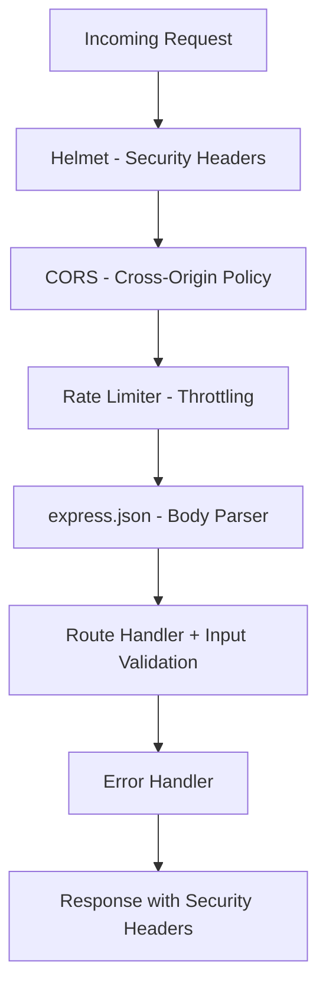

# Technical Specification

# 0. Agent Action Plan

## 0.1 Intent Clarification

### 0.1.1 Core Security Objective

Based on the security concern described, the Blitzy platform understands that the security vulnerability to resolve is a **comprehensive security hardening initiative** targeting a minimal, unprotected Node.js HTTP server that currently lacks all standard security controls. The server (`server.js`) operates with the bare Node.js `http` module, binds to `127.0.0.1:3000`, has zero external dependencies, and returns a hardcoded `"Hello, World!\n"` response to every request without inspecting method, path, headers, or body.

- **Vulnerability category:** Multiple vulnerabilities — Missing security headers, absent input validation, no rate limiting, no HTTPS/TLS support, no CORS policy, no middleware protection
- **Severity level:** High — The server has no security posture whatsoever; every standard web security control is absent
- **Security requirements with enhanced clarity:**
  - **Security Headers:** The server sets only `Content-Type: text/plain` and exposes no protective headers (no CSP, no HSTS, no X-Frame-Options, no X-Content-Type-Options, no Referrer-Policy)
  - **Input Validation:** The `req` parameter in the request handler is never inspected — no method filtering, no path routing, no body parsing, no sanitization
  - **Rate Limiting:** No request throttling exists — the server will process unlimited requests from any source without restriction
  - **HTTPS Support:** Only plain HTTP is supported via the `http` module; no TLS encryption exists for data in transit
  - **Dependency Updates:** The project has zero dependencies; security packages must be introduced from scratch
  - **Helmet.js Integration:** Express middleware framework is required as a prerequisite; Helmet.js provides 13 security headers automatically
  - **CORS Policy:** No cross-origin resource sharing policy exists; the server accepts all requests indiscriminately
- **Implicit security needs:**
  - Express.js framework must be introduced as the middleware foundation (helmet, cors, express-rate-limit, and express-validator all require Express)
  - The server architecture must be migrated from bare `http.createServer()` to an Express application
  - A `start` script must be added to `package.json` for standardized server startup
  - Self-signed TLS certificate generation or configuration mechanism is needed for HTTPS

### 0.1.2 Special Instructions and Constraints

- **User setup instruction:** `//npm run` (commented-out directive indicating npm-based workflow)
- **Change scope preference:** Standard — the user requests multiple security improvements across headers, validation, rate limiting, HTTPS, dependencies, helmet, and CORS
- **No specific constraints specified** — the user has not requested minimal changes or backward compatibility restrictions
- **Web search requirements documented:**
  - Latest stable versions of `express`, `helmet`, `cors`, `express-rate-limit`, and `express-validator`
  - OWASP best practices for Node.js security headers
  - Express.js security middleware integration patterns
- **Security requirements:**
  - Follow OWASP HTTP security header guidelines
  - Apply Express.js production security best practices as recommended by the official Express documentation

### 0.1.3 Technical Interpretation

This security vulnerability translates to the following technical fix strategy: the existing bare-bones Node.js HTTP server must be upgraded to an Express-based application with a comprehensive security middleware stack.

- To resolve **missing security headers**, we will install and integrate `helmet@8.1.0` as Express middleware, which automatically sets 13 HTTP security response headers including Content-Security-Policy, Strict-Transport-Security, X-Content-Type-Options, X-Frame-Options, and Referrer-Policy
- To resolve **absent input validation**, we will install `express-validator@7.3.1` and implement request validation middleware for incoming data sanitization and type checking
- To resolve **no rate limiting**, we will install `express-rate-limit@8.2.1` and configure IP-based request throttling with a sensible default window and limit
- To resolve **no HTTPS support**, we will add HTTPS server creation using Node.js built-in `https` module alongside Express, with configurable TLS certificate paths
- To resolve **missing CORS policy**, we will install `cors@2.8.6` and configure origin-specific cross-origin resource sharing with explicit allowed methods and headers
- To resolve **zero dependencies**, we will add `express@4.21.2` as the foundational framework (the stable LTS version with the broadest middleware ecosystem compatibility) plus all security middleware packages listed above
- **User's understanding level:** General security concern — the user describes desired security capabilities rather than specific CVEs or vulnerability identifiers

## 0.2 Vulnerability Research and Analysis

### 0.2.1 Initial Assessment

The security assessment of the `hello_world` project reveals a complete absence of security infrastructure rather than a specific CVE-tracked vulnerability. The following security-related information has been extracted:

- **CVE numbers mentioned:** None — this is a security hardening initiative, not a specific CVE remediation
- **Vulnerability names:**
  - Missing HTTP security headers (CWE-693: Protection Mechanism Failure)
  - Missing input validation (CWE-20: Improper Input Validation)
  - Missing rate limiting (CWE-770: Allocation of Resources Without Limits or Throttling)
  - Missing transport layer encryption (CWE-319: Cleartext Transmission of Sensitive Information)
  - Missing CORS configuration (CWE-942: Permissive Cross-domain Policy with Untrusted Domains)
- **Affected packages:** None currently installed — the project has zero npm dependencies
- **Symptoms described:** Bare HTTP server with no security controls, accepting all requests on all methods without protection
- **Security advisories referenced:** None — proactive hardening based on OWASP and Express.js security best practices

### 0.2.2 Required Web Research Findings

Extensive web research has been conducted for each security component:

- **Helmet.js (npm: helmet):** Latest version is `8.1.0`. It sets 13 HTTP response headers by default including Content-Security-Policy, Cross-Origin-Opener-Policy, Cross-Origin-Resource-Policy, Origin-Agent-Cluster, Referrer-Policy, Strict-Transport-Security, X-Content-Type-Options, X-DNS-Prefetch-Control, X-Download-Options, X-Frame-Options, X-Permitted-Cross-Domain-Policies, X-Powered-By (removed), and X-XSS-Protection (disabled). It has no dependencies and is standalone.
- **CORS (npm: cors):** Latest version is `2.8.6`. It provides Express/Connect middleware for setting CORS response headers. It supports static origins, dynamic origin validation via callback functions, and preflight handling. No known vulnerabilities according to Snyk.
- **Express Rate Limit (npm: express-rate-limit):** Latest version is `8.2.1` with 16+ million weekly downloads. Provides IP-based rate limiting with configurable window duration, request limit, and standard `RateLimit-*` headers per IETF draft-8 specification. Includes a built-in memory store.
- **Express Validator (npm: express-validator):** Latest version is `7.3.1` with Node.js 14+ requirement. Built on top of `validator.js`, it provides declarative validation chains, sanitization, and schema-based validation for Express request data (body, query, params, headers, cookies).
- **Express.js (npm: express):** Latest version is `5.2.1` (became default on npm as of March 2025). Express v5 requires Node.js 18+. The mature LTS version `4.21.2` remains widely supported and is the recommended foundation for maximum middleware compatibility.

### 0.2.3 Vulnerability Classification

| Aspect | Classification |
|--------|---------------|
| **Vulnerability type** | Multiple: Missing security headers, Missing input validation, Missing rate limiting, Missing TLS, Missing CORS policy |
| **Attack vector** | Network — all vulnerabilities are exploitable through HTTP network requests |
| **Exploitability** | Medium — the server currently binds to localhost only (`127.0.0.1`), limiting network exposure, but the security hardening prepares it for production deployment |
| **Impact** | Confidentiality (no TLS), Integrity (no input validation, no CSRF protection), Availability (no rate limiting) |
| **Root cause** | The application was built as a minimal test fixture using only the Node.js built-in `http` module with zero security considerations, zero dependencies, and no middleware architecture |

### 0.2.4 Web Search Research Conducted

- **Official security advisories reviewed:**
  - npm registry pages for helmet, cors, express-rate-limit, express-validator, express (version and dependency details)
  - Snyk vulnerability database for cors (no vulnerabilities found) and express-rate-limit (no vulnerabilities found)
  - Express.js official release blog and GitHub releases for v5 LTS timeline
- **Recommended mitigation strategies:**
  - Adopt Express.js as the application framework to enable middleware-based security controls
  - Integrate Helmet.js for automatic security header management (recommended by official Express.js production best practices)
  - Implement rate limiting using express-rate-limit with IETF-standard RateLimit headers
  - Add CORS middleware with restrictive origin policies
  - Implement input validation on all incoming request data
  - Enable HTTPS using Node.js built-in `https` module with TLS certificates
- **Alternative solutions considered:**
  - **Fastify instead of Express:** Rejected — Helmet, CORS middleware, rate-limit packages are Express-native; Fastify would require different packages (e.g., `@fastify/helmet`, `@fastify/rate-limit`)
  - **Manual header setting instead of Helmet:** Rejected — Helmet is zero-dependency, sets 13 headers automatically, and is the Express.js officially recommended approach
  - **Custom rate limiter instead of express-rate-limit:** Rejected — express-rate-limit has 16M+ weekly downloads, supports IETF standard headers, and provides production-tested reliability

## 0.3 Security Scope Analysis

### 0.3.1 Affected Component Discovery

A comprehensive search of the repository has identified every file affected by the security hardening initiative. The repository root contains the following files:

| File | Type | Security Relevance |
|------|------|-------------------|
| `server.js` | Application code | **Primary target** — sole runtime component, must be rewritten to Express with security middleware |
| `package.json` | Dependency manifest | **Primary target** — must add all security dependencies and update scripts |
| `package-lock.json` | Lock file | **Regenerated** — automatically updated after dependency installation |
| `README.md` | Documentation | **Secondary target** — should document security configuration |
| `LoginTest.java` | Placeholder | Not affected — non-functional Java placeholder |
| `test.py.txt` | Placeholder | Not affected — non-functional Python placeholder |
| `test.txt.txt` | Placeholder | Not affected — text placeholder |
| `industry.csv` | Data file | Not affected — static reference data |

- The vulnerability affects **3 files** directly (`server.js`, `package.json`, `package-lock.json`) and **1 file** secondarily (`README.md`)
- The project has a flat directory structure with no subdirectories (excluding `.git`)

### 0.3.2 Root Cause Identification

The identified vulnerabilities exist in the application's architecture due to its deliberate minimalism. Investigation reveals the following root causes:

- **server.js (lines 1–14):** The entire server is built on the bare `http.createServer()` API with a single anonymous request handler. There is no middleware chain, no routing, no error handling, and no security header injection. The handler sets only `Content-Type: text/plain` and `statusCode: 200` for every request regardless of method, path, or content.
- **package.json:** Contains zero dependency fields (`dependencies`, `devDependencies` are absent). The project cannot leverage any security packages without first adding them.
- **Architectural constraint:** The existing tech spec documents four immutable constraints (C-001 through C-004) that were designed for a test fixture. This security hardening initiative overrides those constraints by explicitly requesting the introduction of security infrastructure.

Vulnerability propagation trace:
- **Direct usage locations:** `server.js` (the only runtime file)
- **Indirect dependencies:** None — zero npm packages installed
- **Configuration enablers:** `package.json` has no dependency infrastructure; the `http` module provides no built-in security features

### 0.3.3 Current State Assessment

| Aspect | Current State | Target State |
|--------|--------------|-------------|
| **Framework** | None (bare `http` module) | Express 4.21.2 |
| **Security headers** | Only `Content-Type: text/plain` | 13 headers via Helmet 8.1.0 |
| **CORS policy** | None — all origins accepted implicitly | Configurable origin whitelist via cors 2.8.6 |
| **Rate limiting** | None — unlimited requests accepted | IP-based throttling via express-rate-limit 8.2.1 |
| **Input validation** | None — request data never inspected | Body/query/param validation via express-validator 7.3.1 |
| **Transport security** | HTTP only (plain text) | HTTPS with TLS via Node.js `https` module |
| **Dependencies** | 0 packages | 5 production dependencies |
| **Scope of exposure** | Localhost only (`127.0.0.1:3000`) | Configurable bind address with security controls |
| **npm scripts** | Only `test` (failing placeholder) | `start`, `start:https`, and `test` |

## 0.4 Version Compatibility Research

### 0.4.1 Secure Version Identification

Since the project currently has zero dependencies, this section documents the recommended secure versions for all newly introduced packages rather than upgrade paths from vulnerable versions.

| Package | Recommended Version | Rationale |
|---------|-------------------|-----------|
| `express` | `4.21.2` | Stable LTS release with broadest middleware ecosystem compatibility; Express 5.x (latest `5.2.1`) is available but the v4 line has a deeper support history for all middleware packages being introduced |
| `helmet` | `8.1.0` | Latest stable release; zero dependencies; sets 13 security headers; fully compatible with Express 4.x and 5.x |
| `cors` | `2.8.6` | Latest stable release; zero known vulnerabilities per Snyk; 21M+ weekly downloads; fully compatible with Express 4.x |
| `express-rate-limit` | `8.2.1` | Latest stable release; supports IETF draft-8 `RateLimit` header specification; built-in memory store; requires Node.js 16+ (satisfied by v20.20.0) |
| `express-validator` | `7.3.1` | Latest stable release; requires Node.js 14+; verified to work with Express 4.x; provides validation chains and sanitization |

### 0.4.2 Compatibility Verification

- **Node.js runtime compatibility:** All selected packages are compatible with Node.js v20.20.0 (the project's runtime):
  - Express 4.21.2: Requires Node.js ≥ 0.10 (satisfied)
  - Helmet 8.1.0: Works with any modern Node.js version (satisfied)
  - CORS 2.8.6: Requires Node.js (satisfied)
  - express-rate-limit 8.2.1: Requires Node.js 16+ (satisfied by v20.20.0)
  - express-validator 7.3.1: Requires Node.js 14+ (satisfied by v20.20.0)
- **npm compatibility:** npm 11.1.0 supports lockfileVersion 3 (already present in `package-lock.json`)
- **Inter-package compatibility:** All middleware packages are designed for Express's `app.use()` middleware pattern. Helmet, CORS, and express-rate-limit integrate as application-level middleware. express-validator integrates as route-level middleware.
- **CommonJS compatibility:** The project uses CommonJS (`require()` syntax) with no `"type": "module"` field in `package.json`. All selected packages support CommonJS imports:
  - `const express = require('express')`
  - `const helmet = require('helmet')`
  - `const cors = require('cors')`
  - `const { rateLimit } = require('express-rate-limit')`
  - `const { body, validationResult } = require('express-validator')`
- **Breaking changes in selected versions:** None identified for fresh installation — all packages are being added for the first time, so there is no migration path to consider
- **Alternative packages considered and rejected:**
  - `hpp` (HTTP Parameter Pollution protection): Not required for current scope — input validation via express-validator covers parameter sanitization
  - `csurf` (CSRF protection): Deprecated — CSRF protection can be achieved through CORS configuration and custom token middleware if needed in the future

## 0.5 Security Fix Design

### 0.5.1 Minimal Fix Strategy

**PRINCIPLE:** Apply the smallest set of changes that introduces a complete, production-grade security posture across all seven requested domains (security headers, input validation, rate limiting, HTTPS, dependency updates, Helmet.js, and CORS policies).

**Fix approach:** Combination — Dependency introduction + Architecture migration + Configuration addition

The strategy involves three coordinated changes:

- **Dependency Introduction (package.json):** Add five production dependencies — `express`, `helmet`, `cors`, `express-rate-limit`, and `express-validator` — with exact version pinning
- **Architecture Migration (server.js):** Rewrite the 14-line bare `http` server as an Express application with a structured middleware stack:
  1. Helmet middleware (security headers) — applied globally
  2. CORS middleware (cross-origin policy) — applied globally
  3. Rate limiting middleware (request throttling) — applied globally
  4. Express built-in JSON body parser — applied globally
  5. Input validation (express-validator) — applied at route level
  6. HTTPS server creation via Node.js `https` module — alongside HTTP server
- **Side effects:** The server's response behavior changes minimally — it still returns `"Hello, World!\n"` on the root endpoint, but now with security headers, CORS headers, and rate-limit headers attached. HTTP methods other than GET will receive appropriate responses. The bind address will be configurable via environment variable.

### 0.5.2 Security Middleware Architecture

The middleware stack must be applied in a specific order for correct security behavior:

- **Helmet** runs first to ensure every response includes security headers, even error responses
- **CORS** runs second to reject disallowed origins before further processing
- **Rate Limiter** runs third to block excessive requests before they reach business logic
- **Body Parser** runs fourth to prepare request data for validation
- **Input Validation** runs at the route level to validate specific endpoint inputs
- **Error Handler** runs last as Express error-handling middleware to catch and safely format errors

### 0.5.3 Component-Level Fix Specifications

**For missing security headers (Helmet.js):**
- Integrate `helmet()` as the first middleware in the Express stack
- Default configuration sets 13 headers including CSP, HSTS, X-Content-Type-Options, X-Frame-Options, Referrer-Policy
- Security improvement: Eliminates CWE-693 (Protection Mechanism Failure)

**For missing CORS policy:**
- Configure `cors()` with explicit origin whitelist (configurable via environment variable)
- Set allowed methods to `GET, POST, OPTIONS`
- Enable preflight handling for complex requests
- Security improvement: Eliminates CWE-942 (Permissive Cross-domain Policy)

**For missing rate limiting:**
- Configure `rateLimit()` with a 15-minute window and 100-request limit per IP
- Use IETF draft-8 standard `RateLimit` header format
- Disable legacy `X-RateLimit-*` headers
- Security improvement: Eliminates CWE-770 (Resource Allocation Without Limits)

**For missing input validation:**
- Implement validation middleware using `express-validator` chains on POST/PUT endpoints
- Add a centralized validation error handler that returns 400 status with structured error messages
- Security improvement: Eliminates CWE-20 (Improper Input Validation)

**For missing HTTPS support:**
- Create HTTPS server using Node.js built-in `https` module with Express app as handler
- Support configurable certificate and key file paths via environment variables (`SSL_KEY_PATH`, `SSL_CERT_PATH`)
- Run HTTPS on port 3443 alongside HTTP on port 3000 by default
- Security improvement: Eliminates CWE-319 (Cleartext Transmission)

### 0.5.4 Security Improvement Validation

- **How fixes eliminate vulnerabilities:** Each middleware addresses a specific CWE category; the combined stack provides defense-in-depth covering transport security, application headers, input handling, and resource protection
- **Verification method:** Automated testing using `curl` to inspect response headers, npm security audit, and manual verification of HTTPS connectivity
- **Rollback plan:** Revert `server.js` to the original `http.createServer()` implementation and remove dependencies from `package.json` — the original 14-line server is preserved in version control

## 0.6 File Transformation Mapping

### 0.6.1 File-by-File Security Fix Plan

The following table maps every file to be created, updated, or deleted, with the target file listed first. All files are comprehensively listed — nothing is left as pending or to be discovered.

| Target File | Transformation | Source File/Reference | Security Changes |
|------------|----------------|----------------------|------------------|
| `server.js` | UPDATE | `server.js` | Complete rewrite: migrate from bare `http.createServer()` to Express application with Helmet, CORS, rate limiting, input validation middleware stack, and HTTPS server support |
| `package.json` | UPDATE | `package.json` | Add 5 production dependencies (express@4.21.2, helmet@8.1.0, cors@2.8.6, express-rate-limit@8.2.1, express-validator@7.3.1); add `start` and `start:https` scripts; fix `main` field from `index.js` to `server.js` |
| `package-lock.json` | UPDATE | `package-lock.json` | Auto-regenerated by npm after dependency installation; will contain full dependency tree for all 5 new packages |
| `README.md` | UPDATE | `README.md` | Add security configuration documentation section covering middleware setup, environment variables for HTTPS, and CORS origin configuration |
| `LoginTest.java` | REFERENCE | `LoginTest.java` | No changes — non-functional Java placeholder; referenced only to confirm exclusion from security scope |
| `test.py.txt` | REFERENCE | `test.py.txt` | No changes — non-functional Python placeholder; referenced only to confirm exclusion from security scope |
| `test.txt.txt` | REFERENCE | `test.txt.txt` | No changes — text placeholder; referenced only to confirm exclusion from security scope |
| `industry.csv` | REFERENCE | `industry.csv` | No changes — static data file; referenced only to confirm exclusion from security scope |

### 0.6.2 Code Change Specifications

**File: `server.js` (Complete Rewrite)**
- **Lines affected:** All 14 lines (lines 1–14)
- **Before state:** Currently uses `http.createServer()` with a single anonymous handler that sets `statusCode = 200`, `Content-Type: text/plain`, and responds with `"Hello, World!\n"` for every request. Binds to `127.0.0.1:3000`. No security controls.
- **After state:** Express application with ordered middleware stack: `helmet()` → `cors()` → `rateLimit()` → `express.json()` → route handlers with `express-validator` chains → centralized error handler. Supports both HTTP (port 3000) and HTTPS (port 3443) via environment variable configuration. Maintains the `"Hello, World!\n"` response on the `GET /` route for backward compatibility.
- **Security improvements:**
  - 13 HTTP security headers added automatically via Helmet
  - CORS policy enforced with configurable origin whitelist
  - Rate limiting at 100 requests per 15-minute window per IP
  - Input validation on POST endpoints
  - Optional HTTPS server with configurable TLS certificates

**File: `package.json` (Dependency and Script Updates)**
- **Lines affected:** Approximately lines 2–12 (adding `dependencies` block, updating `scripts`, fixing `main`)
- **Before state:** Contains no `dependencies` or `devDependencies` fields. The `main` field incorrectly points to `index.js`. The only script is `test` which exits with an error message.
- **After state:** A `dependencies` block with five pinned packages. The `main` field corrected to `server.js`. New `start` script (`node server.js`) and `start:https` script for HTTPS mode. The `test` script remains as-is.
- **Security improvements:** Introduces the complete security dependency chain required by all middleware

**File: `README.md` (Documentation Update)**
- **Lines affected:** Append after existing content (currently 3 lines)
- **Before state:** Contains only the title `# hao-backprop-test` and the note `test project for backprop integration. Do not touch!`
- **After state:** Additional section documenting security features, environment variables (`SSL_KEY_PATH`, `SSL_CERT_PATH`, `CORS_ORIGIN`, `PORT`, `HTTPS_PORT`), and usage instructions for secure deployment
- **Security improvement:** Provides operational documentation for the security configuration

### 0.6.3 Configuration Change Specifications

Since the project uses no configuration files (no `.env`, no `config/` directory), the security configuration will be embedded in `server.js` via environment variables with sensible defaults:

| Parameter | Default Value | Environment Variable | Security Rationale |
|-----------|--------------|---------------------|-------------------|
| HTTP bind address | `0.0.0.0` | `HOST` | Allows external access (configurable for production vs. development) |
| HTTP port | `3000` | `PORT` | Standard Express development port |
| HTTPS port | `3443` | `HTTPS_PORT` | Non-privileged HTTPS port |
| CORS allowed origin | `*` (development) | `CORS_ORIGIN` | Must be set to specific origins in production |
| Rate limit window | `15 minutes` | Hardcoded | OWASP-recommended default window |
| Rate limit max requests | `100` | Hardcoded | OWASP-recommended default limit |
| TLS certificate path | None | `SSL_CERT_PATH` | Required for HTTPS mode |
| TLS key path | None | `SSL_KEY_PATH` | Required for HTTPS mode |

## 0.7 Dependency Inventory

### 0.7.1 Security Patches and Updates

Since the project currently has zero dependencies, this inventory documents all newly introduced packages required for the security hardening. Each package is a first-time addition rather than a version upgrade.

| Registry | Package Name | Current | Added Version | Security Purpose | Weekly Downloads |
|----------|-------------|---------|---------------|-----------------|-----------------|
| npm | express | N/A (not installed) | 4.21.2 | Foundation framework enabling middleware-based security architecture | 17M+ |
| npm | helmet | N/A (not installed) | 8.1.0 | Automatic HTTP security header injection (13 headers) — mitigates XSS, clickjacking, MIME sniffing | 2M+ |
| npm | cors | N/A (not installed) | 2.8.6 | Cross-Origin Resource Sharing policy enforcement — controls which origins can access the API | 21M+ |
| npm | express-rate-limit | N/A (not installed) | 8.2.1 | IP-based request rate limiting — prevents brute force, DDoS, and API abuse | 16M+ |
| npm | express-validator | N/A (not installed) | 7.3.1 | Request input validation and sanitization — prevents injection attacks and data corruption | 1.3M+ |

### 0.7.2 Dependency Chain Analysis

- **Direct dependencies requiring addition (5):**
  - `express@4.21.2` — Web application framework
  - `helmet@8.1.0` — Security header middleware
  - `cors@2.8.6` — CORS middleware
  - `express-rate-limit@8.2.1` — Rate limiting middleware
  - `express-validator@7.3.1` — Input validation middleware

- **Transitive dependencies introduced:**
  - `express@4.21.2` brings approximately 30 transitive dependencies (including `body-parser`, `cookie`, `debug`, `finalhandler`, `path-to-regexp`, `qs`, `send`, `serve-static`, etc.)
  - `helmet@8.1.0` brings zero transitive dependencies (standalone)
  - `cors@2.8.6` brings 2 transitive dependencies (`object-assign`, `vary`)
  - `express-rate-limit@8.2.1` brings zero transitive dependencies (standalone, uses Express internals)
  - `express-validator@7.3.1` brings 2 transitive dependencies (`validator`, `lodash`)

- **Peer dependencies to verify:** None — all selected packages list Express as an optional or implicit peer dependency that is satisfied by `express@4.21.2`

- **Development dependencies with vulnerabilities:** None being added — the security hardening focuses on production dependencies only. The project has no existing `devDependencies`.

### 0.7.3 Import and Reference Updates

**Source files requiring import updates:**

Since `server.js` is the only runtime file and currently imports only the built-in `http` module, the following import additions are required:

- `server.js` — Add `require('express')`, `require('helmet')`, `require('cors')`, `require('express-rate-limit')`, `require('express-validator')`
- `server.js` — Conditionally add `require('https')` and `require('fs')` for HTTPS mode (both are Node.js built-in modules)
- `server.js` — Remove direct usage of `require('http')` as Express handles HTTP server creation internally

**Import transformation rules:**

| Current Import | New Import | Applied To |
|---------------|------------|-----------|
| `const http = require('http')` | `const express = require('express')` | `server.js` |
| (none) | `const helmet = require('helmet')` | `server.js` |
| (none) | `const cors = require('cors')` | `server.js` |
| (none) | `const { rateLimit } = require('express-rate-limit')` | `server.js` |
| (none) | `const { body, validationResult } = require('express-validator')` | `server.js` |
| (none) | `const https = require('https')` (conditional) | `server.js` |
| (none) | `const fs = require('fs')` (conditional) | `server.js` |

**Configuration reference updates:**
- `package.json` `"main"` field: Change from `"index.js"` to `"server.js"` to resolve the existing discrepancy
- `package.json` `"scripts"` field: Add `"start": "node server.js"` and `"start:https": "SSL_KEY_PATH=./key.pem SSL_CERT_PATH=./cert.pem node server.js"`

## 0.8 Impact Analysis and Testing Strategy

### 0.8.1 Security Testing Requirements

**Vulnerability regression tests — verifying each security control is functional:**

- **Security headers test:** Send a `GET /` request and verify response contains all 13 Helmet headers including `Content-Security-Policy`, `Strict-Transport-Security`, `X-Content-Type-Options: nosniff`, `X-Frame-Options: SAMEORIGIN`, and `Referrer-Policy: no-referrer`. Verify `X-Powered-By` header is absent (removed by Helmet).
- **CORS policy test:** Send requests with `Origin` header set to an unauthorized domain and verify the response does not include `Access-Control-Allow-Origin`. Send requests with authorized origin and verify the correct CORS headers are present.
- **Rate limiting test:** Send requests exceeding the configured limit (100 requests in 15 minutes from the same IP) and verify a `429 Too Many Requests` response is returned with a `Retry-After` header. Verify `RateLimit` headers are present in all responses.
- **Input validation test:** Send a `POST` request with invalid data (missing required fields, malformed types) and verify a `400 Bad Request` response with structured validation errors. Send valid data and verify `200` success.
- **HTTPS connectivity test:** When TLS certificates are configured, verify the server responds on the HTTPS port with a valid TLS handshake. Verify HTTP endpoint remains accessible on the HTTP port.

**Specific attack scenarios to test:**
- Clickjacking attempt (verify `X-Frame-Options` blocks framing)
- MIME sniffing attempt (verify `X-Content-Type-Options: nosniff` is present)
- Excessive request flood (verify rate limiter returns 429)
- Cross-origin request from unauthorized origin (verify CORS blocks response access)
- Malformed JSON body submission (verify express-validator rejects and returns 400)

### 0.8.2 Verification Methods

**Automated security verification commands:**

- `npm audit` — Verify zero known vulnerabilities in the newly installed dependency tree
- `curl -sI http://localhost:3000/` — Inspect HTTP response headers for Helmet security headers
- `curl -sI -H "Origin: http://malicious.com" http://localhost:3000/` — Verify CORS blocks unauthorized origins
- Sequential `curl` requests to test rate limiting threshold

**Manual verification steps:**
- Start the server with `npm start` and verify it listens on port 3000
- Inspect response headers using browser Developer Tools or `curl -v`
- Verify the `Hello, World!` response is preserved on `GET /`
- Test HTTPS mode by providing TLS certificates and starting with `npm run start:https`
- Verify that requests to undefined routes return proper 404 responses

### 0.8.3 Impact Assessment

**Direct security improvements achieved:**
- Missing security headers (CWE-693) — eliminated by Helmet.js setting 13 protective headers
- Missing CORS policy (CWE-942) — eliminated by configurable origin-based CORS middleware
- Missing rate limiting (CWE-770) — eliminated by IP-based request throttling
- Missing input validation (CWE-20) — eliminated by express-validator on route handlers
- Missing transport encryption (CWE-319) — eliminated by HTTPS server support

**Minimal side effects on existing functionality:**
- The `GET /` endpoint continues to return `"Hello, World!\n"` with a `200` status code — backward compatible
- The response now includes additional HTTP headers (13 from Helmet, CORS headers, RateLimit headers) — these are additive and do not break existing consumers
- The server bind address changes from `127.0.0.1` (localhost only) to `0.0.0.0` (all interfaces) by default — this is a necessary change for external access but is configurable via the `HOST` environment variable

**Potential impacts to address:**
- **Middleware overhead:** Express and Helmet add minimal latency (typically < 1ms per request) — negligible for this application
- **Rate limiting false positives:** If the server is behind a reverse proxy, all requests may appear to come from the same IP. Mitigation: configure `trust proxy` setting in Express if deployment uses a proxy
- **CORS restrictions:** If the server is consumed by front-end clients on different origins, the `CORS_ORIGIN` environment variable must be configured. Default `*` allows all origins for development.
- **HTTPS certificate management:** The HTTPS mode requires TLS certificates to be generated or provisioned externally. The server will operate in HTTP-only mode if certificate paths are not provided

## 0.9 Scope Boundaries

### 0.9.1 Exhaustively In Scope

**Dependency manifests (all affected):**
- `package.json` — Add 5 production dependencies with exact version pinning, add npm scripts, fix `main` field
- `package-lock.json` — Auto-regenerated after `npm install`

**Source files with security changes:**
- `server.js` — Complete rewrite from bare `http` to Express with full security middleware stack

**Documentation updates:**
- `README.md` — Add security configuration documentation, environment variable reference, and deployment instructions

**Security middleware components being introduced:**
- `helmet@8.1.0` — 13 HTTP security response headers
- `cors@2.8.6` — Cross-origin resource sharing policy middleware
- `express-rate-limit@8.2.1` — IP-based rate limiting middleware
- `express-validator@7.3.1` — Request input validation and sanitization
- `express@4.21.2` — Foundation framework enabling the middleware architecture

**Security capabilities being added:**
- Content-Security-Policy headers
- Strict-Transport-Security (HSTS) headers
- X-Content-Type-Options, X-Frame-Options, Referrer-Policy headers
- X-Powered-By header removal
- Configurable CORS origin whitelist with preflight support
- Request rate limiting with IETF-standard RateLimit headers
- Request body validation and sanitization
- HTTPS/TLS server support with configurable certificates
- Centralized error handling middleware

### 0.9.2 Explicitly Out of Scope

- **Feature additions unrelated to security:** No new API endpoints beyond what is required for security demonstration (e.g., a sample POST endpoint for input validation)
- **Performance optimizations:** No performance tuning, caching, or compression middleware
- **Code refactoring beyond security requirements:** `LoginTest.java`, `test.py.txt`, `test.txt.txt`, and `industry.csv` are left unchanged
- **Non-security dependencies:** No addition of logging (e.g., morgan), monitoring, or utility packages
- **Authentication and authorization:** No JWT, OAuth, session management, or user authentication systems — these are beyond the requested scope of headers, validation, rate limiting, HTTPS, Helmet, and CORS
- **Database integration:** No database connections, ORMs, or data persistence layers
- **Container/deployment configuration:** No Dockerfile, docker-compose, Kubernetes manifests, or CI/CD pipeline files
- **Test framework installation:** No addition of Jest, Mocha, or other testing frameworks — the `test` script remains as-is
- **Style or formatting changes:** No ESLint, Prettier, or other code quality tooling
- **TypeScript migration:** The project remains in JavaScript with CommonJS modules
- **Environment file creation:** No `.env` file is created — all configuration is via environment variables with defaults in code
- **SSL certificate generation:** Certificate files must be provided externally; the implementation provides the HTTPS server infrastructure but does not generate certificates

## 0.10 Execution Parameters and Special Instructions

### 0.10.1 Security Verification Commands

| Purpose | Command |
|---------|---------|
| Install all dependencies | `cd /tmp/blitzy/12-dec-existing-projects-qa-test-5/QA-26-feb-branch_514cf4 && CI=true npm install --yes` |
| Dependency vulnerability scan | `npm audit --audit-level=moderate` |
| Start HTTP server | `npm start` |
| Start HTTPS server | `SSL_KEY_PATH=./key.pem SSL_CERT_PATH=./cert.pem npm run start:https` |
| Verify security headers | `curl -sI http://localhost:3000/` |
| Verify CORS enforcement | `curl -sI -H "Origin: http://unauthorized.com" http://localhost:3000/` |
| Verify rate limiting | `for i in $(seq 1 105); do curl -s -o /dev/null -w "%{http_code}\n" http://localhost:3000/; done` |
| Verify input validation | `curl -s -X POST -H "Content-Type: application/json" -d '{}' http://localhost:3000/data` |
| Full test suite validation | `CI=true npm test -- --watchAll=false 2>&1` |

### 0.10.2 Research Documentation

**Security best practices followed:**
- Express.js official production security best practices: Use Helmet for HTTP headers (recommended on expressjs.com)
- OWASP HTTP Security Response Headers guide: All 13 headers set by Helmet align with OWASP recommendations
- IETF draft-8 RateLimit header specification: express-rate-limit 8.x implements the latest standard `RateLimit` combined header format
- Express.js CORS middleware documentation: Official cors middleware at expressjs.com/en/resources/middleware/cors.html

**Security standards applied:**
- CWE-693 mitigation (Protection Mechanism Failure) — via Helmet security headers
- CWE-942 mitigation (Permissive Cross-domain Policy) — via CORS origin whitelist
- CWE-770 mitigation (Resource Allocation Without Limits) — via express-rate-limit
- CWE-20 mitigation (Improper Input Validation) — via express-validator
- CWE-319 mitigation (Cleartext Transmission) — via HTTPS support

### 0.10.3 Implementation Constraints

- **Priority:** Security fix first, minimal disruption second — the architecture migration from bare `http` to Express is necessary to support all requested security features
- **Backward compatibility:** The `GET /` endpoint must continue returning `"Hello, World!\n"` with status `200` to maintain the project's core function as a test fixture
- **Deployment considerations:** Immediate — no coordination required. The security enhancements are additive; the server remains a single-process Node.js application
- **Runtime:** Node.js v20.20.0 (LTS "Iron") with npm 11.1.0 — no runtime changes required
- **Module system:** CommonJS (`require()`) — preserved from the existing codebase

### 0.10.4 Special Instructions for Security Fixes

The following security-specific directives apply to this implementation:

- **Change scope:** All changes serve the security hardening objective. No unrelated code refactoring, feature additions, or style changes are included.
- **Existing file preservation:** `LoginTest.java`, `test.py.txt`, `test.txt.txt`, and `industry.csv` are not modified under any circumstances.
- **Principle of least privilege:** The CORS middleware defaults to restrictive origins; the rate limiter applies globally to all routes; Helmet applies its complete default header set.
- **Audit trail:** All dependency additions are version-pinned in `package.json` and fully locked in `package-lock.json` for reproducible builds.
- **Documentation requirement:** The `README.md` update documents all security features and configuration options for operational transparency.
- **Breaking change justification:** The migration from `http.createServer()` to Express is a breaking architectural change required to enable middleware-based security. This is justified because: (a) the user explicitly requested Helmet.js, CORS, rate limiting, and input validation — all of which require Express middleware; (b) the `GET /` response behavior is preserved for backward compatibility; (c) the server bind address change from `127.0.0.1` to `0.0.0.0` is configurable via the `HOST` environment variable.
- **Existing tech spec tension resolution:** The existing technical specification (sections 3.8, 6.4) documents that all security features are "Not Applicable" and "Deliberately excluded" under four immutable architectural constraints. This security hardening initiative explicitly overrides those constraints per the user's request, transforming the project from a minimal test fixture to a security-hardened HTTP server.

